# Red Hat Certified Engineer (RHEL 8 RHCE) - P19：388-4869-1 - Install Required Packages - 11937999603_bili - BV12a4y1x7ND

Welcome back， everyone。 This is Matt。 And in this video， we're going to begin Section 4。

 which is install and configure an ansible control node。

 and I'm going to show you how to install the required packages for ansible。

 So let's go ahead and click on Section 4。 and you'll notice two different headings。

 which is installing Ansible using Yum and then installing Ansible from source。

 And the reason for this is that I'm going to show you first。

 how to install ansible on a red Hat En Linux host。

 which has the proper subscriptions to the ansible 2。8 repo。

 And then I'm going to show you how to install it from source on a machine that does not have access to that repo。

 And the reason for this is that the repositories in our playground server for REl 8。

 do not have the latest packages for Ansible。 And that's mainly due to the fact that Rel 8 is a very new Os from Red Hat having just come out on May 7。

2019。 And the reos that our image relies on have not been updated to include those packages。

 And with that being said， I'm actually going to show you how to do。

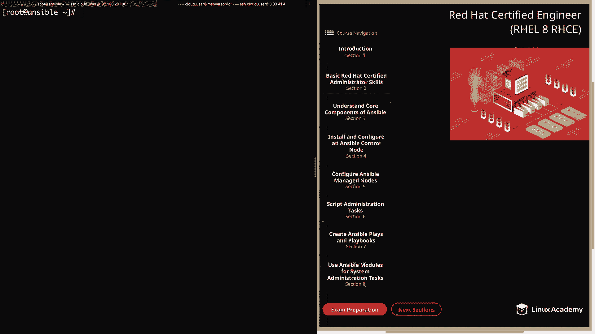

Both but for this course， I'm going to be using ansible that was installed from source since I'll be using our playground image。

All right， so let's go ahead and install ansible using yum。 And as you'll see， it is very。

 very simple。 And currently， I'm lockedgged into a local installation of Red Hat Enterprise 8。

 that's just in a virtual machine。 And this installation does have access to the required repositories。

So let's go ahead and walk through this together。 I're going to head back over to the command line。

 And first， I'm just going to do a quick yum search ansible。And as you can see。

 we have no matches found， and the reason for this is that even though I do have access to the Anible repo。

 I have not enabled it yet with subscription manager。

 so I'm just going to show you how to do that real quick。

So first I'm going to do a subscription manager， repos， and then dash dash list。

 and then I'm going to gr for Ansible。

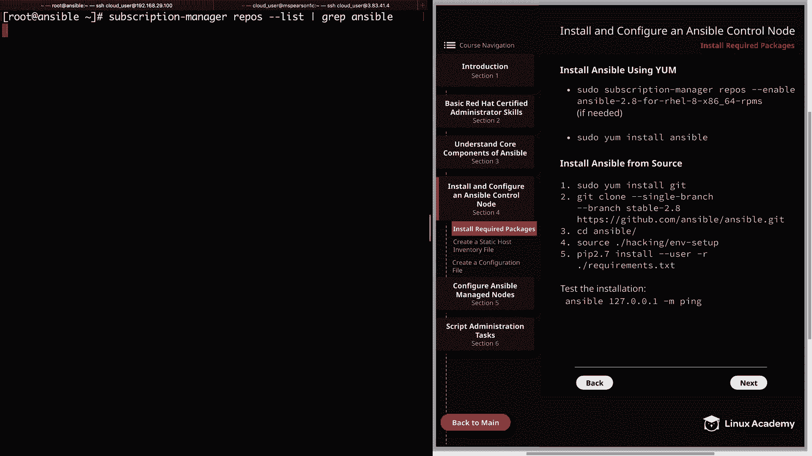

And we see right at the top， we have our Ans 2。8 repo， so I'm just going to copy that real quick。

 so I don't have to type it out。Save me for making some errors。

We'Clear that。And then to enable it， we're going to use subscription manager。Repo， dash dash and A。

And then feed it our repository。We see that our repository isn' enabled for the system。

 Let's go ahead and do our yM search again。To validate this。And we see the ansible package。

 so let's go ahead and install that using Youngum install。I'll add a dash Y and then answerable。

And this can take a minute。 So I'll go ahead and fast forward。 so you don't have to wait。

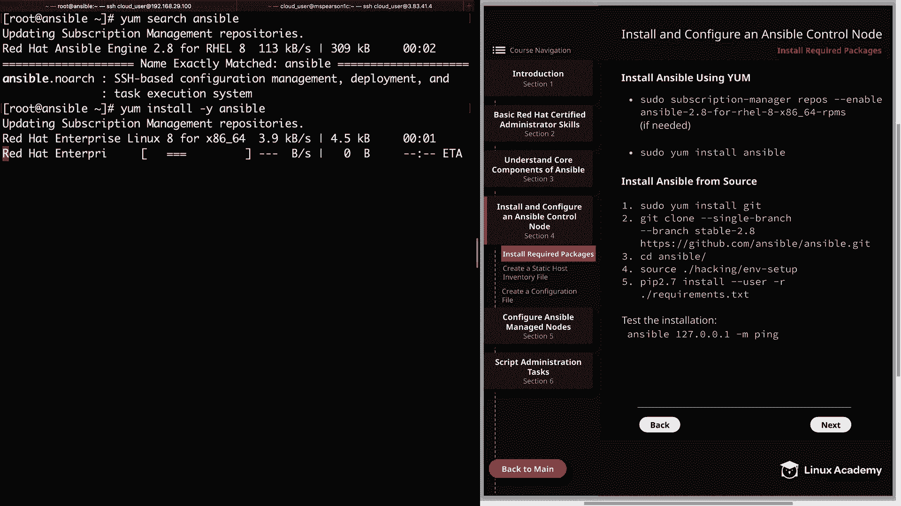

All right， so our packages have installed successfully。And as you can see， that's all there is to it。

 So when you have the repository enabled， all you have to do is you installst ansible and you're all set。

Now， for an installation from source， it's a little more complicated， but still not too bad。

 And for that， we're going to head over to the cloud playground image that I have set up for this。

And our second tab here， which is on MS Pearson 1C。

And even though it is a little bit more complicated， it's actually still pretty simple。

 And that's due to the fact that Ansible is not a traditional piece of software in the sense that there are no service demons or database set up。

 Of course， there are going to be scripts and commands that gets set up。

 But these all operate from the user's home directory， which I'm going to show you in just a second。

 But just remember if you want to do anything that requires elevated privileges that will need to be set up for the user。

 And given the fact that it's going to operate from the user's home directory。

 that means that some of the default directories and configuration files are not going to get created like they would if you're doing just the yum installation。

 Some examples of that would just be the Etsy ansible directory that gets created。

 which is going to have your ansipible do Cfg and your host file， as well as Etsy ansible roles。

 So we're actually going to have to manually add those and then populate the default files。Alright。

 so the first thing we need to do is install Git。 And that's because we're going to be cloning the ansipible git repo。

 Let's go ahead and do that with pseudo yum install Git。 And just remember that this is Rel 8。

 So you can use DNF install rather than yum install。

 I'm preferring to use yum here just because the ansible documentation uses yum。

 But remember that yum is actually interacting with that DNF back in as of Rel 8。 All right。

 So we're going to go ahead and install Git。Add my dash why。

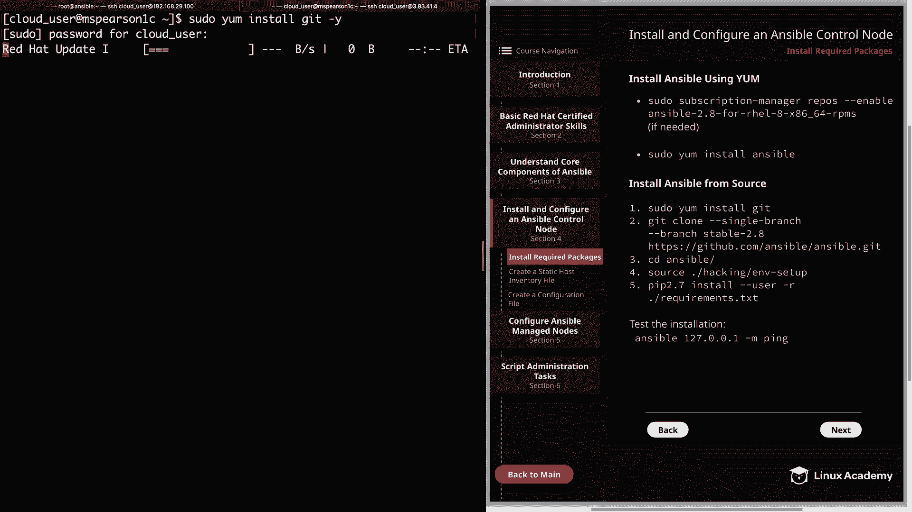

And now that we have Git installed， we can run our Git clone， but before we do that。

 I'm actually going to create a git directory， and that way we can use that directory to pull down our clone。

 and we can use home cloud user Ansible as our main working directory for the course。

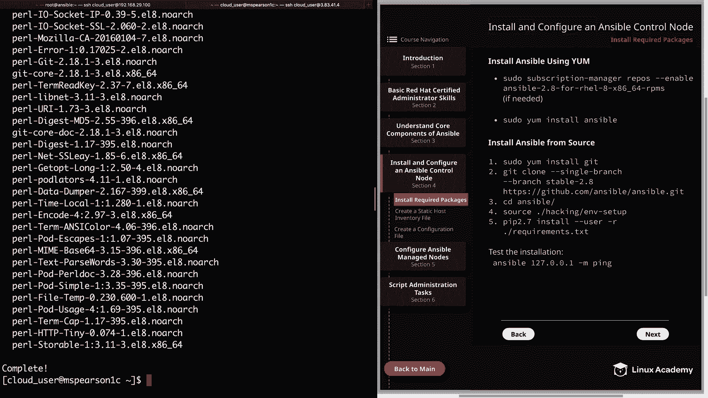

So I'm going to go ahead and clear this out。 And you see we're already in the cloud users home directory。

 So I'm going to go ahead and do M K D and make an ansible directory， which again。

 is going to be our main base of operation for the course。 And then I'm also going to make。

A directory called Git， and that's where we're going to pull down our git clone。

So we'll see the in there， and now we can go ahead and clone our git repo for that。

 we're going to use Git clone。And then we're going to specify a single branch using dash dash single dash branch。

And then the branch is going to be stable。And then 2。8 and we're choosing version 2。

8 because that is the version that the red Ha exam is based on， and if we didn't specify the version。

 it would just pull in the latest that was in the repository。

 So let's just go ahead and specify the URL that's httPS ColN//lash Github。 co/ ansible s ansible。

 git。All right， let's go ahead and kick that off。And now it's going to clone that repo into a directory called Ansible。

 and I'll go ahead and speed this up so you don't have to wait。And now that that's finished。

 let's go ahead and Cd into our newly cloned repository， an ansible。

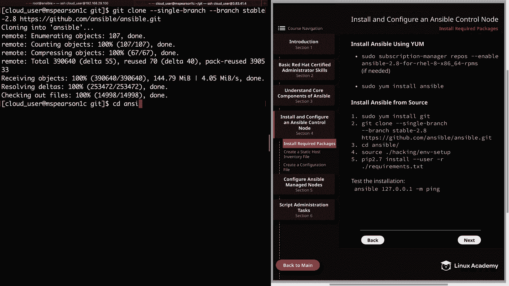

Then we can do a listing。 And as you can see， there are several different files and directories that we'll be using for installation。

 And so the next step that we need to do is source our environment setup script。

Go ahead and clear this out。

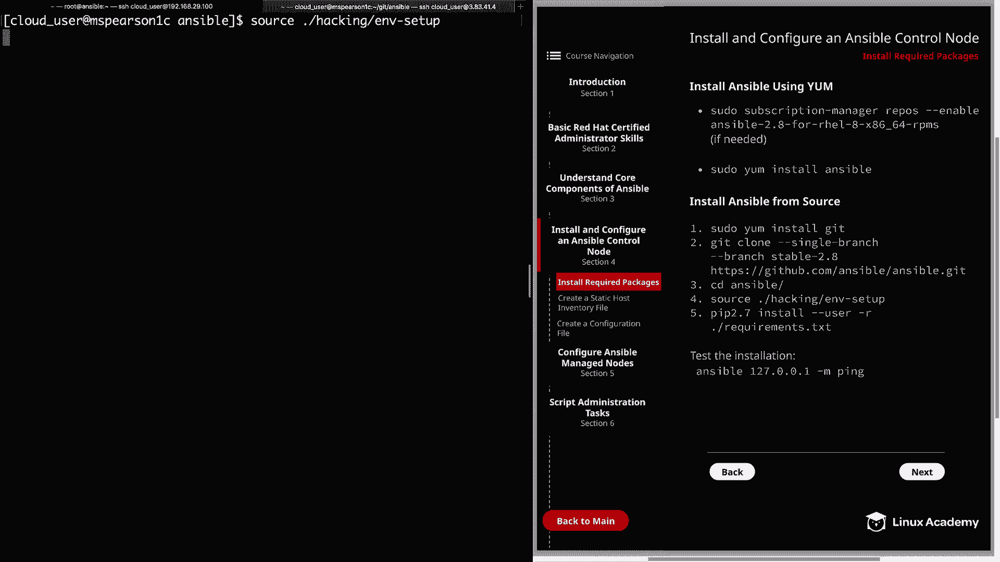

And as you can see， it's going to set up some environment variables。

 as well as adding some directories to our path。 And that way。

 all the anciible commands are going to be available to us。

It's also going to set the Python path as well as Man path。

 which is going to give us access to our documentation。

So let's go ahead and clear this and remember that as always。

 you can just echo your path out by doing an echo dollar sign path and you see that we are set up for this current session。

 but the one thing that you do need to keep in mind is that these environment variables are only going to persist for the current session so it has to be resourced each time you log in。

 But if you like to make it permanent， you can always add it to your bash profile。

 So let's go ahead and do that real quick。 in our home directory and its dot bash underscore profile。

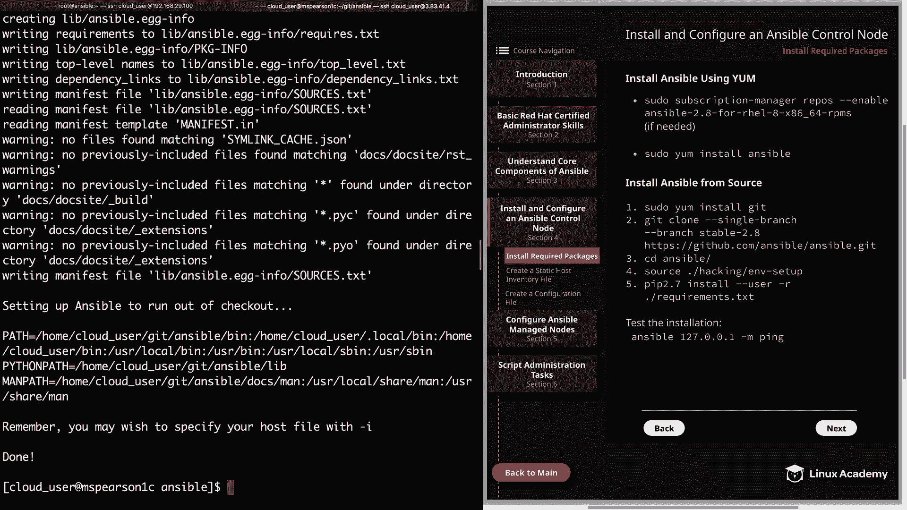

Now we can just head to the bottom of this file， and then we're going to add a line。

It is going to source our M setup script。 and then we need the path to the script。

 and that's in home and then gi。Answible。Hacking an M dash setup。

 And now every time we log into our host， it's going to source our M setup script。

 So that way we don't have to do it each time we log in right。

 So now let's go ahead and close this out。And then the last thing that we're going to need to do is use PIP to install our dependencies。

And we can take a look at those dependencies by opening up the requirements do TXT。

 Let's go ahead and take a look。And as you can see， it's going to install Gingja 2， Paamel。

 and then cryptography。 So let's close this out。 I'll go ahead and clear this。

And then we can run Pip 2。7， and then we'll do install dash dash user。Dash R。

And then requirements do TxT。

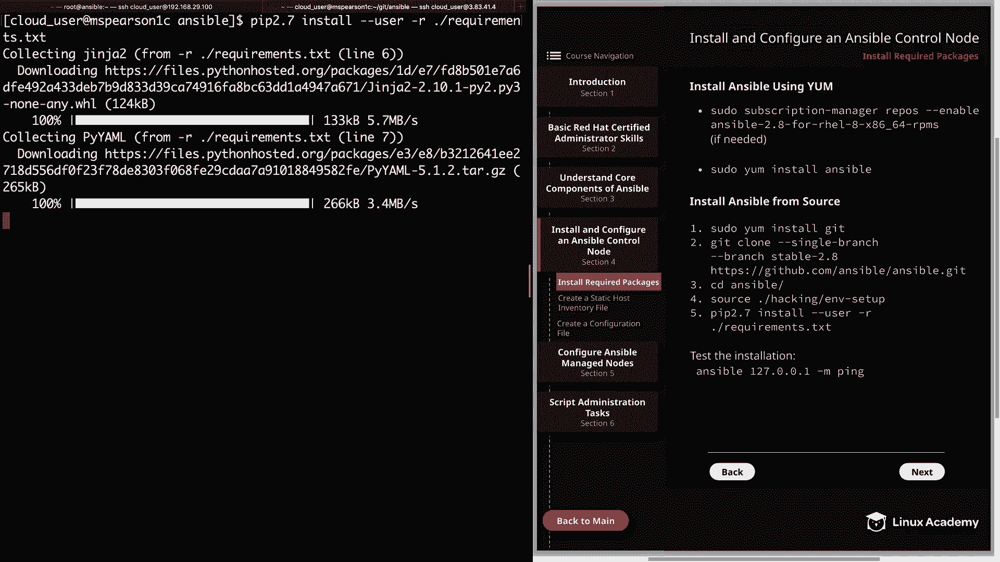

And with that， all our dependencies were installed。

 and it also finishes up our ansible installation from source。

And currently we don't have any managed nodes configured。

 but we can test the installation by just hitting the local host。

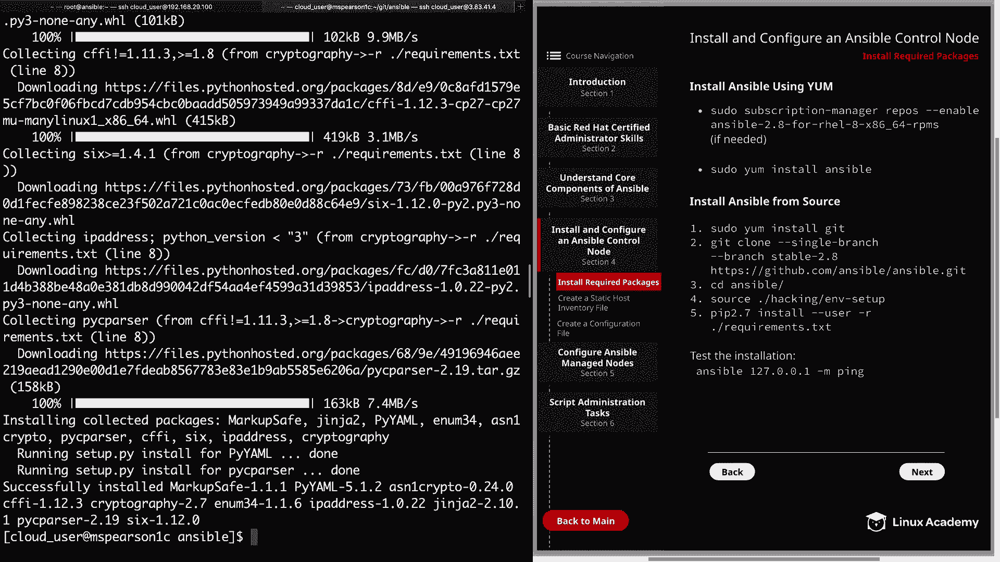

Let's go ahead and run clear。For that， we'll use Ansible and as you can see there。

 I was able to tab Comp。 that's because all the ansible commands are inner a path。

 which was of course established by our setup script。So we use the ansipible command。

 which is used for ad hoc commands。And then we'll put in 127。0。0。1。

 and then we'll use the ping module。And as you can see。

 we get a warning that lets us know that no inventory was parsed。

 so it just used the implicit local host。But even though we didn't provide an inventory。

 we were able to ping the local host。 And that lets us know that our installation was successful。

 Well， that's going to finish up this video on installing required packages。

 Keep in mind that I will be using this particular host where I've installed it from source for the remaining videos in the course。

 And now you can mark the video complete and we'll move on to the next lesson。😊。

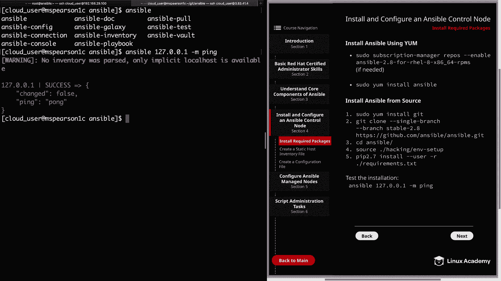