# Ansible 控制节点安装与配置：P19：安装所需软件包

## 概述

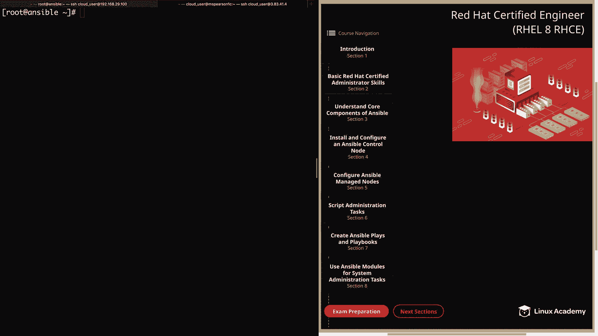

在本节课程中，我们将学习如何安装 Ansible 控制节点所需的软件包。我们将介绍两种安装方法：使用 Yum 包管理器在有订阅权限的系统上安装，以及从源代码在无法访问官方仓库的系统上安装。本节内容将为后续的 Ansible 学习与实践奠定基础。

## 两种安装方法简介

课程视频介绍了两种安装 Ansible 的方法。第一种是使用 Yum 在拥有 Red Hat Ansible 2.8 仓库订阅的 Red Hat Enterprise Linux 8 主机上进行安装。第二种是从源代码安装，这种方法适用于我们的实验环境，因为其 RHEL 8 镜像的仓库尚未包含最新的 Ansible 软件包。

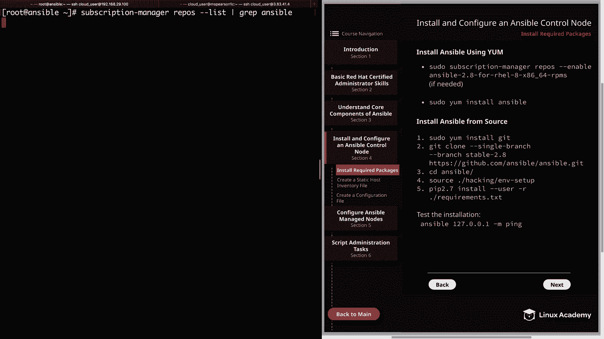

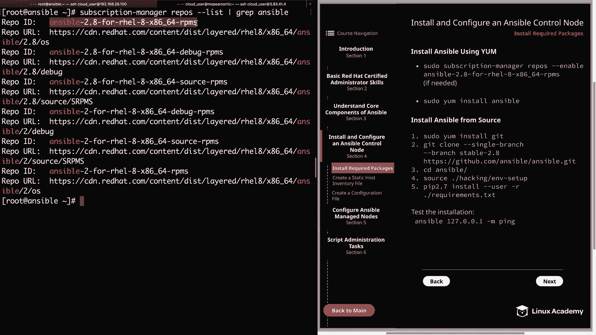

上一节我们介绍了课程的整体结构，本节中我们来看看如何具体安装 Ansible 软件。

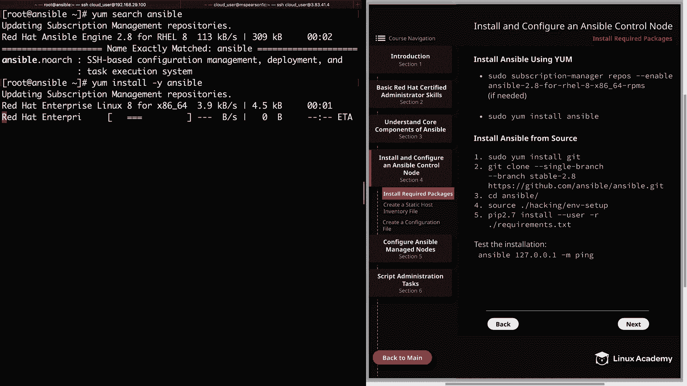

## 方法一：使用 Yum 安装 Ansible

此方法适用于拥有有效订阅、可以访问 Ansible 官方仓库的 Red Hat Enterprise Linux 8 系统。安装过程相对直接。

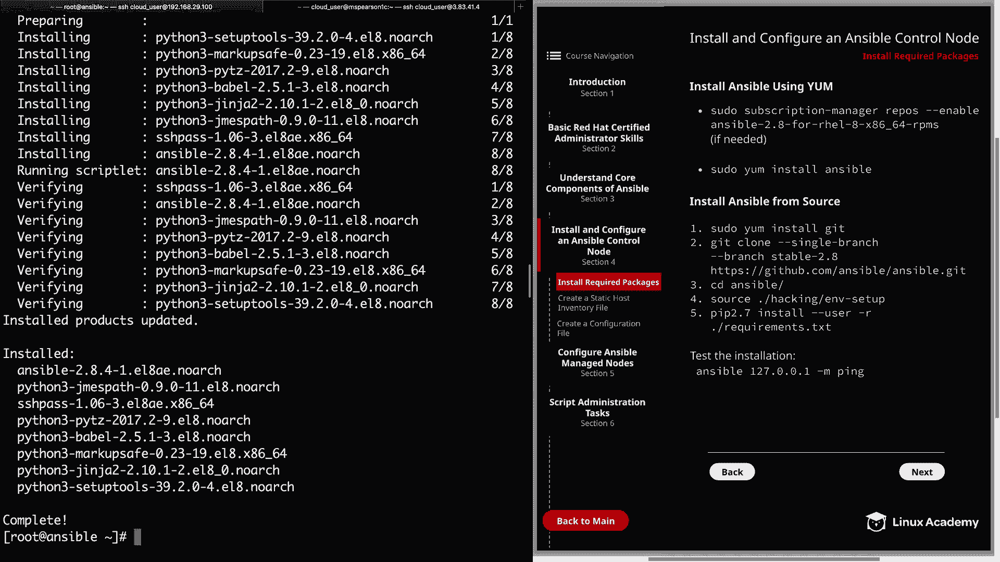

以下是使用 Yum 安装的具体步骤：

1.  **启用 Ansible 仓库**：首先，需要使用 `subscription-manager` 命令列出并启用包含 Ansible 的特定仓库。命令格式为 `subscription-manager repos --enable <仓库名称>`。
2.  **搜索软件包**：启用仓库后，可以使用 `yum search ansible` 命令验证仓库已生效并能找到 Ansible 软件包。
3.  **执行安装**：最后，使用 `yum install -y ansible` 命令安装 Ansible 软件包及其所有依赖项。

安装完成后，Ansible 的核心命令和配置文件（如 `/etc/ansible/` 目录）会自动部署到系统中。

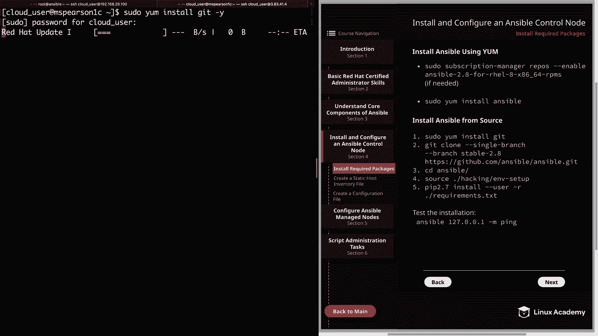

## 过渡到源代码安装

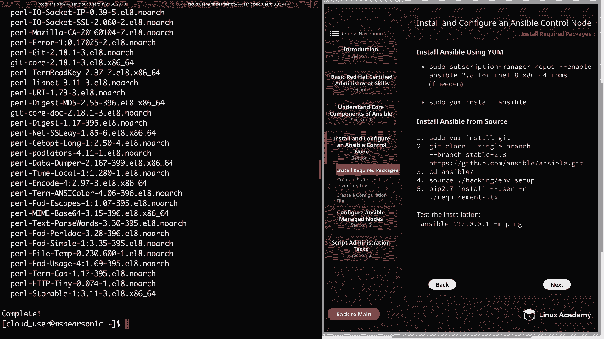

虽然 Yum 安装简便，但我们的实验环境无法直接使用此方法。因此，我们需要掌握第二种安装方式：从源代码编译安装。接下来，我们将切换到实验环境的云主机进行操作。

## 方法二：从源代码安装 Ansible

此方法适用于无法通过包管理器直接安装 Ansible 的环境。虽然步骤稍多，但 Ansible 作为无需后台守护进程或复杂数据库配置的软件，安装过程依然清晰。

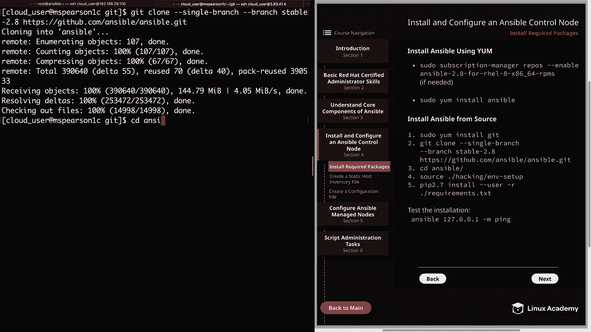

以下是源代码安装的具体步骤：

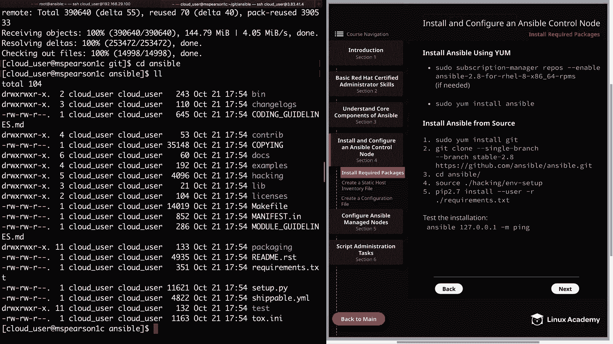

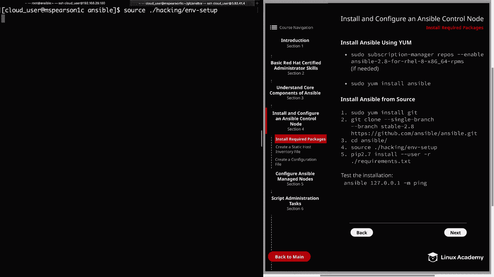

1.  **安装 Git**：首先需要安装 Git 工具，用于克隆 Ansible 的源代码仓库。命令为 `sudo yum install -y git`。
2.  **准备目录**：在用户家目录下创建两个工作目录，例如 `ansible`（用于后续操作）和 `git`（用于存放克隆的代码）。
3.  **克隆源代码**：进入 `git` 目录，使用 Git 克隆 Ansible 的稳定版本分支。为确保与 Red Hat 考试要求一致，我们指定克隆 2.8 版本。命令如下：
    ```bash
    git clone --single-branch -b stable-2.8 https://github.com/ansible/ansible.git
    ```
4.  **设置环境**：进入克隆得到的 `ansible` 目录，执行环境设置脚本 `source ./hacking/env-setup`。该脚本会配置必要的环境变量（如 `PATH`, `PYTHONPATH`）以便系统识别 Ansible 命令。
5.  **持久化环境变量**（可选）：为使环境变量在每次登录时自动生效，可以将 `source /path/to/ansible/hacking/env-setup` 命令添加到用户配置文件（如 `~/.bash_profile`）的末尾。
6.  **安装 Python 依赖**：Ansible 运行需要特定的 Python 库。使用 `pip` 根据 `requirements.txt` 文件安装这些依赖。命令如下：
    ```bash
    pip2.7 install --user -r requirements.txt
    ```

完成以上步骤后，Ansible 即安装完毕。需要注意的是，从源代码安装不会自动创建 `/etc/ansible` 等默认目录和配置文件，后续需要手动创建和配置。

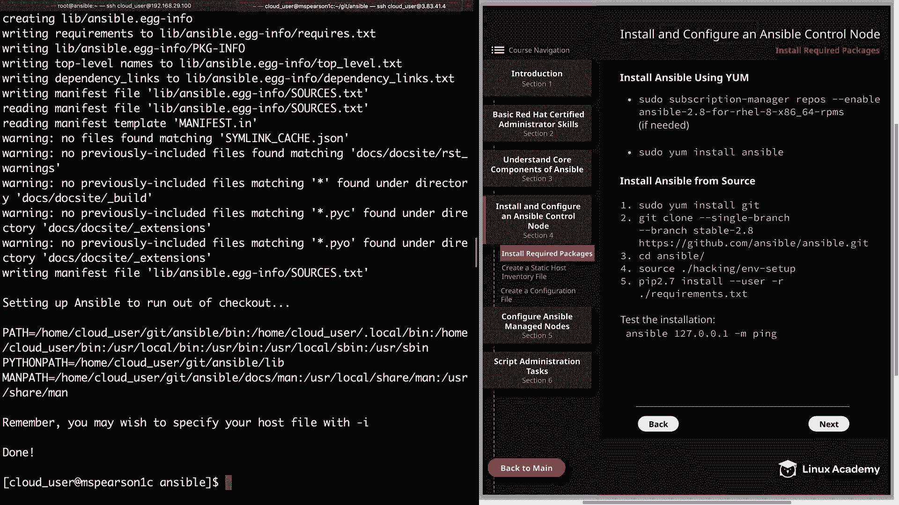

## 验证安装

无论采用哪种安装方式，安装完成后都应进行验证。

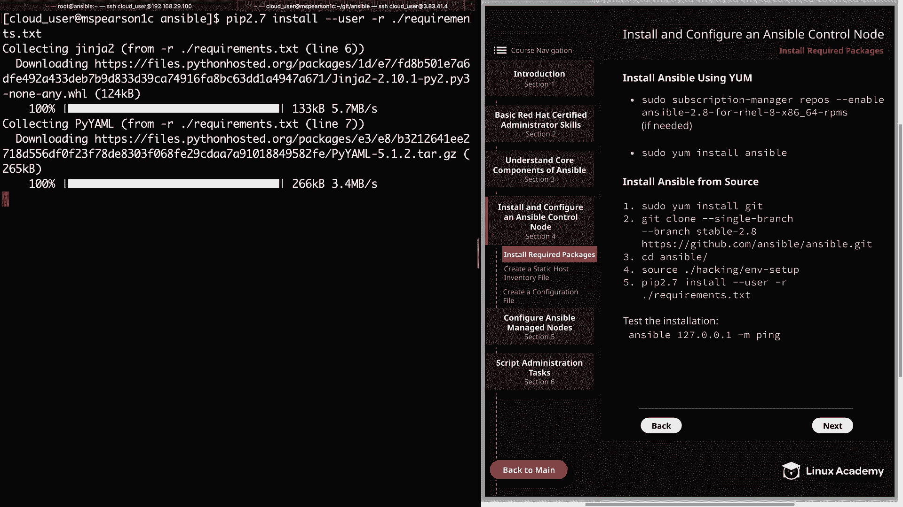

以下是验证安装是否成功的简单方法：

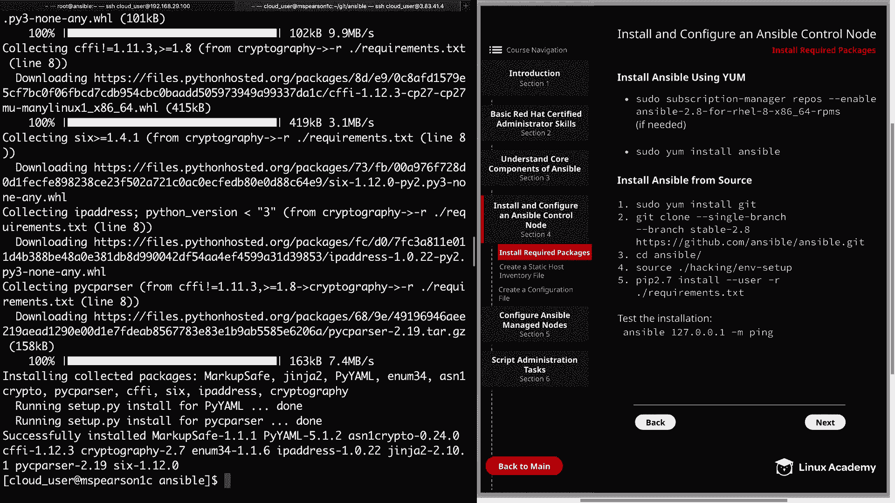

*   运行 `ansible --version` 查看版本信息。
*   执行一个简单的 ad-hoc 命令测试连通性，例如 `ansible 127.0.0.1 -m ping`。首次运行可能会提示未提供清单文件，但若能成功收到 `pong` 回复，则证明 Ansible 核心功能安装正确。

## 总结

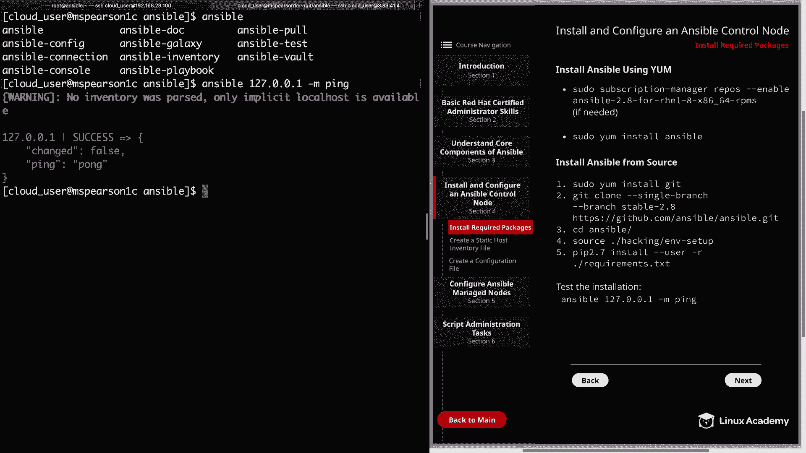

本节课中我们一起学习了在 RHEL 8 系统上安装 Ansible 控制节点的两种方法。我们掌握了通过 Yum 在订阅系统上的便捷安装流程，也详细演练了从源代码在受限环境下的完整安装步骤，包括 Git 克隆、环境配置和依赖安装。后续课程将基于这个从源代码安装的实验环境继续展开 Ansible 的配置与使用学习。