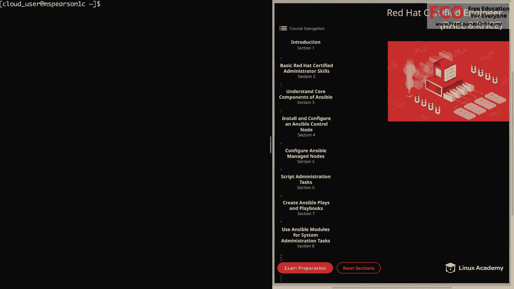
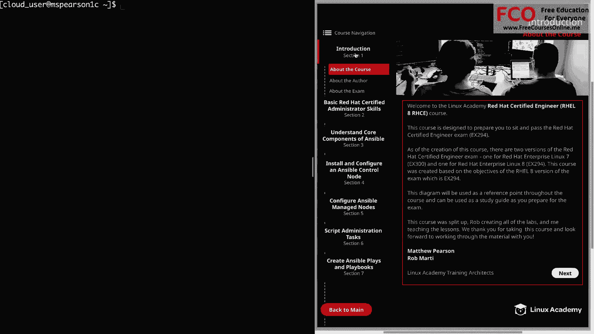
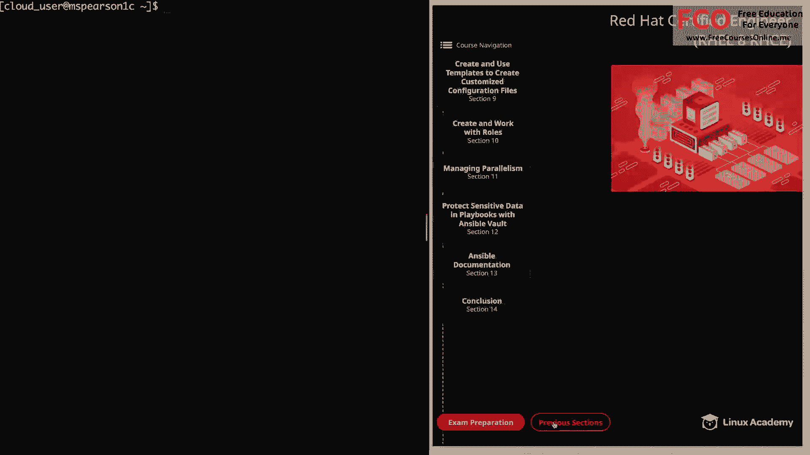

# Red Hat Certified Engineer (RHEL 8 RHCE) - P1：388-4881-1 - About the Course - 11937999603_bili - BV12a4y1x7ND

Hello， everyone。 This is Matt。 And let me welcome you to the Red Hat certifiedt engineer for Red Hat Enterprise Linux 8 course。

 And in this video， I'm going to talk a little bit about the course and what you can expect。

 So let's go ahead and click on introduction here in our diagram。😊。

And that's going to bring us to the section on about the course。

So this course is designed to prepare you to sit and pass the Red Hat Certified Engineer exam。

 which is EX294。As of the creation of this course， there are two versions of the Red Hat Certified Engineer exam。

 one is for Red Hat Enterprise Linux 7， which is the EX 300。

 and the other is for Red Hat Enterprise Linux 8， which is EX 294。

And this course was created based on the objectives for the Rail 8 version of the exam。

 which as I said before， is E X 294。 So I just wanted to make sure that there is no confusion about what this course is going to cover。

 So if you're interested in studying about the REil 7 version of this course。

 please check out the previous version on Linux Academy。

 But if you're looking for the Rail 8 version， you've come to the right place。

 This diagram that you see here on the right side of the screen is going to be used as a reference point throughout the course and can also be used as a study guide as you prepare for the exam。

 So as we go through the material， you will become very familiar with this diagram。

 and then you can also use it to study for particular sections。

Another quick note is that this course was split up between me and another training architect。

 which is Rob Marty， and Rob is going to be handling all the labs for the course and I will be teaching all the lessons。

We really do appreciate your interest in the course。

 and we look forward to working through the material together。 Now， before we finish this video。

 I wanted to briefly go over the subjects that we're going to be covering and make one recommendation。

 So let's head down here and click back to main。 and the recommendation that I wanted to make is before or after Section 3。

 which is understanding the core components of Ansible。 I suggest that you jump ahead to Section 13。

😊。

And watch all the videos on ansciible documentation that way you can have a better understanding of the ansible documentation as you're going through the course and also taking your labs。

Let's go ahead and jump back to the previous section。

 and so our first main content section is going to be basic red Ha certified administrator skills。

And this is just going to be a refresh of some of the things that you learn in the RHCSA that the exam objectives of the RHCE suggest that you should know。

Then we're going to move into core components of Ansible。

 which is going to help you learn about the various components that make up ansible。

 And next we'll walk through installing and configuring our control node and then also configuring our managed nodes。

 Then we'll talk about creating simple shell scripts and also how we can run ansible commands within these scripts。

 and then we'll move on to the bread and butter of ansible， which is creating plays and playbooks。

And then in section 8， we're going to go over several different modules that are going to help us in automating system administration tasks。

 Now， let's go ahead and click on next sections。And in section 9。

 we're going to learn about using templates in Ansible， followed by creating and using roles。

 and then next we have managing parallelism， and then in section 12。

 we'll talk about protecting sensitive data in our playbooks using Ansible Vault。

And then the last main content section， which we already referenced is going to cover ansible documentation。

 but again， I recommend that you go through this before or after section 3。Well。

 that's going to finish up this introduction video。

 so let's go ahead and market Comp and we can move on to the next section。

