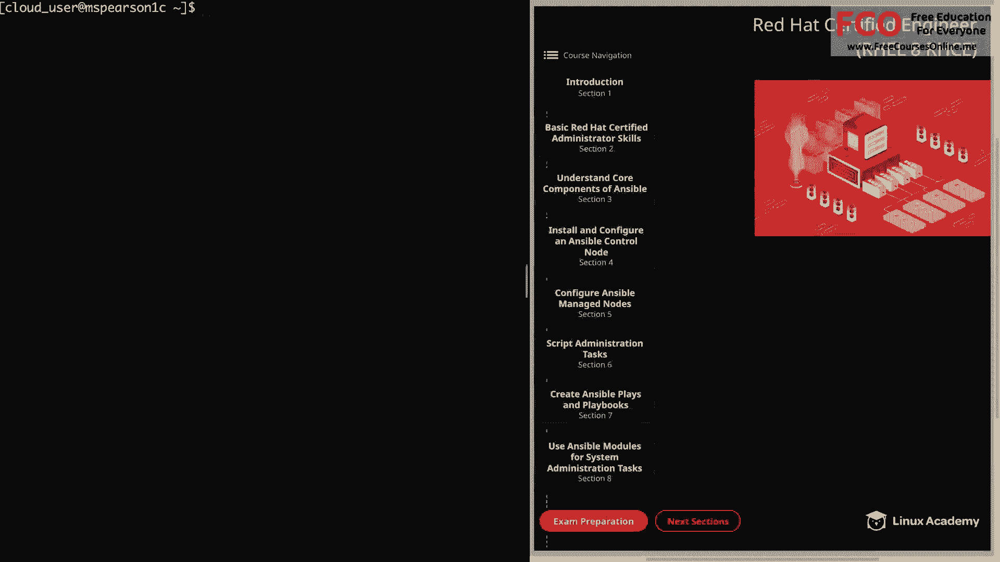
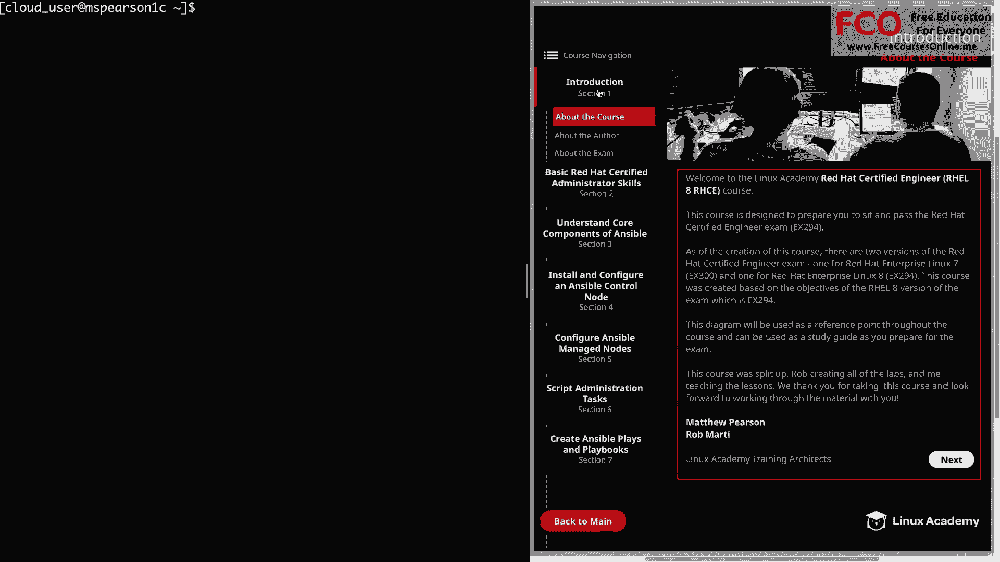
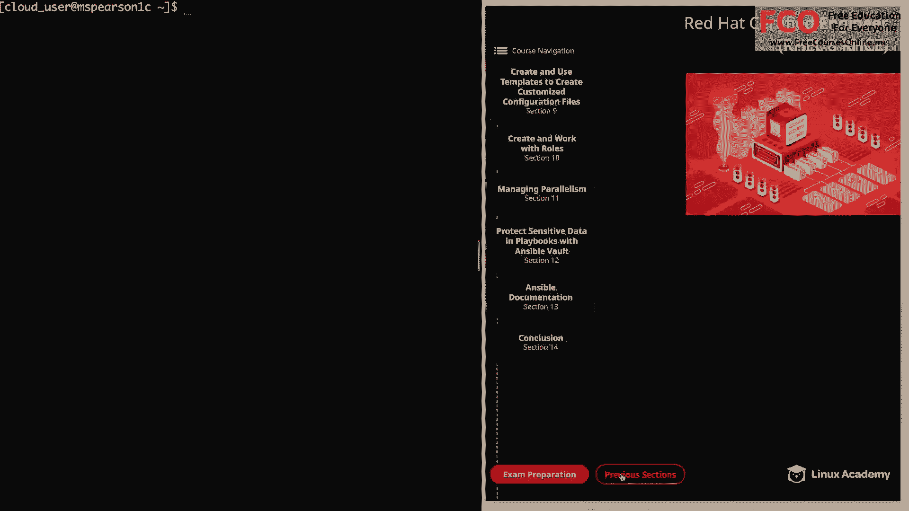

# RHCE认证课程：P1：关于本课程 🎯

在本节中，我们将介绍本课程的整体设计、目标以及学习路径，帮助你明确学习方向并为后续内容做好准备。

## 课程概述

本课程旨在帮助你准备并通过红帽认证工程师考试，即EX294。截至本课程创建时，红帽认证工程师考试有两个版本：针对红帽企业Linux 7的EX300，以及针对红帽企业Linux 8的EX294。本课程基于RHEL 8版本的考试目标（EX294）创建。如果你对RHEL 7版本的课程感兴趣，请查看Linux Academy上的先前版本。如果你正在寻找RHEL 8版本，那么你来对地方了。

## 课程结构与学习工具

屏幕右侧的图表将在整个课程中作为参考点，也可用作备考的学习指南。随着学习的深入，你会对这张图表非常熟悉，并可以利用它来复习特定章节。

本课程由我和另一位培训架构师Rob Marty共同负责。Rob将处理课程中的所有实验部分，而我将负责所有课程的教学。我们非常感谢你对本课程的兴趣，并期待与你一同学习。

## 学习内容与建议

在结束本节之前，我想简要概述我们将要涵盖的主题，并提供一个学习建议。

以下是本课程的主要章节内容：

*   **第1部分：基础RHCSA技能回顾**
    这部分将复习RHCE考试目标建议你掌握的、在RHCSA中学到的一些知识。

*   **第2部分：Ansible核心组件**
    这部分将帮助你了解构成Ansible的各个组件。

*   **第3部分：安装与配置**
    我们将逐步讲解如何安装和配置控制节点，以及如何配置受管节点。

*   **第4部分：脚本与Ansible命令**
    我们将讨论如何创建简单的Shell脚本，以及如何在这些脚本中运行Ansible命令。

*   **第5部分：Play与Playbook**
    这是Ansible的核心内容，我们将学习如何创建Play和Playbook。

*   **第6部分：常用模块**
    我们将介绍多个不同的模块，这些模块将帮助我们自动化系统管理任务。

*   **第7部分：模板与角色**
    我们将学习如何在Ansible中使用模板，以及如何创建和使用角色。

*   **第8部分：并行管理**
    这部分将讲解如何管理任务的并行执行。

*   **第9部分：敏感数据保护**
    我们将讨论如何使用Ansible Vault来保护Playbook中的敏感数据。

*   **第10部分：Ansible文档**
    最后一个主要内容章节将涵盖Ansible文档的使用。

**一个重要建议是**：在开始第3部分（理解Ansible核心组件）之前或之后，我建议你跳到第13部分，观看所有关于Ansible文档的视频。这样，你在学习课程和进行实验时，能更好地理解和使用Ansible文档。

## 总结

本节课我们一起了解了本课程的目标（备考EX294）、结构、分工以及主要的学习内容大纲。我们还获得了一个关键的学习建议，即提前熟悉Ansible文档以辅助整个学习过程。接下来，我们将正式进入课程内容的学习。