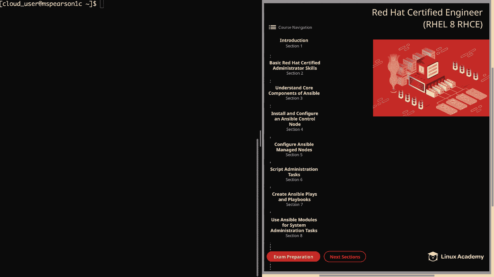
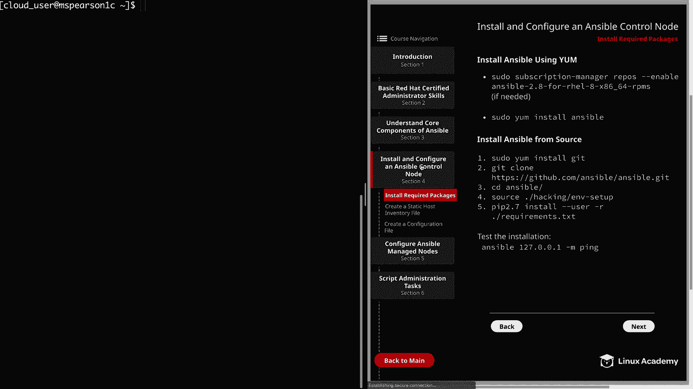
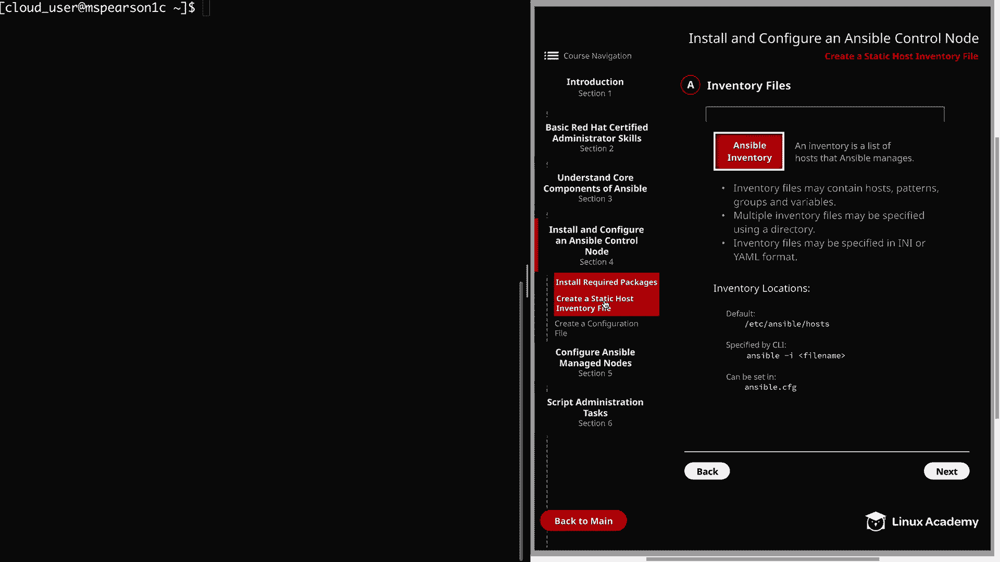
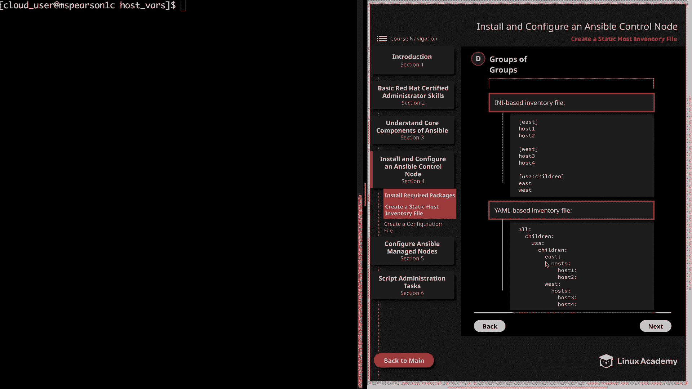

# Red Hat Certified Engineer (RHEL 8 RHCE) - P20：388-4869-2 - Create a Static Host Inventory File - 11937999603_bili - BV12a4y1x7ND

Welcome back everyone， This is Matt， and in this video。

 we're going to walk through creating a static host inventory file。

 So let's go ahead and get started by clicking on install and configure an answerible control node。

And then we'll click on create a static host inventory file。

 So an Ansible inventory is just a list of all the host that Ansible manages。

This is how Ansible is going to know which host it needs to perform actions against。

Inventory files may contain hosts， patterns， groups and variables。

And I will be showing you examples of each of these momentarily。

 but it's good to know at the start that an inventory can just be an individual host or more complex groups of hosts and even groups that are nested under other groups。

Next， multiple inventory files may be specified using a directory。

 So rather than specifying an individual inventory file。

 you can also specify a directory that can contain several inventory files。

 and inventory files may be specified in I and I or Yaml format。 And again。

 this is going to largely come down to preference。 but I will note that the default host file example is an I and I。

 but some people prefer Yaml due to its readability。

 not to mention that you're going to be using Yaml for your playbooks。

And now let's talk about inventory locations。 So if no other inventory is referenced。

 then the default is going to be used， which is going to be an Etsy ansible host。

 But you can also specify the location to another inventory file in the command line using the dash I flag。

 So if you're running ansible in order to run an ansible ad hoc command or even ansible dash playbook in order to run a playbook。

 you can specify dash I and then the path to your inventory file。

 and that will be used over the default。 And you can also update the ansible do Cfg in order to change the default location of the host file。

 All right， So now it's set over to the next page。

And before we move on， I did want to mention that inventory files can be dynamic。

 which means that you can use a script in order to generate your inventory as long as it returns Json。

 This is， however， outside of the scope of the objectives for the RHC exam。

 But I did want to mention to it just in case you ran across the term。

 and didn't want you to get confused on static versus dynamic。

 And the use case for this is typically going to be with cloud infrastructures where the host are likely to change very quickly。

 So that way you can use a script in order to return the host that are actually active。 All right。

 so at the top of the page， I provided an I and I based inventory file just as an example。

 And at the top is where we're going to put all of our ungrouped host。And as you can see。

 we just have a single host， which is mail dot example do com。 And then after that。

 I've actually provided some variables in line that are going to deal specifically with mail dotexle do com。

 And that is ansible underscore port。 And then I give a value， which is 5556。

 and then ansible underscore host， which is 1，92 do 16，8 do 0 do 20。

 After the young group host is where you can add your host groups。And to do this。

 you're going to have a heading with the name of your group in brackets。

 and then followed by all the host that are a part of that group。 Also。

 notice that I have another heading here that is web servers， colon varrs。

 And this is where we're setting variables for the entire host group。 If we wanted to。

 we could add the variables in line like we did with mail do example com。

 But when we specify it for the group， this is going to apply to every host in that group。

 So if you have any variables that need to be different from host to host。

 make sure that you specify that in line， rather than under the group variables。 And then lastly。

 we have another group， which is called Db servers。

 And the host under that group have been expressed using shorthand。 So it's going to be Db 01。

 through D B 99 do example do com。 All right。 So now that we've gone over an example of a basic I and I based inventory file。

 let's talk about some of the inventory variables best practices。 So as you noticed in this example。

 I had some variables that were tied directly to a host。

 And also variables that were tied to a group of host。

Let's go ahead and talk about how these variables should be expressed。So first。

 variables should be stored in Yaml files located relative to the inventory file。

 So what we mean by that is let's say that you have an inventory file that's located in home cloud user Ansible。

 which is going to be our main working directory。 Then you should create the host underscore varrs and group underscore varrs directory in order to store those variables。

 And like I said， you can add them directly into the inventory file。

 But the best practice is to put them in these two directories。

 They're located relative to the inventory file itself。And then lastly。

 the variable files that are stored in this host underscore vars and group underscore vrs directories should be named after the host or the group for which they contain variables。

 And keep in mind that the files may end in dot Y M L or dot Yal。

 So in our example that we have right here， we have mail dot example dot com。

 which is not currently under a group。 except for the default groups of all in ungrouped。

 which we'll talk about in just a minute。So for these two variables that we have specified。

 we would need to create a file under host underscore varrs that is called mail dot example dot com。

 The same as the name of the host。 And then we could also add a dot Y mail or dot yaml if we wanted to。

 and then we would just add in our two variables。 The same would also be true for the group variable that we have for Web servers。

 except for that one。 We would put it in group underscore varrss。

 And then we would title the file Web servers。 And of course， again， you can add the dot Yl dot yaml。

 And then you would add your variable。 All right。 So now let's head over to the next page。

And in this example， I provided a yaml based inventory file。

 and it's actually the same as the I and I file on the previous page。

 but I want to show you what that format looked like in Yaml。

 And now is probably a good time to mention that inventories have to default groups。

 and that's going to be all and ungrouped。All contains every host that's listed in the inventory file。

 regardless of whether it's part of a group or not。

 and then ungrouped is going to contain every host that does not currently have another group aside from all。

 So by default， every host is going to belong to at least two groups。

 So if you take example of mail dot example com right here， it's going to be part of the all group。

 as well as the ungrouped group。 And then if you take the example of Web01 do example com。

 it's going to be part of the all group。 And then also the Web servers group。

 And this is actually illustrated a little more clearly in Yaml。

 which is part of the reason I bring it up now。 So as you see。

 when you're specifying a Yaml based inventory file， it's going to start with all。

 And then the next heading is going to be host。 And this is where you're going to put all your ungrouped host。

 And as you see the two variables are specified underneath the host。

And then at the same level as host， you can specify children。

 and then other children is where you're going to specify your groups， so web servers and DB servers。

And then under each group， you're going to specify your host。

And then you can also specify hostt level variables。All right。

 so now I'm going to head over to the command line。

 and we're actually going to create our own staticco inventory file。

So go ahead and check our location we're in the home directory。Let's go ahead and CDd to Anible。

And actually， I'm going to go ahead and create a directory called inventory。

 And we're going to use this just to store all of our inventory files。 That way。

 it kind of separates things out and makes them a little bit cleaner。

 Let's go ahead and do that M to inventory。And then we'll see D into that。

And now we can go ahead and make our inventory file， and I'm just going to call it M。 I and I。

And as indicated by that extension， we are going to be using the I I format。

 and the first thing that we need to do is list our ungrouped host。

 So I'm going to specify a host called M Pearson 2。

 and then I'm actually going to do a inline variable。' going to call ansible underscore host。

And then we're going to provide the actual host name。And this is going to be MS Pearson 2C。

tmyabservver。com。And this just allows me to be able to refer to that host as MS Pearson 2。

 rather than having to give the entire host name， and it also illustrates the use of an inline variable。

Alright， so now let's head down a couple lines， and we're going to add our first group and this one。

 I'm just going to call it lab servers。 Remember we do put that in brackets。

And this is just going to include all the managed nodes that I have for my ansible installation。

 of course， minus MS Pearson 2。And so we're just going to use MS Pearson。

 And then rather than listing them all out， I'm going to use the shorthand。

 So this is going to be three through6。See。tMylaservver。com。All right， now let's head down。

 and we're going to create another group， and this is going to be web servers。

And this group is going to contain MS Pearson 3C。Myab server do com。Rather than typing that out。

 I'm just going to yank this and then paste it again。And we can replace the three with a four。

And then we're going to add one more group， we're going to call Db servers。

Almost forgot my brackets there。 And we go ahead and paste in the host again。 And this is going be 5。

 and this will be 6。And that's going to finish out our inventory file。 And just real quick to recap。

 We have an ungroup host， which is M S Pearson 2。 Of course。

 we're using the variable to link it to its actual host name。

 which is Ms Pearson 2 C mylabs server com。 And then we have a group that contains all of the managed nodes 3 through 6。

 And then we have two other groups。 And part of the reason that I did it this way was to show you that a host can be a part of multiple groups。

So if you take MS Pearson 3C here， it's in the La service group and it's also in the Web service group。

 and it's also going to be part of the default group all， and then you have MS Pearson 2。

 which is part of the ungrouped group， as well as the all group。All right。

 let's go ahead and save this。 And before we move on。

 I wanted to show you how you can use that host underscore varrs directory in the same directory as your inventory file in order to store those host level variables。

 And remember that even though you can store variables in line like we did in our M do I and I file。

 it's actually best practice to put it in host underscore vrs。

 So let's go ahead and create that directory。Host underscore vars。

And then I'm going to open our inventory file back up。And I'm going to copy our variable。

And while we're here， let's go ahead and remove this。

So now we don't have any more variables in our inventory file。So we're going to save that。

 so now let's see the into host vars。And remember that the variable file needs to be named the same as the host that it's referencing。

Remember， we called it MS Pearson 2， so let's create a new file called MSs Pearson 2。

 and remember this can end in dot yal or dot YMl if we want。

 but I'm just going to leave the extension blank。Since this says a YaAml file。

 we're going to start it with three dashes。And then we can paste in our variable。

 and I'm going to put it in yaml format。 So we're going to remove the equals and add a colon in a space。

 And now we can go ahead and save this file。And we have successfully created a host variables file。

 So let's go ahead and clear this out。And unfortunately。

 we haven't configured our antsible managed nodes yet。

 So we're not able to actually test our inventory file。

 but we will be taking care of that in just a couple videos after this one。

But before we wrap up this video， there is one last thing I wanted to show you。

 So let's head over to the last page。And that is how you can use nested groups or groups of groups。

And on this page， I've provided the IN I based example， as well as the yaml based example。

So if you look at the top one that's I and I， we have two groups east and west。

 and each of these have two hosts underneath them。And if you look at the last heading。

 we have USA colon children。 and this is how you specify that you want to have child groups underneath this group here before the colon。

 So as you can see， we have added east and west to the USA group。

And if we look down here at the Yaml based example， it is actually a little easier to see。

 which is per the usual for Yaml。 So it's going to start with all like we're used to seeing。

 And then under all， you can put children， and this is where you're going to specify your groups。

 And then we have the USA group。 And just like we did under all， you can also specify children again。

 which is going to allow you to specify those child groups。And then under each child group。

 you can also specify host and then the list of hosts under those groups。Well。

 that's going to bring us to the end of this video。 so go ahead and mark it complete。

 and we can move on to the next lesson。

