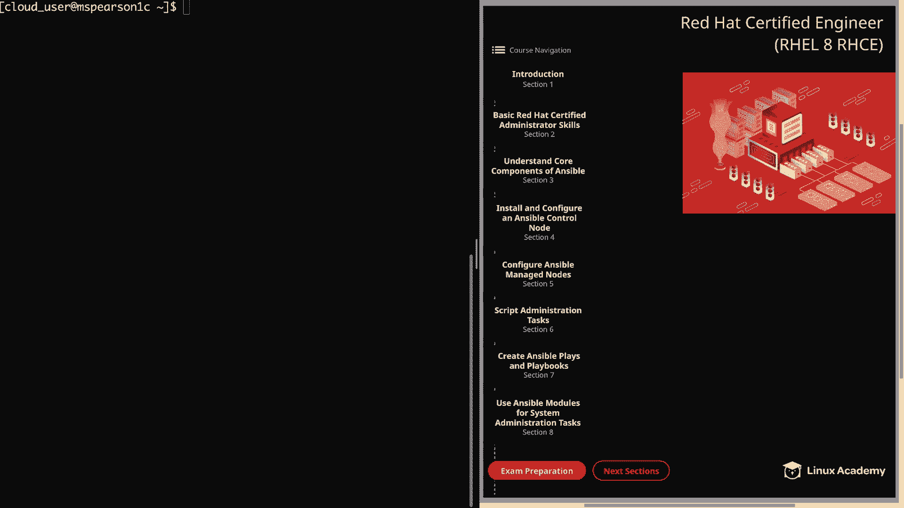
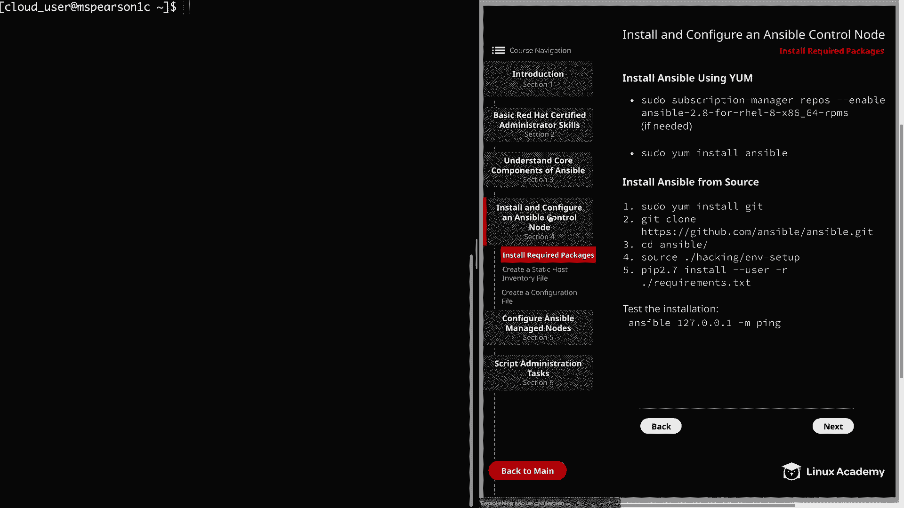
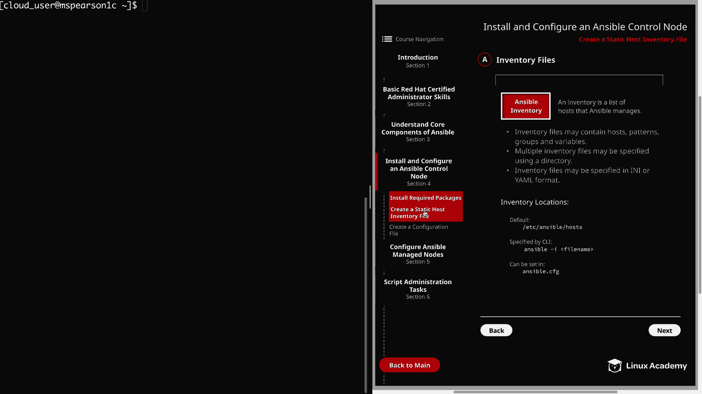
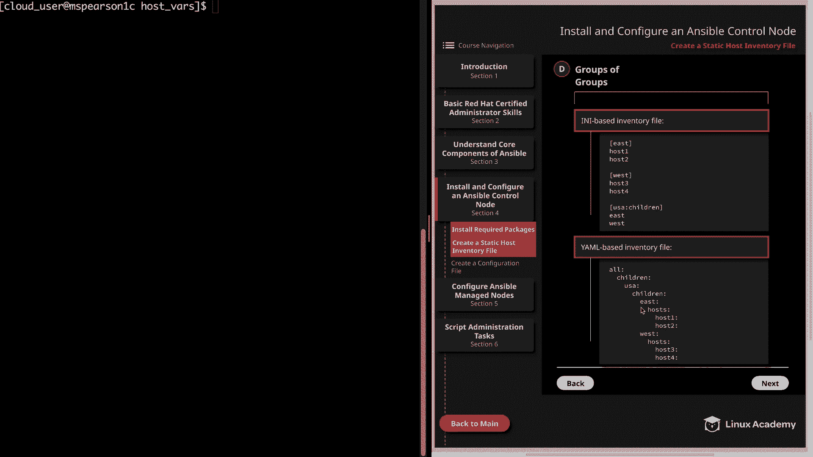

# Ansible 教程：P20：创建静态主机清单文件 📄



在本节课中，我们将学习如何为 Ansible 创建一个静态主机清单文件。清单文件是 Ansible 管理所有主机的列表，它定义了 Ansible 需要对哪些主机执行操作。我们将涵盖清单文件的基本结构、格式、变量管理以及一些最佳实践。



---

## 什么是 Ansible 清单？ 📋

Ansible 清单是所有由 Ansible 管理的主机的列表。这是 Ansible 了解需要对哪些主机执行操作的方式。清单文件可以包含主机、模式、组和变量。

接下来，我们将探讨清单文件的多种指定方式。

---

## 清单文件的格式与位置 📍

清单文件可以以两种主要格式编写：INI 格式或 YAML 格式。选择哪种格式主要取决于个人偏好。默认的示例主机文件通常是 INI 格式，但有些人更喜欢 YAML，因为它更具可读性，并且你将在编写 Playbook 时大量使用 YAML。

关于清单文件的位置，如果未引用其他清单，则默认使用 `/etc/ansible/hosts` 文件。但是，你也可以在命令行中使用 `-i` 标志指定另一个清单文件的位置。例如：

```bash
ansible all -i /path/to/your/inventory -m ping
```



此外，你还可以更新 `ansible.cfg` 配置文件来更改默认的主机文件位置。

在深入细节之前，需要了解清单文件也可以是动态的。

---

## 静态清单与动态清单 ⚙️

清单文件可以是静态的，也可以是动态的。动态清单意味着你可以使用一个脚本（只要它返回 JSON 格式）来生成你的清单。这在云基础设施中尤其有用，因为主机可能会快速变化。然而，动态清单超出了 RHCE 考试目标的范畴，此处提及是为了避免概念混淆。

现在，让我们来看一个静态清单的具体例子。

---

## INI 格式清单文件示例 📝

以下是一个基于 INI 格式的清单文件示例：

```ini
mail.example.com ansible_port=5556 ansible_host=192.168.0.20

[webservers]
web01.example.com
web02.example.com

[webservers:vars]
http_port=80

[dbservers]
db[01:99].example.com
```

在这个例子中：
*   `mail.example.com` 是一个未分组的主机，并直接附带了两个内联变量。
*   `[webservers]` 定义了一个主机组，包含两台主机。
*   `[webservers:vars]` 为该组的所有主机设置了变量 `http_port`。
*   `[dbservers]` 组使用缩写 `db[01:99]` 来表示从 `db01` 到 `db99` 的主机。

上一节我们介绍了清单的基本结构，本节中我们来看看如何更规范地管理这些变量。

---

## 清单变量管理的最佳实践 🏆

正如你在示例中看到的，变量可以直接关联到单个主机，也可以关联到整个主机组。管理这些变量的最佳实践如下：

以下是存储变量的推荐方式：
1.  **变量应存储在 YAML 文件中**，这些文件位于相对于清单文件的特定目录中。
2.  在你的主工作目录（例如 `/home/clouduser/ansible`）中，应该创建 `host_vars` 和 `group_vars` 目录来存储这些变量。
3.  存储在 `host_vars` 和 `group_vars` 目录中的变量文件，应根据它们所包含变量的主机或组的名称来命名。文件扩展名可以是 `.yml` 或 `.yaml`。

例如，对于主机 `mail.example.com` 的变量，应创建文件 `host_vars/mail.example.com.yml`。对于 `webservers` 组的变量，应创建文件 `group_vars/webservers.yml`。

了解了 INI 格式后，我们来看看同样的内容在 YAML 格式中是如何表达的。

---

## YAML 格式清单文件示例 🔄

YAML 格式的清单文件通常更具结构性和可读性。以下是上述 INI 示例的 YAML 等价形式：

```yaml
all:
  hosts:
    mail.example.com:
      ansible_port: 5556
      ansible_host: 192.168.0.20
  children:
    webservers:
      hosts:
        web01.example.com:
        web02.example.com:
      vars:
        http_port: 80
    dbservers:
      hosts:
        db01.example.com:
        db02.example.com:
        # ... 一直到 db99
```

在 YAML 格式中，有两个默认组变得非常清晰：`all` 和 `ungrouped`。`all` 组包含清单中列出的所有主机，而 `ungrouped` 组则包含所有不属于任何自定义组（除了 `all`）的主机。

现在，让我们动手创建一个自己的清单文件。

---

## 动手实践：创建静态清单文件 🛠️

我们将创建一个名为 `m.ini` 的 INI 格式清单文件。

首先，进入工作目录并创建一个专门的 `inventory` 目录来存放清单文件，以保持项目整洁。

```bash
cd ~/ansible
mkdir inventory
cd inventory
```

现在，创建并编辑清单文件 `m.ini`：

```ini
mspearson2 ansible_host=mspearson2c.mylabserver.com

[labs]
mspearson[3:6]c.mylabserver.com

[webservers]
mspearson3c.mylabserver.com
mspearson4c.mylabserver.com

[dbservers]
mspearson5c.mylabserver.com
mspearson6c.mylabserver.com
```

在这个清单中：
*   `mspearson2` 是一个未分组的主机，我们使用内联变量 `ansible_host` 指定了其实际连接地址。
*   `[labs]` 组包含了所有被管理节点（3到6）。
*   `[webservers]` 和 `[dbservers]` 是更具体的组。注意，主机可以属于多个组，例如 `mspearson3c` 同时属于 `labs` 和 `webservers` 组。

根据最佳实践，我们应该将主机级变量移出清单文件。让我们为 `mspearson2` 创建一个主机变量文件。

首先，从 `m.ini` 中移除 `ansible_host` 变量行。然后，创建 `host_vars` 目录和对应的变量文件：

```bash
mkdir host_vars
cd host_vars
```

创建文件 `mspearson2.yml`（或 `mspearson2`）并添加内容：

```yaml
---
ansible_host: mspearson2c.mylabserver.com
```

这样，我们就成功地将变量移到了符合最佳实践的独立文件中。

最后，我们来了解一个更高级的功能：嵌套组。

---

## 使用嵌套组（组中的组） 🧩

有时，你可能希望将多个组组织在一个父组下。这可以通过嵌套组来实现。

以下是 INI 格式的嵌套组示例：

```ini
[east]
host1.example.com
host2.example.com

[west]
host3.example.com
host4.example.com

[usa:children]
east
west
```

这里，`east` 和 `west` 组成为了 `usa` 组的子组。

YAML 格式能更清晰地展示这种层次关系：

```yaml
all:
  children:
    usa:
      children:
        east:
          hosts:
            host1.example.com:
            host2.example.com:
        west:
          hosts:
            host3.example.com:
            host4.example.com:
```

在 YAML 中，通过在 `children` 关键字下定义组，可以直观地创建多级嵌套结构。

---

## 总结 📚

本节课中我们一起学习了如何创建和管理 Ansible 的静态主机清单文件。我们涵盖了：
*   清单文件的基本概念和作用。
*   INI 和 YAML 两种格式的写法与区别。
*   如何定义主机、主机组以及为它们设置变量。
*   管理清单变量的最佳实践，即使用 `host_vars` 和 `group_vars` 目录。
*   如何创建嵌套组来更好地组织主机结构。



掌握清单文件的创建是使用 Ansible 进行自动化管理的第一步。在接下来的课程中，我们将配置被管理节点，并开始使用这个清单文件来运行 Ansible 命令和 Playbook。