# Red Hat Certified Engineer (RHEL 8 RHCE) - P21：388-4869-3 - Create a Configuration File - 11937999603_bili - BV12a4y1x7ND

Welcome back everyone， this is Matt， and in this video I'm going to show you how to create a custom configuration file。

 and this is going to wrap up section 4， which is install and configure an Anible control note。

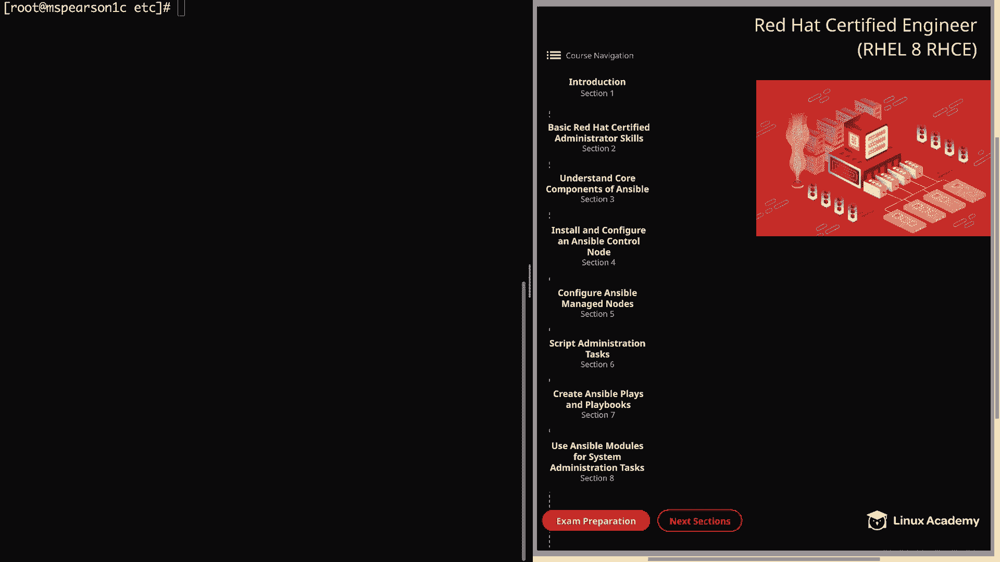

So let's go ahead and click on section 4 and then create a configuration file。

 and then we're going to head over to the command line。

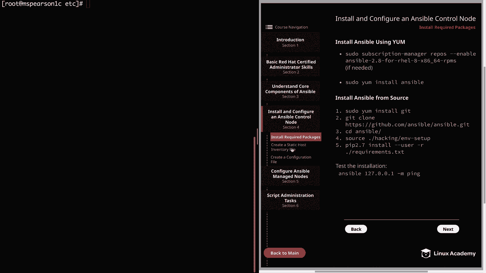

And the first thing I'm going to do is create the Etsy Ansible directory。

 and then I'm going to add the default host and configuration file。

 and I was going to do this prior to the video， but I decided I would go ahead and walk through this with you that way you can go ahead and set it up yourself also and not get confused when I'm referencing the Etsy Ansible ansible。

 CfG or Etsy Ansible host。So let's go ahead and do that now， as you can see。

 I'm logged in as root currently。And I am in the Etsy directory。

 So let's go ahead and create our ansciible directory。

And I'm just going to go ahead and create a roles directory as well while I'm at it。

 and then we'll seed into Ansible。And then we're going to copy the default ansible。

 CFfg and the default host file from our examples directory with an A Git repo。

 So let me just show that to you real quick。 It's going to be a home cloud underscore user。

And then get。Ansible and then examples。As you can see， there's a few different files and directories。

 but we're going to be focusing on the Ansible。 CFfg and the host file， let's go ahead and use CP。

That's home， cloud user， and then Gi。Ansible examples， they're going to get ansible。cfg。

 go ahead and copy it straight here。And then I'll just hit the up arrow。Go ahead and grab host。

Go ahead and list that out and we see we have our ansl。

 CFfg and our host file and as well as our roles directory。

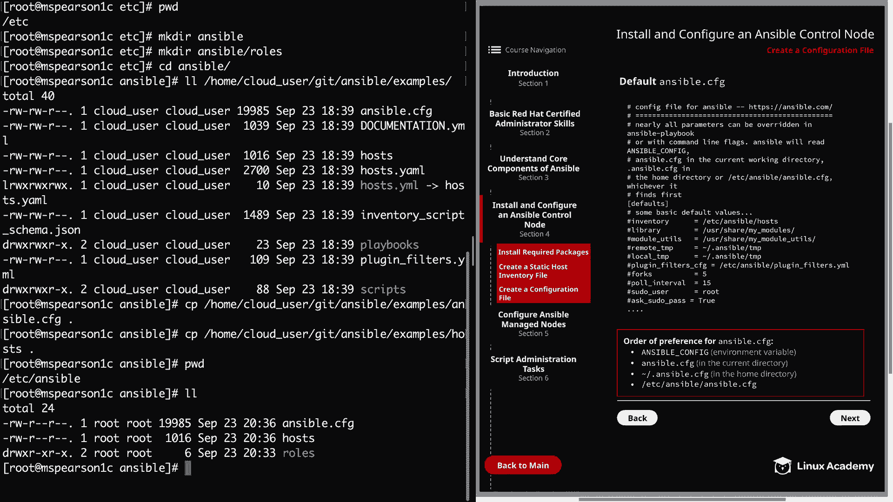

Alright， so now that we've populated those， let's go ahead and clear this and then we can open up the ansible dot CFfg。

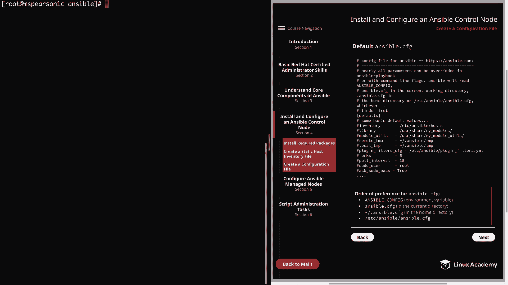

And here at the top， it is telling us again the order of precedence that Ansible is going to read that ansible。

 CFfg。So again， it's going to be the environment variable first and then Ansible dot CFg in the current working directory。

 and then dot Ansible do CFfg in the home directory。And then lastly， Etsy Ansible Ansible。 CFfg。

And again， when it finds an anible out C FG file， it's not going to look for any others。

 And if you look over at the diagram， you'll notice that I've added this again at the bottom。

And then moving on with the configuration file， we're going to see the default heading。

 And this is going to be expressed in brackets。 And this is something that's really important to note because Ansple is not going to know how to associate your configurations unless it's under a heading。

 So whenever we're making our own custom configuration file。

 we need to make sure that we have the proper headings。

So then we're going to see a bunch of comments that have the some of the basic default values。

 So we have inventory here， library， module utilities。Fors， pseudouser。

And if we wanted to change any one of these， we could just go ahead and yank and paste it in and then just uncom it and change the value to whatever we wanted it to be。

 But we're going to keep this with all its default settings since we're going to be creating our own custom configuration file。

 So go ahead and undo that。

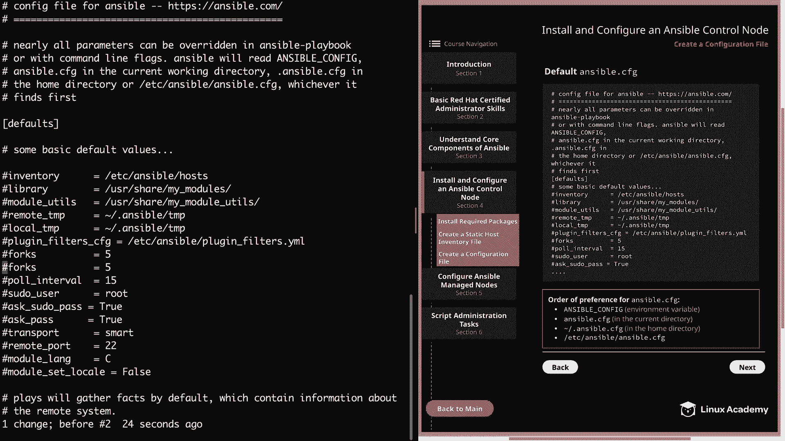

Then we can scroll down just a little bit more。

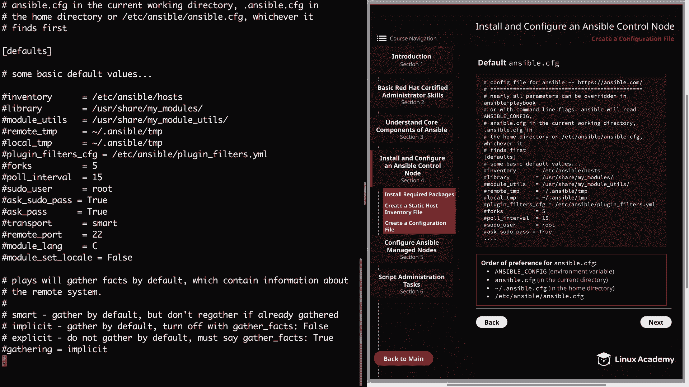

Now we see that plays are going to gather facts by default， which we've talked about earlier。

 And this is the setting that you're going to need to change if you want to disable fact gathering。

 So currently， we know it's set to implicit， which means it is always going to be gathering facts。

 But then you can also set this to smart， which is going to， again gather by default。

 but it's not going to rega if those facts have already been gathered about that host。

And then we have explicit， which is going to tell ansible not to gather facts by default。

 But rather you have to specify gather underscore facts equals true within your playbook。 Allright。

 let's go ahead and page now。

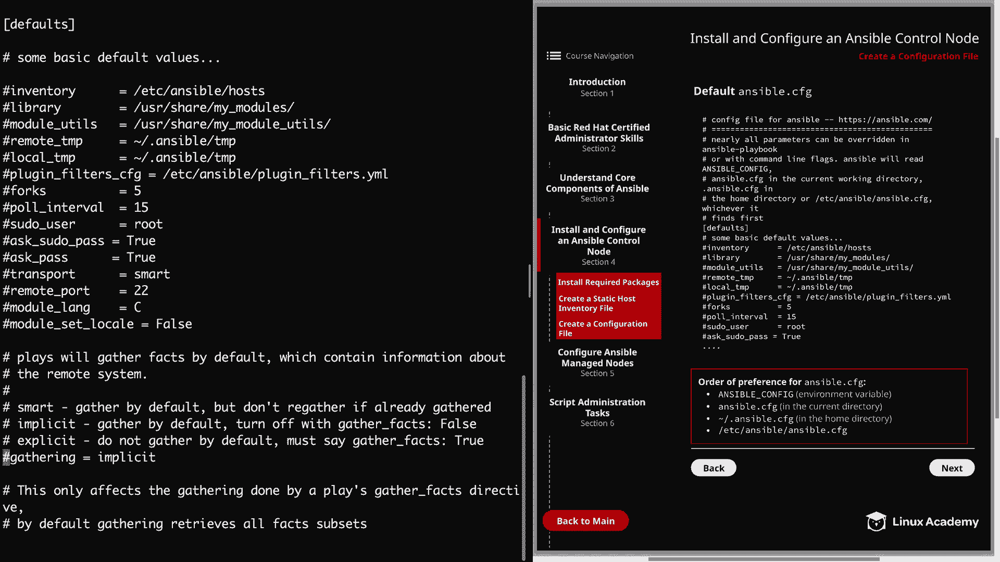

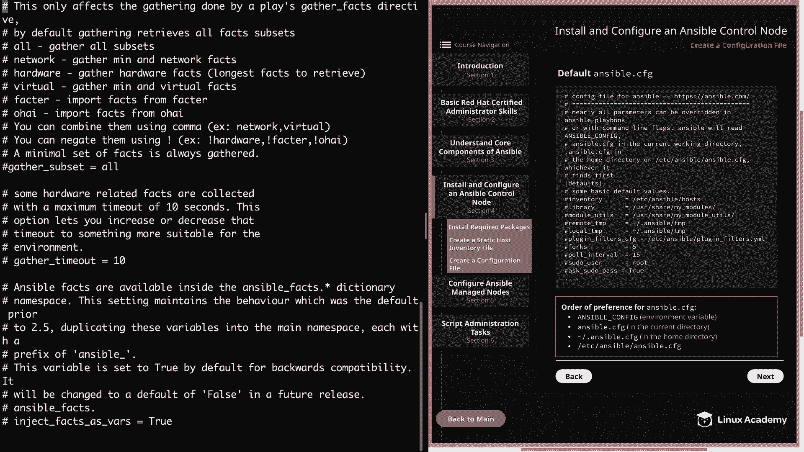

And here it shows you how you can change what type of facts are gathered。

 And then we also have a gather timeout。

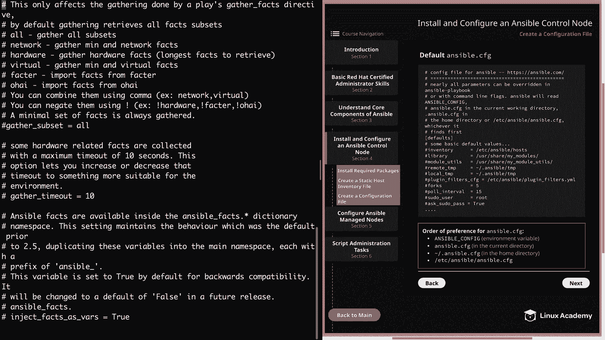

Go ahead and page down again。And another setting that I wanted to make note of is roles underscore path。

 And this is going to set the default directory or directories。

 And you can separate those by colon in which you would like Ansible to search for your rolls in。

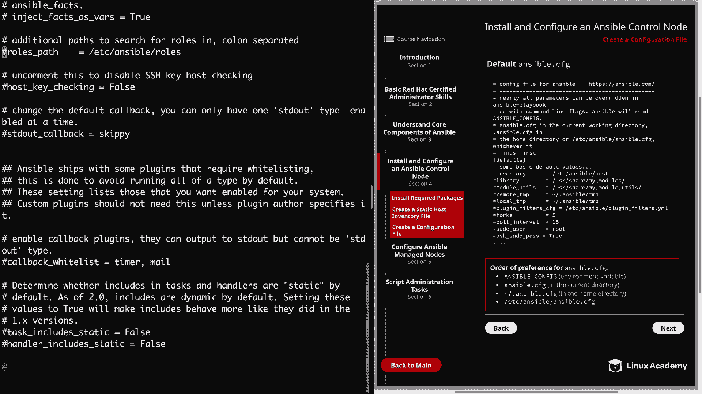

And we can also specify things like the SSH timeout。

Who the remote underscore user is set to by default。

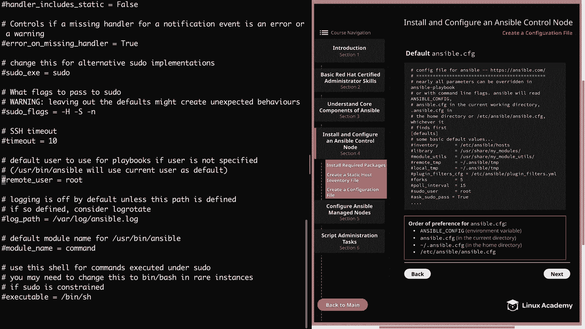

Then if we use shift G to head to the end of the file， we're going to notice some different headings。

 We have di here。And we even have colors。 And this shows us the configurations that we can make in order to change the actual color output that Anible guess us。

All right， so now let's go ahead and close out of this file。

I'm just going to go ahead and clear the screen。And now let's go ahead and create our own simple custom configuration file。

 And just remember that any value that we don't set is just going to use the default ansible values for that particular item。

 Let's go ahead and log out of the root user。See we're in our home cloud user directory。

 let's go ahead and seed into Ansible， which is going to be again， our main working directory。

 and now we can create our custom configuration file。

 and of course it's going to be called Ansible do CFfg。

So as we saw with the default anciible configuration file。

 there were a ton of comments that were mainly just showing us what the default settings were currently set to。

 So our file is going to look pretty small by comparison。So the first thing we need to do。

 remember is to add a heading， so we're going to add the default heading。

And then we can add our configurations。 The first one that I'm going to add is the Python interpreter。

 So this is interpreter underscore Python。Equals auto。

And remember that we needed to add this so that the default of auto underscore legacy could be overwritten because by default。

 it's pointing to user B Python， which is pointing to Python 2 on these cloud servers。

 and setting this to auto is going to use the user Liveexec platform dash Python Slink。

 which is going to point to Python 3。And we're doing this to prevent warnings and so that our young module will also function on the cloud server。

All right， so the next configuration that we're going to override is inventory。

And we're going to set this to be home。Cloud user。Answible。Thenhan our inventory directory。

 and then our main inventory file。And then lastly， we're going to update Ros path。

And remember we can actually add multiple directories for Ansible to search in for roles。

 so we're going to keep the default， which is Etsy ansible roles。

And then we can add another directory by deliminating with a colon。It's going to be home。

 cloud_ user。Ansible， and then rolls。And with these three entries。

 we've created our own Ansible configuration file。So let's go ahead and save and quit。

And then the last thing that I want to do is create that roles directory since it doesn't exist yet。

So Mkder rolls。And just before we finish， I'm going to go ahead and add the interpreter underscore Python equals auto to our default Ansible。

 CFfg。And that's just because no matter what antsipible configuration file we're using。

 I want that always to have the interpreter underscore Python equals auto。

So since we're not currently root， I'm going to go ahead and do pseudo。And that's Etsy， ansible。

 and then ansible。cfg。That is， if I can type in my password correctly。

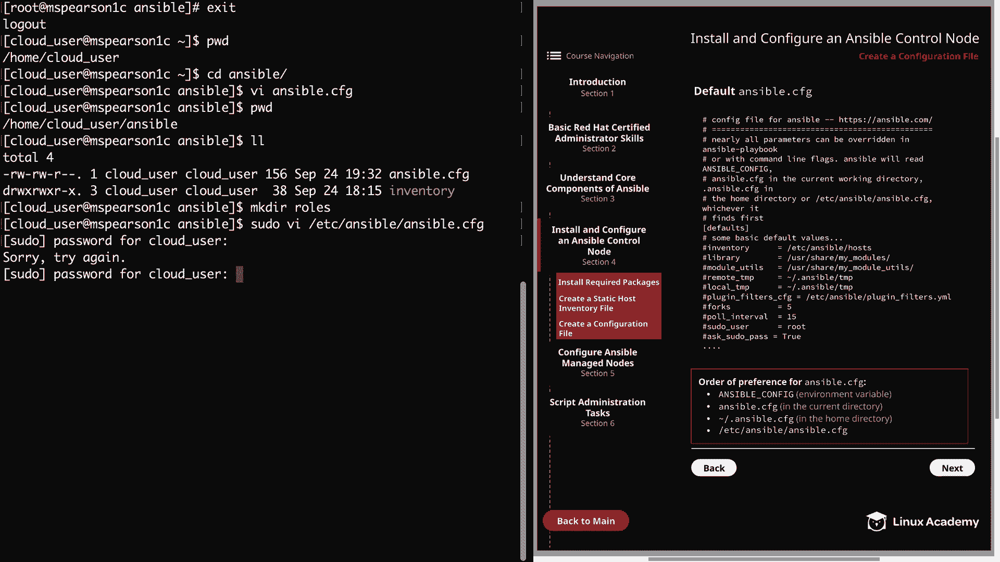

And there we go。And so right at the top here of these default values。

 I'm just going to go ahead and add interpreter。Underscore Python。Equals auto。

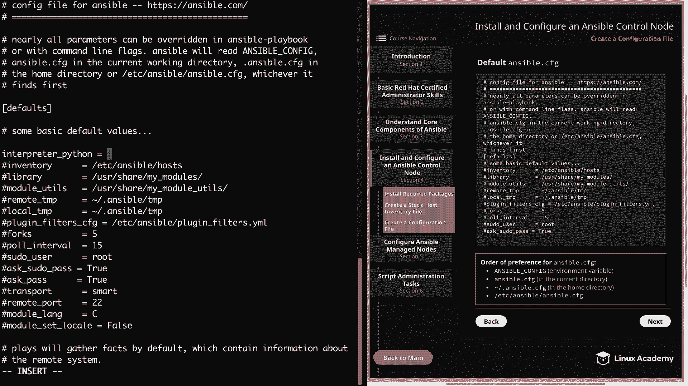

All right， let's go ahead and save this and that's going to finish up this video so let's market it complete and we can move on to configuring ansible manage node。

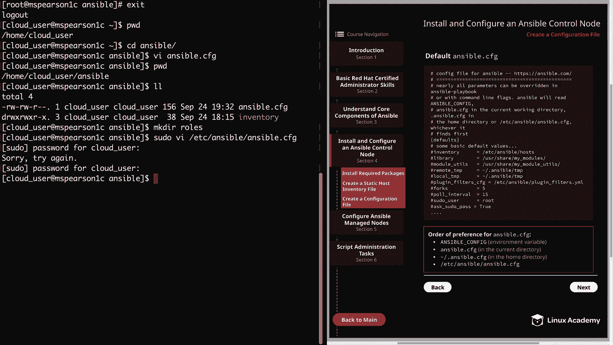