# Ansible 配置管理：P21：创建配置文件

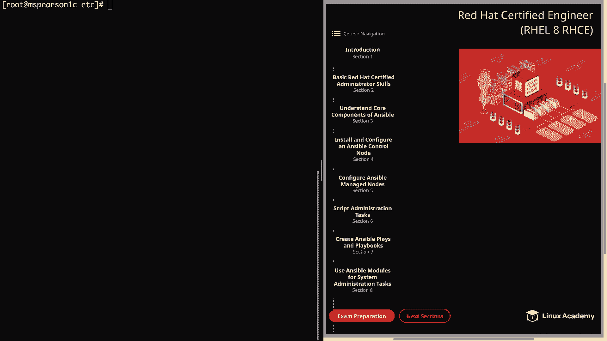

## 概述
在本节课程中，我们将学习如何为 Ansible 创建自定义配置文件。这是“安装和配置 Ansible 控制节点”章节的最后一个部分。我们将从默认配置文件入手，了解其结构，然后创建一个精简的自定义配置文件，并覆盖一些关键设置以适应我们的环境。

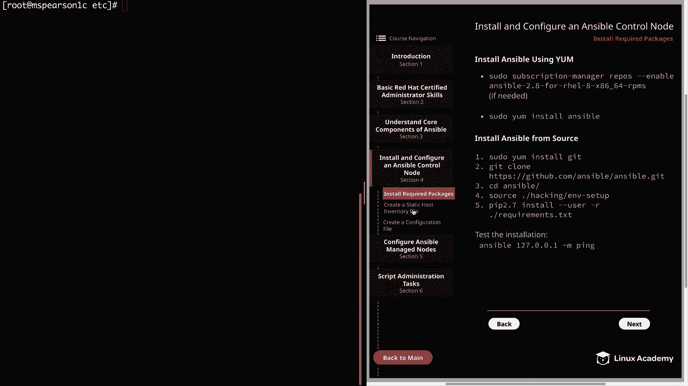

---

## 创建 Ansible 工作目录与文件

上一节我们介绍了 Ansible 的基本安装，本节中我们来看看如何为其建立工作环境。

首先，我们需要创建必要的目录并复制默认的配置文件作为参考。

以下是具体步骤：

1.  以 `root` 用户身份登录，并进入 `/etc` 目录。
2.  创建 Ansible 的主配置目录：`mkdir ansible`。
3.  同时在该目录下创建一个 `roles` 目录：`mkdir /etc/ansible/roles`。
4.  进入新创建的 Ansible 目录：`cd /etc/ansible`。
5.  从 Git 仓库的示例目录中复制默认的 `ansible.cfg` 和 `hosts` 文件：
    ```bash
    cp /home/cloud_user/git/ansible/examples/ansible.cfg .
    cp /home/cloud_user/git/ansible/examples/hosts .
    ```
6.  使用 `ls` 命令确认文件已成功复制。

现在，我们已经准备好了基础的工作目录和默认配置文件。

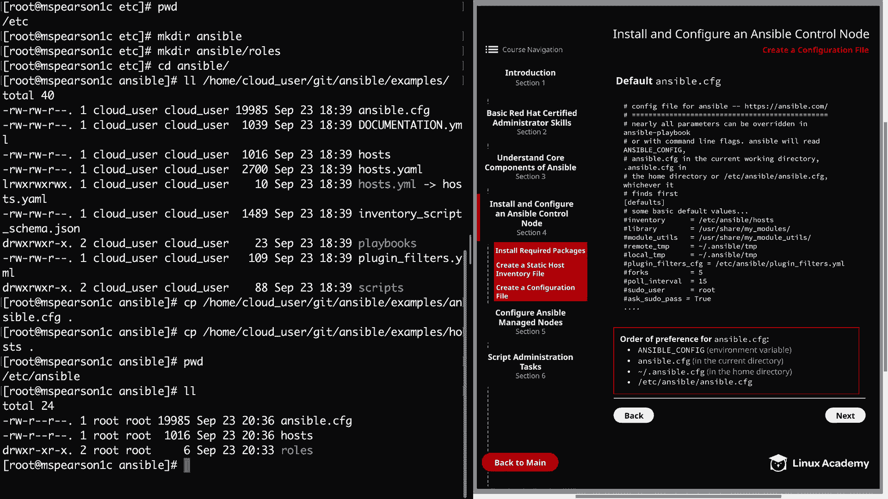

---

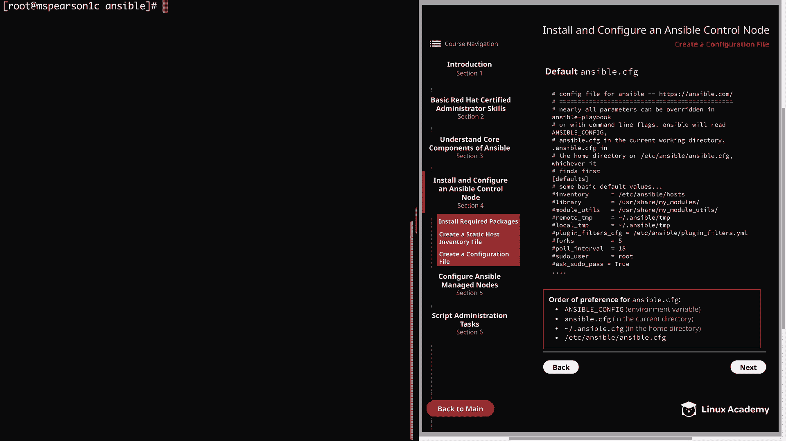

## 解读默认配置文件

在创建自己的配置文件之前，理解默认配置文件的结构和选项非常重要。

我们可以使用文本编辑器（如 `vi` 或 `nano`）打开 `/etc/ansible/ansible.cfg` 文件进行查看。

### 配置文件的读取顺序
文件开头会再次说明 Ansible 读取配置文件的优先级顺序：
1.  环境变量 `ANSIBLE_CONFIG`。
2.  当前工作目录中的 `ansible.cfg`。
3.  用户家目录中的 `.ansible.cfg`。
4.  `/etc/ansible/ansible.cfg`。

**重要提示**：Ansible 一旦找到第一个有效的配置文件，就会停止继续查找。

### 配置段落与默认值
配置文件使用方括号 `[ ]` 来定义配置段落（heading）。这是关键，因为 Ansible 需要根据段落来识别和组织配置项。

在 `[defaults]` 段落下，我们可以看到许多被注释掉的基本配置项及其默认值，例如：
*   `inventory`：定义清单文件路径。
*   `library`：模块库路径。
*   `remote_user`：默认的远程连接用户。

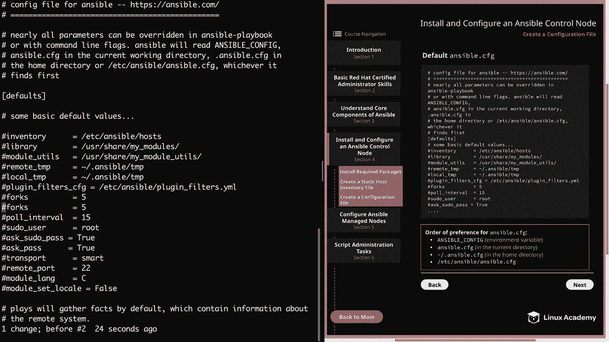

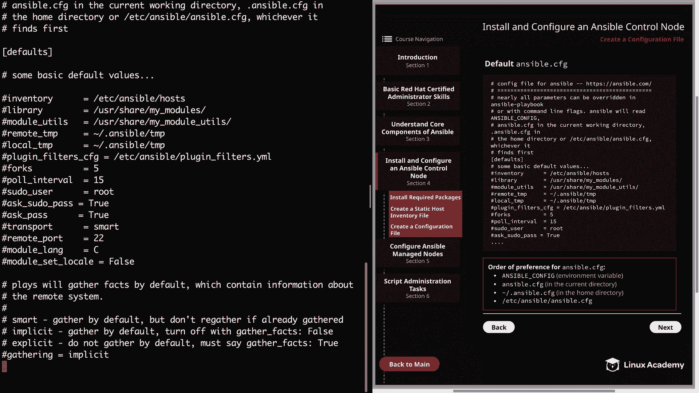

如果我们需要修改某项配置，只需取消对应行的注释并更改其值即可。但本节中，我们将保持默认文件不变，转而创建自己的自定义文件。

### 关键配置项示例
滚动配置文件，我们可以注意到几个重要的设置：

*   **事实收集（Gathering Facts）**：
    配置项 `gathering` 默认为 `implicit`，表示总是收集主机事实。其他选项包括：
    *   `smart`：默认收集，但如果主机事实已收集则不再重复。
    *   `explicit`：默认不收集，必须在 Playbook 中通过 `gather_facts: true` 显式指定。

*   **角色路径（Roles Path）**：
    配置项 `roles_path` 用于设置 Ansible 搜索角色的默认目录。可以指定多个目录，用冒号 `:` 分隔。
    ```ini
    roles_path = /etc/ansible/roles:/home/cloud_user/ansible/roles
    ```

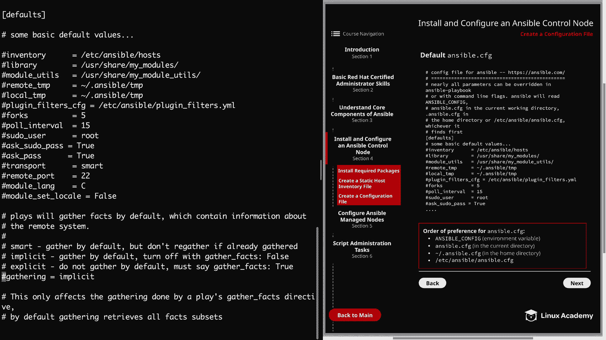

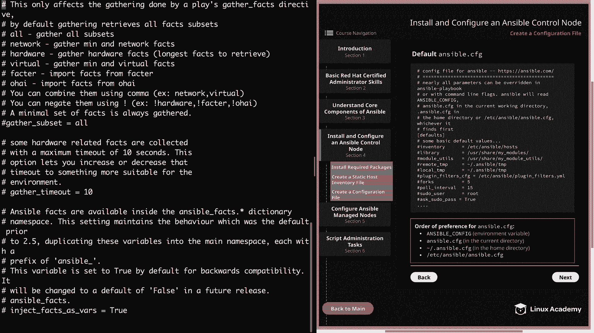

*   **SSH 超时与远程用户**：
    可以配置 `ssh_timeout` 和 `remote_user` 等连接相关参数。

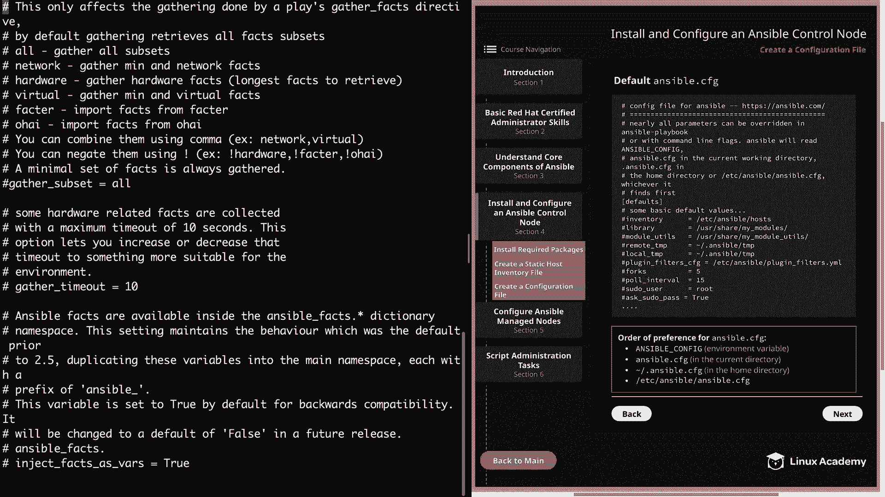

*   **输出颜色**：
    在文件末尾的 `[colors]` 段落，可以配置 Ansible 命令输出的颜色显示。

了解这些内容后，我们可以关闭默认配置文件，开始创建自己的版本。

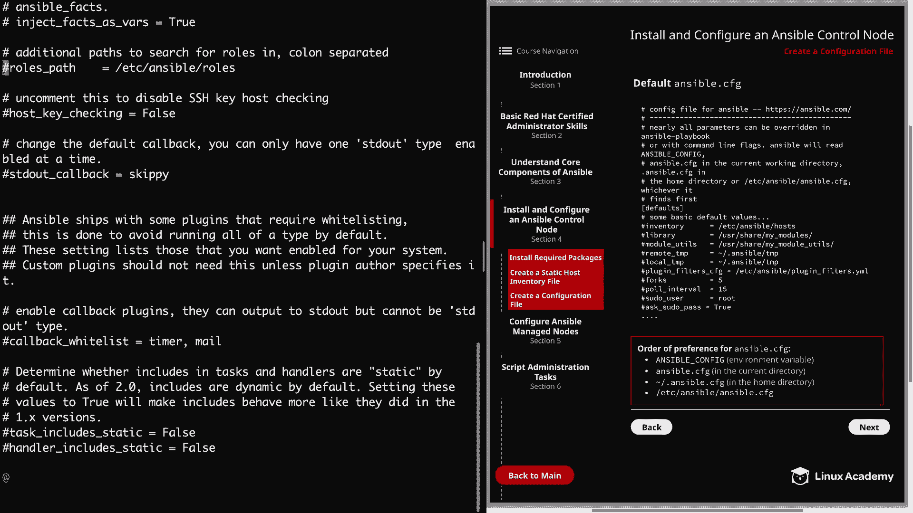

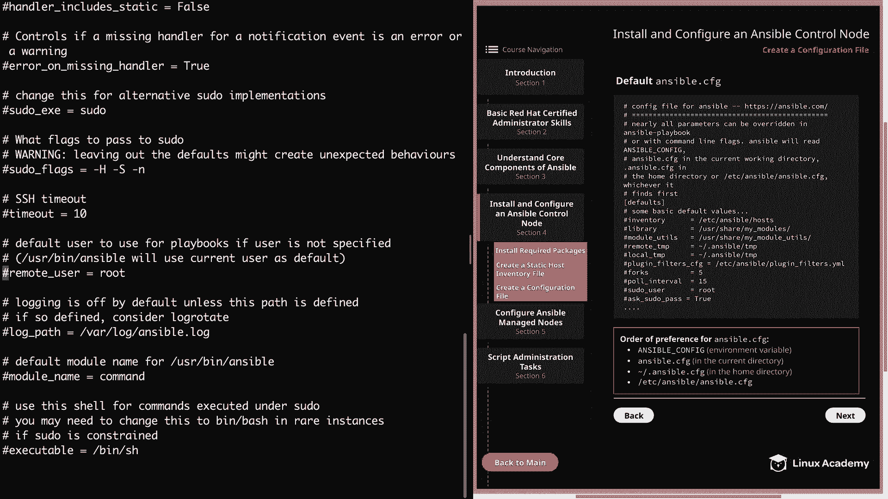

---

## 创建自定义配置文件

现在，我们将创建一个更简洁的自定义配置文件。任何未在自定义文件中设置的选项，Ansible 都会使用其内置的默认值。

首先，退出 `root` 用户，切换到常规用户（如 `cloud_user`）的家目录，并进入我们的主工作目录：
```bash
cd /home/cloud_user/ansible
```

然后，创建名为 `ansible.cfg` 的配置文件。

我们的自定义文件将比默认文件小很多，因为它只包含我们需要覆盖的配置。文件内容如下：

```ini
[defaults]
interpreter_python = auto
inventory = /home/cloud_user/ansible/inventory
roles_path = /etc/ansible/roles:/home/cloud_user/ansible/roles
```

以下是每个配置项的说明：

1.  **`interpreter_python = auto`**：
    *   **目的**：覆盖默认的 `auto_legacy` 设置。在云服务器上，默认可能指向 Python 2（`/usr/bin/python`），将其设为 `auto` 可确保使用 Python 3（通过 `/usr/libexec/platform-python` 软链接）。这能避免警告信息，并确保 `yum` 等模块正常工作。

2.  **`inventory = /home/cloud_user/ansible/inventory`**：
    *   **目的**：指定我们自定义的清单文件路径，而不是使用 `/etc/ansible/hosts`。

3.  **`roles_path = /etc/ansible/roles:/home/cloud_user/ansible/roles`**：
    *   **目的**：定义 Ansible 搜索角色的路径列表。这里设置了两条路径，用冒号分隔。

创建文件并保存退出后，我们还需要创建配置中引用但尚未存在的 `roles` 目录：
```bash
mkdir /home/cloud_user/ansible/roles
```

---

## 更新默认配置文件（可选）

为了确保在任何情况下都使用 Python 3 解释器，我们也可以将 `interpreter_python = auto` 这一行添加到系统的默认配置文件 `/etc/ansible/ansible.cfg` 的 `[defaults]` 段落顶部。

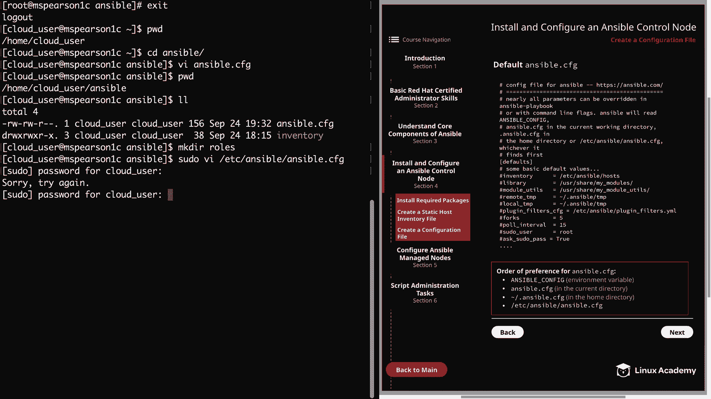

这需要 `sudo` 权限：
```bash
sudo vi /etc/ansible/ansible.cfg
```
在 `[defaults]` 下的默认值列表顶部添加该行即可。

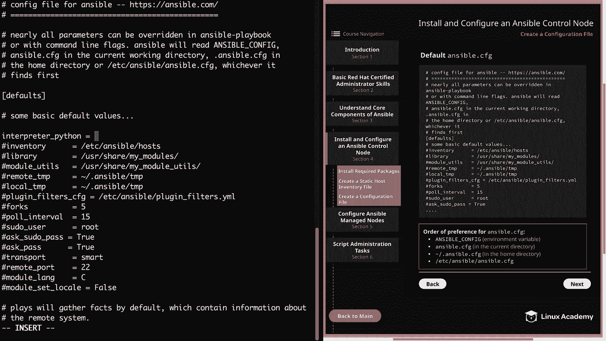

---

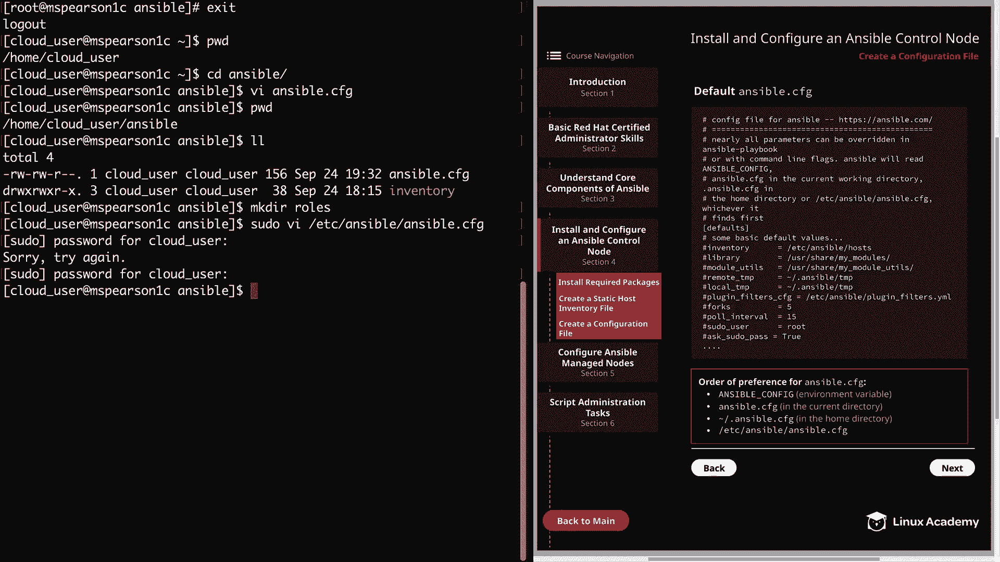

## 总结
本节课中我们一起学习了如何为 Ansible 创建和定制配置文件。我们首先建立了工作目录并了解了默认配置文件的结构，然后创建了一个精简的自定义配置文件，覆盖了 Python 解释器、清单文件路径和角色搜索路径这三个关键设置。通过本课的学习，你应该能够根据实际环境需要，灵活地配置你的 Ansible 控制节点了。接下来，我们将进入下一个主题：配置 Ansible 受管节点。