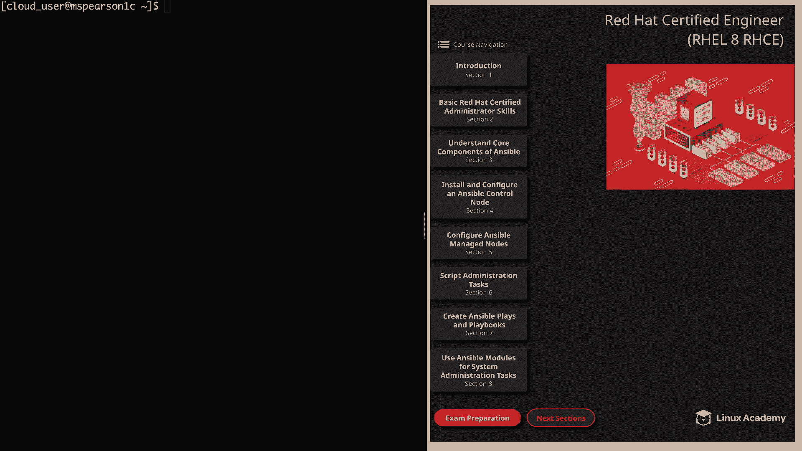
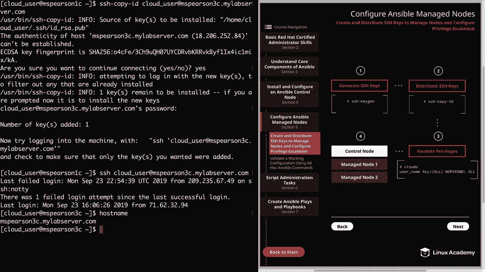
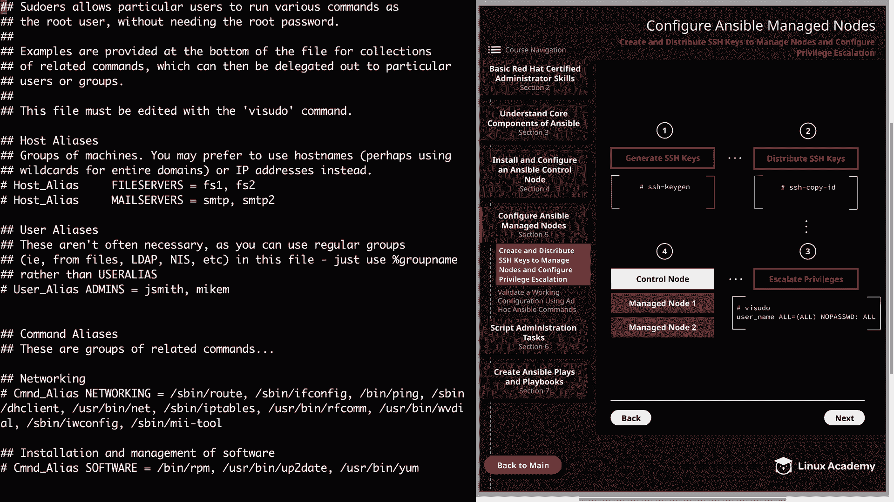
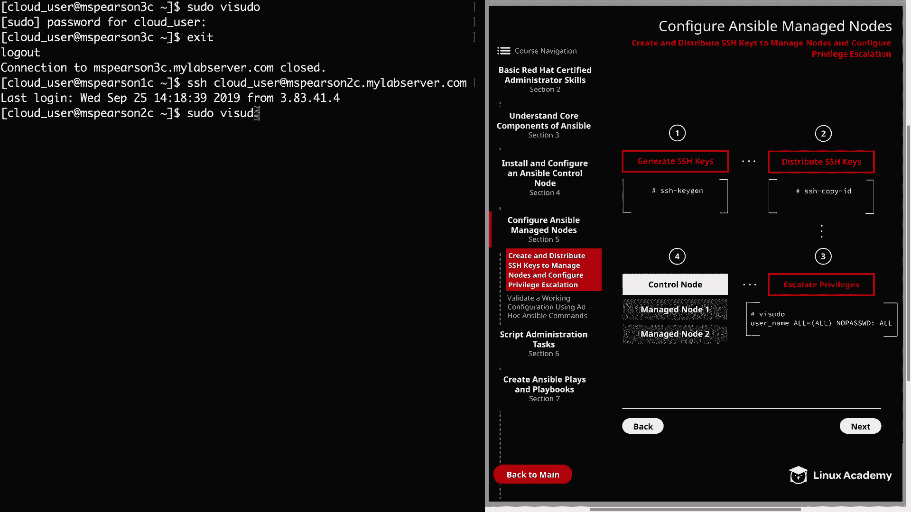
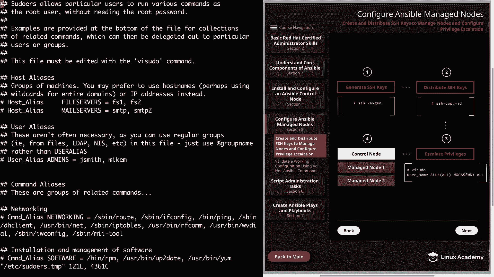
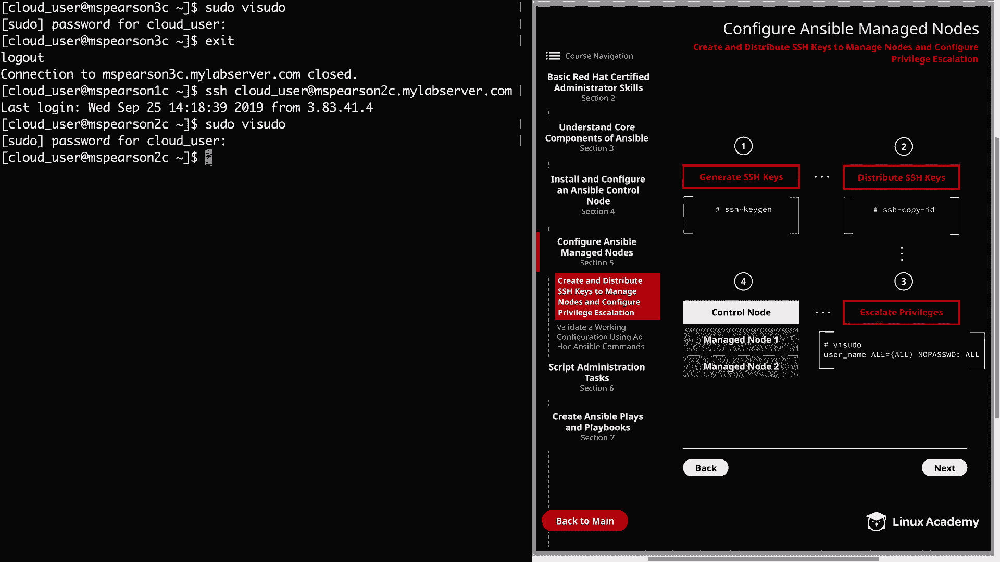

# Red Hat Certified Engineer (RHEL 8 RHCE) - P22：388-4870-1 - Create and Distribute SSH Keys to Manage Nodes and Configure Privil - 11937999603_bili - BV12a4y1x7ND

Welcome back everyone， this is Matt， and in this video。

 we're going to continue on with our installation of Ansible by setting up our ansible manage nodes。

We're going to be doing this by creating SSH keys for our ansible user。

 then distributing these keys to the managed nodes， as well as setting up privilege escalation。

 And honestly， this is one of the reasons that people really love Ansible so much not only is it a great tool for automating deployments and managing systems。

 but it also doesn't require any software to be installed on the nodes that you're managing。

 So Ansible is agentless as opposed to other similar tools that require agents to be installed on their managed host。

 So all we have to do is make sure that Ansible has access to the host and a user that can perform the actions on that host。

So without any more preamble， let's go ahead and click on section 5 for configure Ansible manage nodes。

 And that's going to bring us to the first section here。

 So currently I am logged into the Ansible control node， which is M Pearson 1 C。

 And the first thing that we need to do is generate our public and private keys for the cloud user。

 Now you don't have to use the cloud user as the user that's going to administer ansible on your installation。

 you can always create a new user but just make sure that whatever user you choose。

 you perform these steps as that user。 And if you're setting this up for your company。

 it's probably a good idea to have a specific user that you can easily identify as the Ansible user for one security and then also just for simplicitys sake。

But you could have a scenario where you need to have multiple different users when running Ansible。

 just make sure that whatever situation you find yourself in。

 be sure to go through all these steps for each user。Alright， so if you look to the right。

 I've provided just a simple diagram of the different actions we're going to be taking。

 and then step4 is just the end state of our installation。

 So the first thing that we need to do is generate our SSH keys， which is step1。

 and we're going to do this by taking advantage of the SSH key gen utility。

 So to generate our public and private keys， All we need to do set over to our command line。

 and then we're going to type in SSH dash key gen。And we see that it's generating our public private RSA key pair。

 and then we need to enter a file in which to save the key。And you can make this whatever you want。

 but I'm just going to accept the default， which is in home Cloud user and the dot SSH directory and then ID_ RSA。

So we'll hit enter。And then it's going to ask us if we want to enter a passph。

And it is good to have a pass phrase for security， just as another line of defense。

 But for our installation， I'm just going to leave this blank， mainly out of convenience。

And then we'll hit enter again and you can see that two different files were created。

 We have ID underscore RSA， which is going to be our private key， and then ID_ Rsa。 pub。

 which is our public key。Now let's go ahead and clear this out。And just real quick。

 I want to show you home， cloud user and dot SSH。We see our public and private key pairs。

 and now that we have our keys， we need to copy our public key to our managed nodes。

And this is going to be step two in our diagram， which is distribute SSH keys。

And this can be done manually just by copying the public key and then adding it to the authorized underscorere keys file。

 and let me just show you that public key really quick。I D underscore RSA dot pub。

And then we're going to cat that。So if you wanted to copy this manually。

 all you have to do is copy and paste this string right here and put into that authorized keys file。

 But there's actually a really handy utility for copying this to the desired location。

 and that's using SSH copy I。 Let's go ahead and clear this。

 and then all we need to do is run SSH copy I。And then the name of our user。Cloud user， and then at。

The actual host name of our managed note。So first we're going to copy this to MSParson2c。

myabbservver。com。And it shows us that we've added one key and that we can try logging into the machine using SSH just to validate it。

 So let's go ahead and try that。 I'm just going to hit my up arrow here。

And we see that we were able to log in and also that we were not prompted for a password。All right。

 so now let's exit， I'll take us back to MS Pearson 1 C。And we can clear that out。

 So before we move on to step3， we're going to distribute this key to M Pearson 3 as well。

 Let's go ahead and hit the up arrow a couple times。

And then all we need to do is replace R C with the three。We're going to say yes。

 then enter our password。And we see that the command was successful again。

 Let's go ahead and try to log in， just to be sure。And again， we were not prompted for a password。

We've logged into MS Pearson 3C。Al right， so now that we have copied our SS S H keys to our managed host。

 we can set up privilege escalation for our cloud user。 So since we're already logged into M S。

 Beararson 3 C， let's go ahead and escalate the privileges for the cloud user on this host first。

Let's go ahead and clear this。And in order to grant these pseudo privileges。

 we need to edit the pseudoers file， and in order to edit that file。

 you need to have elevated privileges。And by default， our cloud user already has those privileges。

 But I'm still going to walk through that and show you how to do it just in case you're using a different user or you're in a situation where the user does not have privileges。

 So the file actually exists in Etsy。It's called pseudoers。And as you can see。

 even the owner of the file does not have right access。

 so we're going to be using the VIcito command to actually edit the file。

 and that's just going to do some syntax checking for us and make sure that we don't mess something up because this is a really important file。

So now let's go ahead and open up that file and edit it using the VI pseudo command or ViU。

 depending on how you want to say it。So we see at the top of the file that pseudoers allows particular users to run various commands as the root user without needing the root password。

 and it lets us know that examples are going to be provided at the bottom of the file。

 and also that the file must be edited with the V pseudo command。

 So let's add down to the bottom and check out some of these examples。

 and then we can also add in our entry。

So right here toward the top， we see this entry that allows root to run any commands anywhere。

 and this is the syntax for a single user。And then if you scroll down just a bit。

 you're going to see how you can do this for a group。

 So this is going to allow all the people in the will group to run all commands。

 And then we see the same thing again， except this time it's not going to require a password。

 And we're actually going to be using the no pass to be the option for our user that way。

 we don't get prompted for a password and we don't have to supply one。

 So I'm going to head down here to the bottom again。 And we're just going to grab this entry。

And I'm going to enter cloud underscore user。And this is going to allow us to run any command without requiring us to supply a password。

So even though our cloud user already had pseudo privileges， the know Pass option was not set。

 so it's good that we went ahead and updated this so we don't run into that problem down the road。

Alternatively， we could add a file to Etsysers。 D。 You see right here， it says include directory。

And in the same way that we saw with ym。 reos。 D， all those repository files under that directory you are going to get pulled in。

 and the same is happening here。 So in addition to just the Corors file。

 you can also just add your permission to a file and that's going to be pulled in and read as well。

All right， so let's go ahead and save this file。And now we can exit out of M Pearson 3C。

And then I'm going to SSH to MS Pearson 2C。We're going to add that as well。

Remember you we need to use VIU。

And then we can use shift sheet ahead to the bottom and we're going to yank this。

Paste it in below and then type in Cloud underscore user。Al right。

 so now I'm going to go ahead and save that。 And now that we've completed those steps。

 our managed nodes are ready to work with Ansipible。

 It's honestly just that simple as long as the user has access to the host and privileges to perform commands on that host。

 Your ansible managed node has been configured。In the next video。

 we're going to test out our configuration using some ansible ad hoc commands。

But before we wrap this video up， I did want to mention that I'm going to set this up for M Pearson 4 C and 5 C as well。

 So for your own installation， if you'd like to go ahead and set up a couple more host。

 feel free to do that。 Just make sure that you perform these steps for each of those。All right。

 well that's going to finish us up here for this video。

 let's move on to the next and we can test out our configuration。

