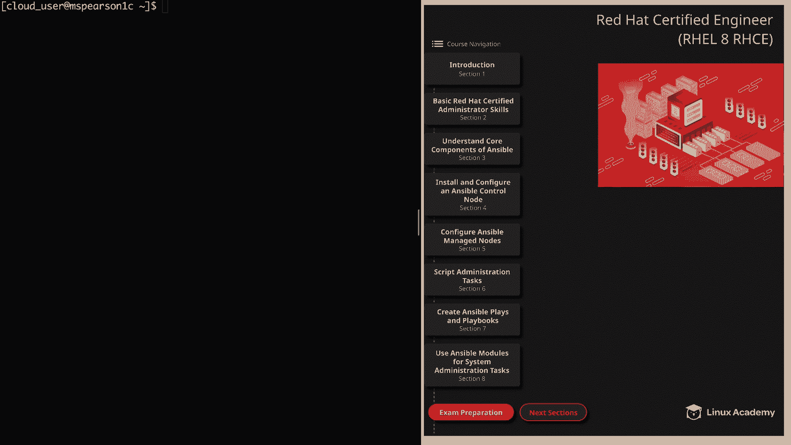
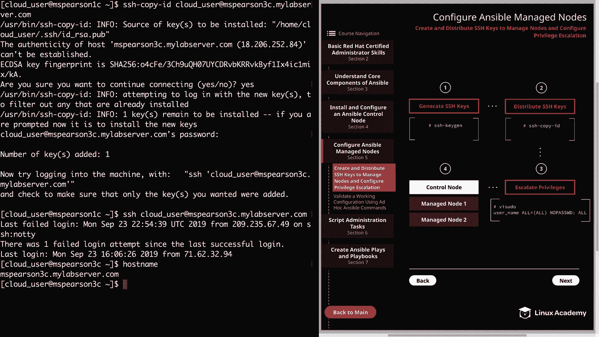
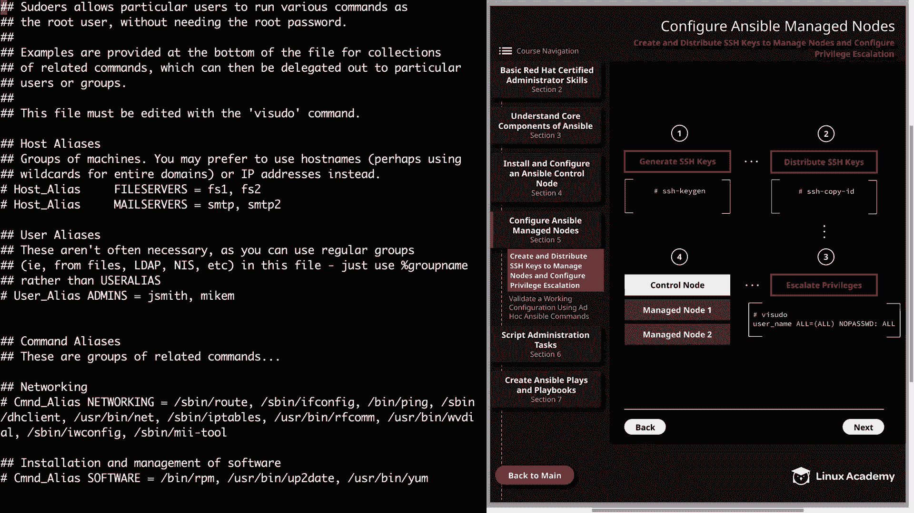
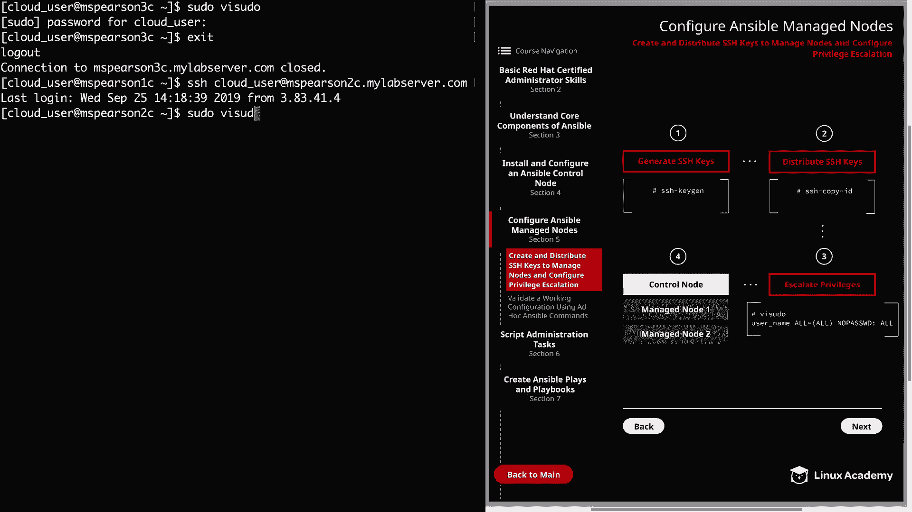
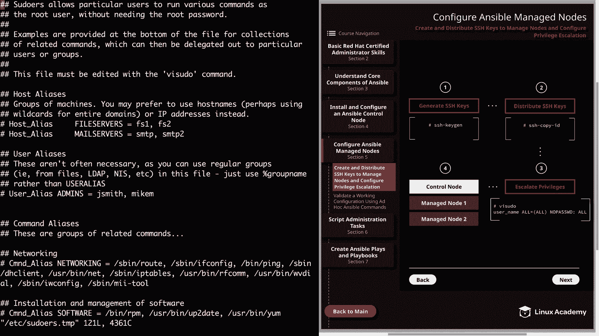
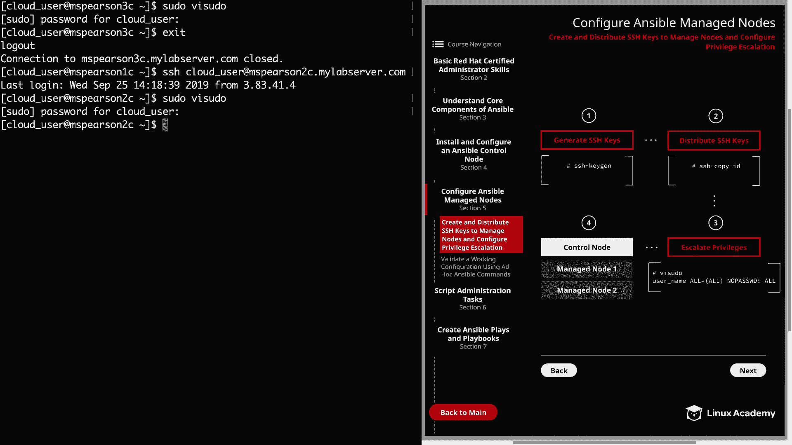

# Ansible 配置教程：P22：配置 Ansible 受管节点

## 概述

在本节课程中，我们将学习如何配置 Ansible 的受管节点。主要内容包括为 Ansible 用户创建 SSH 密钥、将公钥分发到所有受管节点，以及配置权限提升。Ansible 的一个主要优势是它是无代理的，这意味着无需在受管主机上安装任何软件，只需确保 Ansible 能够访问主机并拥有执行命令的权限即可。

## 生成 SSH 密钥对

首先，我们需要为 Ansible 管理用户生成 SSH 密钥对。我们将使用 `ssh-keygen` 工具来完成此操作。



以下是生成密钥的步骤：

1.  打开终端，确保以 Ansible 管理用户身份登录。
2.  输入命令 `ssh-keygen` 并按下回车。
3.  当提示“输入保存密钥的文件”时，可以接受默认路径（例如 `/home/clouduser/.ssh/id_rsa`），直接按回车。
4.  当提示输入密码短语时，出于安全考虑可以设置，但为了演示方便，我们直接按回车留空。

命令执行后，将在 `~/.ssh/` 目录下生成两个文件：私钥 `id_rsa` 和公钥 `id_rsa.pub`。

```bash
ssh-keygen
```

## 分发 SSH 公钥

生成密钥对后，需要将公钥复制到所有受管节点上，以便实现免密码 SSH 登录。我们可以使用 `ssh-copy-id` 工具来简化这个过程。

以下是分发公钥的步骤：

1.  使用 `ssh-copy-id` 命令，后接用户名和主机名。
2.  系统会提示你输入目标主机上该用户的密码。
3.  成功后，可以尝试 SSH 登录该主机进行验证，此时应不再需要输入密码。

例如，将公钥复制到主机 `msparson2c.myabbservver.com`：

```bash
ssh-copy-id clouduser@msparson2c.myabbservver.com
```



请为你的每一个受管节点重复此步骤。

## 配置权限提升

上一节我们配置了免密登录，本节中我们来看看如何配置权限提升。为了让 Ansible 用户能够在受管节点上执行需要 root 权限的命令，我们需要配置 `sudo` 权限，并设置为无需密码。

这可以通过编辑 `/etc/sudoers` 文件来实现。**必须使用 `visudo` 命令来编辑此文件**，因为它会进行语法检查，防止配置错误导致系统问题。



以下是配置步骤：

1.  通过 SSH 登录到目标受管节点。
2.  运行 `sudo visudo` 命令。
3.  在文件底部，添加一行配置，赋予你的 Ansible 用户无需密码执行所有命令的权限。
4.  保存并退出编辑器。

需要添加的配置行格式如下，将 `cloud_user` 替换为你的实际用户名：

```
cloud_user ALL=(ALL) NOPASSWD:ALL
```



此配置意味着用户 `cloud_user` 可以在任何主机上，以任何用户身份，无需密码地运行任何命令。



为每一个受管节点重复此配置步骤。

## 总结



本节课中我们一起学习了配置 Ansible 受管节点的完整流程。我们首先生成了 SSH 密钥对，然后使用 `ssh-copy-id` 将公钥分发到各个节点，实现了免密登录。最后，我们通过编辑 `sudoers` 文件，为 Ansible 用户配置了无需密码的 `sudo` 权限。完成这些步骤后，你的 Ansible 控制节点就已经能够顺利地管理和自动化操作所有受管节点了。在接下来的课程中，我们将使用 Ansible 临时命令来测试这个配置。