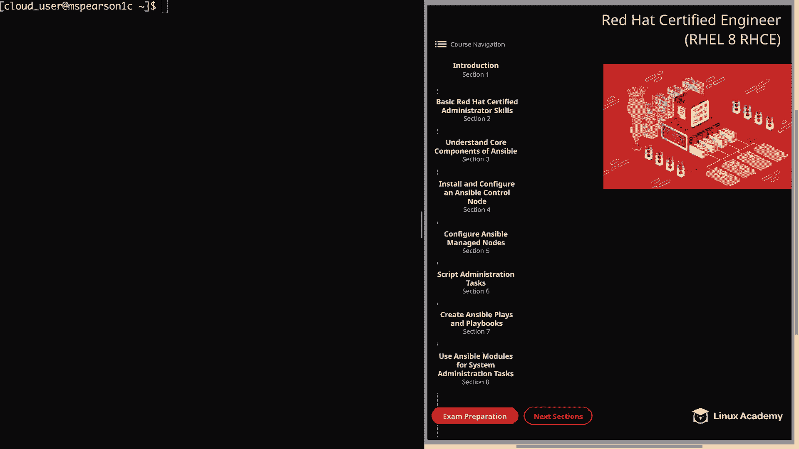
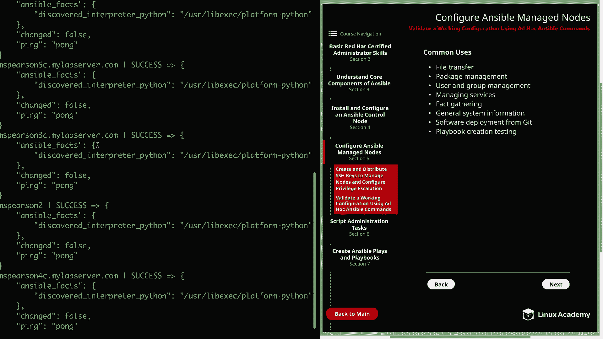
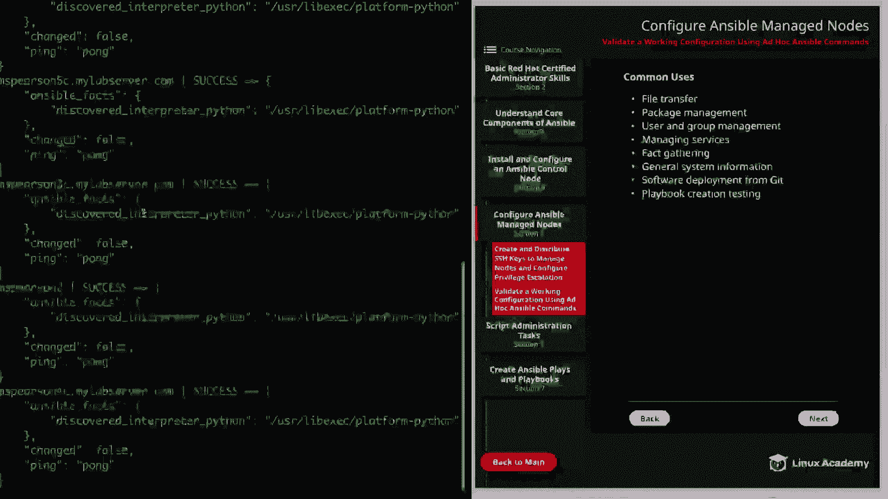
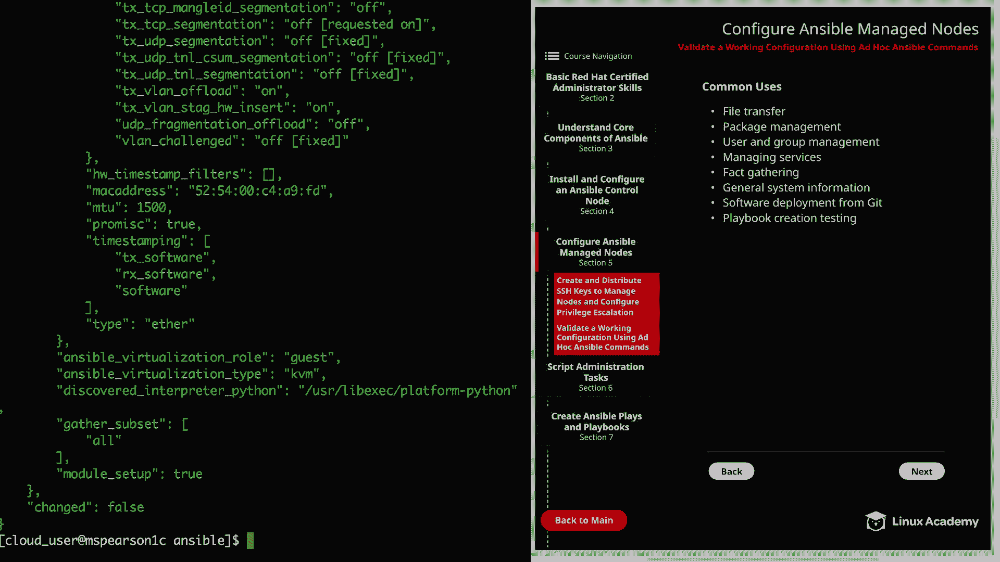
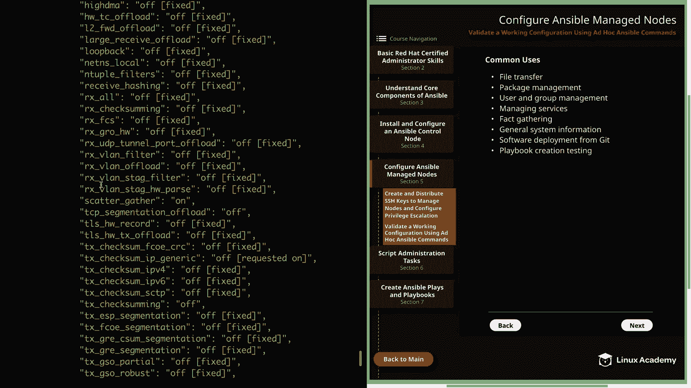
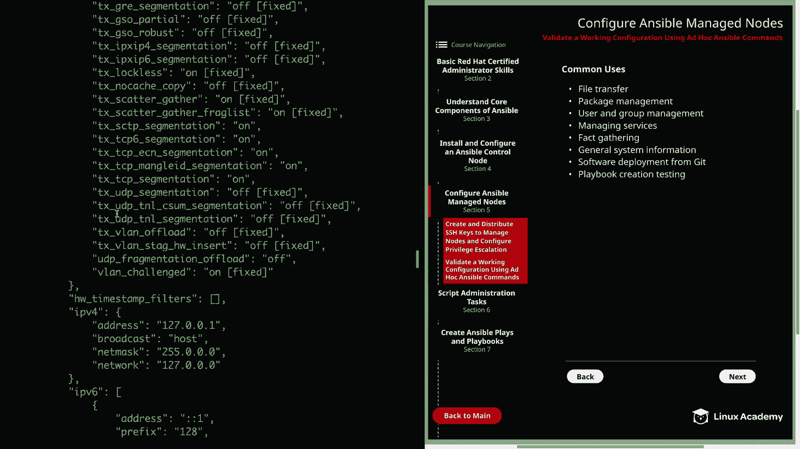
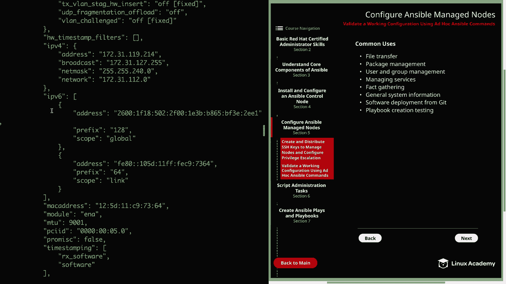
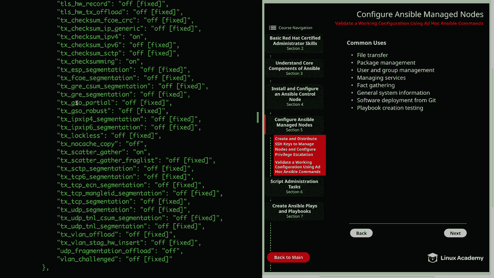
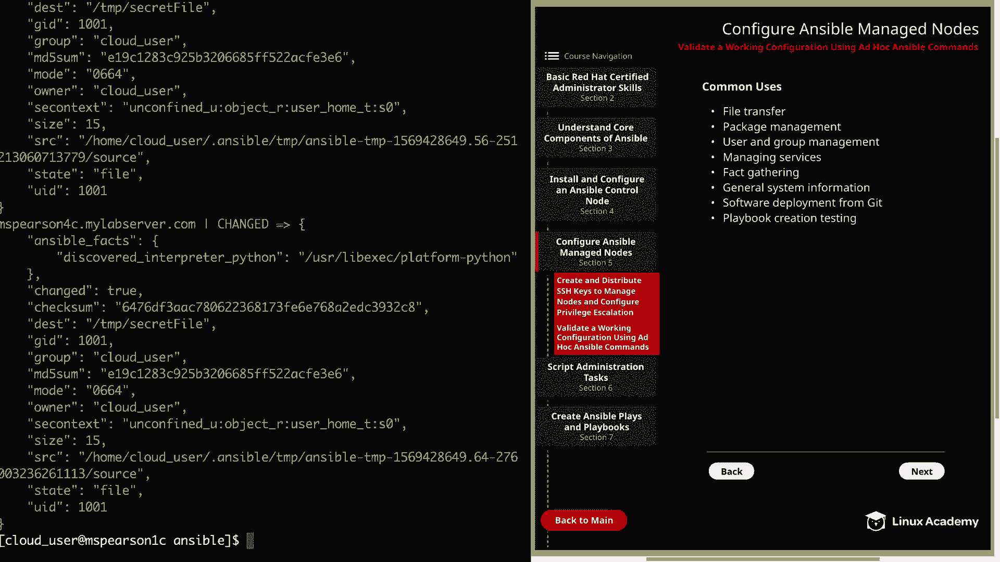
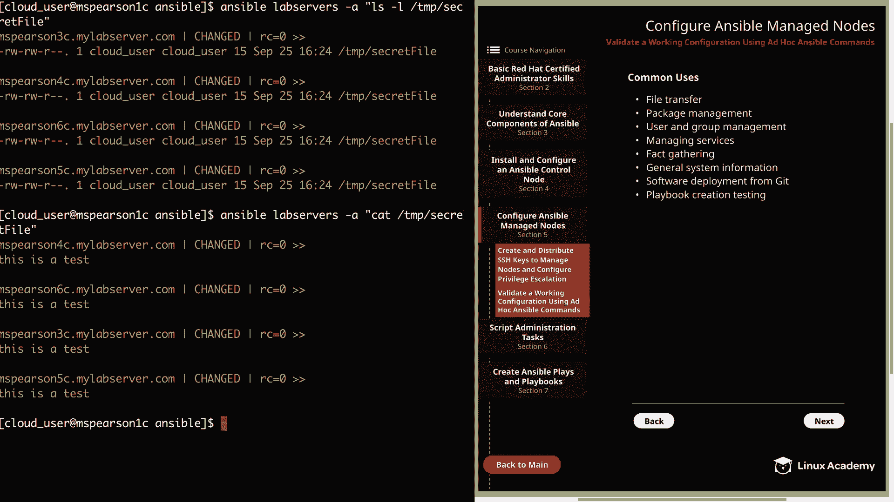

# Red Hat Certified Engineer (RHEL 8 RHCE) - P23：388-4870-2 - Validate a Working Configuration Using Ad Hoc Ansible Commands - 11937999603_bili - BV12a4y1x7ND

Welcome back everyone， this is Matt and in this video we're going to be validating our working ansipible configuration using some ansible ad hoc commands。

So let's head over to section 5， which is configure ansible manage nodes and then down to validate a working configuration。

 And before we get into validating our setup， first。

 let's talk a little bit about the ansible ad hoc command。 And as you can see。

 the syntax is going to take the following format。 It's going to be the ansible command followed by the host or group that you're wanting to reference。

 And then you can pass the dash i flag， which allows you to specify an inventory file。

 Otherwise it's going to use the default。 and then you can use dash M followed by a module。

And then dash A in the arguments for that module。 And so an ansible ad hoc command is basically used to execute a quick one liner。

 And this is going to be very similar to the way in which you would use a bash1 liner command。

 as opposed to writing a bash script that you might save for regular execution。This doesn't mean。

 however， that you shouldn't save a list of ansible ad hoc commands that you regularly use。

And in fact， we're going to be going over how to use a shell script in order to call some of these antsible ad hoc commands。

They are useful for nonrout tasks， and we know that the main bread and butter of ansible is in the playbooks。

 which is going to allow you to execute a series of plays in order to achieve a desired end state on a host。

 However， there are several situations， especially when it comes to non routineout task where it doesn't really make sense to write a playbook。

 and it's actually more efficient just to use an ad hoc command。As we saw in the syntax。

 ad hoc commands are executed using the Ansible command， and then of course。

 Ansible Dash playbook is going to be used to execute a playbook。

Arguments that are passed using the dash a flag do require double quotes and are going to be space delimited if there are multiple arguments。

 Another thing to keep in mind is that commands are executed as the user running ansible。

 So whatever user that you are when you run the ansible command is a user that's going to be executing the task that you want to perform。

You can always change that user by specifying the dash U option。

 which is going to change the user that is running the Ansible command。

And you can also use dash dashash becomecom dashash user。

 and that's going to specify the user that you want to execute the commands on the remote host or manage nodes。

And another important flag is the dash B option， and this is used to execute commands as the route user。

 and this will be necessary for any task you're trying to perform on your managed node that's going to require escalated privileges。

 And this is the reason behind adding the cloud user to the suitorous file on our managed nodes。

Lastly， the dash A option may be used without the dashM option in order to just run Shell commands。

So if you simply just need to run a random shell command。

 you can do this by specifying that dash a option， again。

 make sure that the module option is not present， and then your command is going to go in the double quotes where your arguments normally would go。

 and I'm going to be showing you an example of this momentarily。All right。

 so now let's head to the next page。We can talk about some of the common uses of ansible ad hoc commands。

First is file transfer， and this is useful in case you need to just copy a file to one of your managed nodes or even create a file on that node。

Then we have package management， and if the particular software needs to constantly live on the host。

 then you may want to think about putting it into a playbook。

 but you can still always use ansible ad hoc to install packages with yM or with apt and you can also gain information about packages that are already installed and that can be things like what's the version of the package that's installed or even if the package just exists。

 and this actually speaks to a larger point of something that's useful about ansible ad hoc and that's just gaining information about a host。

Next is user and group management， so you can add or remove groups and users on the host as well as changing permissions on files and directories。

 and though this can be done in a playbook， that's also something you can do in a one- off situation using Ansible ad hoc。

Next， we have managing services。And you could be in a situation where you just need to shut down a service or to check and see whether a service is enabled and running。

 or maybe you're even in a situation where you're going to go out of town for a week。

 So you want to issue a command to shut down all of your lab servers， So there are， of course。

 several different scenarios， but that information gathering is， again， really important。

 which actually brings us to our next point， which is fat gathering。

So one of the great things that Ansible does by default is gathering a ton of different information about the host。

 such as the operating system， kernel version， even the actual disks that are attached to it。

And this is what is known as ansible facts。 So with the ad hoc command。

 you can actually use the setup module in order to gather these facts about a host machine or a group of host。

 and we're going to go much deeper into ansible facts later on in the course and also how we can use them in our commands and our playbooks。

And then in addition to Ansible facts， we also have general system and process information。

So this is going to be things that Ansible is not going to gather by default using Ansible facts。

 which could be things like running processes or logs or even a resource utilization。

 which of course can be very important to know in a one off situation。Next。

 we have software deployment from Git， and as you know。

 Git has become a very important part of the IT pipeline。

 and there's actually a git module that's going to allow you to deploy software or files straight from a Git repository。

And then lastly， playbook creation testing。So using ansible ad hoc commands is one of the best ways to play around with different ansible modules and also to see how they work。

 and this is going to allow you to test out the modules before you add them into your playbook just to make sure that you're getting the intended results。

And this is actually something that I've used personally just to help me understand modules better and also just to test them out to make sure that they function in the way that I think they're going to So that's definitely something that I would recommend you do as you're learning more about Ansible。

All right， so now that we have learned about ansible ad hoc commands。

 we're finally coming to the moment where we can validate our configuration。

 So let's head over to the command line。 Currently I am in the cloud user' home directory。

 So let's Cd into Ansible， which is， of course， our main working directory。

 We see our ansible configuration file and our inventory directory in our roles directory。

 And before we test out any commands， let's go ahead and check out our inventory file。

 which is M do I and I。😊，And we see that we have five different servers configured Ms Pearson 2 all the way to MParson 6 So let's close out of this and we can go ahead and run some commands。

 And the first thing that we're going to do is use the ping module。

 and that's just going to see if we can actually reach out to the host。So for that。

 we're going to run ansible I， then we're going to specify our inventory file。

 and then I'm going to use the default group of all。

 and that way it's going to run this ping against all the hosts that are in our inventory。

And you can specify your host or group of hosts before the inventory file。

 and you'll probably see me do this both ways， but I just wanted to point that out real quick。

And then we're going to supply our dash in flag for the module。

 we're going to be using the Ping module。So as you can see， we're greeted with this green text。

 as well as several success messages。

Then we see all our different managed nodes。

And we were able to reach out using Ping。Now I'd like to test out the setup module。

 so let's go ahead and clear this out， and then we can use the setup module to gather facts about a host。

 and let's go ahead and run this against M Pearson 2。

We're going to use ansible and here I'll specify the host before this time。Dash eye。Inventory。

And then， set up。

And by default， this is going to return all the facts on the host。

But the other thing that this showed is that we were able to reach out and gather these facts。

 But as you can see， there's a ton of different facts that Ansipple is going to gather about a host。

See a Mac address， and this is all for our IPV6， and then we have our IPV4 addresses。

As well as plenty of other information about the host。

So we'll head back down to the bottom， let's go ahead and clear this out。

And then I also wanted to show you that because we're in。Our working directory。

 and we have our ansible dot CFfg。We actually already have a default inventory file defined。

 and that is our inventory dot。I and I。So we don't actually have to use the dash i flag to specify the inventory。

So I want to go ahead and show that to you very quickly。SoLet's go ahead and run ants will again。

 and we're going to specify MS Pearson 2。And again， we're going to use the setup module。

 And this time， since there's so much output， let's go ahead and pipe it into head。

Then we'll show 20。And as you can see， since we have the Ansible。 CFfg in our working directory。

 it's going to reference our inventory file for us so we don't have to use the dash i flag。

And in this output， we're able to see the beginning of the anciible facts。

 So we see our IPV 4 addresses， IPV 6 addresses， and then also our ansible architecture。

 as well as some additional information。 All right， let's go ahead and clear this。

 And now let's go ahead and use the copy module to see if we can copy files to our managed nodes。

And the first thing I'm going to do is create a file。 We're going to call this secret file。

It's very secret。We'll add a line called this is a test。All right， let's go ahead and save that。

 I'm going to go ahead and copy this to MSParson 2。And remember。

 we don't have to specify our inventory file。We're going to be using the copy module。

And then we also need to pass it some arguments using dash A， so open up a double quote。

We're going to add source and our source is home。Cloud_ user。Ansible and then secret file。

And then we need to add our destination。And we're just going to put this in temp。All right。

 so we get back that there was a change。 it's also going to show us some information about the file。

 as well as the mode。This is our permissions， which is 0664， which is pretty default in standard。

 You see， our destination is Temp secret file， and the owner is cloud user。

 and it's even going to show us the Se context。All right。

 so we see that that was successful based on the output。

 but let's go ahead and run some shell commands against MS Pearson 2 in order to validate that。

So clear this。So first， let's go ahead and run Ansible。

we're going to be checking on MSsParson 2 because that's where we copied our file。

 and then we're going to pass dash A。And remember， if dash A is used without the dash M and a module。

 it's going to allow us to run shell commands。 So let's just go ahead and open up our double quote and do an Ls dash L on temp。

And it's a little bit harder to see because some of the wrapping that's going on。

 but if you check right here， we have our secret file。

 it's also going to show us the permissions and the owner and group。And then next。

 let's go ahead and hit up。And we can run cat temp。Secret file。

And we see the contents of our secret file， which is this is a test。All right。

 so we've been working a lot with MS Pearson 2， and the last thing that I want to do is run through those same commands we just ran。

 but this time I'm going to do it to the Lab servers group。So let's go ahead and do Ansible。

Specify lab servers， we're going to use our copy module again。Remember。

 we need to specify the source。And since the file is in my current working directory。

 I don't have to give the explicit path， so I'm just going to type out secret file。

And then destination equals1。Al right， so we see the output that we saw before。

 except this time it's for all the servers and our lab servers group。

嗯。And now let's go ahead and do our listing。So ansible La servers。Dash a。I'll do LS dash L。

 and this time let's not list all the contents in the directory， but just the file itself。

And we say that the file is on every server and our La servers group。

And then we can also hit the up arrow。And go ahead and cat out the contents。And as expected。

 we get this as a test on each managed node。Well， that's going to finish up this video on validating a working configuration。

 and this has been just a simple test showing you some of the different modules that you can use with the Ansible ad hoc command。

So let's go ahead and mark it complete and we can move on to the next lesson。

