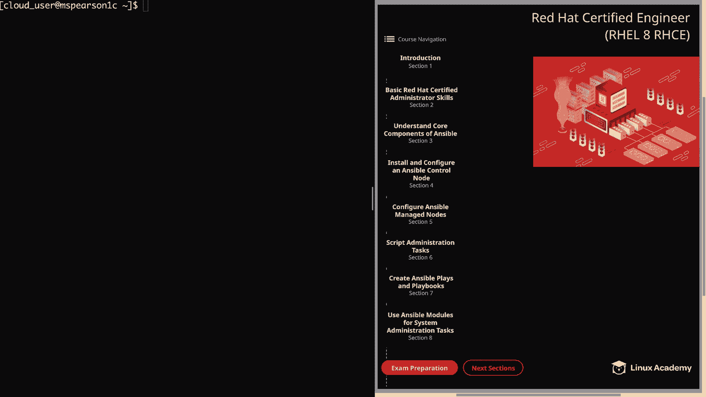
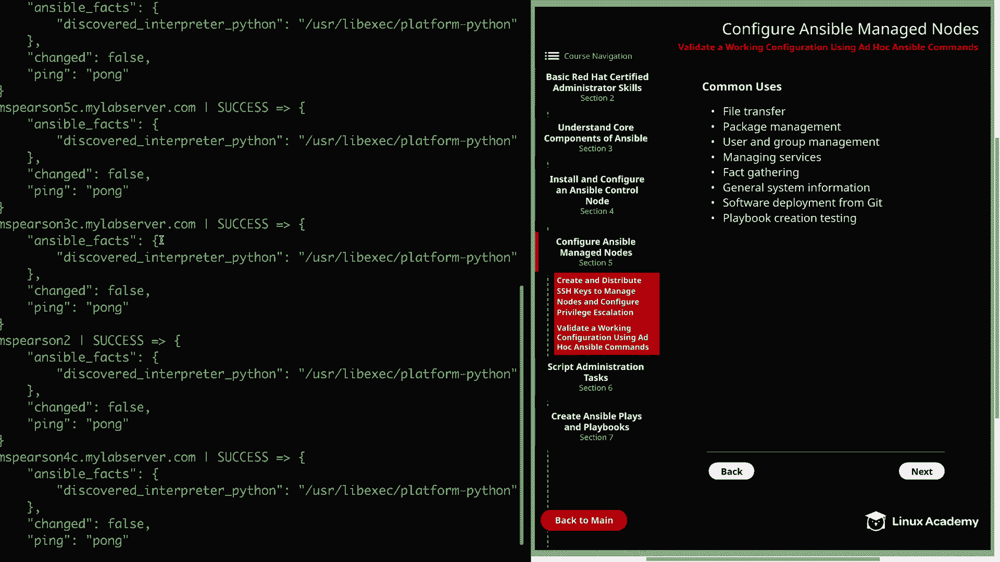
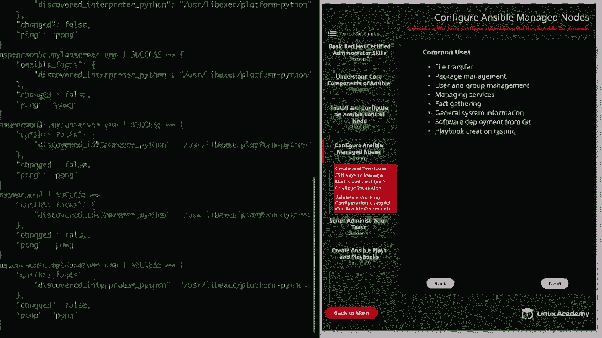
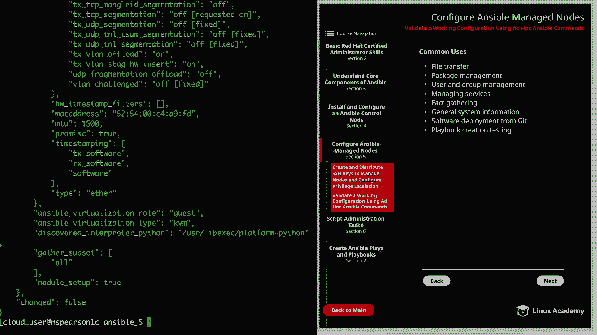
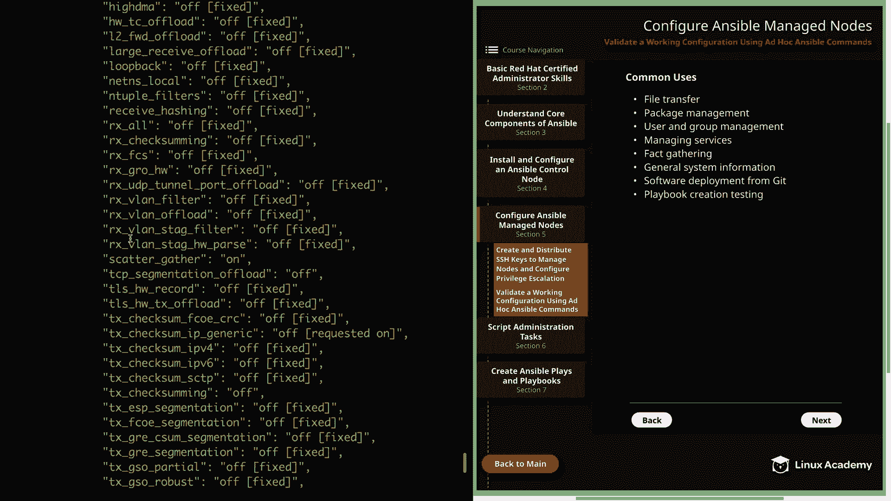
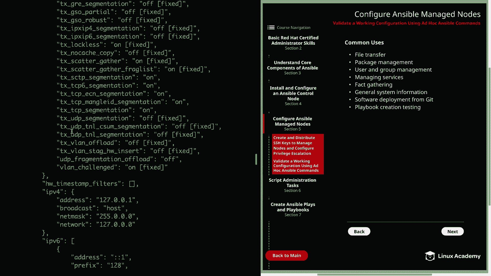
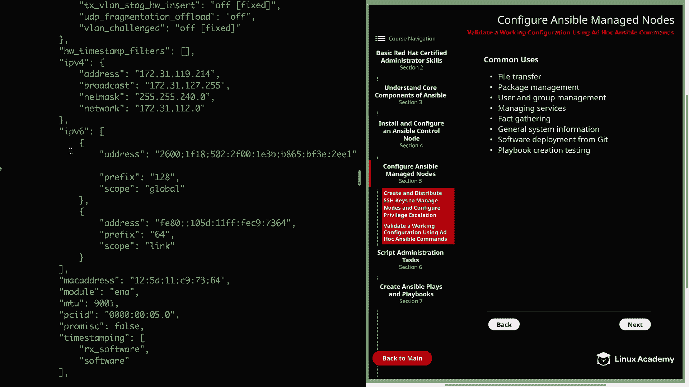
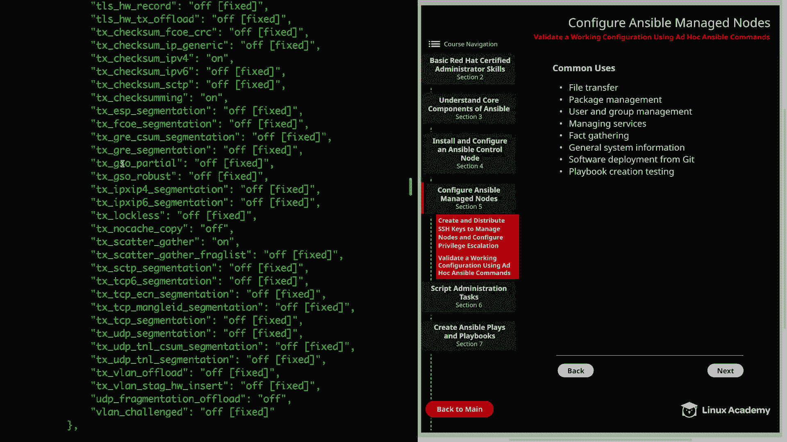
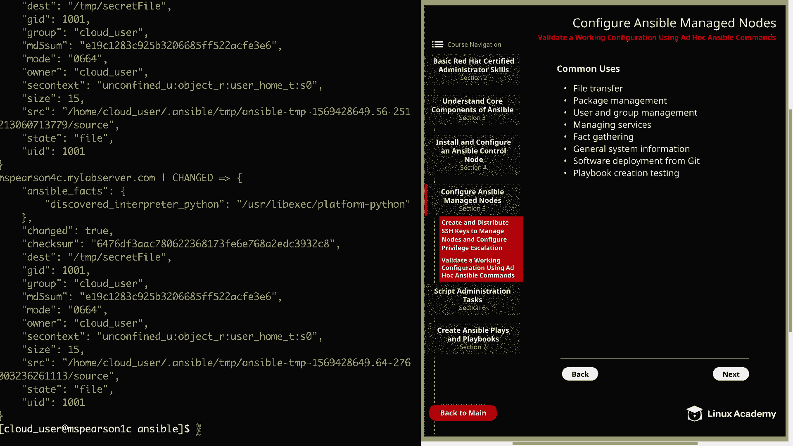
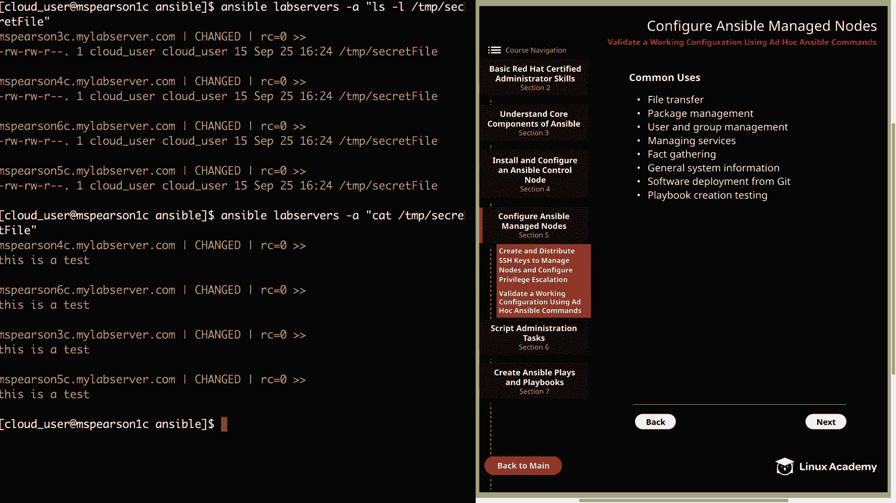

# Ansible 入门教程：P23：使用 Ansible Ad Hoc 命令验证配置 🚀



在本节课中，我们将学习如何使用 Ansible Ad Hoc 命令来验证我们的 Ansible 配置是否正常工作。Ad Hoc 命令是执行快速、一次性任务的强大工具，非常适合进行配置验证和测试。

## 什么是 Ansible Ad Hoc 命令？🤔

上一节我们介绍了 Ansible 的基本概念，本节中我们来看看 Ad Hoc 命令。Ansible Ad Hoc 命令用于执行快速的一行命令，类似于在 Bash 中使用单行命令，而不是编写一个完整的脚本。虽然 Ansible 的核心是 Playbook，但在处理非例行任务时，使用 Ad Hoc 命令通常更高效。

其基本语法格式如下：
```bash
ansible [host_pattern] -i [inventory_file] -m [module_name] -a "[module_arguments]"
```
*   `ansible`：主命令。
*   `[host_pattern]`：目标主机或主机组。
*   `-i`：指定清单文件（可选，有默认配置时可省略）。
*   `-m`：指定要使用的模块。
*   `-a`：传递给模块的参数。

需要记住的几点：
1.  使用 `-a` 传递参数时，参数需用双引号括起来，多个参数用空格分隔。
2.  命令默认以运行 Ansible 的用户身份执行。
3.  使用 `-u` 选项可以指定运行 Ansible 命令的用户。
4.  使用 `--become` 或 `-b` 选项可以以 root 用户权限执行命令（需要 sudo 权限）。
5.  可以单独使用 `-a` 而不指定 `-m` 来运行任意的 Shell 命令。

## Ad Hoc 命令的常见用途 🛠️

了解了基本语法后，以下是 Ad Hoc 命令的一些典型应用场景：

*   **文件传输**：快速向被管理节点复制文件或创建文件。
*   **软件包管理**：使用 `yum` 或 `apt` 安装、查询软件包信息。
*   **用户和组管理**：添加/删除用户和组，修改文件权限。
*   **服务管理**：启动、停止、重启服务，或检查服务状态。
*   **信息收集（Fact 收集）**：使用 `setup` 模块获取主机的详细信息（如操作系统、内核版本、磁盘等）。
*   **系统和进程信息**：查看运行中的进程、日志或资源使用情况。
*   **从 Git 部署软件**：使用 `git` 模块直接从代码仓库拉取文件或软件。
*   **Playbook 创建与测试**：在将模块写入 Playbook 前，先用 Ad Hoc 命令测试其功能和效果。

## 实战：验证 Ansible 配置 ✅







现在，让我们进入实战环节，使用 Ad Hoc 命令来验证我们的 Ansible 环境是否配置正确。假设我们的工作目录是 `/home/cloud_user/ansible`，并且已经配置了清单文件 `inventory.ini`。









首先，我们使用 `ping` 模块测试与所有主机的连通性：
```bash
ansible all -i inventory.ini -m ping
```
如果配置正确，你将看到绿色的 `SUCCESS` 消息，表明 Ansible 可以成功连接到所有被管理节点。

接下来，我们使用 `setup` 模块收集特定主机（例如 `server2`）的详细信息：
```bash
ansible server2 -i inventory.ini -m setup
```
这个命令会返回大量关于该主机的信息（Ansible Facts），如 IP 地址、系统架构等。为了输出更清晰，可以将其管道传递给 `head` 命令：
```bash
ansible server2 -m setup | head -20
```
**注意**：如果当前目录存在 `ansible.cfg` 文件且其中指定了默认清单，则可以省略 `-i inventory.ini` 参数。

然后，我们测试文件管理功能。首先在控制节点创建一个测试文件：
```bash
echo "This is a test" > secret_file.txt
```
使用 `copy` 模块将其复制到 `server2` 的 `/tmp` 目录：
```bash
ansible server2 -m copy -a "src=secret_file.txt dest=/tmp/"
```
命令执行成功后，会显示文件已更改。我们可以用 Shell 命令验证文件是否已存在并查看其内容：
```bash
# 列出 /tmp 目录下的文件
ansible server2 -a "ls -l /tmp/"

# 查看文件内容
ansible server2 -a "cat /tmp/secret_file.txt"
```
最后，我们可以对主机组（例如 `lab_servers`）执行相同的操作，一次性在所有组内主机上完成文件复制和验证。

## 总结 📝





本节课中我们一起学习了 Ansible Ad Hoc 命令。我们首先了解了它的基本语法和设计用途，然后探讨了它在文件传输、包管理、信息收集等多个场景下的实际应用。最后，我们通过一系列实战操作，使用 `ping`、`setup`、`copy` 等模块以及直接执行 Shell 命令，成功验证了 Ansible 控制节点与被管理节点之间的配置和工作状态。掌握 Ad Hoc 命令是高效使用 Ansible 进行系统管理和自动化运维的重要一步。