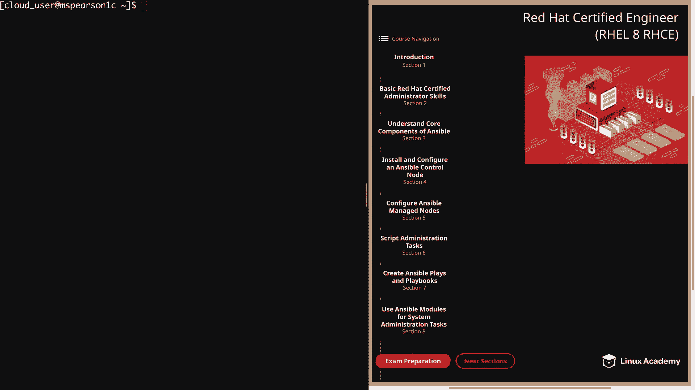
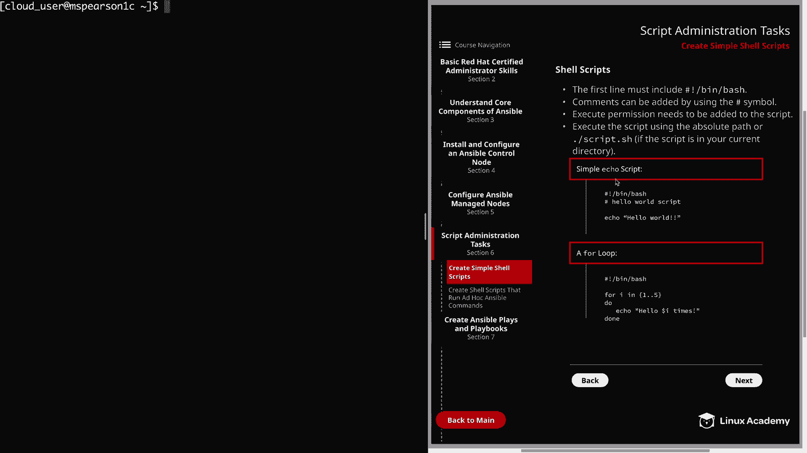
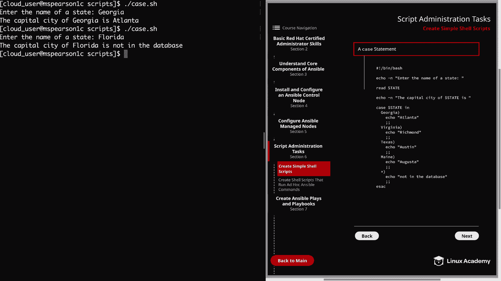

# Red Hat Certified Engineer (RHEL 8 RHCE) - P24：388-4871-1 - Create Simple Shell Scripts - 11937999603_bili - BV12a4y1x7ND

Welcome back everyone， this is Matt， and in this video we're going to be talking about creating simple shell scripts。

 so let's head over to script administration tasks， which is Section 6。

And now we can talk about shell scripts。So before you start to panic。

 the RHC exam does not expect you to be able to create these grandiose and large complicated shell scripts。

 It does， however， expect you to be able to know how to create basic simple shell scripts。So first。

 we're going to talk a little bit about shell scripts， and then I'm going to show you a few examples。

So the first thing that you need to know is that the first line must include a hash or a pound symbol followed by an exclamation。

 which is often called a chaang。And then the path to the interpreter。

 and this is just letting the shell know what program needs to interpret the script。 So in our case。

 we're using bash to interpret the script， but we could use another interpreter like Pearl or Python。

 depending on what type of script we're trying to create。Next。

 comments can be added throughout the script using the pound symbol。

 and that's because everything that appears after a pound symbol is ignored by bash。

This becomes more and more important， the larger the size of the script。

 especially if you have anyone other than yourself that's going to need to interact with it or update it。

And it's not that you can't figure out what's going on in a script by looking through it。

 but it's much easier if you provide comments。 And this is even true for your own script。

 So for your own quality of life。 So if you have a large shell script that you created a year ago。

 you can easily jump into it and see what you're trying to accomplish。And again。

 don't be confused by the first line starting with a pound。

 remember that this is a special symbol that chaang。

 and it's just letting the shell know how to interpret the script。The next point is super important。

 and that is that execute permissions need to be added to the script。

So even if the contents of your shell script are perfect and fine in what they need to be。

 you won't be able to run that script unless it has execute permissions。

And this can be done using numeric or symbolic mode， so to make the script executable by the user。

 we can simply run C mod U plus X on the file， and that's going to add execute on the user。

 and then alternatively， you can do something like C modd 755。

 which is going to add readwrite execute for the user， and then just read execute for everyone else。

And then lastly， you can execute the script using the absolute path or by using the dot slash if the script is in your current directory。

 and this is because your current directory is not automatically a part of your path。

 And when I talk about path， I'm not talking about your current directory。

 but that actual system path variable that the operating system is going to use in order to locate executables。

So if we head over to the command line real quick。I can just echo Doar sign path。

And you'll notice the directory that we added in， which is the home cloud user Gi ansible bin that allows those ansible commands to be exposed to our path。

 But as you can see， this is just a colon delimited list that the shell is going to look in to see what commands are available to you。

So since we added that ansible bin directory， I can just type out ansible and little tab complete because it's already in my path We're searching for any executables in those directories。

 And then I could do a tab tab， and we can see what other ansible commands are available。 You can。

 of course， add additional directories to your path。

 So if you have a scripts directory that you want to always have in your path so you can run those scripts。

 you can， of course， do that。And all you would need to do is export the path variable and add the desired directory in your bash profile。

 but we're not going to go over that for this lesson， but just so you know that is available to you。

In addition to giving the explicit path to the script。

 you can also just type in bash and then whatever the script name is。

 and that's because bash is a language interpreter and one of its functions is to read and execute scripts。

All right， let's go ahead and clear this out。And now we can go over some of the example shell scripts that I've provided。

 and of course there's a ton that you can do in scripting and we're not going to be able to cover it all。

 but I did want to show you an example of some of the more common things that you often see。

So if you take a look at the diagram， I've provided a simple echo script。

There's also a four loop here。And then on the next page， we have a case statement。

 and I've just added those in the diagram for you to reference back to。

 And I've also pre populated these on the Ansipible control node。

 So let's head back to the command line。 we're going to Cd into Ansible。

 which is our working directory。And you see， I've added a scripts directory， so let's head into that。

And I've added three scripts， which are the same ones that are in the diagram。

 and feel free to copy those and play around with them if you'd like。Let's go ahead。

 and work through them。So first we have Echo。tsh。And this is just a basic shell script that's going to produce output。

 It also shows you how you can just run normal bash commands in a shell script in the same way that you would from the command line。

 So as you can see， it's going to start off with the Shabang and then Ben Bash。

 which is our interpreter。 And then I've added a comment here that just says hellello world script。

And the script only has one line， and that is to echo hellello world。

So let's go ahead and close out of this。Let's go ahead and try to run that by doing a dot slash and then echo dot S。

So you'll see that I get a permission denied， let's go ahead and list this out。

And that seems like a weird error since I am the owner of the file and I have right access to it。

But you're probably already noticing that I do not have XQ permission。 So even though I own the file。

 since I don't have XQ permission， I'm going to get permission denied。

 So let's go ahead and add that executeQ permission to the user。And while we're at it。

 let's go ahead and add that to all the scripts that are in this directory。So I'll just do a star。

We can do our listing again。And we see that the user has execute permissions。

And now let's see what happens if we try to run our script。And as expected。

 we see that the contents of our script were echoed to standard out。All right。

 so the next script that we want to look at is the loop dosh。And again。

 we're going to start with our sheang， and then we have4 I in。

 and then this is going to be one through five。So the eye here is a variable resett。

 which is going to be defined by anything that we pass after in。So if I wanted to。

 I could have named this something like number， so be4 number n1 through5。

 but the I just tends to be a standard variable that people use。 And so in this example。

 I'm defining one through 5， but we could really use any type of list that we wanted to or we could even put a command here and then use the output of that command in our for loop。

 and then for everything from the end statement， I'm specifying to do an action。And in this case。

 we're going to go through each number and we're going to substitute it for our variable。

 which is represented by Do sign I。And we're going to echo the statement。

And then we're going to specify done。Which will indicate the end of the loop。

And using a for loop is honestly really good for any command that you have to perform over and over again。

 such as creating a large list of users or even copying files to multiple hosts。

And one of the great things about Ansible is that it's going to take care of a lot of that for us just by specifying a certain module。

 But regardless of that， it's， it's really good to know how these things can be performed on a basic level。

 So let's go ahead and close out of this。And based on the way that our script is written。

 we expect it to print out Ho one， Ho 2， Ho 3， and so on and so forth。

Let's go ahead and try that out。And this is called loop do H。And we get the output that we expect。

 and we notice that everything we defined after in was then substituted into our command。All right。

 now we can move on to our last example， which is a case statement。

And these are particularly used to help simplify some of the more complex conditionals that you're going to end up seeing with a multi level。

 if then else statement， which of course， has multiple different choices。

And it also allows you to match multiple different values against one variable and then execute commands based on the value that you receive。

Let's go ahead and open that up real quick。So we begin with an echo。

 and that lets the user know to enter a name of a state。And then we're going to use read。

 which we see right here in order to tell the script to take whatever strain the user inputs and store it as the variable state。

And then it's going to echo the capital city of the state， depending on the value that's entered。

 and it's going to give different output。 So if you look down a little bit further。

 if you input Georgia， it's going to give you Atlanta， Virginia is going to be Richmond。

 so on and so forth。But to jump back up just two lines。

Each case statement is going to start with the case keyword。

 and then it's going to be followed by the expression， which in our case。

 we're using the state variable， and then the n keyword。

 and then you can specify patterns that the statement is looking for。

 So in this case it be like Georgia or Virginia， Texas remain。

 and you can actually list multiple patterns here， just adding a pipe at the end and then the next pattern another pipe。

 and then you can terminate the list using the parenthesis， as you see here just after Georgia。

And then you can specify one or more statements under that pattern。

 and here we're just using Echo Atlantalan， and these are going to be the commands that are executed when the pattern matches。

And the pattern and its associated commands are known as a clause。

 So you can see here I have five clauses。One， two， three， four， five。

And each clause is going to be terminated by using two semicolonons。

As you see right here under the echo， you probably also notice that my last clause includes an asterisk。

 and this is just used to serve as a catch all for any unexpected input。 And that way。

 you can let the user know what the script is actually expecting。 So in my example。

 I just say that the given state is not in the database。

 But you could also let the user know what patterns are expected。

 you actually see this quite a lot with scripts that stop and start a service。

 So if you pass the wrong argument， it's going to say you must enter or start or stop or status or whatever the output happens to be。

 But it'll lets the user know what the intended input should be。 And then finally。

 the statement is going to end with the Esac keyword， or as you probably notice。

 is's just the keyword case backwards。So let's go ahead and back out of this。

And then try to run our script。It's going to be a case。

And then we're going to enter in a state that the script is actually expecting。Just Georgia。

And we see that we get the expected output， which is the capital city of Georgia， is Atlanta。

And this time I'm going to put in a pattern or a state in our case， which is not expected。

 let's type in Florida。And we get the output from the catch all clause。

 it just says the capital city of Florida is not in the database。And with that。

 we're going to finish up this video on create simpleim shellll scripts。

 so let's go ahead and mark it Comp and we can move on to the next lesson。

