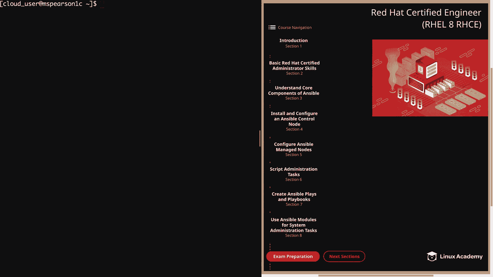
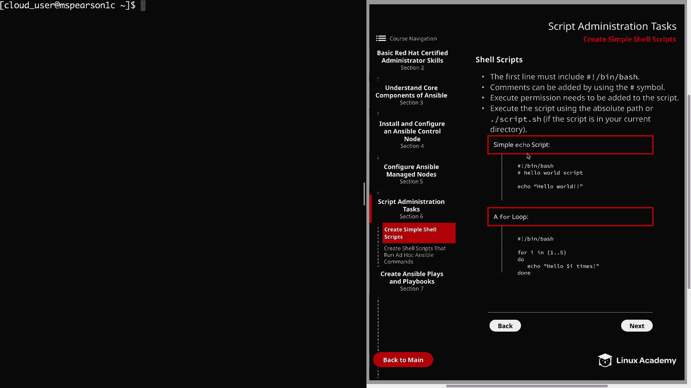
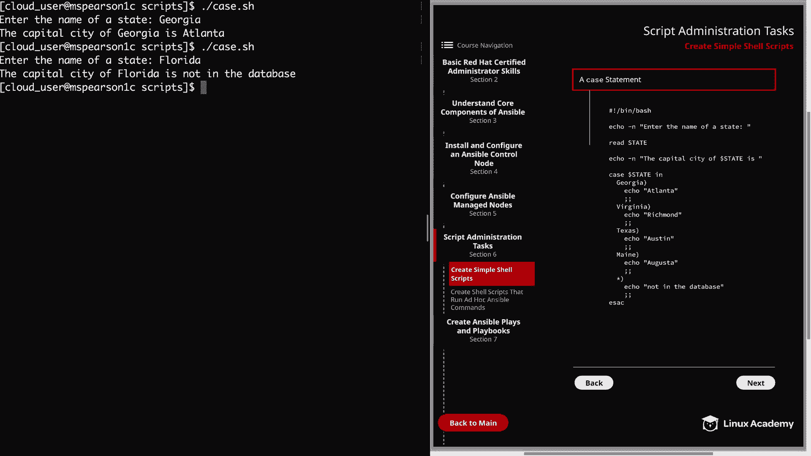

# Red Hat 认证工程师 (RHEL 8 RHCE)：P24：创建简单的 Shell 脚本 🐚



在本节课中，我们将学习如何创建简单的 Shell 脚本。Shell 脚本是自动化系统管理任务的有力工具。我们将从脚本的基本结构开始，逐步了解如何编写、设置权限并运行脚本，最后通过几个常见示例来巩固所学知识。

## 脚本基础结构

上一节我们介绍了课程概述，本节中我们来看看 Shell 脚本的基本构成要素。

一个有效的 Shell 脚本必须遵循特定的结构。以下是其核心组成部分：

*   **Shebang行**：脚本的第一行必须是 `#!`（称为“shebang”），后跟解释器的路径。这告诉系统使用哪个程序来执行脚本。例如，对于 Bash 脚本，通常是 `#!/bin/bash`。
*   **注释**：使用 `#` 符号添加注释。`#` 之后的所有内容都会被 Bash 解释器忽略。添加注释对于提高脚本的可读性和可维护性至关重要。
*   **执行权限**：脚本文件必须具有执行权限才能直接运行。可以使用 `chmod` 命令添加权限，例如 `chmod u+x script.sh` 或 `chmod 755 script.sh`。
*   **执行方式**：可以通过指定脚本的绝对路径（如 `/home/user/script.sh`）或在脚本所在目录使用 `./script.sh` 来运行。也可以使用 `bash script.sh` 命令，这会直接调用 Bash 解释器来执行脚本。

## 运行脚本前的准备

理解了脚本的基本结构后，我们需要知道如何让系统找到并执行我们的脚本。这涉及到系统的 `PATH` 环境变量。

你的当前工作目录通常不在系统的 `PATH` 变量中。`PATH` 是一个由冒号分隔的目录列表，系统会在这些目录中查找可执行命令。你可以使用 `echo $PATH` 命令查看当前的路径设置。

如果你想将某个目录（如存放个人脚本的目录）永久添加到 `PATH` 中，可以修改 `~/.bash_profile` 文件。但请注意，出于安全考虑，通常不建议将当前目录 `.` 添加到 `PATH` 中。

## 示例脚本解析



现在，让我们通过几个具体的例子来实践如何编写 Shell 脚本。我们将分析三个典型脚本：一个简单的输出脚本、一个循环脚本和一个条件判断脚本。

### 示例一：简单输出脚本

这是一个最基本的脚本，演示了如何在脚本中执行标准的 Bash 命令。

**脚本 `echo.sh` 内容：**
```bash
#!/bin/bash
# 这是一个 Hello World 脚本
echo "Hello World"
```

要运行此脚本，首先需要赋予它执行权限：
```bash
chmod u+x echo.sh
./echo.sh
```
运行后，终端将输出：`Hello World`。

### 示例二：循环脚本

`for` 循环非常适合重复执行某项任务，例如批量创建用户或处理文件列表。

**脚本 `loop.sh` 内容：**
```bash
#!/bin/bash
for i in 1 2 3 4 5
do
    echo "Hooray $i"
done
```

在这个脚本中，变量 `i` 会依次取值为 `in` 后面的列表（1到5）中的每一个元素，并执行 `do` 和 `done` 之间的命令。

运行脚本：
```bash
./loop.sh
```
输出将是：
```
Hooray 1
Hooray 2
Hooray 3
Hooray 4
Hooray 5
```

### 示例三：条件判断（Case语句）脚本

`case` 语句用于简化复杂的多条件判断（类似于多层的 `if-elif-else` 语句）。它可以将一个变量与多个模式进行匹配，并根据匹配结果执行相应的命令。

**脚本 `case.sh` 内容：**
```bash
#!/bin/bash
echo "Enter the name of a state:"
read state
echo "The capital city of $state is:"

case $state in
   Georgia)
     echo "Atlanta"
     ;;
   Virginia)
     echo "Richmond"
     ;;
   Texas)
     echo "Austin"
     ;;
   Maine)
     echo "Augusta"
     ;;
   *)
     echo "Not in the database"
     ;;
esac
```

脚本解析：
1.  `read state`：等待用户输入，并将输入内容存入变量 `state`。
2.  `case $state in`：开始 `case` 语句，对变量 `state` 的值进行匹配。
3.  `Georgia)`：这是一个匹配模式（clause）。如果 `$state` 的值是 “Georgia”，则执行其后直到 `;;` 的命令。
4.  `;;`：表示一个模式匹配块的结束。
5.  `*)`：这是一个通配符模式，匹配任何未在前面列出的值。它作为默认或“捕获所有”的情况。
6.  `esac`：`case` 语句的结束标记（`case` 倒过来写）。

运行脚本示例：
```bash
./case.sh
Enter the name of a state:
Georgia
The capital city of Georgia is:
Atlanta

./case.sh
Enter the name of a state:
Florida
The capital city of Florida is:
Not in the database
```

---



本节课中我们一起学习了创建简单 Shell 脚本的核心知识。我们了解了脚本必须包含 Shebang 行、如何添加注释和设置执行权限。我们还探讨了运行脚本的不同方法，并分析了三个经典示例：执行简单命令、使用 `for` 循环进行迭代以及利用 `case` 语句进行条件分支处理。掌握这些基础是迈向自动化系统管理的重要一步。