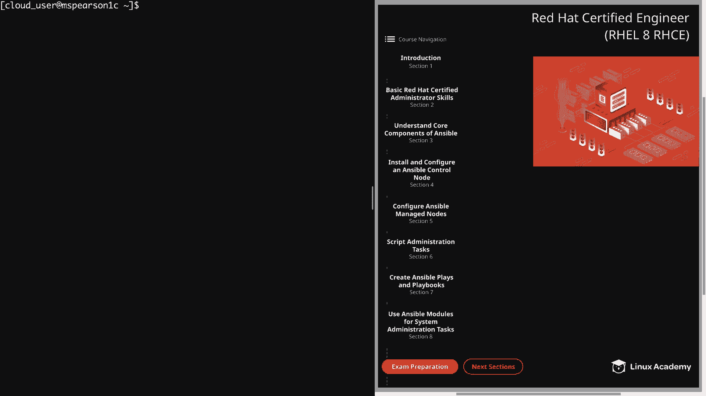
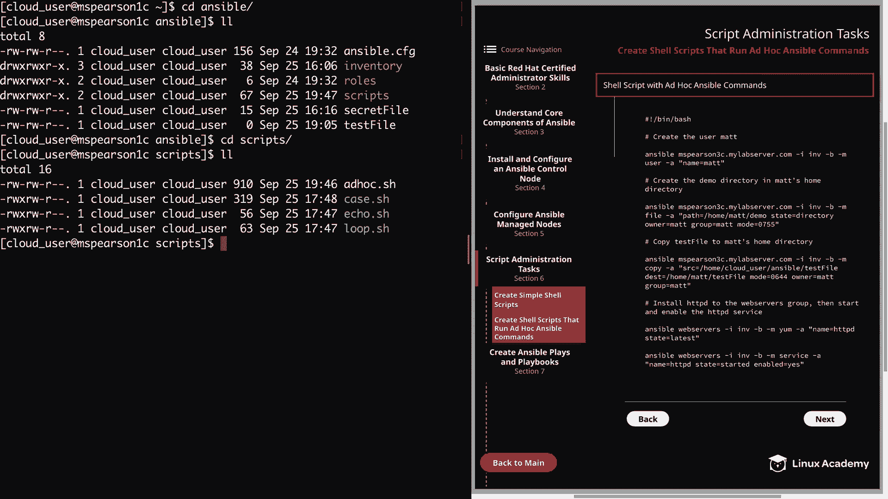
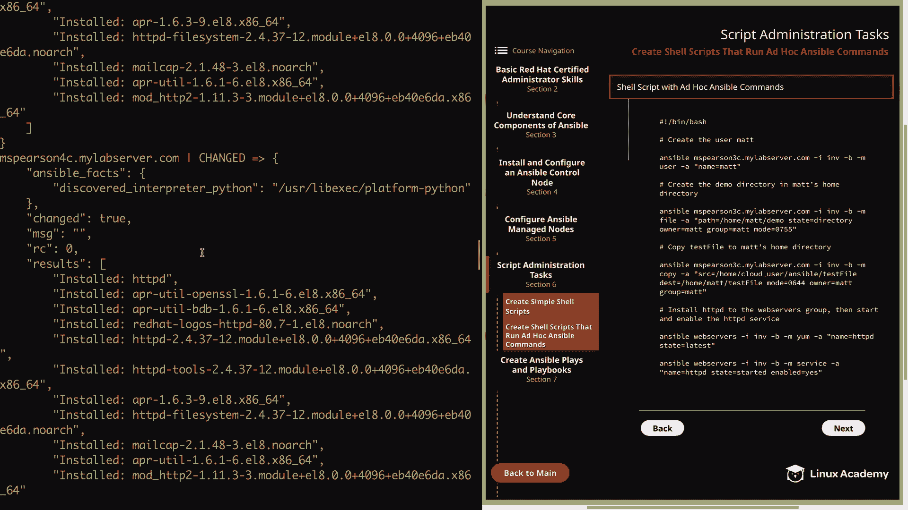
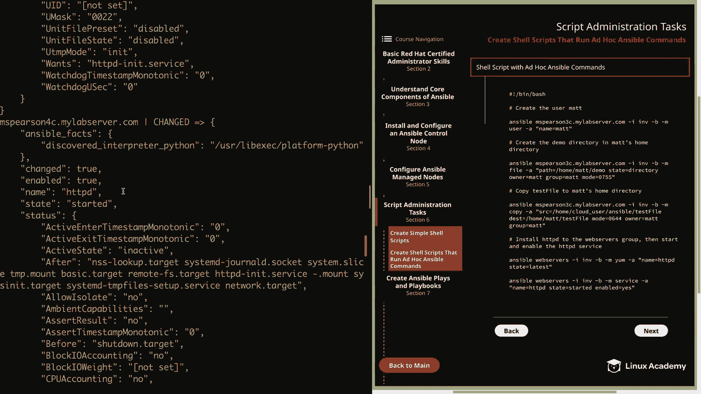

# Red Hat Certified Engineer (RHEL 8 RHCE) - P25：388-4871-2 - Create Shell Scripts That Run Ad Hoc Ansible Commands - 11937999603_bili - BV12a4y1x7ND

Welcome back everyone， this is Matt， and in this video we're going to be talking about creating shell scripts in order to run ad hoc Ansible commands。

So even though ad hoc commands are typically used for one off situations。

 that doesn't prevent you from saving them in a script so that you can reuse them later。

 or just creating bash scripts in order to leverage the power of ansible。And the great thing is。

 this is really easy to set up as long as you know the modules and arguments that you want to use。

So let's go ahead and click on section 6。And then on createate Shell scripts that run ad hoc ansible commands。

So for this section， I've provided a sample shell script that has some ansible ad hoc commands。

 and I've actually already created this on my ansible control node。 So let's go ahead。

And click on the command line。Then we can seed into Ansible。Just our main working directory。

 and then we're going to seed into scripts。And as you'll notice。

 I've added ad hoc do H to our other shell scripts。

Let's go ahead and open that up。I I've added several comments to let us know what each section is trying to accomplish。

 so first we will be creating the user mat and then we're going to create the demo directory in the usermats home directory。

 then we're going to copy test file to that home directory and then finally we're going to install HTTPD to the web server group and then start and enable the service。

So let's start with the first task， which is to create the user mat。 So as you can see。

 I'm going to start off with the Ansipible command。

 So lets us know this is going to be an ad hoc command。

And then we're going to be performing this action on MS Pearson 3C。

And then we pass the dash i flag and specify our inventory file， and as you can see。

 I've provided the full path to our inventory file。

 and I would recommend this for all the shell scripts that you create for ad hoc commands。

And that just ensures there's no issue with locating the inventory file。

 and then we have the dashB option， which means that we're going to become the root user for this command。

 then dash M， and then our module will be user followed by our dash A for the arguments。

 and we're just going to pass a single argument and that is that the name equals mat。

 Next we're going to create the demo directory in Matt's home directory。 for this again。

 we'll use the ansipible command and we're going to specify Emmas Sparson 3 C。

 So well as our inventory file。 and we're going to become the root user using dash B。

 and we're going to specify the file module this time。And then， are arguments。First。

 we're going to specify path and that is the path to the directory we're going to create。

 and then we're going to use the state argument， and this is where we specify that we're creating a directory Next。

 we're going to specify the owner and group permission as the mat user and mat group。

 and then the mode is going to be 0755。And once that directory is created。

 we're going to copy test file to Matt's home directory。So again， we specify the ansple command。

Then MS Pearson 3 C and the path to our inventory file B to become root。

And this time we're going to specify the copy module followed by our arguments in double quotes。

 so we're going to specify the source of the file we're going to copy。

 which is in home cloud user Ansible in the name of the file is test file。

 and I went ahead and created this file prior to the video， and we need to specify the destination。

 and this is the destination on the managed node， which is going to be home mat test file。

For the mode， we're going to specify 0644， which is going to be readr for the user and then read for group and other。

 and we're going to set the owner and group to be met。And then lastly。

 we're going to install the HttPD server to the web servers group and then make sure that that is started and enabled。

So it again， we're going to start with the Ansible command。

 but this time we're going to specify the web service group。

And then the you path the same inventory file。We're going to become the root user and then use dash M to specify the y module and dash A followed by our arguments。

And for name， we're going to specify the name of our package， which is HttPD。

 and then the state is going to be latest。And then in our last ad hoc command。

 we're going to specify the service module， and we're going to pass it the name of the service。

 which is H T TBD。 and then the state we want， which is started and then enabled equals yes。

 So now that we've walked through our script。 And as you can see。

 this is literally just several lines of a bunch of different ansible ad hoc commands。

Let me go ahead and save this。And before we can run the command。

 we need to make sure that it iss executable。 So we'll use CM。U plus X on ad hoc。 H。

And this could take a little while， so I'm going to go ahead and speed this up for you。

All right， so now that our script is finished。Let's go ahead and check the output and we can scroll back up to the top。

And from the looks of it， all our commands ran successfully。Let's check out the first line here。

And we see that our user was created named Matt。 It also says create home equals true。

 and this is true by default。 and our home directory is going to be home mat。

And were given the default shell of Ben Bash and a UI of 1003。

So scroll down a little bit more here。 We see that our directory was created。

 We have the state right here。

And the UI for the directory is going to be 1003， which of course， Matt Group I is also 1003。

And our mode is 0，7，5，5。 We continue scrolling down。

We see that our file was successfully copied to Home Matt and then name test file。

And that has the proper group and owner provisions with mat and our mode， which is 0，6，4，4。

 Coning down， we see our next to last task， which was installing H T TP D。

We see changed equals true and it says installed HttVD。

And we're going to see the rest of the output from the yum command as well as any dependencies that were installed。

And we see that the same is true for MS Pearson 4C。Because remember。

 we did deploy to the Web servers group， which contains MSsParson 3 C and MSspherarson 4 C。

 So we've also installed Apache here。

And then we see that our service was also started。And then we see some additional output from that。

By that， I mean， a decent amount of additional output。And then we come down to the last server。

 and we see that this was also started。 So in the script， I use just a few modules。 and， of course。

 there are many， many at your disposal。 We're actually going to be going over some of the more commonly used modules in the next lesson But the main purpose of this example was just to show you how you can create a script。

 And then you can use that in order to call these ad hoc ansipible commands。

 And there are different use cases for this。 And I'm sure that you can get really， really creative。

 given the amount that Ansible has to offer。 So just keep this in mind for the exam。

 as well as your own personal installations of ansible。

And that's going to wrap this video up， so go ahead and mark it Comp and we can move on to the next section。

