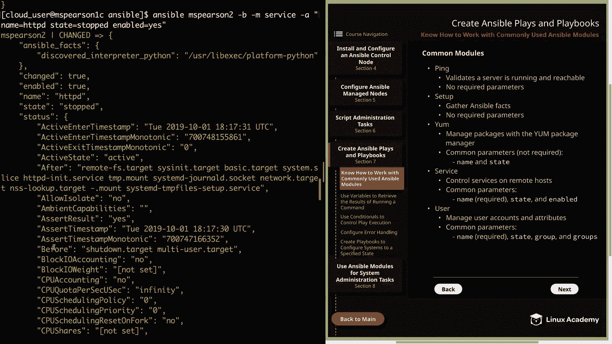

# Red Hat Certified Engineer (RHEL 8 RHCE) - P26：388-4872-1 - Know How to Work with Commonly Used Ansible Modules - 11937999603_bili - BV12a4y1x7ND

Welcome back everyone。 This is Matt。 and in this video we're going to move on to section 7。

 which is all about creating ansible plays and playbooks。 So let's go ahead and click on that。

 It's going bring us to the first section， which is knowing how to work with commonly used ansible modules。

 And in my opinion， it is really important to have a good grasp of some of the more basic and often use modules that way you're not having to look them up every time in the Ansible documentation。

 and this will be really helpful， especially when you're sitting taking the exam that way you don't lose time on having to look up every single thing。

Alright， so on this page and the next， I've provided a list of just some common modules that are good to know。

 And the first we're going to start with is the Ping module。

 and this is going to validate that a server is running and reachable and doesn't have any required parameters。

 So this is just a simple way to see if you can reach out to your managed nodes through ansible。

 It's also a great use case for running an ansible ad hoc man。And as I said。

 there are no required parameters， and it actually only has one that it takes， which is data。

 And this changes the return value received from running the command。 And by default。

 this is going to be pong。 and you can also use crash as a value to return an exception。

 And since we've already seen an example of this in the course。

 I'm just going to move on to the next module， which is the setup module。

 Another one that we've seen show up。 And this is going to be used in order to gather ansible facts。

 and this also has no required parameters。 So by default。

 this is going to return all the facts that ansible can gather about the host。

 And you can also filter this by using the filter argument in order to search for specific facts。

 and an example of this would be something like ansipible underscore E0。

 which will return the facts about the E0 device。And you can also restrict the facts that are returned by using the gatherer subset argument。

 which allows you to specify a particular subset of facts like hardware or network。Next。

 we have the young module， and this is going to manage packages using the young package manager。

And the common parameters， which are not required， but are most often used is going to be name and state。

 and there are some other parameters， but this is what you're typically going to be using。

 So name is going to allow you to specify the name of the package or the package group。

 and then state will allow you to choose whether you want it installed or removed。

So let's head over the command line real quick and we'll just demonstrate this using some ansipible ad hoc commands。

So I'll see the into my Ansible directory。So we'll go ahead and specify Ansible since we're running an ad hoc command。

 I'm going to run this on MS Pearson 2。Dash B to become the root user。

And then we'll specify the y module， and then our arguments。Let's go ahead and install HttPD。

And then for state， I'm just going to use latest。And what this is going to do is check and see if the package is installed。

 and if it is installed， then it will actually update it to the latest version of the package。

 And if it's not installed， then it'll just install the latest version。

 So let's go ahead and hit enter onness。It might take a second soga and fast forward through so you don't have to wait。

And as we can see， our change status says true。And on the results， we see that we've installed HTTPD。

 as well as any of the dependencies that is needed for the package。

And we can also remove the package by setting the state equal to absent。 But before I show you that。

 let's go ahead and use the HttPD server in order to show the service module。

 So the service module is going to control service on remote host and the common parameters are going to be name which is required and then typically you're going to see state and enabled。

 So in the same way that you use system CTL on your local host you can use the service module in order to start or enable a service so that it comes back after a reboot。

 And another thing about the name parameter if you only specify the name and don't use any other parameter。

 then you're going to get the status of the service and then with the state parameter。

 you can specify started， stopped restarted or reloaded。

 And then for enabled you can set that to yes or no。

 So let's go ahead and try that out with our newly installed HtTPD service。So again。

 we're going to run the ansible command on MS Pearson 2。And we're going to become the root user。

This time we're going to specify the service module。And then our arguments。

 So we're going to be interacting with HttPD。And then for state， let's go ahead and say started。

And then， for enabled。Let's say yes。

And that return pretty quickly， we see we get a good bit of output here。

Let's scroll back up and we see that our change status is set to true， enabled is also set to true。

 and it gives us the name of the service that we requested， which is H TTPD。

 and its state is started。

And then if we wanted to stop the service， we could just come back here and rather than start it。

We'll just put in， stopped。

Again， we see our output。

And we see that the state is stopped。And now let's go ahead and remove HttPD。

So rather than state latest， we're going to say state absent。 if I can spell it， right。

And we see under the results section that we've removed modD_ HTTP and also HtTPD。

All right， our next module is the user module， and this is going to allow you to manage user accounts and attributes。

 And under the common parameters， we have name， which is a required parameter， and then state。

 group and groups。The state parameter can take one of two values， the default being present。

 and then it can also be used to remove a user by specifying absentin。

 The group parameter is used to set the primary group。

 And then you can also use the group's parameter in order to add a user to multiple groups。

 I enlist this in the diagram。 you can also use the home option in order to set the user's home directory。

 and then you can use the shell parameter in order to specify the user's shell。

 So let's go ahead and try this out。 Ansible， We're going to run this again on MSs Pearson 2。

Become the root user。We're going to use the user module。For arguments。

Let's just specify name and give the user Pinehead。

So this is going to create a user called Pinehead and then just use all the default settings。

And we get our change status equals true。We didn't add a comment for the user。And by default。

 create home is going to equal true， and it's going to give us our group I D， which is 1003。

As well as our UI， which is 1003。And then it's going to print out the other default information about the user。

 such as the home directory， the name， and then the shell， and of course。

 the default state is present， and this is not a system user。All right。

 let's go ahead and click on next。 we can talk about the remaining modules。

And the next module on the docket is the copy module。

 and this is going to be used to copy files to a remote host。And typically。

 you're going to specify the source and destination in order to copy a file。 And as you can see。

 the destination is required parameter， But you can also specify the owner and group。

 as well as the permissions for the file using mode。 And as we seem with many other modules。

 the mode can be expressed either numerically or symbolically。

 And let's just go ahead and try this out。 First， let's just go ahead and create a file here in home cloud user Ansible。

 I'm going to touch。 and we're just going to call this secret file。

And let's go ahead and use Ansible to copy it。So'll be MS Pearson 2。

And we'll go ahead and become the root user。We'll use the copy module。

We're going to provide our source， which is going to be home。Cloud_ user。Answible。

And then it's secret file。And then， our destination。Let's go ahead and put that in home Pinehood。

Which is the new home directory that was created for the Pinehead user。And then for owner。

 let's go ahead and make this P head。And then for group。Did you pine head as well。

And then for the mode， let's just kind of do our standard 64，4 permissions。

And had enter to kick it off。And we see that our ad hoc command ran successfully。

We're greeted with all the return values， so we see our destination， the group ID。

 the name of the group， the permissions， which is 0644， the owner。

 we even get some information about the SE context all the way down to the UID， which is 1003。

All right， so our next to last module is the file module。

 and this allows us to manage files and directories。 So the common parameters are going to be path。

 which is required， and then we also have state， owner， group and mode。

 and path is going to be the path to the file or directory that you're going to be modifying or creating。

And then state is where you're going to specify whether it's a file， a directory。

 a soft or hard link。 And you can specify touch in order to create a new file。

 And then absence is going to be used to remove files and directories that are specified。

 So let's go ahead and test this out。 And first， we're going to create a directory。

 And then we're going to create a file within that directory。 Let's go ahead and run Ansible。

Ms Pearson 2。Dash B for become M， and then we're going to specify the file module。And then。

 our arguments。So the first thing we're going to specify is our path。

 and we're going to create the directory in home Pinehead。We're just going to call it test。

Then we're going to use state in order to specify that it is a directory that we're creating。

 and then I'm going to specify the owner。Wch is going to be Pinehead。And then the group。

 which will also be pinehead。All right， so our directory was successfully created。

So now let's go ahead and create a file within that directory。

 So I'm going to go ahead and hit up since our command is going to be fairly similar。

So we have our path， which is home Pinehead test。Let's go ahead and create a file that's called test fileile。

And then， for state。We're going to use touch since we're creating the file。The owner， again。

 is going to be Pinehead。And the group。It's also going to be Pinehead。And then for the mode。

 let's just go ahead and do 0，6，4，4。And then we can go ahead and run it。

And we see that our file was created successfully within our newly created directory。

So now let's move on to our final module， which is the git module。

 and this is going to be used in order to allow you to interact with Git repositories。

 So our common parameters are going to be repo， which is required and then destination。

 which is also required。 and then finally we have clone。

And I'm just going to go ahead and show you an example of this so you can see how it works。

 So the first thing we need to do is install Git on our Ms Pearson 2 host。

So let's real quick do MSParson 2， we're going to become。And use the young module。Dash a。

So for our name， it's going to be git。And then our state will just say latest。All right。

 looks like our package was installed and it was。So now let's go ahead and use the Git module in order to pull down a Git repo。

So it'll be answersible again MSs Pearson 2。Then dash B dash m。

 and then we'll specify the git module。And then our arguments。

 So first is we're going to specify our repository， actually have it over here on my clipboard。

 So I'm just going to copy and paste it。 saveve me a little bit of typing。

And then we're going to specify our destination。Let's go ahead and put it in home， Pinehead。Anw。

And make sure that the directory that you're specifying either a new directory that's going to be created or an existing empty directory。

 So we'll go ahead and kick that off。This might take a minute。

 so I may go ahead and speed this up for us。All right。

 so we see that we do get the change status equals true。

 but we don't get a lot more information about it。So let's go ahead and validate that real quick with another ansible ad hoc command。

So it would be Anable MS Pearson 2。Dash B in the'rem to specify dash A。

And just remember that when we specify dash A without using a module。

 that's going to allow us to run commands within the quotes。

So let's go ahead and just do an LS dash L in home。Pinehead。

Ansible。And we see that the ansible git repo was successfully pulled down。Well。

 let's going to finish up our list of common modules I'd also like to give an honorable mention to a couple others。

 First， we have the line and file module， and this is going to be used to validate that a string exists in a file。

 and it can also be used to add or replace a line。And then a couple others that are similar。

 but of course， different is the command module and the shell module。

 and these are going to allow you to run commands。And I really encourage you to dive into the Ansible documentation under the module index。

 And that's going to give you a little bit more information about the modules。

 It's going to show you examples of the modules。And there are several other modules。

 so it's really a good thing to familiarize yourself with that module index。

 and that way you can find the correct module for the task that you're trying to accomplish。

You'll also see a lot of different modules as we progress through the course and show examples of different playbooks and things that you can do with Ansible。

 and in particular we're using Section 8 in order to show a bunch of different modules specifically for system administration tasks。

All right， well that's going to bring us to a close， so let's go ahead and mark the video complete。

 and then we can move on to the next section。

