# Ansible 教程：第7章：掌握常用 Ansible 模块 🧩

在本节课中，我们将学习如何创建 Ansible 任务和剧本。首先，我们将重点介绍一些常用且基础的 Ansible 模块。熟练掌握这些模块非常重要，这样你就不必每次都查阅文档，尤其是在考试时，可以节省大量时间。

以下是本节将要介绍的核心模块列表。

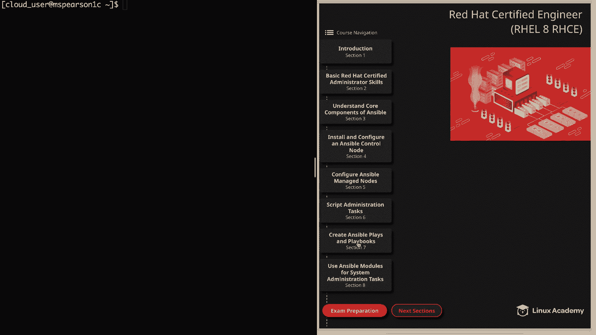

## 1. Ping 模块

Ping 模块用于验证目标服务器是否正在运行且可达。它没有必需的参数，是测试 Ansible 能否连接到被管理节点的简单方法。它也是运行 Ansible 临时命令的绝佳用例。

该模块只有一个可选参数 `data`，用于改变命令执行后的返回值。默认返回 `pong`。你也可以使用 `crash` 作为值来返回一个异常。

由于我们已在课程中见过此模块的示例，我们将直接进入下一个模块。

## 2. Setup 模块

Setup 模块用于收集 Ansible 事实信息，同样没有必需的参数。默认情况下，它会返回 Ansible 能收集到的关于主机的所有事实。

你可以使用 `filter` 参数来筛选特定事实，例如 `ansible_eth0` 将返回关于 eth0 设备的事实。你还可以使用 `gather_subset` 参数来限制返回的事实范围，例如指定 `hardware` 或 `network` 子集。

## 3. Yum 模块

Yum 模块用于通过 Yum 包管理器管理软件包。最常用的参数（非必需）是 `name` 和 `state`。

*   **`name`**：指定软件包或软件包组的名称。
*   **`state`**：选择操作，如 `present`（安装）、`latest`（安装最新版）或 `absent`（移除）。

让我们通过命令行使用 Ansible 临时命令来演示一下。

```bash
# 在 mspearson2 主机上以 root 用户身份安装 httpd 软件包（或更新至最新版）
ansible mspearson2 -b -m yum -a "name=httpd state=latest"
```

命令执行后，如果 `changed` 状态为 `true`，则表示安装或更新成功。我们也可以将 `state` 设置为 `absent` 来移除软件包。

在演示移除之前，让我们先用安装好的 httpd 服务来介绍下一个模块。

## 4. Service 模块

Service 模块用于控制远程主机上的服务。常用参数包括必需的 `name`，以及常用的 `state` 和 `enabled`。

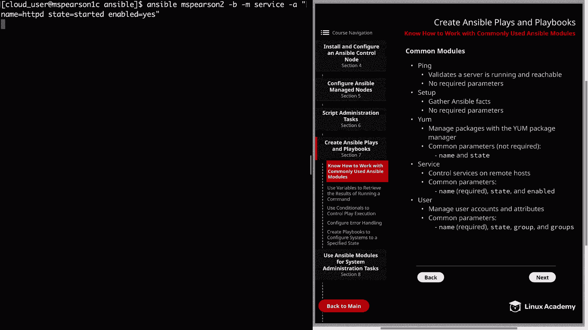

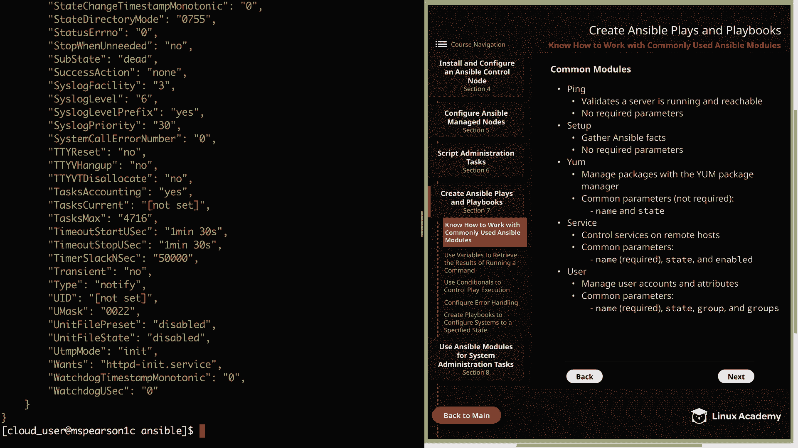

*   **`name`**：服务名称。如果只指定此参数，将返回服务状态。
*   **`state`**：控制服务运行状态，如 `started`、`stopped`、`restarted` 或 `reloaded`。
*   **`enabled`**：设置服务是否开机自启，值为 `yes` 或 `no`。

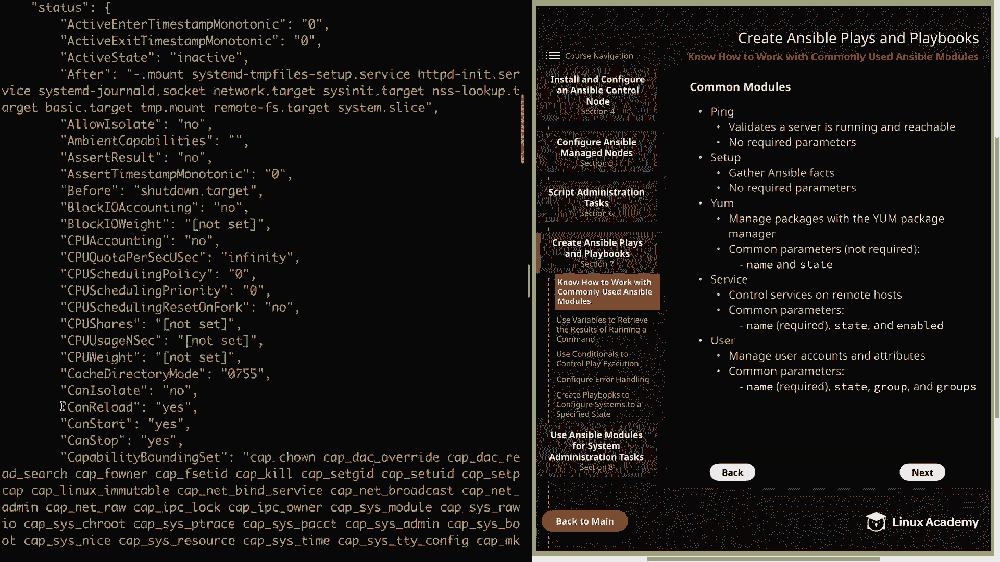

让我们用新安装的 httpd 服务来测试：

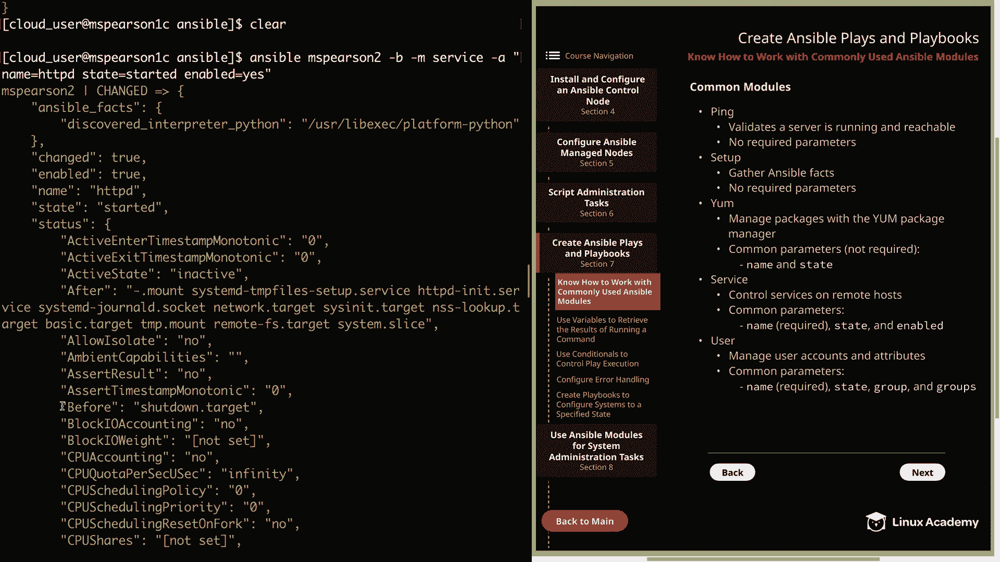

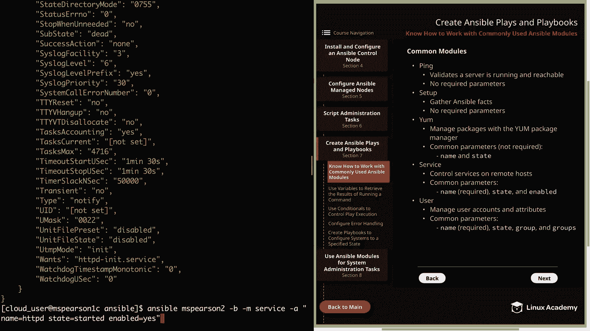

```bash
# 启动 httpd 服务并设置为开机自启
ansible mspearson2 -b -m service -a "name=httpd state=started enabled=yes"
```

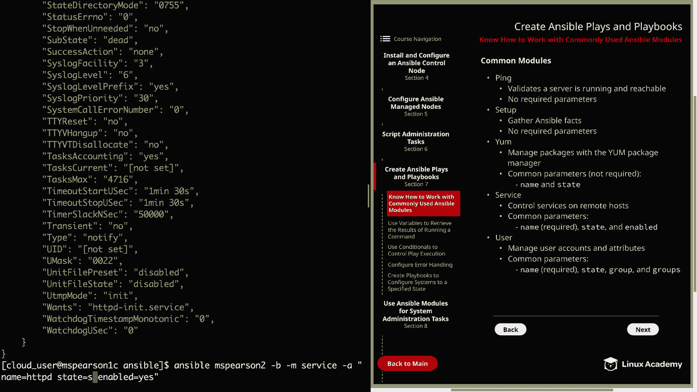

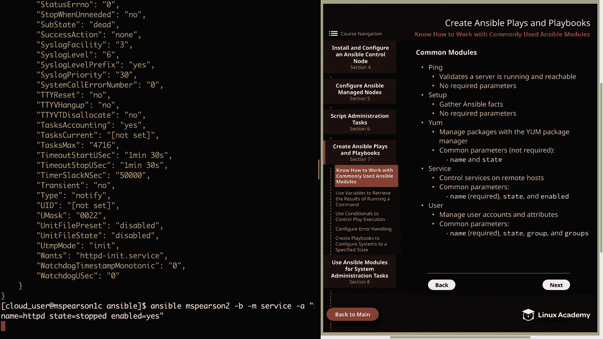

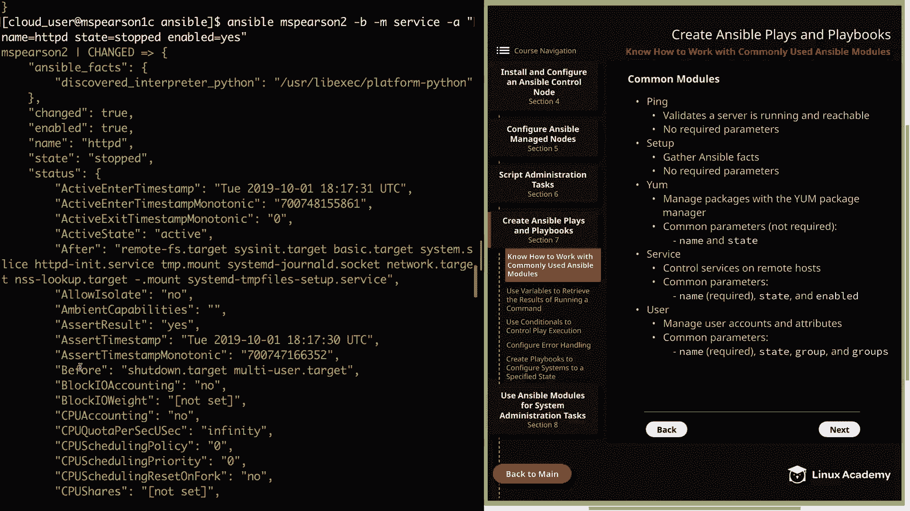

执行后，`changed` 状态为 `true`，`enabled` 也为 `true`，服务状态显示为 `started`。要停止服务，只需将 `state` 改为 `stopped`。

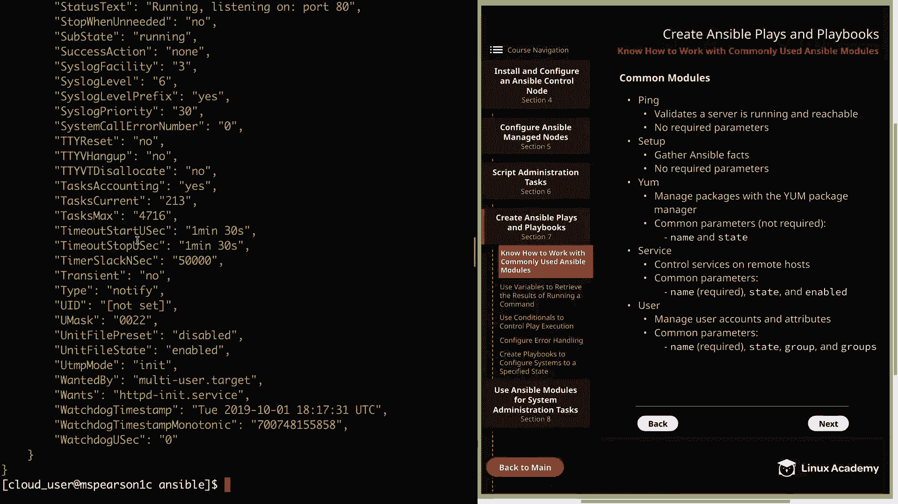

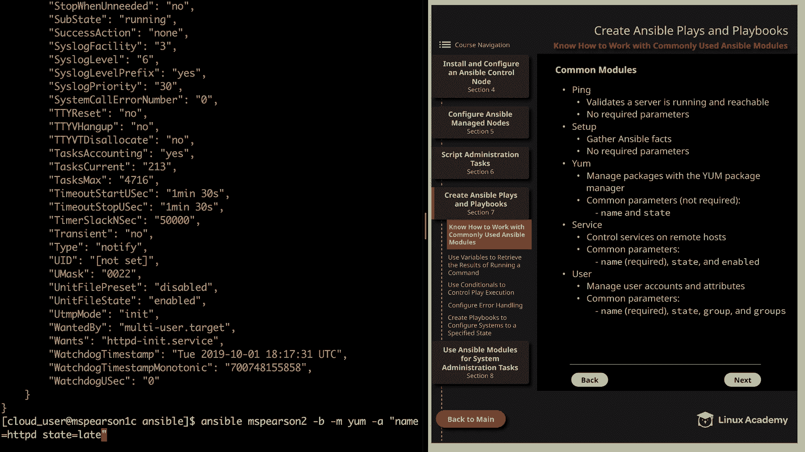

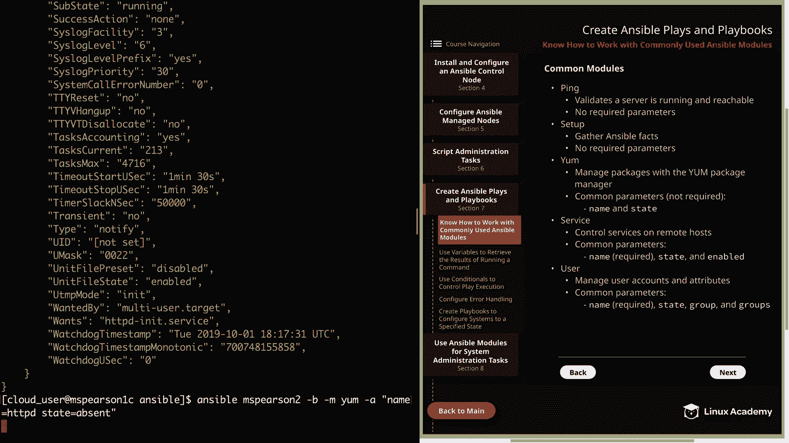

现在，让我们移除之前安装的 httpd 软件包：

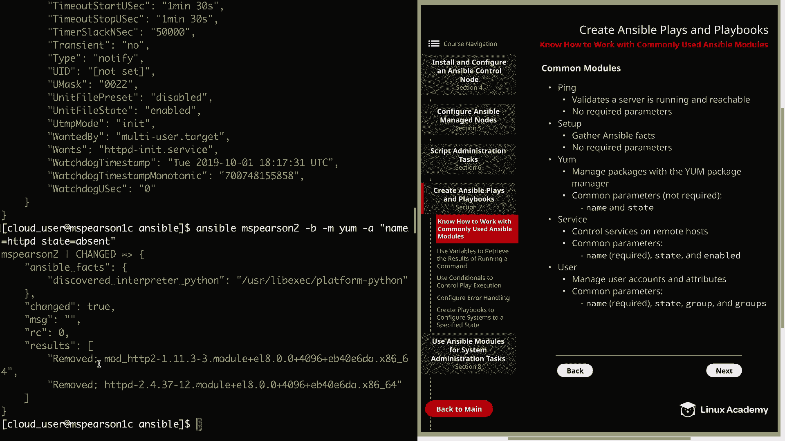

```bash
# 移除 httpd 软件包
ansible mspearson2 -b -m yum -a "name=httpd state=absent"
```

## 5. User 模块

User 模块用于管理用户账户及其属性。常用参数包括：

*   **`name`**：（必需）用户名。
*   **`state`**：用户状态，默认为 `present`（创建），`absent` 表示删除用户。
*   **`group`**：设置用户的主组。
*   **`groups`**：将用户添加到多个附加组（以逗号分隔的列表）。
*   **`home`**：设置用户的家目录。
*   **`shell`**：指定用户的登录 shell。

让我们创建一个名为 `pinehead` 的用户：

```bash
# 创建用户 pinehead，使用所有默认设置
ansible mspearson2 -b -m user -a "name=pinehead"
```

创建成功后，会返回用户 ID、组 ID、家目录和 shell 等信息。

## 6. Copy 模块

Copy 模块用于将文件复制到远程主机。通常需要指定 `src`（源）和 `dest`（目标），其中 `dest` 是必需参数。你还可以指定 `owner`、`group` 和 `mode`（权限）等参数。

首先，在控制节点创建一个文件：

```bash
touch /home/cloud_user/ansible/secret_file
```

然后，使用 copy 模块将其复制到远程主机：

```bash
# 将文件复制到 pinehead 用户的家目录，并设置所有者和权限
ansible mspearson2 -b -m copy -a "src=/home/cloud_user/ansible/secret_file dest=/home/pinehead/ owner=pinehead group=pinehead mode=0644"
```

## 7. File 模块

File 模块用于管理文件和目录。常用参数包括：

*   **`path`**：（必需）文件或目录的路径。
*   **`state`**：指定类型，如 `directory`（目录）、`file`（文件）、`link`（链接）或 `touch`（创建空文件）。`absent` 用于删除。
*   **`owner`**、**`group`**、**`mode`**：设置属主、属组和权限。

让我们创建一个目录，并在其中创建一个文件：

```bash
# 创建目录
ansible mspearson2 -b -m file -a "path=/home/pinehead/test state=directory owner=pinehead group=pinehead"

# 在目录中创建文件
ansible mspearson2 -b -m file -a "path=/home/pinehead/test/test_file state=touch owner=pinehead group=pinehead mode=0644"
```

## 8. Git 模块

Git 模块用于与 Git 仓库交互。常用参数包括：

*   **`repo`**：（必需）Git 仓库的 URL。
*   **`dest`**：（必需）克隆到本地的目标路径。
*   **`clone`**：通常与上述参数一起使用来执行克隆操作。

首先，确保远程主机已安装 git：

```bash
ansible mspearson2 -b -m yum -a "name=git state=latest"
```

然后，克隆一个 Git 仓库：

```bash
# 克隆仓库到指定目录
ansible mspearson2 -b -m git -a "repo=https://github.com/ansible/ansible-examples.git dest=/home/pinehead/ansible"
```

**注意**：目标目录 (`dest`) 必须是新目录或现有空目录。

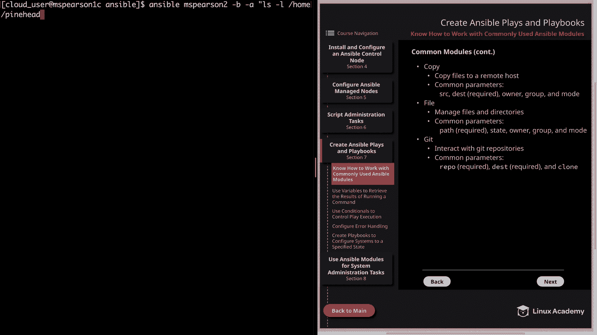

## 其他值得关注的模块

除了以上模块，还有几个模块值得了解：

*   **Lineinfile 模块**：用于确保文件中存在某行字符串，也可用于添加或替换行。
*   **Command 和 Shell 模块**：用于在远程主机上执行命令。`command` 模块更安全，不通过 shell 解析；`shell` 模块支持管道、重定向等 shell 功能。

我强烈建议你查阅 Ansible 官方文档的“模块索引”部分。那里有每个模块的详细说明和示例。随着课程深入，我们会在第8节看到更多用于系统管理任务的模块示例。

## 总结

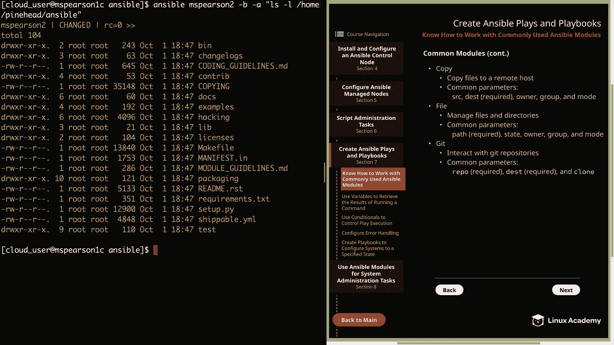

本节课中，我们一起学习了 Ansible 中一些最常用的核心模块，包括 Ping、Setup、Yum、Service、User、Copy、File 和 Git 模块。掌握这些模块是高效编写 Ansible 剧本的基础。记住，多实践、多查阅文档是熟悉它们的最佳途径。