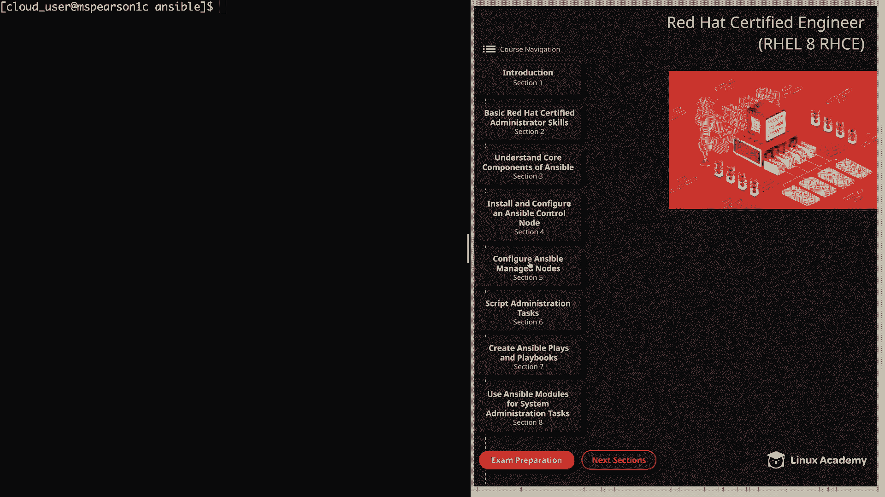
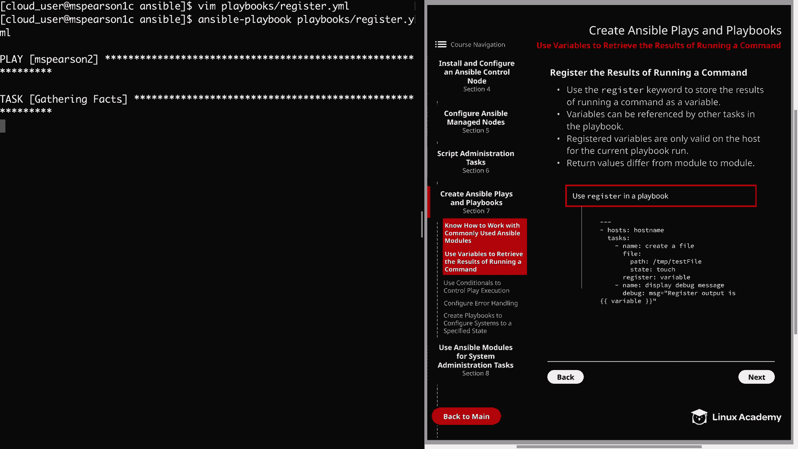
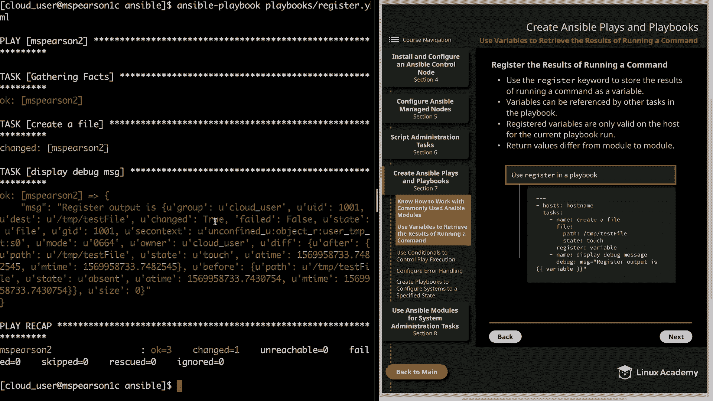
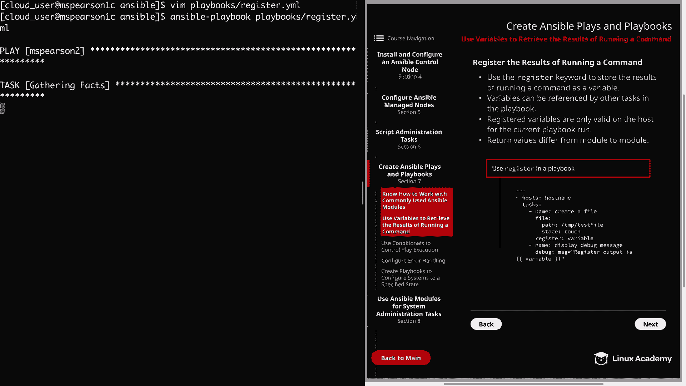
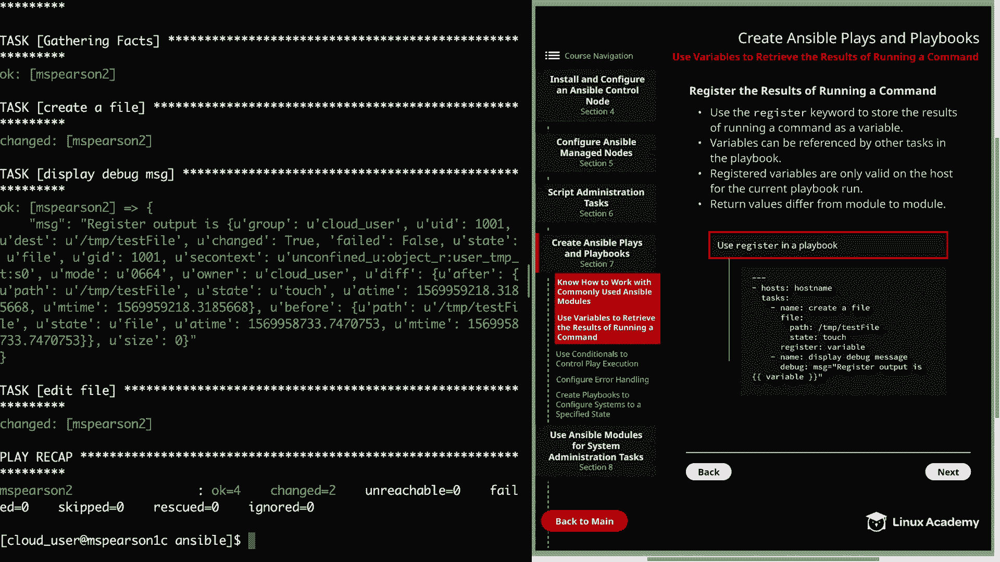
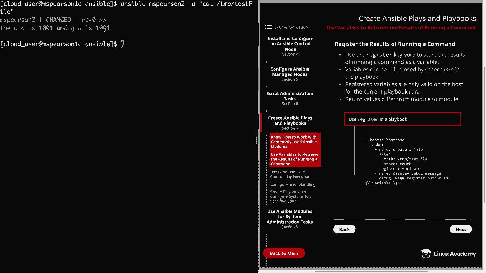

# Red Hat Certified Engineer (RHEL 8 RHCE) - P27：388-4872-2 - Use Variables to Retrieve the Results of Running a Command - 11937999603_bili - BV12a4y1x7ND

Welcome back to everyone， this is Matt， and in this video we're going to talk about using variables to retrieve results of running commands。

 So let's head over to section 7 to create antsible plays and playbooks。

And then down to the second section。 So in order to retrieve these results of a running command。

 we're going to be using the register keyword， and we're going to be storing it as a variable。

 And this is honestly very easy to do。 So at the same indentation as your module。

 you merely need to add the keyword register and then specify the name of your variable。

 So if you look at the example at the bottom of the page。We have our hosts specifying our host name。

 and then we have tasks， and we're going to create a file。

 and then at the same indentation as our file module， we're going to specify the register keyword。

 and then we're going to give a name for our variable， which here is just variable。

 Next variables can be referenced by other tasks in the playbook。

 And one of the great things about registering these variables。

 is not just for the information that they're going to provide。

 but also the ability to make decisions based on what is returned。

 So if we continue looking the example here， we're going to use register and specify our variable name。

 And then we're going to reference that variable and the second task。

 which is using the debug module。 And then our next point， which is really important to keep in mind。

 is that registered variables are only valid on the host for the current playbook run。

 So that means that once the playbook is finished executing the variables will no longer be stored。

 So if you have a playbook that requires those variables。

 you will need to have it gather them within the playbook。 And then lastly。

 return values differ from module to module。 So the return values。

Say from the young module are going to be different from the values from the user module。

 And if you like to view the return values that are expected for a particular module。

 you can always look up that module in the Anible documentation。

 and then the return values will be described under the return values section for that module。

 Allright， so now let's head it over to the command line and we can test this out。

So the first thing that we need to do is create our playbook and I'm going to create this in my playbook directory and I just decided to create a directory within home cloud user Ansible so that I can keep all my playbooks in the same place。

 And you'll probably also notice that I installed vim and I typically like to use that over just normal V since it adds a few extra features but the re image in playground does not install it by default。

 So if you'd like to use Vim， please feel free to go ahead and install that。 Anyways。

 let's go ahead and create our playbook and I'm just going to call it register dot YMl。All right。

 so we're going to start out with our three dashes。And then， our host。

Let's go ahead and do this on MS Pearson 2。And we don't need any elevated privileges since we're just going to be creating a file in the temp directory。

 so I'm going to go ahead and specify tasks。And then we're going to come back and then specify our name。

For this， it's just going to be create a file。And we're going to be using the file module。

We're going to specify the path， which is going to be temp， and then the name of the file。

 which is test file。And then the state。It's going to be touched since we're creating the file。

And then at the same indentation， the same level as our file module。We're going to type in， register。

And this is where we're going to define our variable。 So we can just call this variable。

 but you can honestly call it whatever you'd like to。

 then we're going to go down and add another task。And for this。

 we're just going to use the debug module to display a message。

 So we'll just say display debug message。Then we'll specify the debug module。And then。

 message equals。Register output is。Then we'll supply our variable。Variable。

And then we'll close our quotes。Alright， so we're going to create a file using the file module。

 and then we're going to use the register keyword in order to store the output from that into our variable。

 which we call variable， and maybe I'll just actually call this R so we're not saying variable over and over again。

So we're just going to call it var。And then we're going to use the debug module in order to display a message which contains our variable。

 which is all the output from that creation of the file。 So let's go ahead and save this。

 we can go ahead and try to run it。So I'm going to run Ansible playbook。

And then we're going to specify our playbook。And since I'm in my ansible working directory。

 we have our ansipible。 CFfg in there， so I don't have to specify the inventory。

 it's just going to default to the normal， so let's go ahead and hit enter。

Alright， so we gathered facts， and then we created our file on M Pearson 2。

 and then you can see our next task， which is display debug message。

 We see our message here and says register output is。

 and then it's going to supply the output from the creation of that file。

 and we see that we get a list of a bunch of different return values。 We get the cloud user group。

 Uid is 1001。 Our destination is temp test file。 We see change is equal true。

And I'm not going to go all the way through， but as you can see。

 it stored all those return values in our variable， which was var。

 and we output that using the debug module into a message。

So now that we see what these return values look like and how we can store them。

Now let's go ahead and update our playbook so that we can actually leverage these variables in another task。

 So we go ahead and clear this out， and then we're going to edit our playbook。

 So let's head down to the bottom of our playbook。

And then we're going to add another task， and we're going to be adding the line and file module。

And we're going to take some of those return values and use them in order to write text into the file。

 So we'll say name。For this， we'll just use editit file。

We're going to be using the line and file module。Now we need to specify a path first。

It's going to be T test file， because that's where we're creating our file。And then， for the line。

We're going to add in the UI is， and then we're going to specify a variable。

And it's going to be v and remember that is the name of our variable that we're registering。

 and then we can also specify one of those return values because we're storing all of them into our variable。

So this time let's just do var。uid， so that's going to pull the Uid。And then we can say an GID is。

And you probably already guess what this is going to be， it's going to be Var。 GID。

And then we can close our quote when it looks like I need to add my spaces here。Also。

 my U is capitalized over here。All right， so let's go ahead and save our playbook。

And let's go ahead and run it and see what happens。Register dot YMl。

And we see the familiar output that we had from before and also our task edit file。

 and it looks like everything succeeded。

Let's go ahead and clear this out， and then I'm going to use the ansipible ad hoc command in order to cat the file test file and see if our changes were actually applied。

Remember dash A， is's going to allow us to run a command in the quotes。

 so we're just going to use CA， temp， test file。And as you see。

 our line and file module added in the text， the UID is 1001 and the GID is 1001。

 and so is able to take those return values that we're storing in that var variable and then use them in another task。

So I realized that this was a pretty simple example of making use of these stored values。

 but I hope you can already see the benefit that it can provide。

 and this is not just for gaining more information。

 but also for making decisions based on the output of the previous task。

We will definitely be talking more about variables later on in the course。

 but for now that's going to finish up this lesson on using variables to retrieve the results of running a command。

 so let's go ahead and mark it complete and we can move on to the next lesson。

