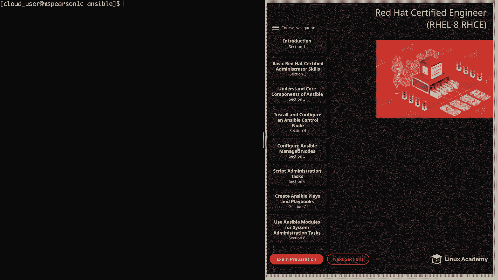
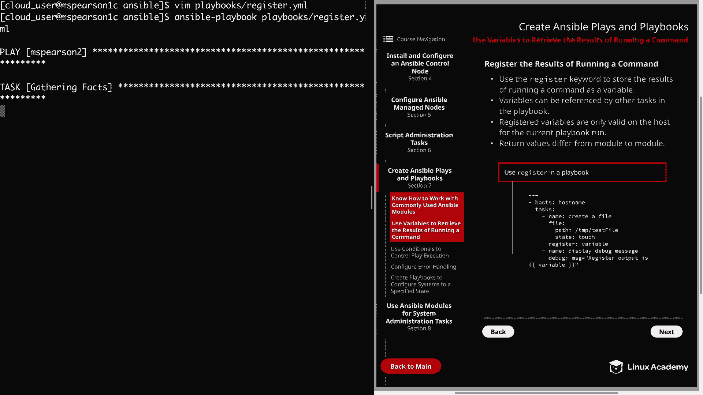
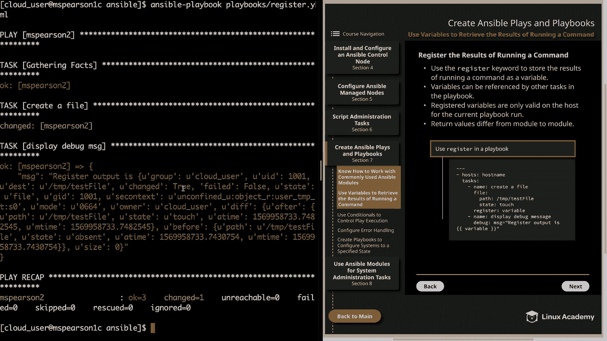
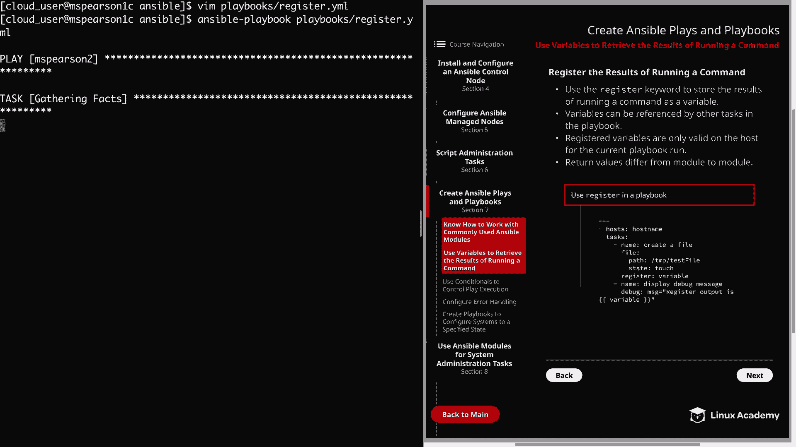
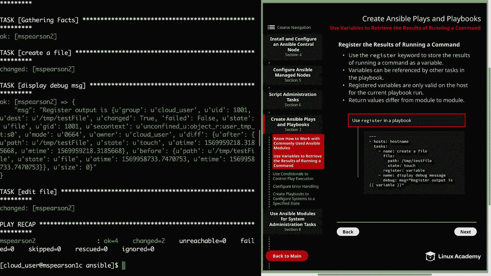
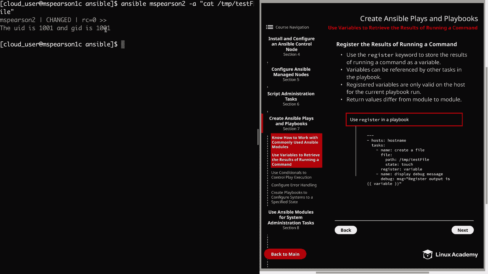

# Ansible 教程：P27：使用变量捕获命令执行结果



在本节课中，我们将学习如何在 Ansible 中使用 `register` 关键字来捕获任务执行的结果，并将其存储为变量。这是实现任务间数据传递和条件判断的基础。

## 核心概念：`register` 关键字

为了捕获一个任务的执行结果，我们需要使用 `register` 关键字。其基本语法是在任务模块的同一缩进级别下，添加 `register` 并指定一个变量名。

**代码示例：**
```yaml
- name: 创建一个文件
  file:
    path: /tmp/testfile
    state: touch
  register: file_creation_result  # 将任务结果注册到变量 file_creation_result 中
```

上一节我们介绍了 `register` 的基本语法，本节中我们来看看注册后的变量如何使用以及需要注意的事项。

## 变量使用与注意事项

以下是关于注册变量的几个关键点：

*   **跨任务引用**：注册的变量可以在同一剧本（playbook）的后续任务中被引用。
*   **决策依据**：这些变量的主要价值不仅在于提供信息，更在于可以根据其返回的值来驱动后续的决策逻辑。
*   **作用域限制**：注册的变量仅在当前剧本的执行过程中对当前主机有效。一旦剧本执行完毕，这些变量就会被清除。
*   **返回值差异**：不同模块的返回值结构各不相同。例如，`yum` 模块和 `user` 模块的返回值就完全不同。要了解特定模块的返回值，可以查阅 Ansible 官方文档中该模块的 “Return Values” 部分。

了解了基本概念后，让我们通过一个实践示例来加深理解。

## 实践演练：创建文件并捕获结果

我们将创建一个剧本，它首先创建一个文件并注册结果，然后使用 `debug` 模块输出结果，最后利用捕获的信息修改文件内容。

**步骤 1：创建剧本**



首先，创建一个名为 `register.yml` 的剧本文件。

```yaml
---
- hosts: mpearson2  # 指定目标主机
  tasks:
    - name: 创建测试文件
      file:
        path: /tmp/testfile
        state: touch
      register: file_var  # 将文件创建任务的结果注册到变量 file_var

    - name: 显示调试信息
      debug:
        msg: "注册的输出是：{{ file_var }}"

    - name: 编辑文件内容
      lineinfile:
        path: /tmp/testfile
        line: "UID 是 {{ file_var.uid }}，GID 是 {{ file_var.gid }}"
```

**步骤 2：运行剧本并观察**



运行此剧本后，你将看到：
1.  `创建测试文件` 任务成功执行。
2.  `显示调试信息` 任务会输出 `file_var` 变量的完整内容。这是一个包含 `changed`、`dest`、`gid`、`uid`、`mode` 等多个键值对的字典，详细记录了文件创建操作的所有返回信息。
3.  `编辑文件内容` 任务会从 `file_var` 变量中提取 `uid` 和 `gid` 的具体值，并将其写入 `/tmp/testfile` 文件中。

**步骤 3：验证结果**

你可以使用 Ansible 临时命令来验证文件内容是否被成功修改：





```bash
ansible mpearson2 -a "cat /tmp/testfile"
```

执行后，你将看到文件中包含了类似 `UID 是 1001，GID 是 1001` 的文本，这证明我们成功捕获并使用了前一个任务的返回信息。

## 总结



本节课中我们一起学习了 Ansible 中 `register` 关键字的核心用法。我们掌握了如何将任务执行结果保存到变量中，如何在后续任务中引用这些变量的特定字段（例如 `{{ variable_name.key }}`），并理解了注册变量的作用域和模块返回值的差异性。通过简单的文件操作示例，我们看到了此功能在实现任务间数据流和自动化决策中的强大潜力。在后续课程中，我们还将深入探讨更多关于变量的高级用法。