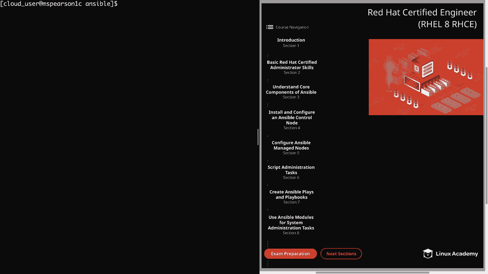
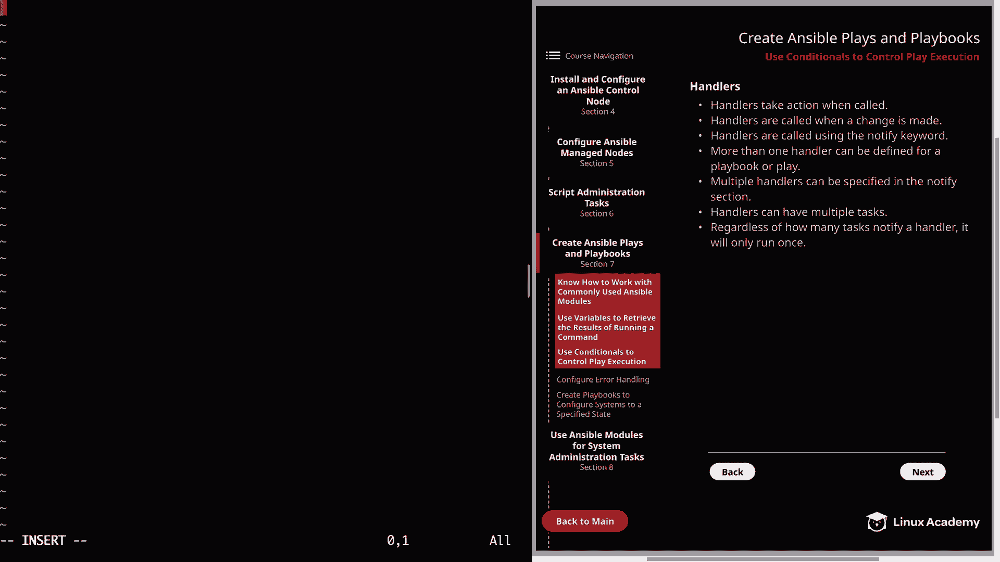
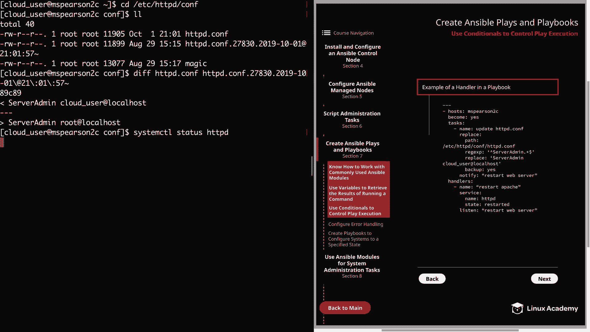
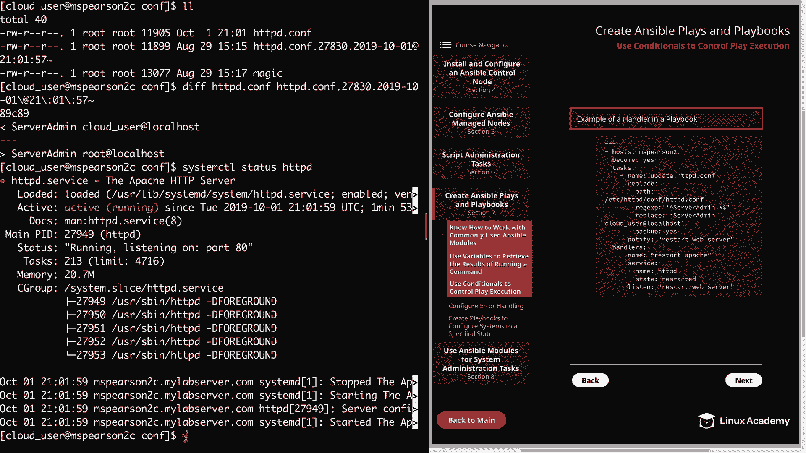
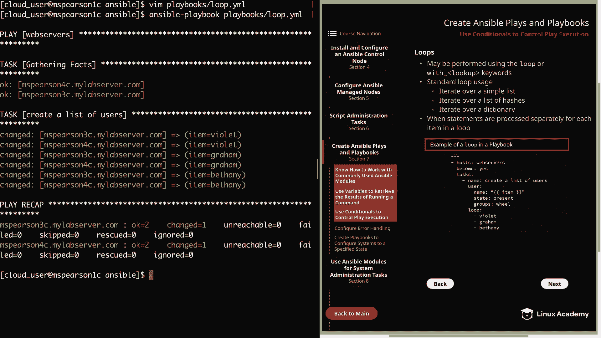

# Red Hat Certified Engineer (RHEL 8 RHCE) - P28：388-4872-3 - Use Conditionals to Control Play Execution - 11937999603_bili - BV12a4y1x7ND

Welcome back everyone， this is Matt and in this video we're going to be talking about using conditionals in order to control play execution。

 So let's head over to section 7。

And then down to use conditionals。All right， so the first thing that we're going to talk about is handlers。

 And I'm going to walk through and talk a little bit about what handlers are。

 And then I'm going to show you a demonstration of how they work in an actual playbook。 So first。

 handlers take action when called。 So if the handler is not called。

 then the action is not going to be performed。 Handlerrs are called whenever a change is made。

And they're also called using the notified keyword。

 So if a task runs in Ansible and no change is made， then the handler will not be notified。

 but if a change occurs as a result of an action， then the handler will be notified using the keyword that the handler is listening for。

 and this can be specified using the notified keyword。Next。

 more than one handler can be defined for a playbook or play。

 which kind of leads into the next point， and that is that multiple handlers can be specified in the notify section。

 so you can have more than one handler in your playbook。

 and then you can reference one or more handlers within the notify section using that notify keyword and not only can you have multiple handlers。

 handlers can also have multiple tasks。So as you can imagine。

 this provides a great deal of flexibility and you're also able to separate out tasks to handlers in a logical way。

Then lastly， regardless of how many tasks notify a handler， it will only ever run once。

 so let's say that you have a service that has a configuration file as well as some data files。

 and any time those are updated， the service needs to be restored。Well。

 you could have a situation where you have a playbook that updates both the data file and the configuration file。

 And so within your playbook， you would use the notify keyword to notify the handler that the service needs to be restarted。

 And even though there are two separate tasks that are running and notifying the handler。

 the handler is only going to run one time。 and you probably already notice how this is a much more efficient way rather than restarting after each individual step。

All right， well， let's head over to the command line and we can try this out。

The first thing we need to do is create a playbook。Im create this in my playbooks directory。

We're just going to call this handler dot Yl。And in this playbook。

 we're going to be working with Apache on MS Pearson 2 and just to let you know prior to this video。

 I went ahead and installed and started an Apache HttPD server。

 so if you're following along go ahead and pause the video and get that installed and then we can move forward。

If we head over to the diagram here。I'm going to show you an example of what we're going to be doing。

So we're going to be updating the Apachehttbd。com， and then we're going to notify a handler that Apache needs to be restarted。

So let's set back over here and we'm going to start out with our dashes。And then for hostst。

 we're going to be dealing with MSParson 2 again。I'm going to become the root user。

AndThen we can specify our tasks。So the first is to update the HttPD。com。An update。

And we're going to be using the replace module。And the first thing we need to specify is a path。

 so we're going to give the path to httPD。com。Etsy。Ht TP D Com， and then HtTPD dot com。Next。

 we need to provide the regular expression for what we're looking for。

And we're going to look for any line that begins with server admin。

And then just grab everything after it。 Soll do our dot star。Dollar sign。

 and we're going to close that out， and then we're going to specify what we're going to replace it with。

 and that's going to be server admin。That's going to be cloud_ user at Localhost。

We're also going to use the backup parameter。That way we'll have a backup of our original httbD。com。

And then remember at the same indentation， the same level as the module we're going to put in notify。

And right here we can use the shorthand or the longhand in order to notify the handler。

 and what I mean by that is specifying it directly after the colon or specifying a list of handlers by supplying them underneath notify。

 but since we're only specifying one， I'm just going to go ahead and add it in here。

 we're going to say restart web server。And then we're going to define our handlers。

And this is going to be back at the level where task is at。And then under handlers。

 we can define our tasks， and all we're wanting to define here is to restart Apache。So name。

It's going to be restart Apache。We're going to use the service module。The name of the services HttPD。

The state is going to be restarted。And then we're going to be listening for that notify keyword。

And that is restart web server。All right， let's go ahead and save and quit。

And now let's kick off our playbook。And we see that our playbook execution was successful。

 let's go ahead and SSH over to MS Pearson 2C。And then we're going to Cd to Etsy HtTPD。Com't。

AndDo a listing。And you're going to notice two comp files， we have the original httPD。com。

 as well as the backup， let's go ahead and do a diF on that。

And we see that our change was added successfully。You can also do a little system CTL status， HP。

And we see that the service is running and has been active for about two minutes。

All right， let's go ahead and exit out of MS Pearson 2C， head back to our control node。

And that was just a quick and practical example of using a handler and a playbook and really demonstrates the important use that handlers have。

 especially when you're talking about a service that needs to be restarted in order for configuration changes to be made live。

Al right， so now let's head over to the next page。And now we can talk about the wind statement。

 So the wind statement is going to allow a task to run or be skipped if certain conditions are met。

 So this is really handy to use in situations where you want a particular action to kick off based on the completion of another action and you can even specify whether the action runs based on whether the previous task either fails or succeeds Next parentheses can be used to group conditions。

So you can put parentheses around statements and then use an operator like or in between the statements so that an action will kick off if one of the statements is met。

Next， multiple conditions can be specified as a list。

 and this is going to be used to specify that all statements need to be true in order to run the task。

So this would be our logical and operator as opposed to the or operator we were just talking about。

 And then lastly， mathematical operation comparisons can also be used。

 So sometimes you may have a situation where you want to get back a variable string that you can then do mathematical comparisons on。

 So an example of that might be the version of the operating system that's running on a host。

And this is particularly true of larger companies that have mixed environments。

 so you might have a group of hosts that are running。

 let's just say RE 6 and then some newer hosts that are running RE 8。

 and you need to make a decision on what tasks you're going to execute against those hosts based on that version number。

 so that might be a situation where you want to use the win statement so that you can use mathematical operation comparisons in order to make that decision。

All right， so let's add back where the command line。

 and then we can try this out and walk through our example that we have here in the diagram。

Let's create a playbook。And our playbooks directory。And this time we'll just call this wind dot yaml。

 So again， we'll start with our dashes。Then our hosts。

This time we're going to be executing into the web server source。We're going to become the root user。

And we can specify our tasks。The first task is going to use the copy module。

 we're just going to be copying a file。So we need to specify our source。That is home cloud_ user。

Index dot HTML。Then our destination， which is going to be var Www HTML。And then index dot HTML。

And then at the same level as our copy module。We's the win keyword。

 and we're going to say when answersible underscore host name。Is equal to。M Pearson 3C。All right。

 let's go ahead and save this。AndNow let's go ahead and run our playbook。Ananceible playbook。

And playbook。When dot Yaml。Alright， so we already see some things going on here that we're not used to seeing。

 which is under the copy file task， we see it skipping MS Pearson 4C and it's made a change on MS Pearson 3C noticeice that it was not a failure it only skip the task for that particular host and the reason for that as you already know is because we specified in our win statement that we only wanted to run that particular task when the Ansible underscore host name was equal to MS Pearson 3C。

Allright， so now let's go ahead and curl the index at HTML from MSParson 4c。MParson 4cindex。 HTMLt。

And we see that the message we get from that is this is the index。 HTML and MSParson 4c。

 which is from our earlier video。And let's see what happens when we curl MS Pearson 3C。

And we see that we get the updated index that HTML that we copied over。

 which says conditionals are cool。Al right， so let's head back over to the diagram。

 We're going to click next， and our last topic in this section is going to be loops。

 and I will be primarily talking about and showing how to use standard loops。

 but Ansible does allow for more complicated loops as well。

 and this will be things like iterating over nested groups and even retry and tasks until specific conditions are met。

 But anyways， loops may be performed using the loop or with underscore lookup keywords。

But I will say that in the newer versions of Ansible。

 they are preferring that you use the loop keyword rather than the with， for instance。

 underscore items or with underscore list， and that's because they're trying to build all the functionality of the with_ lookup into the loop now there are certain situations where you do need to use the with lookup keyword。

 but for standard loops， you should be good using just the loop keyword。

And the standard way that loops are used is in order to iterate over a simple list。

 And this is expressed by the example of a loop I provide here in the diagram where we're creating a list of users。

 and we just list out their names， Violet Graham and Bethany。

But you're also able to iterate over a list of hashes。

 and hashes are a way to store multiple values inside a variable。

 basically allowing you to store key value pairs within that same variable。

 then also to iterate over a dictionary， which is merely just a list of key value pairs。Then lastly。

 another good thing to keep in mind is that whenever you add a when statement to a loop。

 it's going to be processed separately for each item in that loop。

 So let's once again head back over the command line。 clear this out。Let's create another playbook。

This time we're going to call this on loop。yml。So again， we'll start with our hashes。

And for' our host， we're going to be running this against our web servers group。

We're going to say become equals yes。And then we're going to give our list of tasks。The first。

 we're just going to put in the name， we're going to say create a list of users。

And we're going to be using the user module for this。Then we're going to specify name。

 and here we're going to put in a variable。And that variable is going to be item。And then later on。

 we specify our loop， those items that we list are going to be substituted for this variable。

So next we're going to say state。I she going to say present？And then we're going to add some groups。

 and we're going to add all these users to the wheel group。

And then at the same level as our user module。We're going to type out loop。And then underneath that。

 we're going to list out our items。So first， we're going to type out Violet。And then， Graham。

And then， Bethany。And before we save and quit this。

 I did want to come back to the whole with lookup keyword。And so to use that。

 we would basically rather than saying loop right here， we would just specify with_ items。

And that's going to basically do the same thing as specifying loop here。

 but with underscore items is the way that it was done before and they're moving toward using the loop keyword。

So for our example， we're just going to stick with the loop keyword。

And feel free to look at the Ansible documentation to see more information about using with lookup versus using justL。

All right， so let's go ahead and save and quit。And now we can go ahead and run our playbook。

And we see that it substitutes our item variable for each name in the list that we provided it under Lo。

 and it does this for both MSParson 3C and MS Pearson 4C。

And that in a nutshell is how you perform a simple loop。 Now。

 loops are not limited to user and group creation and can also be used with other modules。

 An example of this will be something like creating multiple files and directories。

 but I did have one disclaimer， and that is that some modules will allow you to add a list directly into the parameter for the module and that's without having to specify a loop just into the parameter by doing a list。

 and whenever that is available， it's actually more efficient to use that than to use a loop。

 and an example of this would be the young module， which allows you to install a list of packages by default without the need to do a loop。

All right， well that's going to wrap up using conditionals to control play execution。

 let's go ahead and mark this video complete and we can move on to the next lesson。

