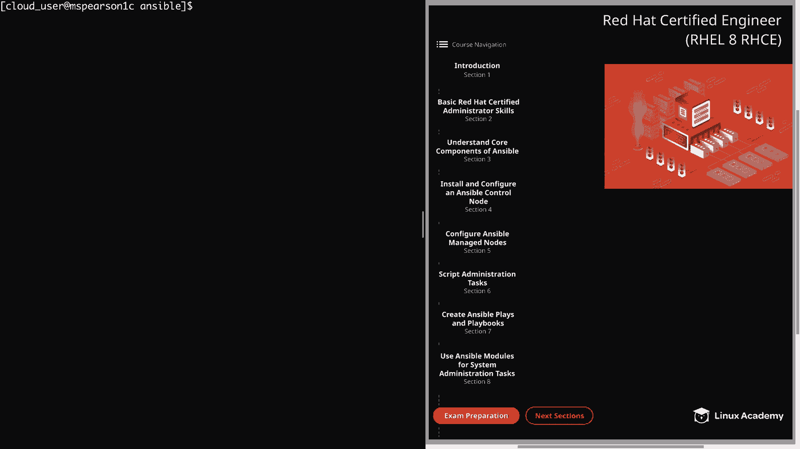
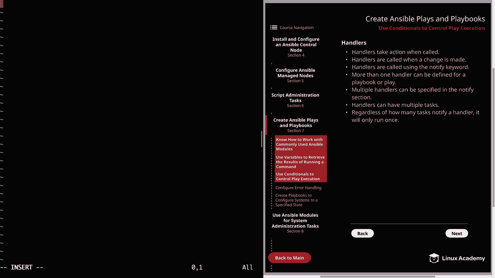
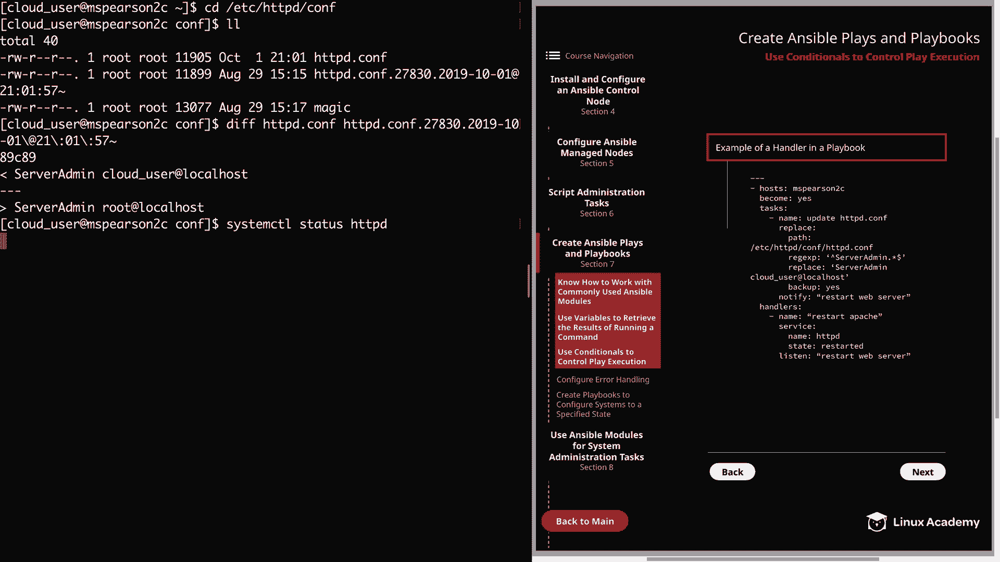
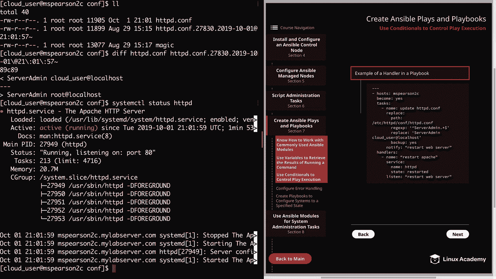
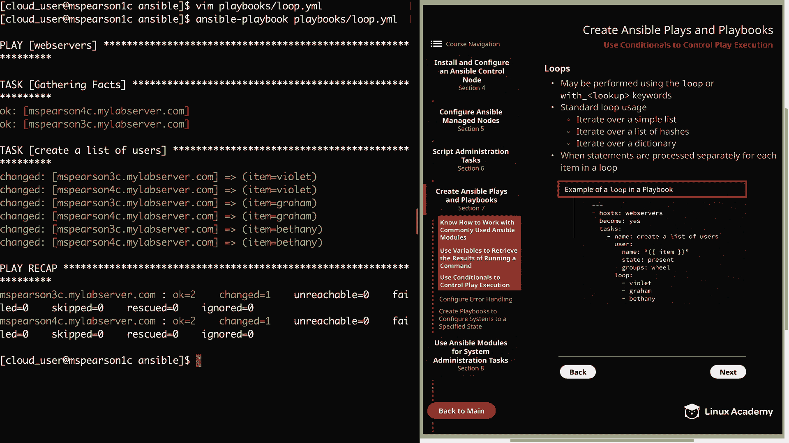

# Ansible 条件控制：P28：使用条件语句控制 Play 执行



在本节课中，我们将学习如何在 Ansible 中使用条件语句来控制 Playbook 的执行流程。我们将重点介绍三种核心机制：**处理器**、**when 语句**和**循环**。掌握这些知识将帮助你编写更智能、更高效的自动化脚本。

## 处理器

上一节我们介绍了 Playbook 的基本结构，本节中我们来看看如何通过处理器来响应任务的变化。处理器是一种特殊的任务，它只在被通知时才会执行，通常用于处理配置变更后的后续操作，例如重启服务。

以下是处理器的几个关键特性：



*   **按需触发**：处理器仅在通过 `notify` 关键字被调用时才会执行。
*   **变更驱动**：只有当引用它的任务报告了 **“changed”** 状态时，处理器才会被通知。
*   **灵活定义**：一个 Playbook 中可以定义多个处理器，一个任务也可以通知多个处理器。
*   **单次执行**：无论有多少个任务通知了同一个处理器，该处理器在整个 Play 运行期间**只会执行一次**。这避免了不必要的重复操作，例如多次重启同一个服务。

现在，让我们通过一个实际例子来理解处理器的工作方式。我们将创建一个 Playbook，用于更新 Apache 的配置文件，并在文件被修改后自动重启 Apache 服务。

首先，创建 Playbook 文件 `handler.yml`：

```yaml
---
- hosts: msperson2c
  become: yes
  tasks:
    - name: Update the httpd.conf
      replace:
        path: /etc/httpd/conf/httpd.conf
        regexp: '^ServerAdmin .*$'
        replace: 'ServerAdmin cloud_user@localhost'
        backup: yes
      notify: restart web server

  handlers:
    - name: Restart Apache
      service:
        name: httpd
        state: restarted
      listen: "restart web server"
```

在这个例子中：
*   `tasks` 部分使用 `replace` 模块修改 `httpd.conf` 文件中的 `ServerAdmin` 指令。
*   `notify: restart web server` 表示如果这个任务导致了变更（即文件被修改），则通知名为 `"restart web server"` 的处理器。
*   `handlers` 部分定义了一个处理器，它监听 `"restart web server"` 这个通知，并在被触发时执行 `service` 模块来重启 `httpd` 服务。

运行此 Playbook 后，如果配置文件被更改，Ansible 会先完成所有任务，然后在 Play 的最后集中执行所有被通知的处理器，确保服务只重启一次。





## When 语句

了解了如何响应变更后，我们来看看如何根据特定条件来决定是否执行任务。`when` 语句用于条件性地执行或跳过任务。

以下是 `when` 语句的主要用法：

*   **条件执行**：任务仅在 `when` 语句的条件评估为 **真** 时运行。
*   **逻辑组合**：可以使用括号 `()` 和逻辑运算符（如 `and`, `or`）来组合多个条件。
*   **列表条件**：当以列表形式提供多个条件时，默认使用 **and** 逻辑，即所有条件都必须为真。
*   **比较运算**：支持数学比较运算符（如 `==`, `!=`, `>`, `<`），可用于比较变量值，例如根据主机系统版本执行不同任务。

让我们创建一个示例 Playbook `when.yaml`，它只在特定主机上复制文件：

```yaml
---
- hosts: webservers
  become: yes
  tasks:
    - name: Copy index.html
      copy:
        src: /home/cloud_user/index.html
        dest: /var/www/html/index.html
      when: ansible_hostname == "msperson3c"
```

在这个 Playbook 中，`copy` 任务只会对主机名为 `msperson3c` 的主机执行。对于 `webservers` 组中的其他主机（如 `msperson4c`），该任务会被标记为 **“skipping”** 并跳过，而不会导致 Play 失败。

## 循环

最后，我们来学习如何高效地重复执行同一任务。循环允许你对一个项目列表进行迭代，避免为每个项目编写重复的任务代码。

在 Ansible 中，循环主要通过 `loop` 关键字实现（旧版本中常用 `with_` 系列查找插件）。以下是循环的常见用途：

*   **遍历简单列表**：迭代一个字符串列表（如用户名、软件包名）。
*   **遍历哈希列表**：迭代一个字典列表，其中每个字典包含多个键值对，便于处理复杂数据。
*   **遍历字典**：迭代键值对。
*   **与条件结合**：当 `when` 语句与循环一起使用时，条件会针对**循环中的每个项目**单独进行评估。

现在，我们创建一个使用循环的 Playbook `loop.yml`，用于在多个主机上创建一组用户：

```yaml
---
- hosts: webservers
  become: yes
  tasks:
    - name: Create a list of users
      user:
        name: "{{ item }}"
        state: present
        groups: wheel
      loop:
        - Violet
        - Graham
        - Bethany
```

在这个例子中：
*   `user` 模块会执行三次，因为 `loop` 列表中有三个项目。
*   每次迭代时，`{{ item }}` 变量会被替换为当前循环项的值（依次是 `Violet`、`Graham`、`Bethany`）。
*   该任务会在 `webservers` 组中的所有主机上执行，为每台主机创建这三个用户。

**效率提示**：某些模块（如 `yum` 或 `apt`）本身支持接收一个列表作为参数。在这种情况下，直接传入列表比使用 `loop` 更高效。例如，安装多个软件包时，应优先使用 `name: [package1, package2, package3]` 的写法。

---



本节课中我们一起学习了控制 Ansible Play 执行的三种强大工具：**处理器**用于响应变更并执行后续操作；**when 语句**用于基于条件决定任务执行路径；**循环**用于高效地重复任务操作。合理运用这些条件控制机制，可以让你编写的 Playbook 更加灵活、健壮和易于维护。