# Red Hat Certified Engineer (RHEL 8 RHCE) - P29：388-4872-4 - Configure Error Handling - 11937999603_bili - BV12a4y1x7ND

Welcome back everyone， this is Matt， and in this video we're going to be discussing how to configure error handling within your playbooks。

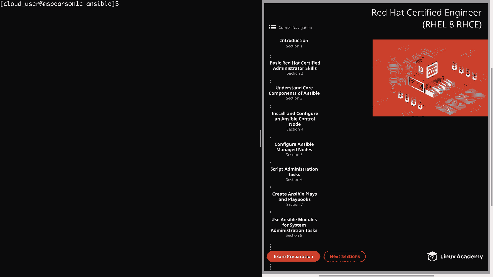

So let's head back down to section 7。And then to the fourth topic， which is configure error handling。

 we're going to begin by talking a little bit more about error handling and what's available。

 and then I'm going to show you some demonstrations。So first。

 you can ignore errors by using the ignore errorss keyword。

 and it's important to note that the default behavior of Ansible is to stop executing any more steps on a host if there is a single failed task。

 but in some situations you may want Ansible to continue running the play even if it encounters an error。

This can be true if it's an error you're expecting or just a task that doesn't make or break an entire playbook execution。

Next， you can force a previously notified handler to run using the force handlers's keyword。

 So if multiple tasks are notifying the same handler and one of those tasks fail。

 then the handler will not run。 And depending on the scenario this can leave your host in an unexpected state。

 So an example of this could be something like a configuration file being updated。

 which will then notify the handler that a service needs to be restarted。

 But then another task in the same play has a failure which causes the handler not to run。

 So to force that to always run， you can set force handlers equal to true。

Next you can define failure conditions using the failed when keyword。

And this gives you the flexibility of defining what a failure actually is for a task as opposed to just using the ansible default。

 and then similar to that， Ansipible also allows you to override the change status of result using the changed win keyword。

And this is useful because when Ansible runs a play against a host。

 it will give the change status based on whether or not it thinks that it affected the machine state。

 but sometimes you will know whether or not the state was actually affected based on either the return code or the output。

 and you want to make sure that the change status isnt returned in a report output and to make sure that the status does not cause a handler to fire。

 Next， you can abort an entire play if any task fails using any error's fatal keyword。

 and this will mark all host failed if any of the host fails as opposed to just skipping the remaining tasks for that particular host。

And then finally， you can implement a block in order to logically group tasks and also to provide error handling using the following keywords。

 which is block， rescue and always So using the block keyword allows you to specify a series of tasks within that block。

 then at the same level as the block keyword， you can use the rescue keyword。

 which allows you to specify an action or actions to be performed if a task within that block happens to fail。

 Finally， blocks also allow for the always keyword。

 which allows you to specify an action to be performed regardless of the failure or the success of the tasks within the block。

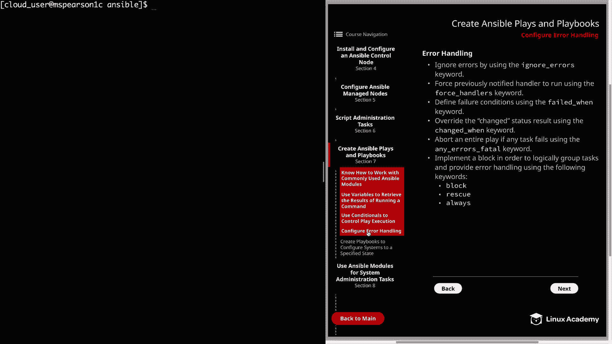

So now let's head over to the next page。And you're going to see a couple examples of some playbooks that are using the ignorere_ errors keyword and also a block in order to handle errors。

 so let's go ahead and try a couple of these out in the command line。And as you might notice。

 I'm already in my home cloud user Ansible， my main working directory。

 and let's go ahead and create a playbook to illustrate the ignorere errors keyword。

So I'm going to create this in my playbooks directory， which is going to call this error。yl。

So go ahead and start this off with our three dashes and then for host。

 I'll be using the Lab servers group。And then we're just going to specify tasks。

The name for this task is just going to be copy remote files。

And we're going to be using the Fech module， which is going to allow us to copy remote files to our local machine。

So we'll type in fetch， we to provide our parameters first is going to be the source。

The source is going to be temp error file。And then the destination。

Is going to be T on our local directory。And so the way I've set up this demonstration is we have our La servers host group。

 and there are four servers in that， and that's MS Pearson， 3， 4， 5， and6。

And all of the hosts in that group other than MS Pearson 3。

 have this error file in the temp directory。And so this task is going to fail when it tries to retrieve that file from that host。

 so what we're going to do is at the same level as fetch。

 we're going to type in ignore underscore errors。We're going set this equal to yes。

So even though the file doesn't exist on one of the hosts， it should ignore that error。All right。

 let's go ahead and save this。And now we can run our playbook。

Let's say we have an error at line4 column 7， let's go ahead and open that up and check it out。

And it looks like we misspelled errors and ignore errors。

 And there is a reasonable amount of irony in that。 So's go ahead and add that in。All。

 so now let's save and try that one more time。

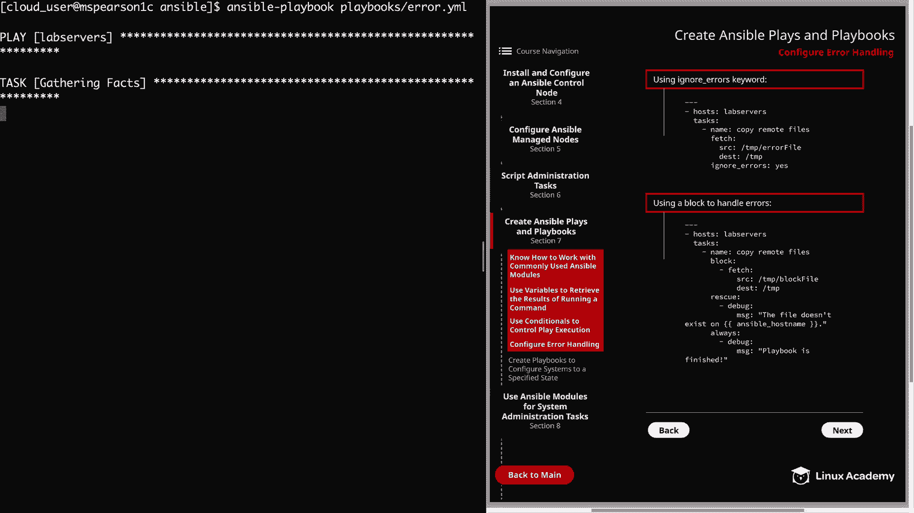

And it looks like our syntax was successful that time。

 so we see that it runs through all the hosts and gathers facts and then it's going to kick off the copypy remotemote files task。

And you can see that for MSParson 4，5 and 6， we have the change status， but then for MSParson 3。

 we get fatal， and it says that it's unable to find the error file。And then just underneath that。

 you're going to see ignoring。 And rather than the saying failed。It's just going to say， ignored。

So even though we had a legitimate error， we were able to bypass it using ignorere errors。

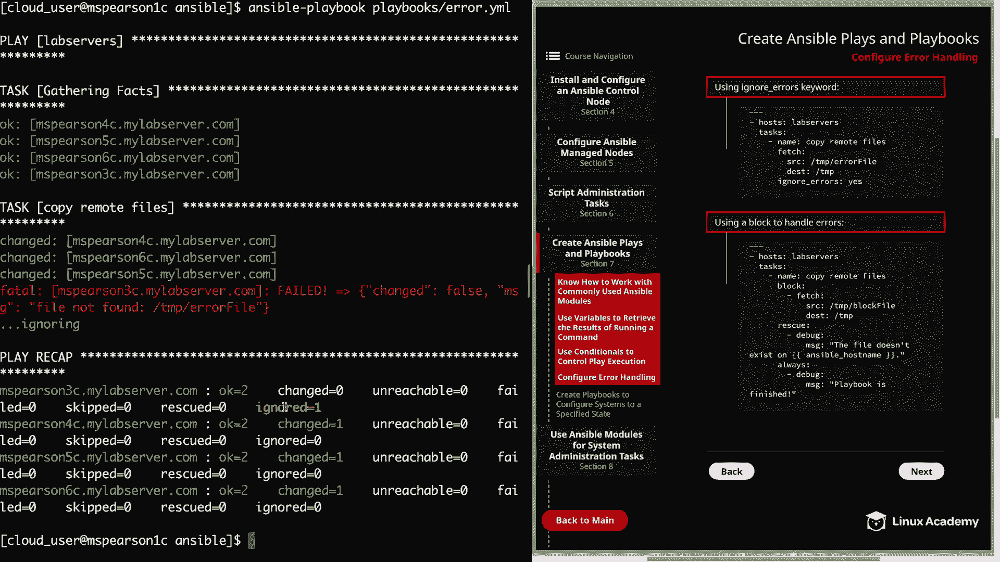

All right， let's go ahead and clear this out， and now I can show an example of using a block to handle errors。

And we'll also see if our spelling has improved。So again， we're going to create this in playbooks。

 I'm just going to call this block dot YMl。So we'll specify our three dashes。

And then our host is going to be lab servers。And then， under Ta。I'm going to say name。

And this is going to be copy remote files， we will be using the Fe module yet again。But first。

 we're going to specify our block。That's going to allow us to specify multiple tasks and also take advantage of the rescue and always keywords。

Almost got me again there。So here we're going to specify our module， which is fetch。And then。

 our source。This time it's going to be temp block file。

And then our destination is going to be temp again。And then on the same level as block。

 now we can specify our rescue keyword。And this is where we're going to specify the task we want to perform if there is a failure within this block。

And for this example， we're just going to use the debug module in order to output a message。

Would be debug。And then for message， we're going to say the file doesn't exist。On。

We're going to use one of the variables here。This ants will underscore host name。All right。

 and then we're also going to use the always keyword。And remember。

 this is going to run regardless of a failure in the block or success of the block。 And again。

 I'm going to use the debug module just to illustrate it。

And we're just going to say playbook is finished。All right， let's take a look over our playbook。

All right， let's go ahead and save it。And we can run our playbook。 Wish me luck。Block dot yal。

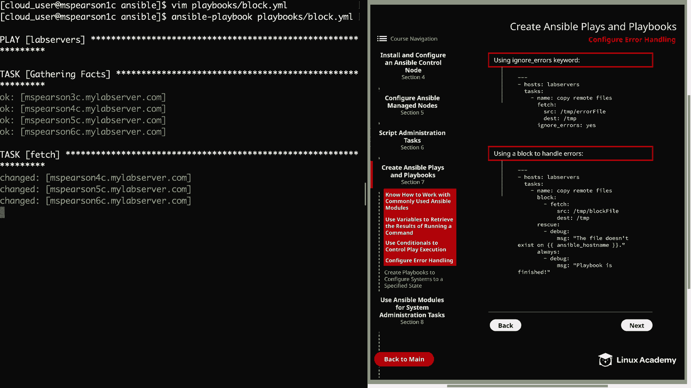

All right， so underplay recap。We see that we have one task that was rescued。

So it's not going to show it as a failure because we enacted a rescue step。

 So let's scroll up real quick and check this out。

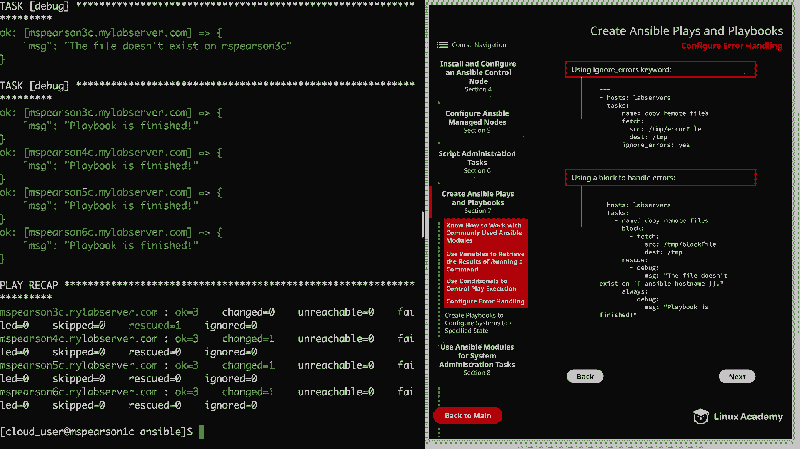

So we gather our facts and then we come down to the fetch task， which is within our block。

And we see that we have the change status for4，5， and6。

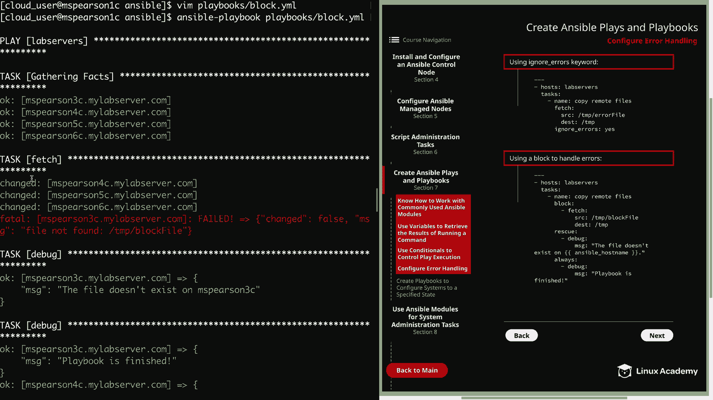

And then on MS Pearson 3。The file block file was not found， so we get a failure。

And so that enacts our rescue， which is this task right here。

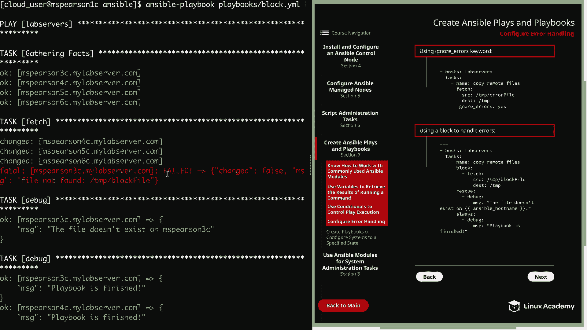

And this lets us know that the file did not exist on MSsParson 3C。

And then we also specify a task under the always keyword。

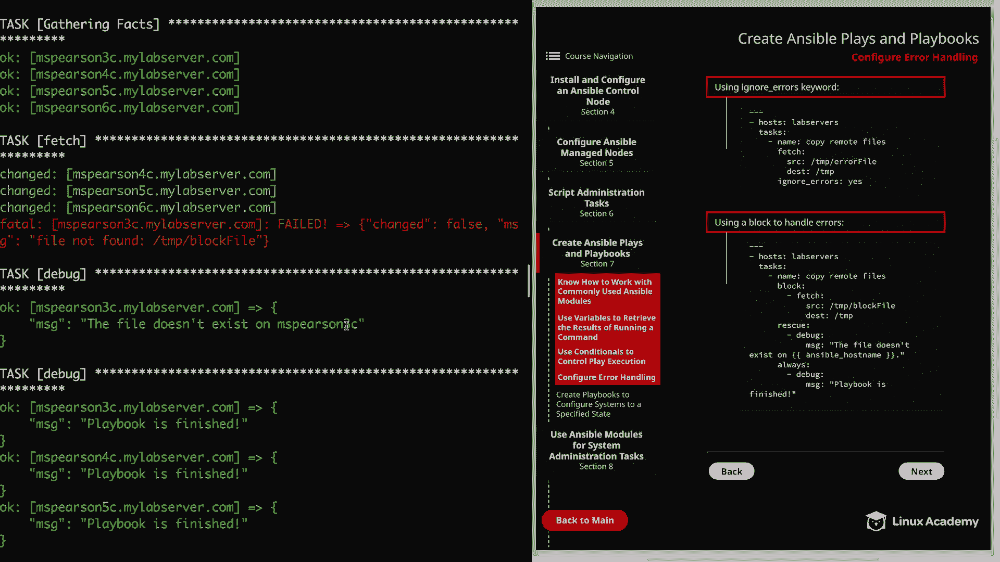

Which was just to output this message that the playbook is finished。

 so you see that that runs for each of the host in the La server group。

And this was really just a simple example to show how you can use a block in order to define a group of tasks and then also use the rescue keyword in order to handle errors within that block。

 And， of course， you may have a situation where you want something to always run regardless。

 And so that's what you're going to use that always keyword for。

 So the last thing that I want to do is just head to our temp directory just to validate that we got the files that we were looking for。

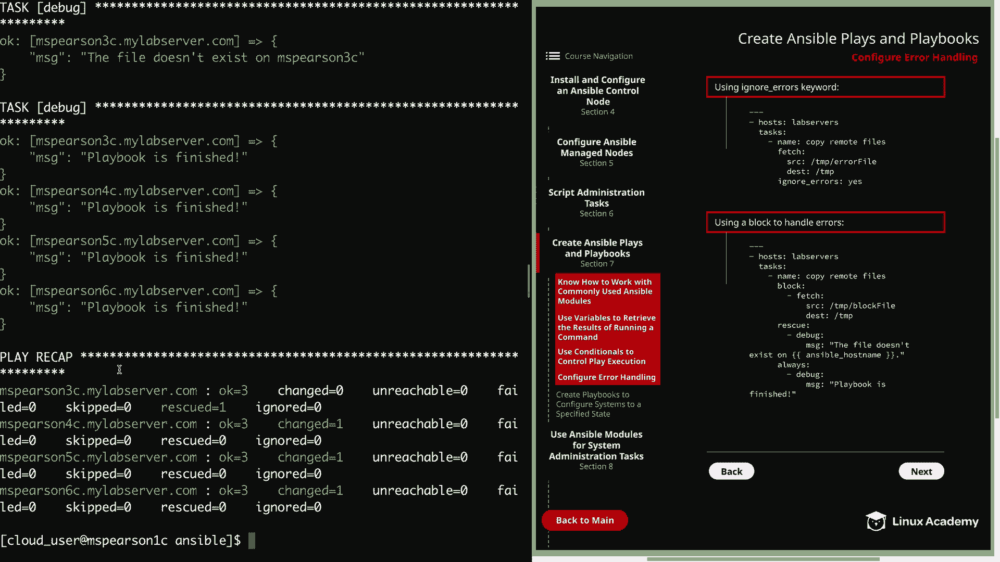

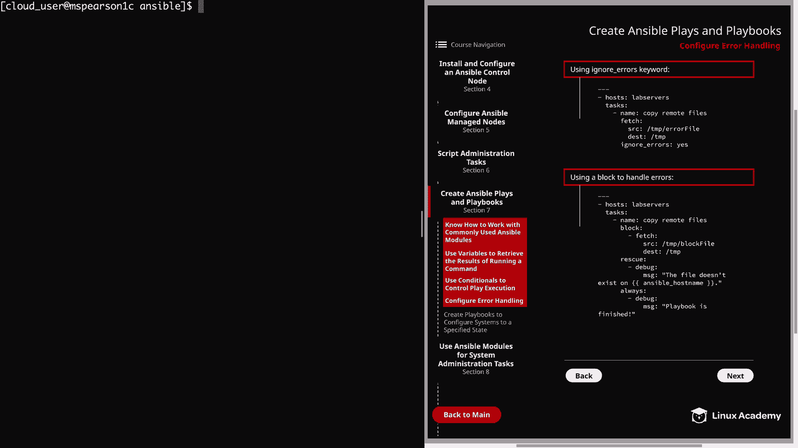

And so you're going to see at the top of this， we have three directories， which is MS Pearson，4 C。

5 C and 6 C。 Let's go ahead and C D into M Pearson 4 C。

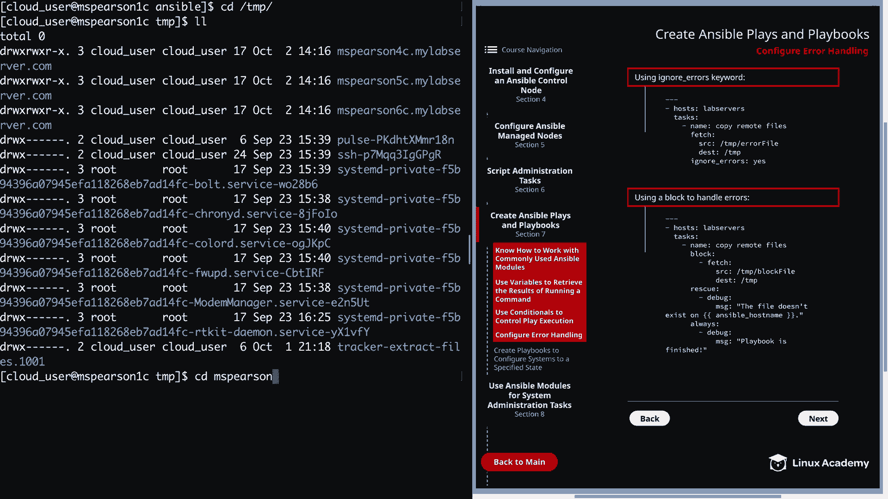

We'll do a listing。And so whenever the fetch module runs， whatever destination you give it。

 it's going to put the entire directory structure from the file that you are fetching。

 So as you can see， it created the host name， which was MSs Pearson 4 C。

 and then within that we have the temp directory。Let's go ahead and do a listing on T。

And you see that we have the block file that was pulled down from the last playbook we just did。

 and then the error file was also pulled down from the first playbook。All right， well。

 that's going to wrap up this video。 There is， of course。

 a lot of really cool stuff you can do with error handling。

 so feel free to play around with that and check it out。

 But now you can go ahead and mark this complete and we will move on to the next lesson。😊。

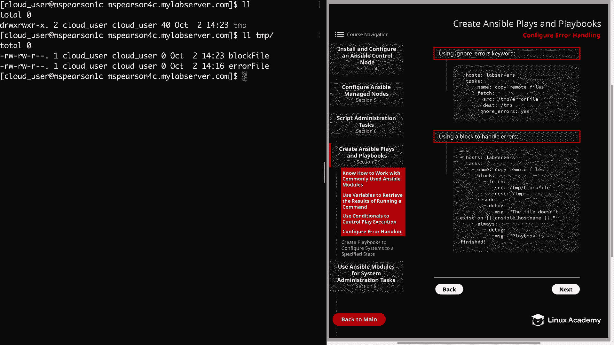