# Ansible 错误处理：P29：配置错误处理 🛠️

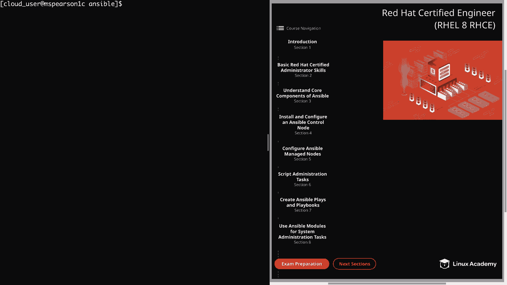

在本节课中，我们将学习如何在 Ansible 剧本中配置错误处理。错误处理是编写健壮剧本的关键，它允许我们控制任务失败时剧本的行为，确保自动化流程的稳定性和可预测性。

## 概述

默认情况下，Ansible 在遇到任务失败时会停止在该主机上执行后续任务。然而，在实际场景中，我们可能需要更灵活的处理方式，例如忽略某些预期的错误、强制运行处理器，或者在失败时执行特定的恢复操作。本节将介绍 Ansible 提供的多种错误处理机制。

## 核心概念与关键词

以下是 Ansible 中用于错误处理的核心关键词及其功能：

*   **`ignore_errors`**：忽略任务失败，允许剧本继续执行。
*   **`force_handlers`**：即使有任务失败，也强制运行所有已通知的处理器。
*   **`failed_when`**：自定义任务失败的条件。
*   **`changed_when`**：手动覆盖任务的“已更改”状态。
*   **`any_errors_fatal`**：如果任何主机上的任务失败，则中止整个剧本。
*   **`block`， `rescue`， `always`**：将任务分组为逻辑块，并提供结构化的错误处理。

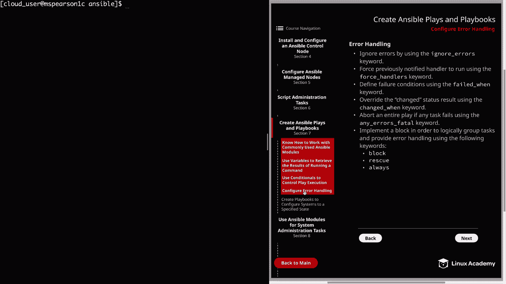

上一节我们介绍了错误处理的基本概念，本节中我们来看看如何使用 `ignore_errors` 和 `block` 结构来处理错误。

## 实践演示：忽略错误

首先，我们创建一个剧本，演示如何使用 `ignore_errors` 关键字来忽略特定任务的失败。

以下是使用 `ignore_errors` 的示例剧本：

```yaml
---
- hosts: lab_servers
  tasks:
    - name: 复制远程文件
      fetch:
        src: /tmp/error_file
        dest: /tmp
      ignore_errors: yes
```

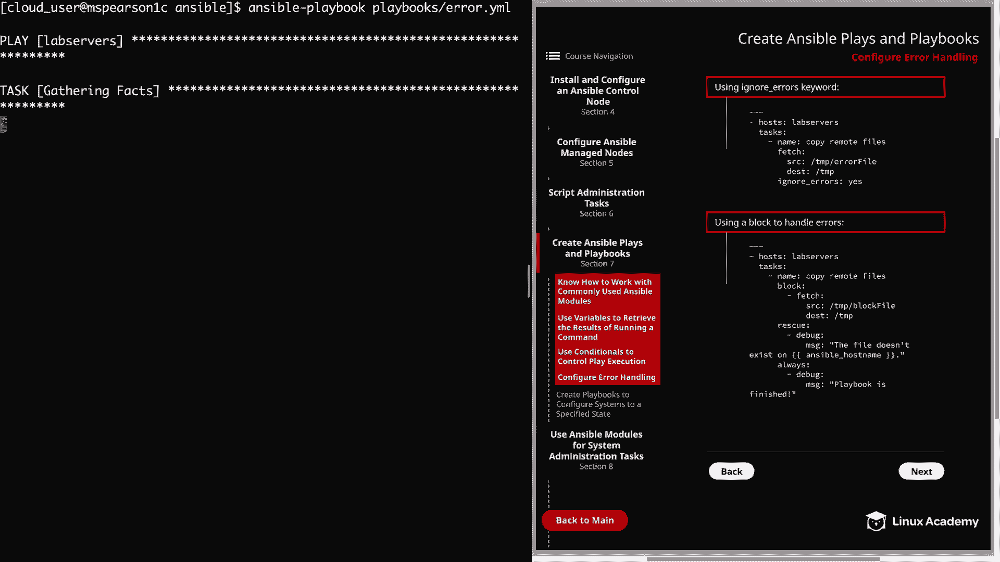

在这个例子中，`fetch` 模块尝试从远程主机的 `/tmp/` 目录复制一个名为 `error_file` 的文件。如果文件不存在（例如在主机 `mspearson3` 上），任务通常会失败。通过设置 `ignore_errors: yes`，即使任务失败，Ansible 也会继续执行，并将失败状态标记为“已忽略”而非“失败”。

运行此剧本后，对于拥有文件的主机，状态显示为“已更改”；对于文件不存在的主机，状态显示为“已忽略”，剧本继续执行完毕。

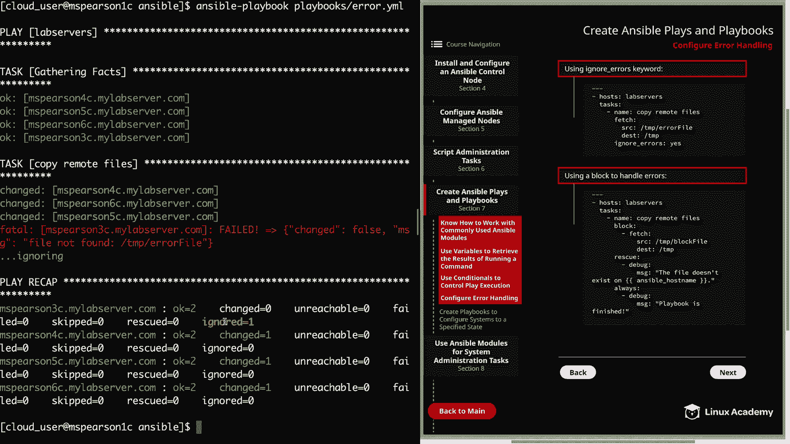

## 实践演示：使用 Block 处理错误

接下来，我们看看如何使用 `block`、`rescue` 和 `always` 来构建更结构化的错误处理逻辑。

以下是使用 `block` 的示例剧本：

```yaml
---
- hosts: lab_servers
  tasks:
    - name: 复制远程文件
      block:
        - name: 获取文件
          fetch:
            src: /tmp/block_file
            dest: /tmp
      rescue:
        - name: 文件不存在时的处理
          debug:
            msg: "文件在 {{ ansible_hostname }} 上不存在"
      always:
        - name: 总是执行的任务
          debug:
            msg: "剧本执行完毕"
```

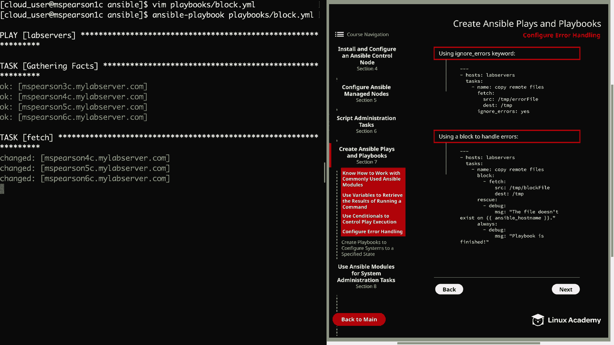

在这个结构中：
1.  **`block`**：定义了要执行的主要任务（获取文件）。
2.  **`rescue`**：如果 `block` 中的任何任务失败，则执行这里的任务（打印调试信息）。
3.  **`always`**：无论 `block` 成功还是失败，最后都会执行这里的任务（打印结束信息）。

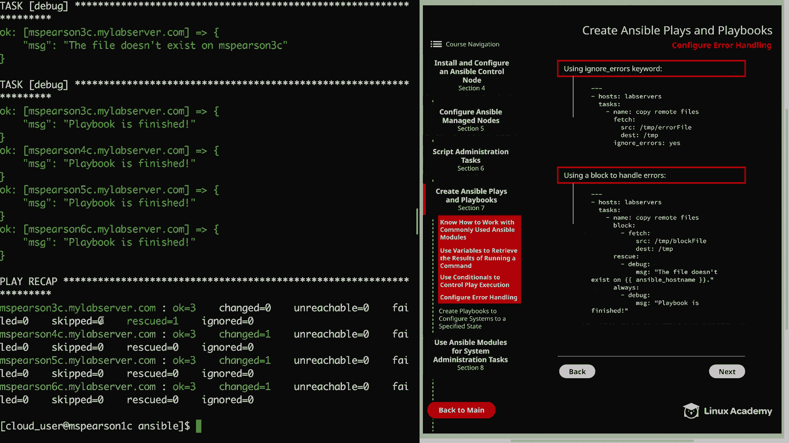

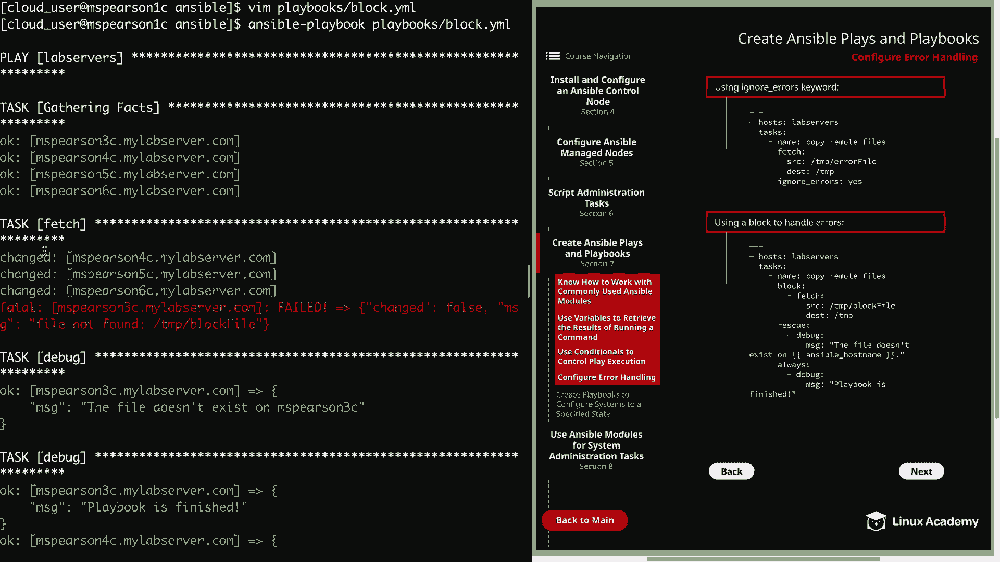

运行此剧本时，对于文件存在的主机，`block` 成功执行；对于文件不存在的主机（如 `mspearson3`），`block` 失败，触发 `rescue` 块中的任务，最后所有主机都会执行 `always` 块中的任务。在结果汇总中，被救援的任务不会显示为“失败”。

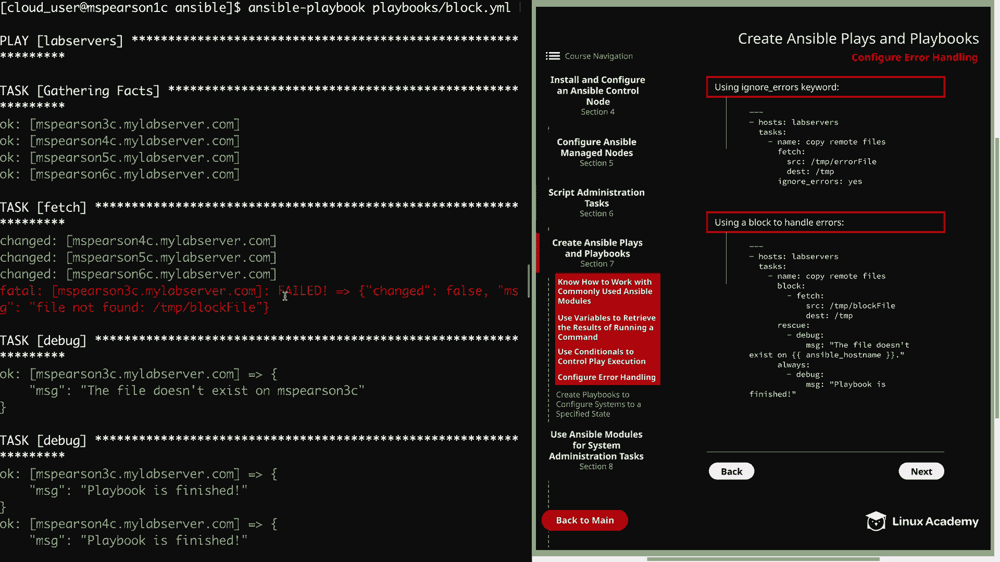

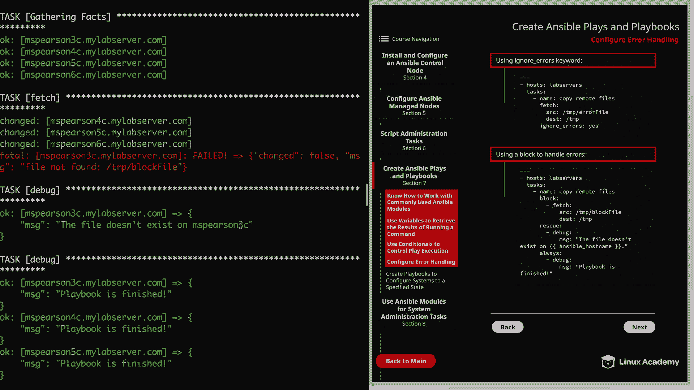

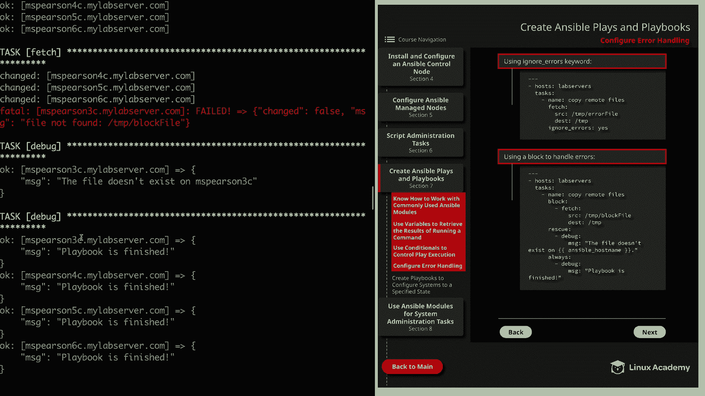

## 验证结果

执行完上述剧本后，我们可以检查本地 `/tmp/` 目录来验证文件是否被成功拉取。`fetch` 模块会在目标路径下创建以主机名命名的目录，并保留远程文件的完整路径结构。

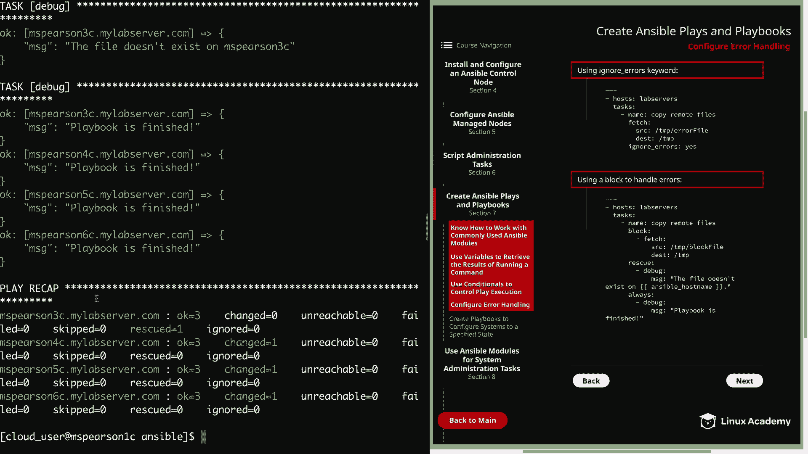

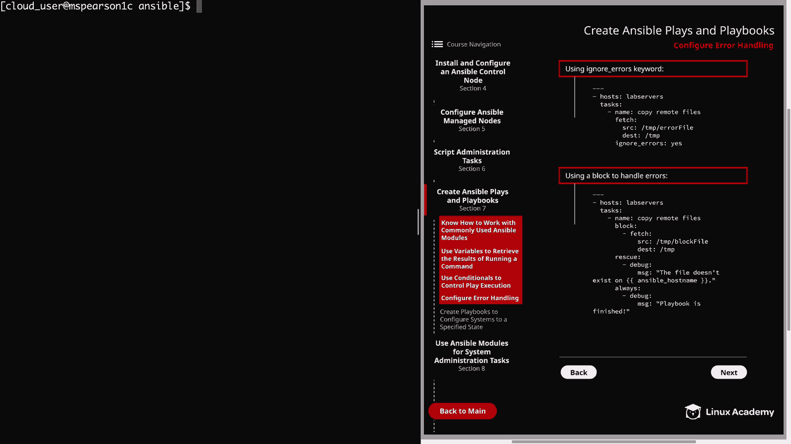

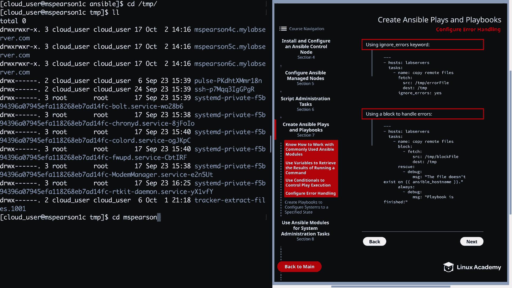

例如，进入 `/tmp/mspearson4c/tmp/` 目录，可以看到成功拉取下来的 `block_file` 和之前拉取的 `error_file`。

## 总结

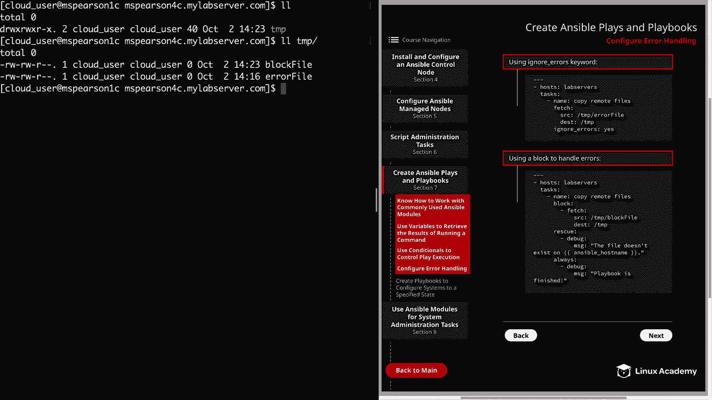

本节课中我们一起学习了 Ansible 中配置错误处理的几种关键方法。我们了解了如何通过 `ignore_errors` 忽略非关键错误，以及如何利用 `block`、`rescue` 和 `always` 构建强大的、结构化的错误处理流程，从而编写出更健壮、更可靠的自动化剧本。掌握这些技巧对于应对复杂的部署场景至关重要。