# Red Hat Certified Engineer (RHEL 8 RHCE) - P30：388-4872-5 - Create Playbooks to Configure Systems to a Specified State - 11937999603_bili - BV12a4y1x7ND

Welcome back， everyone。 This is Matt。 And in this video， we're going to finish up Section 7。

 which is create Ansible plays and playbooks。 And what we're going to do is put together a lot of the things we've learned into a large playbook and then execute that against our managed nodes。

 So let's head over to Section 7。😊。

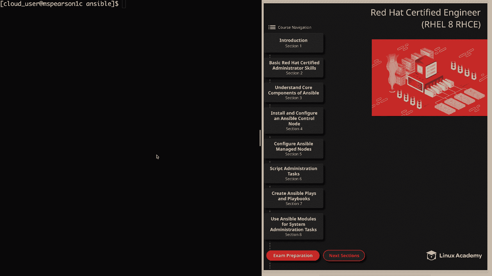

And then the final lesson， which is create playbooks to configure systems to a specified state。

 So in our diagram， I have provided the example playbook that we're going to be creating and then running。

But before we get into creating our playbook， I did want to show you Im in my working directory and I've also created a template file within a template directory that I created。

It's just called index dot J2。And this is just a simple index。

t HTML that's choosing the Ansipible host name variable in order to display the host name of the server that we're hitting。

And this is going to come into play on the task that we're using the template module for。

 but I just want to show you that I already created that， so if you're following along。

 feel free to go ahead and create that as well。And now we can go ahead and get started。

So within playbooks， I'm just going to create a playbook that is called deploy。yml。

And to get it started， we're going to start off with our three dashes。

And then the first play that we're going to create is going to run against our web servers group。

We're going to be doing some privilege tasks so we're going to become and set that to yes。

And then we can define our tasks。So the first task is going to be installing Apache。For that。

 we're going to use the young module。I'm going to specify the name of the package， which is HttPD。

And then for state， we're going to use latest。We're going to come back and run another task。

And the description for this is going to be create user and add them to the Apache group。

It's actually going to be create users。And add them to the Apache group。So for that。

 we're going to use the user module。And for name， we're actually going to be performing a loop。

 So we're going to put in our variable。Which is item。

We're also going to specify groups so we can add these users to the Apache group。

then we'll come back to the same indentation as user。 we're going to specify loop。

And then we'll define the items in that loop， which is going to be will。And then， miles。

Then we have another task。And this is to create the index dot HTML。And for this。

 we're going to use the template module， so we're actually going to be pushing out that template that we created。

So the source is going to be home。Cloud_ user， Ansible。And then templates。And then index dot J2。

And then for destination， and this is where it's going to be going on our manage nodes。Far Www HTML。

of course， index do HTML。And we want this file to be owned by Apache。And also， the Apache group。

AndFor permissions， we're going to set this to0644。

And then our last task is going to be starting and enabling。The HtTPD service。

We use the service module。Name is HttPD。State is going to be started。

And then enabled is going to be set to yes。And one thing that we could have done with this playbook is add a handler in so that way if we updated something like the HttPd。

com， then it would kick off a restart， but for this example。

 we're just going to make sure that the service is started and enabled。

 but just keep in mind that that is something you can do especially if you want to make your playbook item potent。

 which is what is recommended to do for all playbooks that way you can run it as many times as you want and you're always going to get the same results。

But in this playbook， we're not updating the configuration file。

 so we're just going to keep it as is。And also while we're on the subject。

 one great thing about playbooks is you can build out a playbook that you think is going to handle all your needs。

 but then you realize that you actually need something else to get your machines to a specified state。

And the great thing about having a base playbook is you can always add to it to make sure that it meets your specifications。

 Alright， so that's going to finish out this play for the Web servers group。

 but we're not finished quite yet。 So let's head over to the next page。😊。

And now we're going to configure another play that's going to run against our DB servers group。

So let's go back to the command line。This time， the host group will be DB servers。Again。

 we're going to become the root user。And now we can specify our tasks。

So the first thing that we want to do is install PostresqL。We'll use the young module。

Name is going to be post GesqL。Dash server。Then state is going to be latest。

And then in order to start up and use our Postgresql database， we need to initialize the Db cluster。

SoWe'll say name and we'll just say initialize Db cluster。For this。

 we're going to use the command module， and this is going to allow us to run user bin。Postreql。

Set up， and then we'll pass it a net Db。And then we can create our database users。

We'll use the user module。And the name， again， we're going to use a loop。 So we're going have our。

Item variable。And for groups， we want to add these users to the Postgres group。

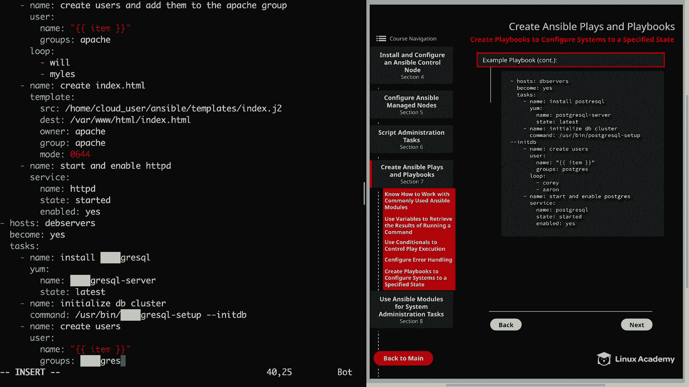

And we're going to create a loop。

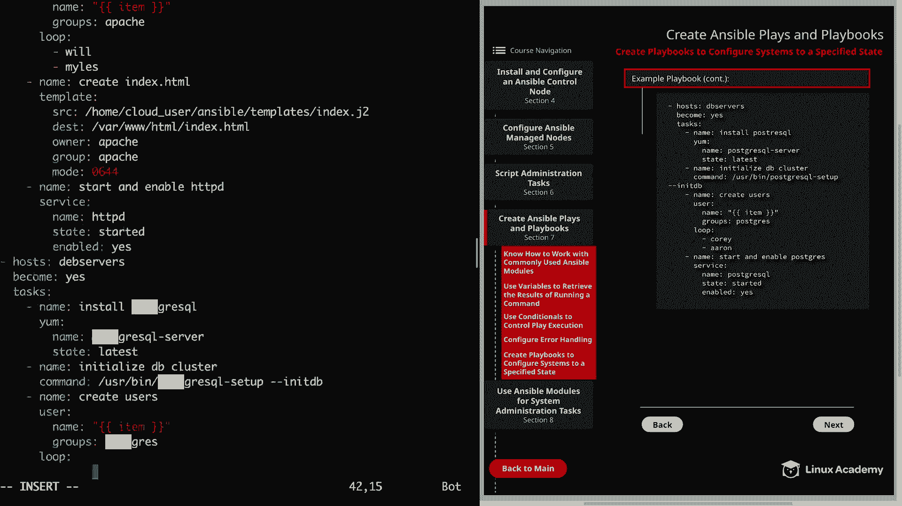

And then specify our users。This is going to be Cory。And， Aaron。We're going to come back。

And our final task is going to be starting and enabling the Postgres service。So start and enable。

Postgres。We'll use the service module。The name of the service is Post rescuescuL。

And the state is started。And enabled is going to equal， yes。All right， now before we save and quit。

 I'm going to take a quick look over this。And after just a quick scan。

 I noticed that for my host set that to Deb servers。

So I guess would be fine if they're running Deian， which they're not。Now we have it as Db servers。

Let's scrollcro down just a bit more。

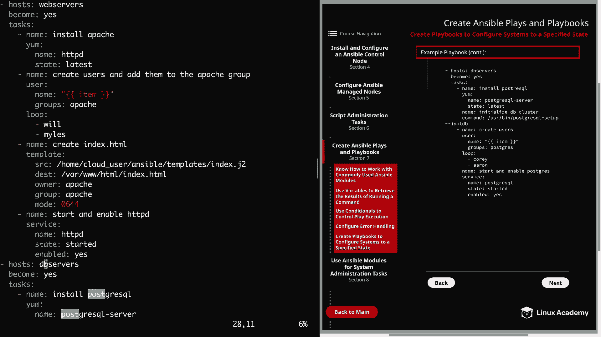

And everything looks fine off the bat， but if we run into issues。

 we can always troubleshoot those together。And the last thing I wanted to mention before we save is that you can always add in blocks in order to group your taologically。

 which as we learned in the last video is a great way to handle any errors that you might encounter。

 So now let's go ahead and save this and quit。Take a deep breath and then we can run our playbook。

It's going to be playbook and then deploy do YMl。All right， here we go。

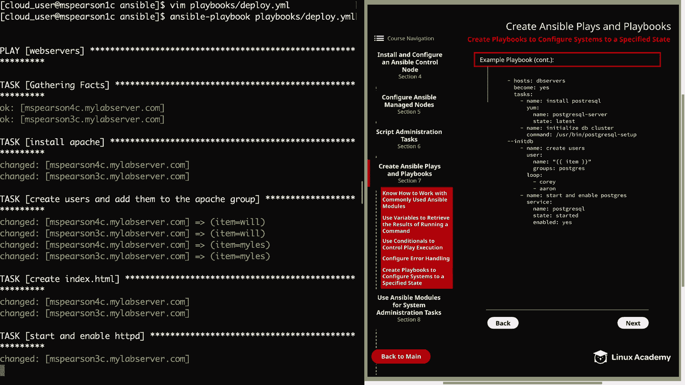

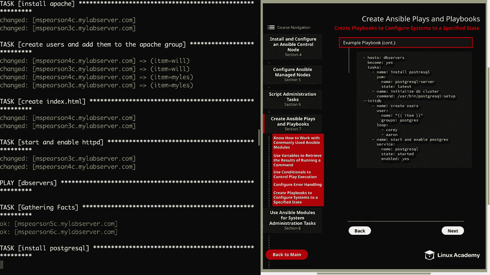

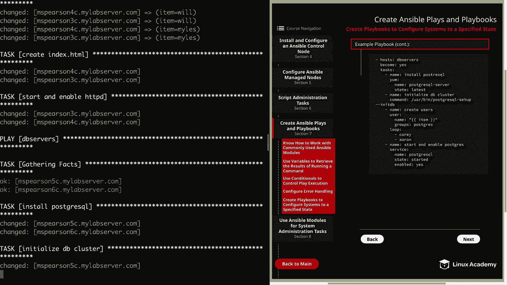

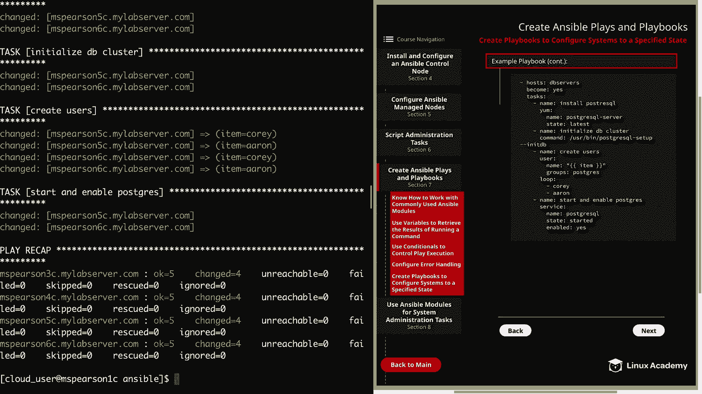

And if you can believe it， our playbook completed successfully。

 So let's just walk through this real quick。

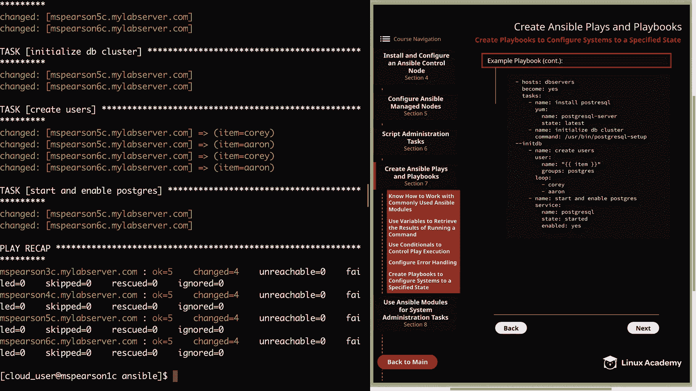

As you can see it's going to start off our first play， which executing it's a web service group。

 it's going to gather our facts。

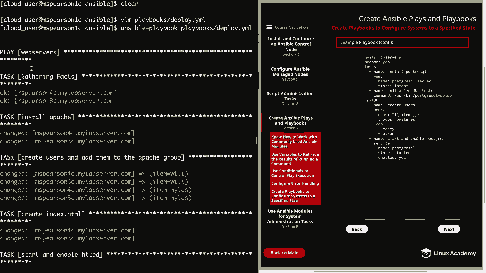

Then it installs Apache on MSParson 4 and 3。

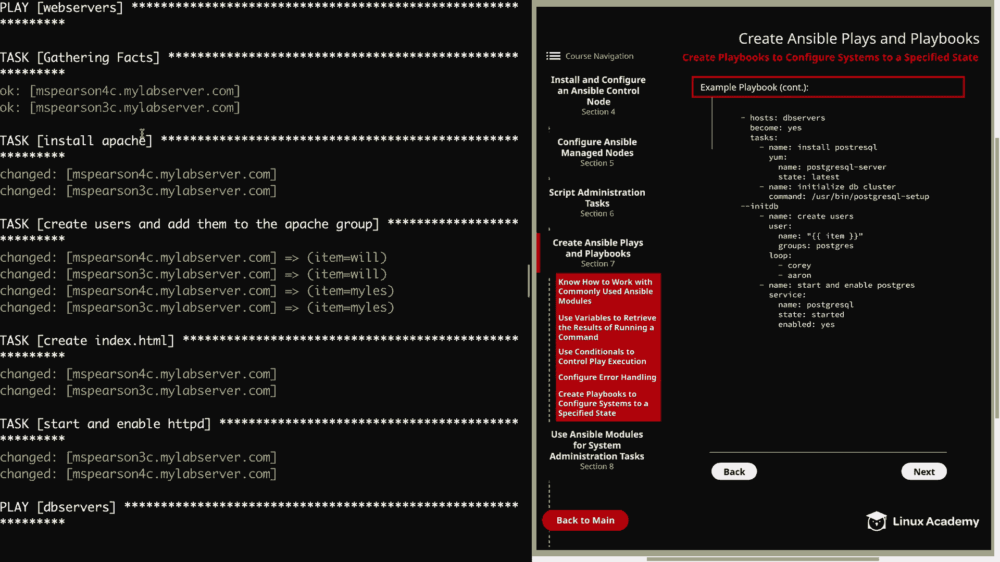

It also creates our two users， Will and Miles。

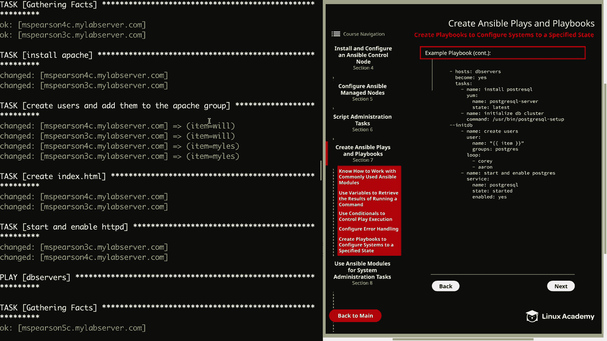

And then we use the template module to create the index dot HTML。

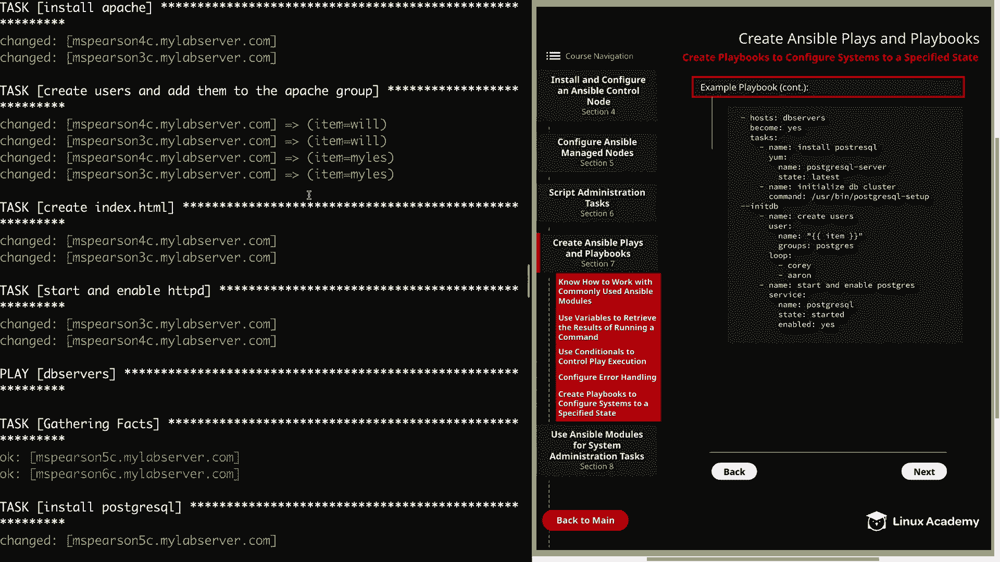

And then we start and enable HtTPD。 And so that finishes out our first play。

 and then our second play， executing against the DB server group。

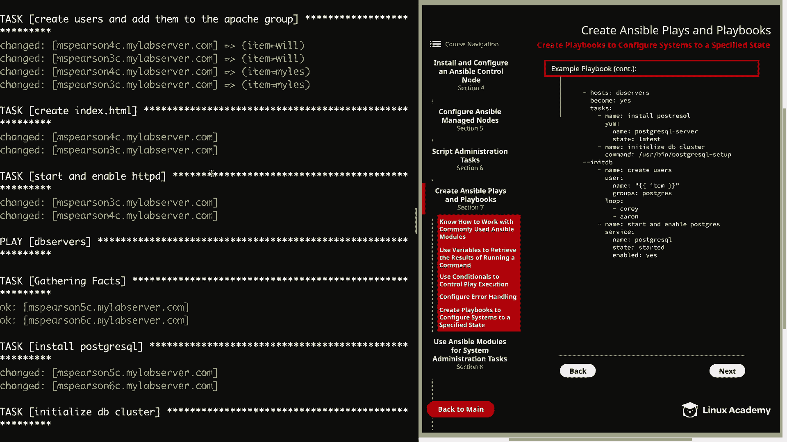

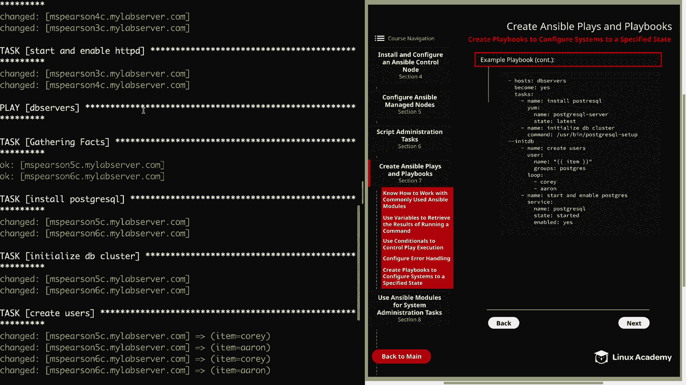

It's going to gather facts。And then install Postresql。

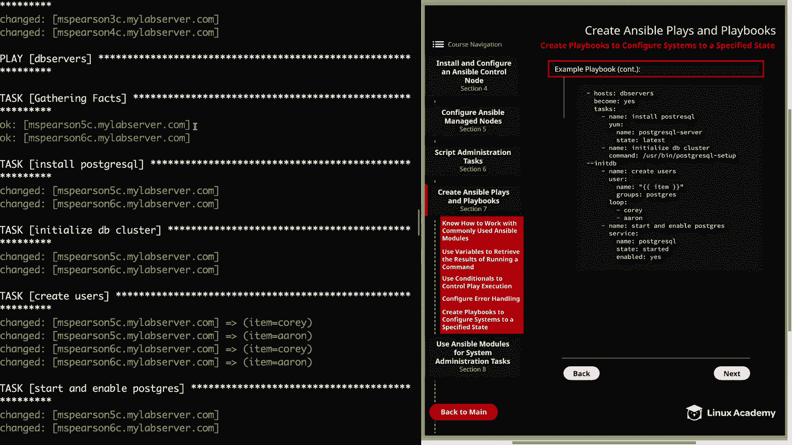

Then we're going to initialize the Db cluster。And then create our users。

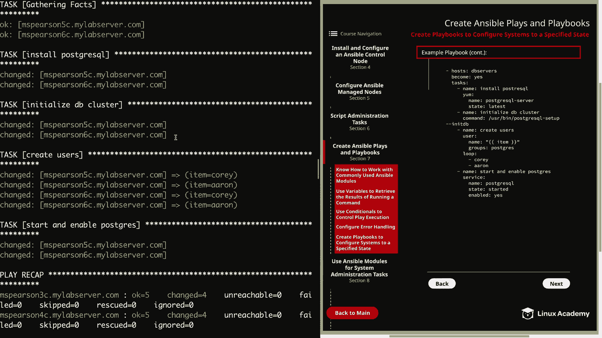

You can also add them to the Postgre group。

And then finally， start and enable Postgres。Well， that's going to finish up this lesson on createate playbooks to configure systems to a specified state。

 so let's go ahead and mark it complete and then we can move on to using ansible modules for system administration tasks。

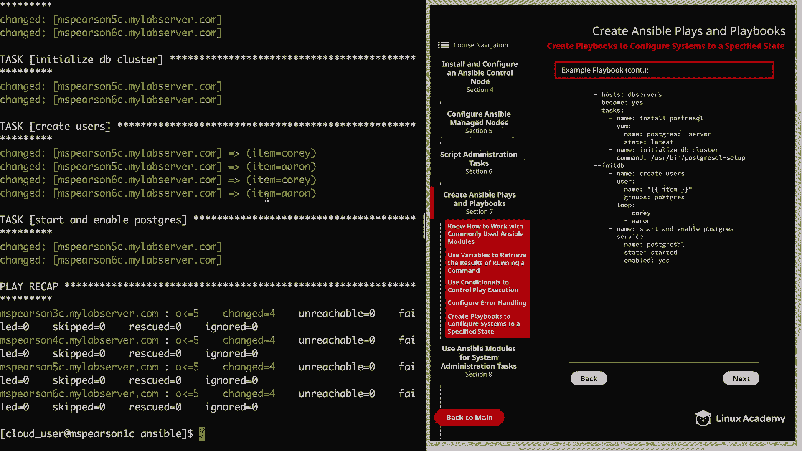