# Ansible 实战教程：P30：创建Playbook以配置系统至指定状态 🚀

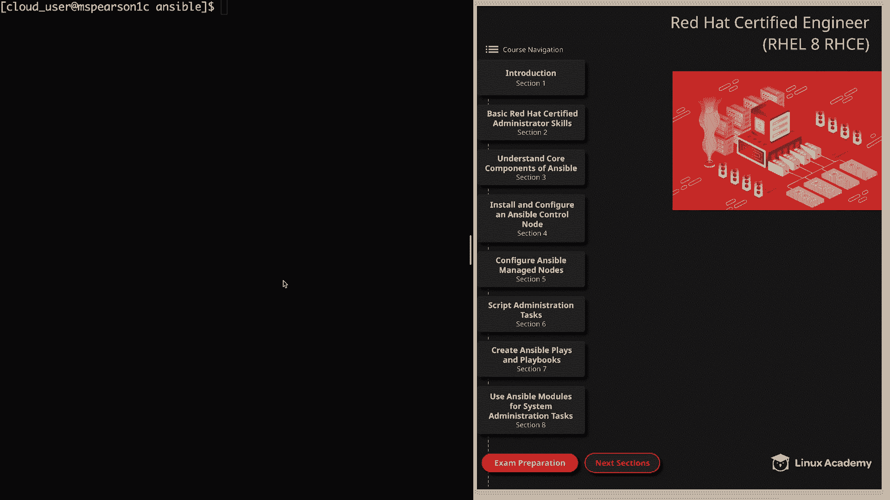

在本节课中，我们将综合运用之前学到的知识，创建一个大型的Playbook，并针对我们的受管节点执行它。我们将通过一个具体的例子，学习如何编写一个包含多个任务和针对不同主机组的Playbook，以实现系统的自动化配置。

## 准备工作

在开始创建Playbook之前，我已经在工作目录中创建了一个模板文件。该文件位于我创建的 `templates` 目录下，名为 `index.j2`。这是一个简单的HTML索引文件，它使用了Ansible的 `hostname` 变量来显示所访问服务器的主机名。这个模板将在我们使用 `template` 模块的任务中发挥作用。如果你正在跟随操作，请也创建这个文件。

现在，我们可以开始创建Playbook了。

## 创建Playbook：`deploy.yml`

在 `playbooks` 目录下，我将创建一个名为 `deploy.yml` 的Playbook。首先，我们用三个短横线开始。

### 针对Web服务器组的第一段Play

第一段Play将针对我们的 `web_servers` 主机组执行。由于需要执行特权任务，我们将设置 `become: yes`。

以下是任务列表：

*   **安装Apache**：我们将使用 `yum` 模块。指定包名为 `httpd`，状态设置为 `latest`。
    ```yaml
    - name: Install Apache
      yum:
        name: httpd
        state: latest
    ```

*   **创建用户并加入Apache组**：我们将使用 `user` 模块，并通过循环创建多个用户。用户名为循环变量 `item`，并将用户添加到 `apache` 组。
    ```yaml
    - name: Create users and add them to the Apache group
      user:
        name: "{{ item }}"
        groups: apache
      loop:
        - will
        - miles
    ```

*   **创建index.html文件**：使用 `template` 模块推送我们之前创建的模板。源文件路径是 `/home/cloud_user/ansible/templates/index.j2`，目标路径是受管节点上的 `/var/www/html/index.html`。我们将设置文件所有者为 `apache`，所属组也为 `apache`，权限为 `0644`。
    ```yaml
    - name: Create the index.html
      template:
        src: /home/cloud_user/ansible/templates/index.j2
        dest: /var/www/html/index.html
        owner: apache
        group: apache
        mode: '0644'
    ```

*   **启动并启用HTTPD服务**：使用 `service` 模块。服务名为 `httpd`，状态设置为 `started`，并设置 `enabled: yes`。
    ```yaml
    - name: Start and enable the HTTPD service
      service:
        name: httpd
        state: started
        enabled: yes
    ```

关于此Playbook，有几点需要说明：我们可以添加一个处理器（handler），以便在更新 `httpd.conf` 等配置文件时触发服务重启。但在此示例中，我们只是确保服务已启动并启用。请记住，使Playbook具备**幂等性**是推荐的做法，这样无论运行多少次都能得到相同的结果。由于本Playbook不更新配置文件，我们保持现状即可。

另外，Playbook的一个优点是，你可以构建一个你认为能满足所有需求的Playbook，但之后可能会发现需要添加其他内容才能使机器达到指定状态。拥有一个基础Playbook的好处在于，你总是可以对其进行增补以满足规范。

至此，针对Web服务器组的Play就完成了，但我们还没有完全结束。

### 针对数据库服务器组的第二段Play

现在，我们将配置另一段Play，针对我们的 `db_servers` 主机组执行。

回到命令行，这次主机组是 `db_servers`。同样，我们将成为root用户。

以下是任务列表：

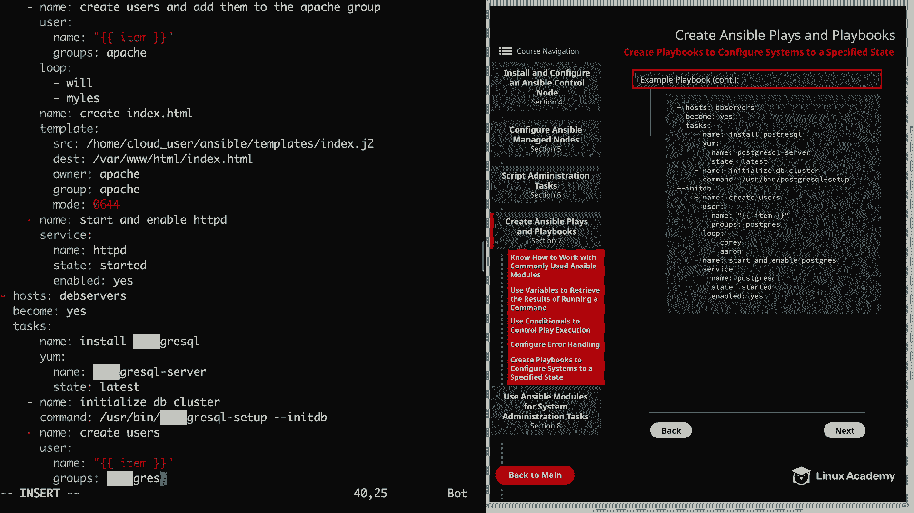

*   **安装PostgreSQL**：使用 `yum` 模块。包名为 `postgresql-server`，状态为 `latest`。
    ```yaml
    - name: Install PostgreSQL
      yum:
        name: postgresql-server
        state: latest
    ```

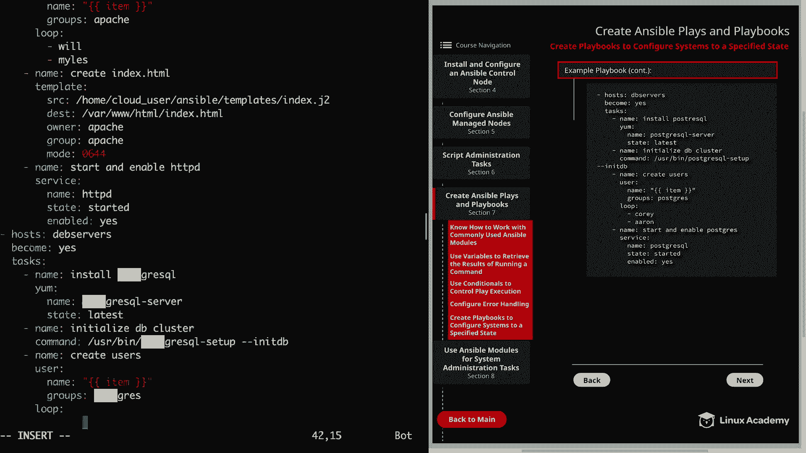

*   **初始化数据库集群**：为了启动和使用PostgreSQL数据库，我们需要初始化数据库集群。使用 `command` 模块运行 `/usr/bin/postgresql-setup --initdb` 命令。
    ```yaml
    - name: Initialize DB cluster
      command: /usr/bin/postgresql-setup --initdb
    ```

*   **创建数据库用户**：使用 `user` 模块，并通过循环创建用户。用户名为循环变量 `item`，并将用户添加到 `postgres` 组。
    ```yaml
    - name: Create database users
      user:
        name: "{{ item }}"
        groups: postgres
      loop:
        - cory
        - aaron
    ```

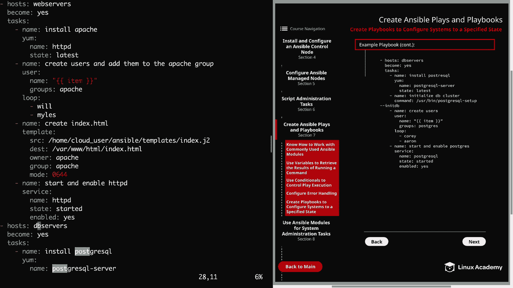

*   **启动并启用Postgres服务**：使用 `service` 模块。服务名为 `postgresql`，状态设置为 `started`，并设置 `enabled: yes`。
    ```yaml
    - name: Start and enable Postgres
      service:
        name: postgresql
        state: started
        enabled: yes
    ```

在保存并退出之前，我快速检查了一下。我注意到主机组写成了 `deb_servers`，这显然是个笔误，已更正为 `db_servers`。快速浏览后，其他内容看起来没问题。如果在运行中遇到问题，我们可以一起排查。

最后，在保存之前我想提一下，你总是可以使用 `block` 来按逻辑分组你的任务，正如我们在上一个视频中学到的，这是处理可能遇到的错误的好方法。

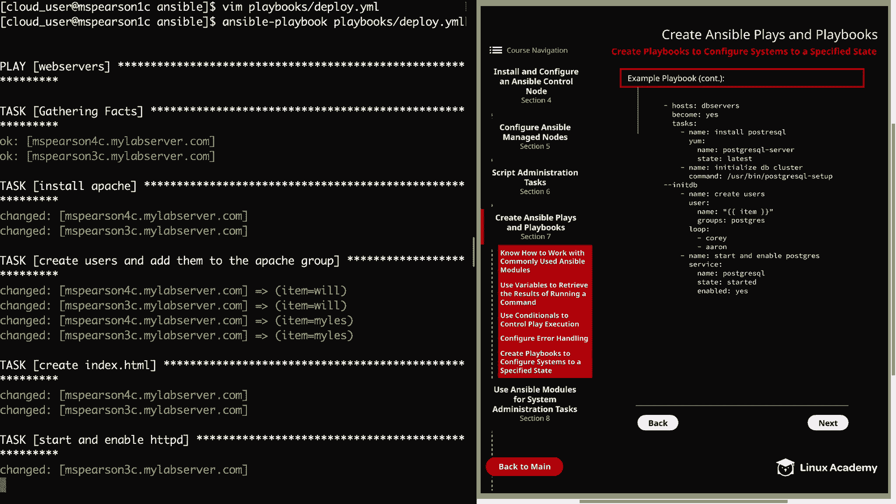

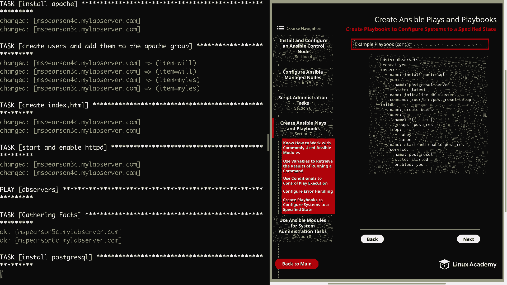

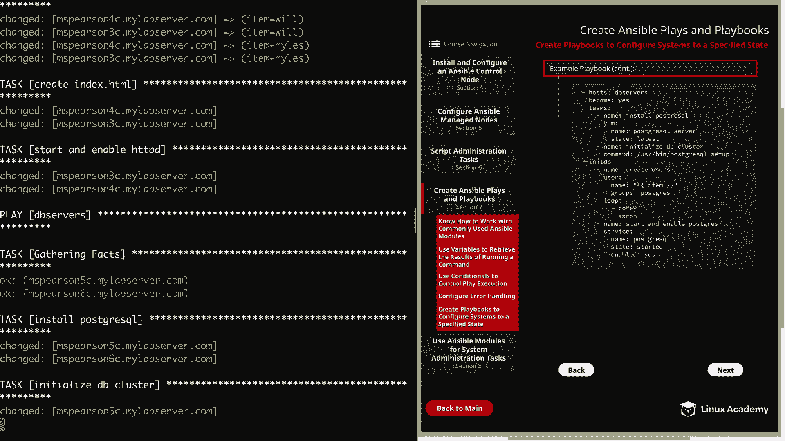

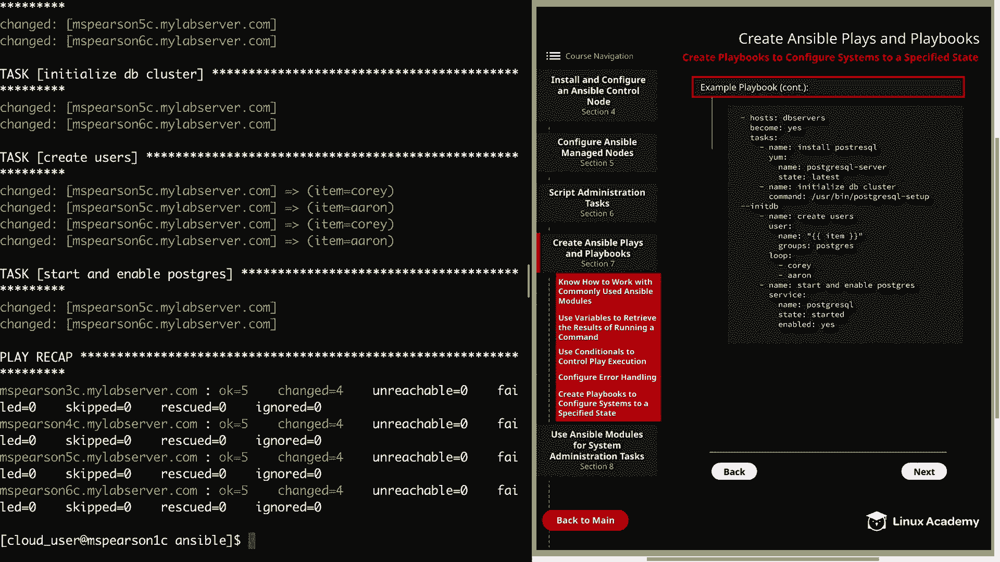

现在，让我们保存并退出。深呼吸一下，然后就可以运行我们的Playbook了。

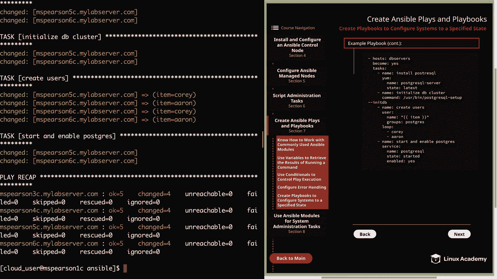

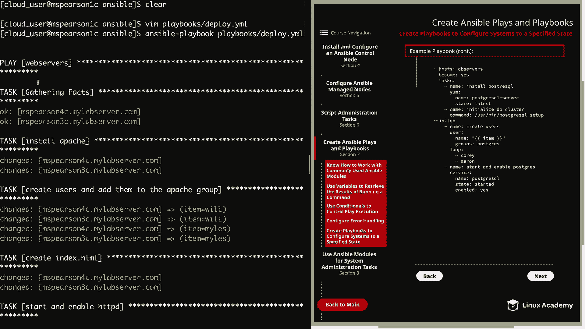

## 运行Playbook

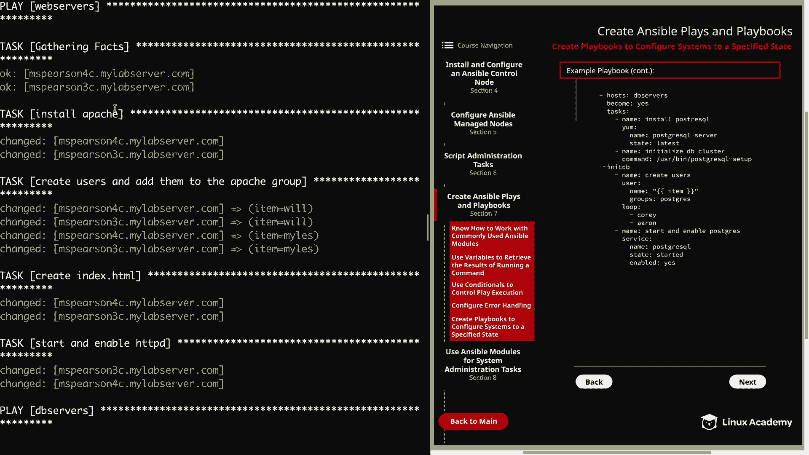

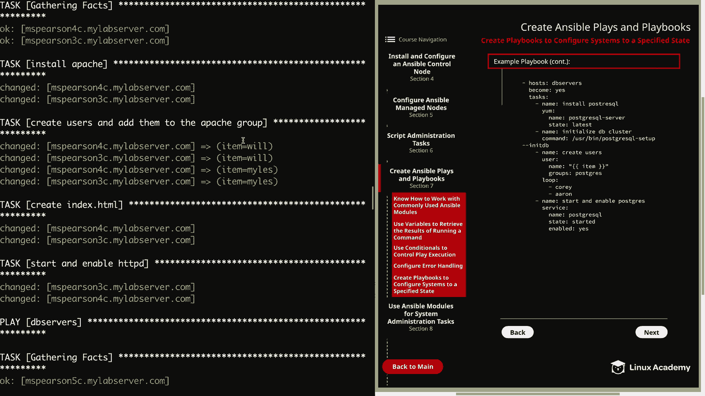

运行命令：`ansible-playbook deploy.yml`

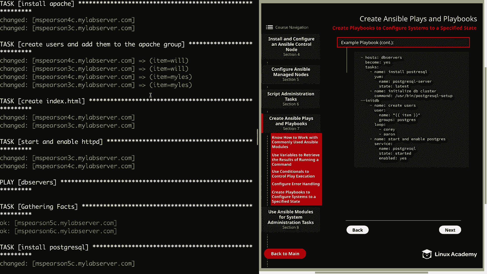

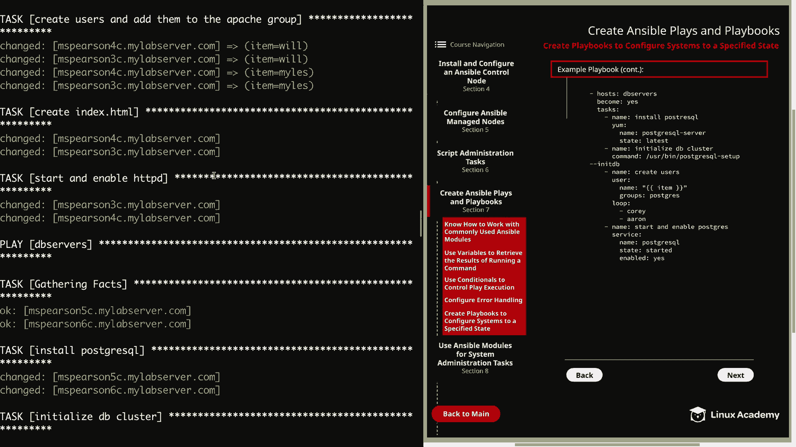

我们的Playbook成功完成了！让我们快速回顾一下执行过程：

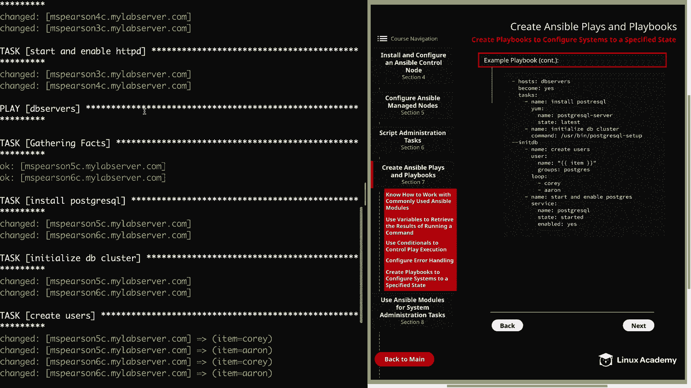

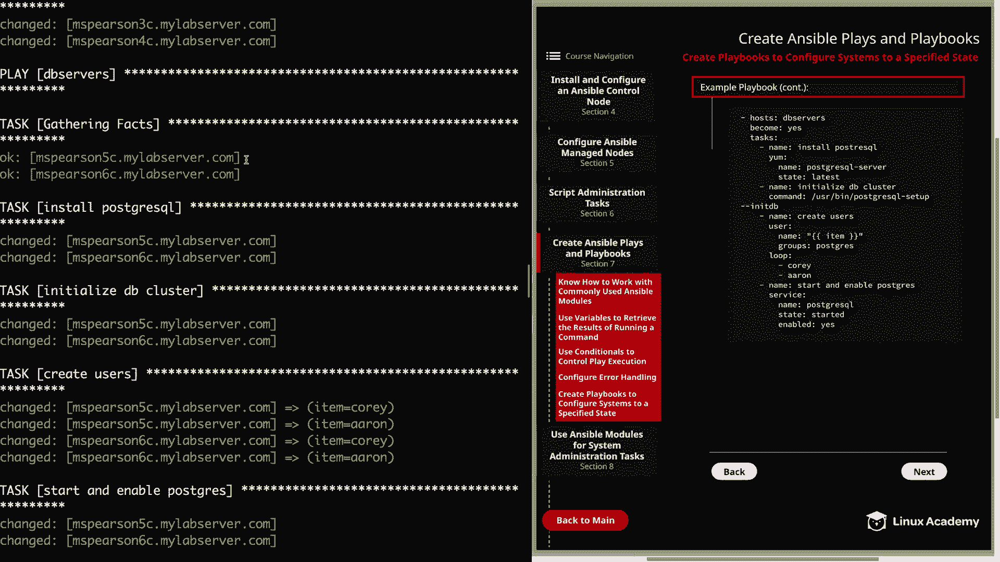

*   首先执行针对 `web_servers` 组的Play：收集事实（Gathering Facts），然后在节点上安装Apache，创建用户Will和Miles，使用模板模块创建 `index.html`，最后启动并启用HTTPD服务。
*   接着执行针对 `db_servers` 组的Play：收集事实，安装PostgreSQL，初始化数据库集群，创建用户Cory和Aaron（并将他们添加到postgres组），最后启动并启用Postgres服务。

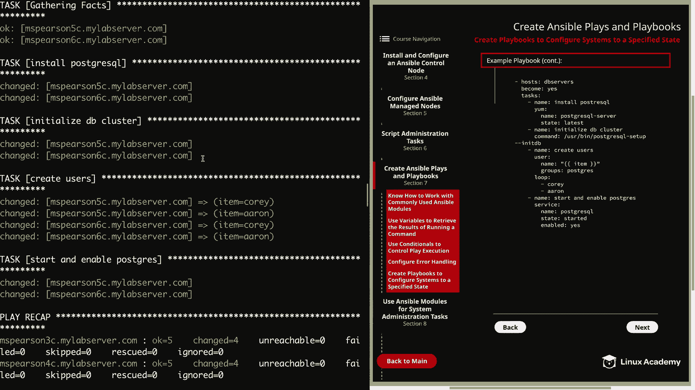


## 总结

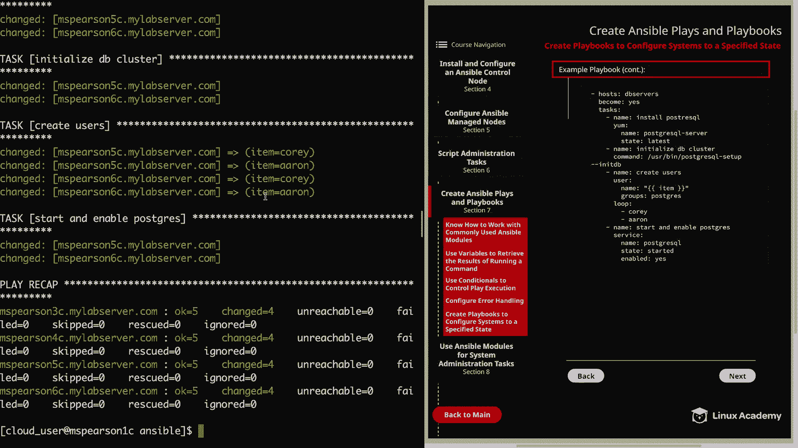

本节课中，我们一起学习了如何创建一个复杂的Ansible Playbook来将系统配置到指定状态。我们实践了针对不同主机组定义多段Play，使用了包括 `yum`、`user`、`template`、`command` 和 `service` 在内的多个核心模块，并通过循环处理多项类似任务。这个过程展示了如何将零散的任务组织成一个完整、可重复执行的自动化配置方案。掌握创建和运行此类Playbook是进行高效系统配置和管理的关键步骤。