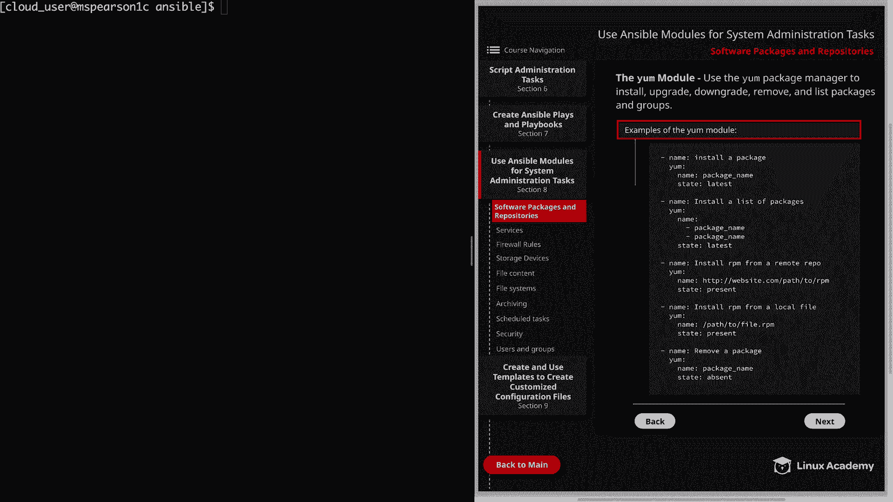
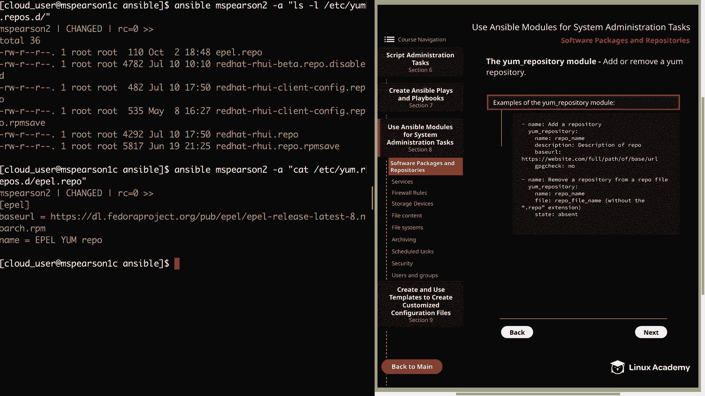
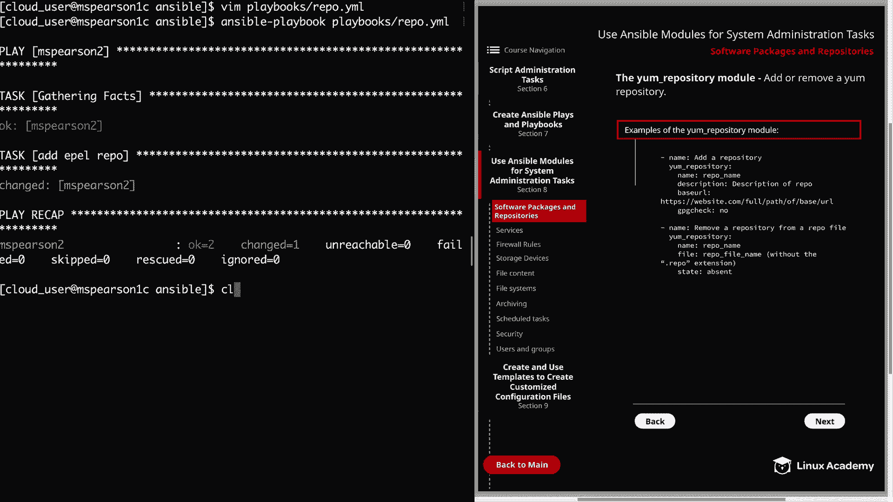
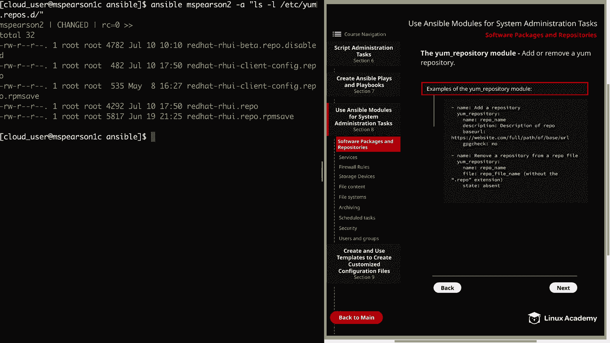

# Red Hat Certified Engineer (RHEL 8 RHCE) - P31：388-4873-1 - Software Packages and Repositories - 11937999603_bili - BV12a4y1x7ND

Welcome back everyone， this is Matt and this video is going to kick off section 8。

 which is going to cover ansible modules that are used for system administration tasks。

The first of this is going to be software packages and repositories。

 so let's go ahead and click on section 8， and that is going to bring us to the first subsection。

So the U module uses the young package manager to install， upgrade， downgrade。

 remove and list packages and groups。In the diagram。

 I've provided some examples of a few different ways you can use the module。Of course， first。

 you can specify what the module is trying to do， followed by the actual name of the module。

 which is yM。And this particular example is just going to install a single package。

 so we're going to give the name of the package in the first state we'd say latest。

And you could also use present here if you wanted to。

 And the main difference between present and latest is they're both going install the package if they don't see it。

 But using latest will not only check for the package。

 but it's also going to make sure that it's been updated to the latest version。

 So if you use present， it's just going to notice that the package is installed and then move on In the next example。

 we're showing how to install a list of packages。So all you would need to do for this is underneath name。

 put the list of packages with a dash。Now you could use a loop here if you wanted to。

 but according to the documentation， it is more efficient if you just list them here underneath name rather than going through a loop。

 but I did want to mention that that is something that is available。Next。

 we have an example of installing an RPM from a remote repo。

And all you would need to do is specify the URL for that RPpM。

You can also install an RPM from a local file， and in this case。

 all you have to do is provide the path to that RM file， and then lastly。

 you can also remove a package and to do that， you just provide the package name and then for state。

 you're going to want to use absent。Allright， so now let's head over to the command line。

And we're going to create a simple playbook that just installs some packages for us。

So let's go ahead and create a new playbook。We're just going to call it yum。yMl。Again。

 we'll start with our dashes。And then host specify MS Pearson 2。

 which kind of been our guinea pig host。And then become will equal yes because it will require escalated privileges。

Then Ta。We give our description。It's going to be install HttPD。We'll specify the module。

And the name of our module is HttPD。And the state is going to be latest。Allright。

 so let's go ahead and run that。And we say that our playbook ran successfully and we were able to install that single package onto MS Pearson 2。

Let's go ahead and open that up again， and this time let's add a few more packages so we can demonstrate installing multiple。

So under our name。I'm just going to say install packages。And then under name。

 we're going to clear this out。 We're going to come right underneath。

And I'm going to go ahead and keep HtTPD， and then I'm going to add a couple more。

Let's go ahead and install VSF TPD。Which is just very secure FTP。And then I can also install themm。

 which again is improve VI。And then the last thing that we're going to install is Firewall D。

And the reason I'm going to go ahead and install that is because we will need it in a later video。

 we're going over the firewall D module。 So now that we have our list， let's go ahead and save this。

We'llCl out our screen and we can go ahead and run our playbook。

It's going to be playbooks and then yum。yl。All right， so that ran successfully as well。

 so we're going to assume all our packages were installed properly。

But you can also use the list parameter with the value of installed。

 And that's going to give you a listing of all the packages that are installed on your machine。

 So before we move on to the next topic in this lesson。

 I did want to mention that this module will also allow you to install package groups。

 just like you can with yum or DNF。 And for that， all you would need to do is for the package name。

 specify the group name and quotes and make sure you add the a symbol in the front。Also。

 remember that even though you're using yum for Re8， it's actually using the DNF backend。

But there is also a DNF module， and it does provide some functionality that the y module does not。

 but for the basic installation of packages， the young module will be fine。

And now we can head to the next page。And this is going to be our final topic。

 which is the youngm repository module。And this is going to allow you to， as you might have guessed。

 add or remove a young repository。Alright， so I've also provided some examples for this module。

 as you can see， we're going to give the description under the name。

 and this is for adding a repository。 We'll specify the module， which is ym underscore repository。

And then you can use the name parameter in order to specify the repo name。

 and you can also provide a description。And then always important is the base URL。

 which allows you to provide the URL for the repository。

And then I've also added the GPG check parameter。 And that was mainly just so you could know that it is available。

 Next， we have an example of removing our repository from a repo file。So again。

 we'll specify our module and then the name of our repo and then the file that that repo exists in。

Make sure that you do this without the dot repo extension。And then the state is going to be absent。

 So let's head over to the command line。 and I'll show you an example of how to do this。

Let's go ahead and create a playbook。We're going to call this one repo。yMl。At our hashes。

And then host， I'm going to specify MS Pearson 2 yet again。Going to become， yes。

Then we can specify our tasks。So our description here would be add E Repo。

And then yum underscore repository。And now we can specify our parameters。

So we're going to give the name of the repo and the repo that we're going to be adding is the E repo。

And then for description， we'll just say apple， yum， repo。And then we need to provide the base URL。

And I'm going to head over to my clipboard here。So I can copy， paste this。

And that's all we need to do。 So let's go ahead and save this。And then we can kick off our playbook。

Let me see that the playbook was added on MSParson 2。

Let's go ahead and run a quick little ansible inpherarson 2。And then dash a。

 And I'm just going to do a quick listing of our yum dot reos dot D directory。 So Etsy。

Yum dot reos dot D。And we see our Apple repository right there at the top。

 And then let's go ahead and run a cat on the file just so we can see how the module added the contents for us。

The cat。 And then we need。Apple dot repo。And we see that it supplied the name of the repo。

 which is E， and then our base URL， and then also our description， which is E ym Repo。All right。

 so now that we've added the repository， let's go ahead and see if we can remove it。

So we're going to modify our playbook yet again。Let's go ahead and clear out the description and the base URL。

And it's not always necessary to specify the file name， but you're going to need to do that。

 especially when you have multiple reppooss that are defined in the same file。By default。

 the file value is going to default to the value that is provided in the name parameter。

 so it really is going to depend on how your repositories are set up。

So since our E repository is the only repository in that file。

 we don't necessarily have to specify it， but I'm going to go ahead and do that anyways just so you can see it。

So we're going to put the name of the file without the dot repo extension。

And then we need to specify state， and it's going to be absent。Let's go ahead and save this。

Then we can run our playbook。And that ran successfully。

 Let's go ahead and check it out and make sure with a couple ad hoc commands。

So first， we'll do our listing。And we see that the Apple dot repo file no longer exists。

 So our repository has been successfully removed。 There was one last thing I want to mention before we wrap up。

 And that's to make sure that you put your description and the base URL in single quotes whenever you're running the ym repository module as an ansible ad hoc command。

And that's just because if you have spaces or weird characters in the arguments portion of the command。

 it can often cause problem。Al right， so that's the last negative wisdom。

 So let's go ahead and mark this video complete and we can move on to the next section。

