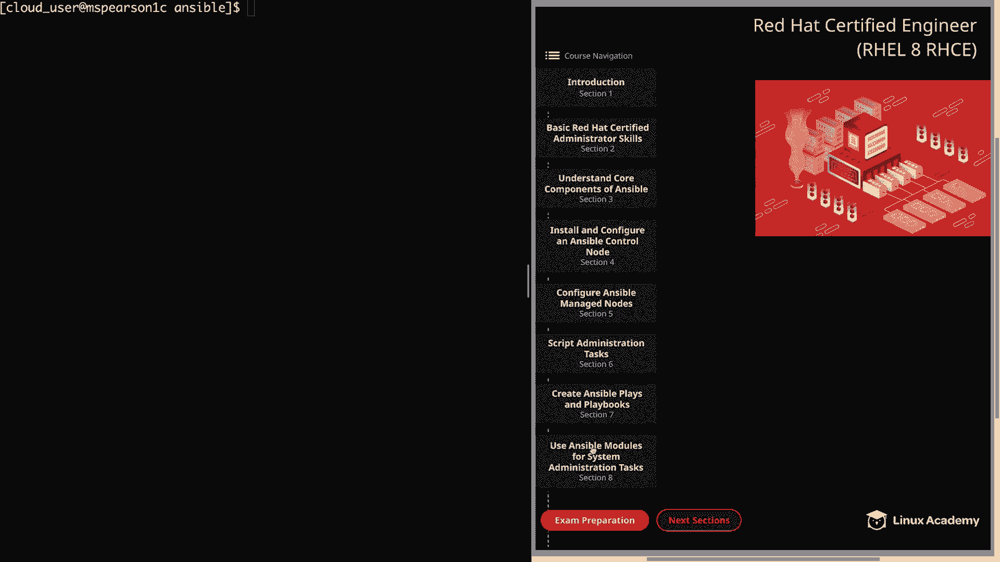
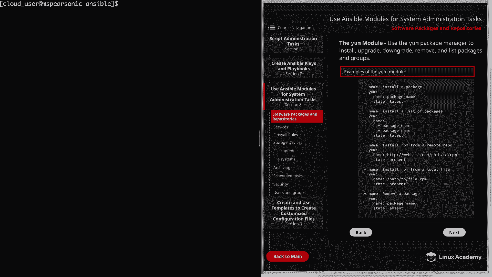
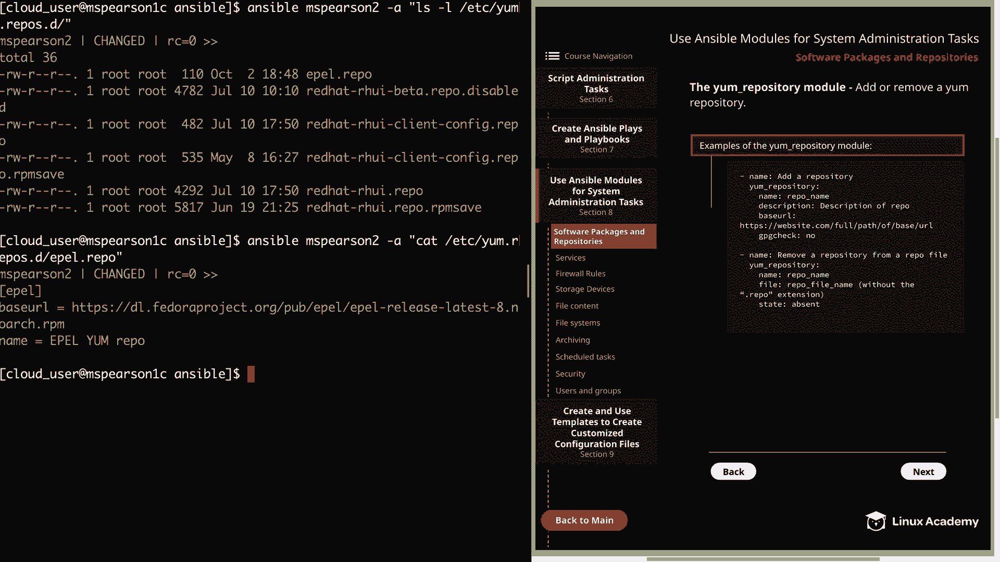
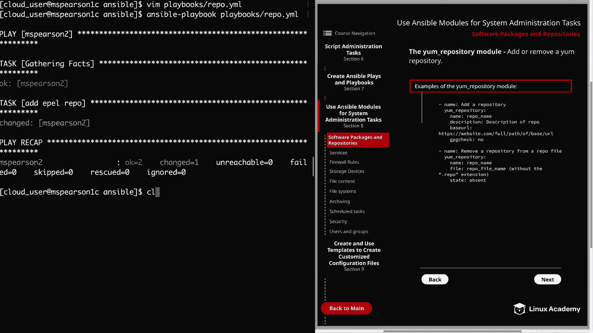
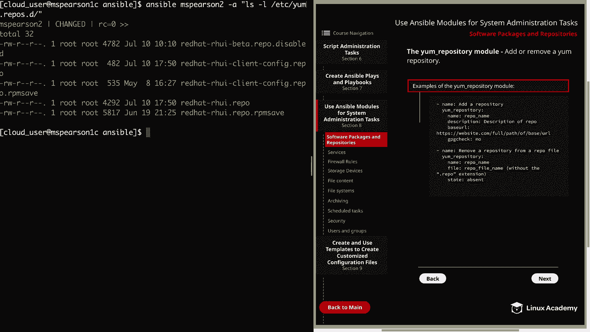

# Ansible系统管理模块：8.1：软件包与仓库管理 🚀



在本节课中，我们将学习Ansible中用于系统管理的模块。首先，我们将重点介绍用于管理软件包和软件仓库的模块。

## 概述 📋

Ansible提供了专门的模块来管理RHEL 8系统中的软件包和软件仓库。这些模块封装了底层包管理器（如YUM/DNF）的复杂操作，使我们能够通过简洁的Playbook或命令来执行安装、更新、删除等任务。本节将详细介绍`yum`模块和`yum_repository`模块的使用方法。

## 使用yum模块管理软件包 📦

`yum`模块使用YUM包管理器来安装、升级、降级、删除和列出软件包及软件包组。在RHEL 8中，虽然模块名为`yum`，但其后端实际使用的是DNF。

以下是使用`yum`模块的几种常见方式示例：

*   **安装单个软件包（最新版本）**：指定软件包名称，并将状态设置为`latest`。这确保软件包被安装并更新到最新版本。
    ```yaml
    - name: Install the latest version of a package
      yum:
        name: httpd
        state: latest
    ```
*   **安装单个软件包（确保存在）**：使用`present`状态。如果软件包已安装（无论版本），则跳过；如果未安装，则安装默认版本。
    ```yaml
    - name: Ensure a package is present
      yum:
        name: httpd
        state: present
    ```
*   **安装多个软件包**：在`name`参数下以列表形式提供多个软件包名。这种方式比使用循环更高效。
    ```yaml
    - name: Install multiple packages
      yum:
        name:
          - httpd
          - vsftpd
          - vim-enhanced
          - firewalld
        state: latest
    ```
*   **从远程URL安装RPM**：直接提供RPM文件的URL。
    ```yaml
    - name: Install an RPM from a URL
      yum:
        name: http://example.com/path/to/package.rpm
        state: present
    ```
*   **从本地文件安装RPM**：提供本地文件系统上的RPM文件路径。
    ```yaml
    - name: Install an RPM from a local file
      yum:
        name: /tmp/local-package.rpm
        state: present
    ```
*   **删除软件包**：将状态设置为`absent`。
    ```yaml
    - name: Remove a package
      yum:
        name: httpd
        state: absent
    ```
*   **列出已安装的软件包**：使用`list`参数。
    ```yaml
    - name: List installed packages
      yum:
        list: installed
    ```
*   **安装软件包组**：在组名前加上`@`符号。
    ```yaml
    - name: Install a package group
      yum:
        name: “@Development Tools”
        state: present
    ```

> **注意**：虽然`yum`模块能满足基本需求，但Ansible也提供了`dnf`模块，它提供了一些`yum`模块不具备的功能。

## 实战：编写安装软件包的Playbook

现在，让我们在命令行中创建一个简单的Playbook来实践安装软件包。

1.  创建一个名为`yum.yml`的Playbook文件。
2.  定义目标主机和权限提升。
3.  添加一个任务，用于安装`httpd`、`vsftpd`、`vim-enhanced`和`firewalld`软件包。

以下是完整的Playbook示例：

```yaml
---
- hosts: mspearson2
  become: yes
  tasks:
    - name: Install packages
      yum:
        name:
          - httpd
          - vsftpd
          - vim-enhanced
          - firewalld
        state: latest
```

运行此Playbook后，可以验证软件包是否成功安装。

## 使用yum_repository模块管理软件仓库 🗃️



上一节我们介绍了如何使用`yum`模块管理软件包，本节中我们来看看如何管理这些软件包的来源——软件仓库。`yum_repository`模块允许你添加或删除YUM仓库。

以下是使用该模块的示例：

*   **添加一个仓库**：需要指定仓库名称、描述和基础URL。还可以启用GPG检查。
    ```yaml
    - name: Add a repository
      yum_repository:
        name: epel
        description: EPEL YUM repo
        baseurl: https://download.fedoraproject.org/pub/epel/$releasever/$basearch/
        gpgcheck: yes
    ```
*   **删除一个仓库**：指定仓库名称及其所在的文件（不含`.repo`扩展名），并将状态设置为`absent`。
    ```yaml
    - name: Remove a repository from a repo file
      yum_repository:
        name: epel
        file: external_repos # 对应 /etc/yum.repos.d/external_repos.repo
        state: absent
    ```

> **注意**：`file`参数默认与`name`参数值相同。只有当多个仓库定义在同一个文件中时，才必须指定`file`参数以精确删除目标仓库。

## 实战：管理EPEL仓库

让我们通过一个Playbook来演示如何添加和删除EPEL仓库。

1.  创建一个名为`repo.yml`的Playbook文件。
2.  添加一个任务来配置EPEL仓库。

```yaml
---
- hosts: mspearson2
  become: yes
  tasks:
    - name: Add EPEL Repo
      yum_repository:
        name: epel
        description: EPEL YUM repo
        baseurl: https://download.fedoraproject.org/pub/epel/$releasever/$basearch/
```

运行此Playbook后，可以使用ad-hoc命令检查仓库是否已添加：
```bash
ansible mspearson2 -a “ls /etc/yum.repos.d/”
ansible mspearson2 -a “cat /etc/yum.repos.d/epel.repo”
```



3.  修改Playbook以删除该仓库。

```yaml
---
- hosts: mspearson2
  become: yes
  tasks:
    - name: Remove EPEL Repo
      yum_repository:
        name: epel
        file: epel # 指定仓库文件（可选，本例中与name相同）
        state: absent
```

再次运行Playbook并验证仓库文件已被删除。

> **重要提示**：当使用Ansible ad-hoc命令运行`yum_repository`模块时，如果参数值包含空格或特殊字符，务必使用单引号将`description`和`baseurl`等参数值括起来，以避免解析错误。



## 总结 🎯

本节课中我们一起学习了Ansible中两个重要的系统管理模块：
1.  **`yum`模块**：用于管理RHEL系统中的软件包，支持安装、更新、删除、列表以及管理软件包组。
2.  **`yum_repository`模块**：用于管理系统中的YUM软件仓库，可以方便地添加或删除仓库配置。



通过这两个模块，你可以轻松地将软件环境和仓库配置作为代码进行管理，确保系统状态的一致性和可重复性。这是实现自动化系统配置和部署的基础步骤。