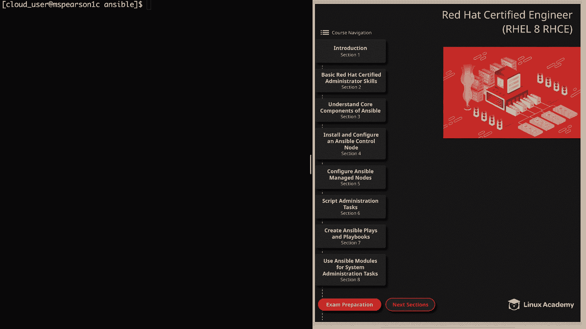
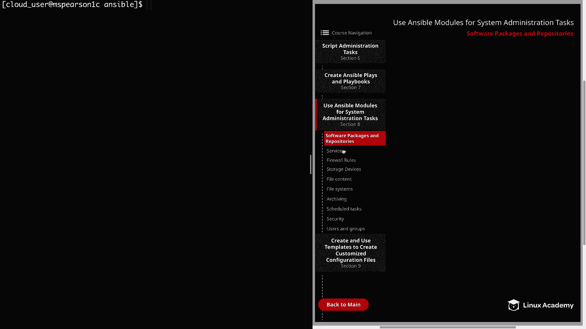
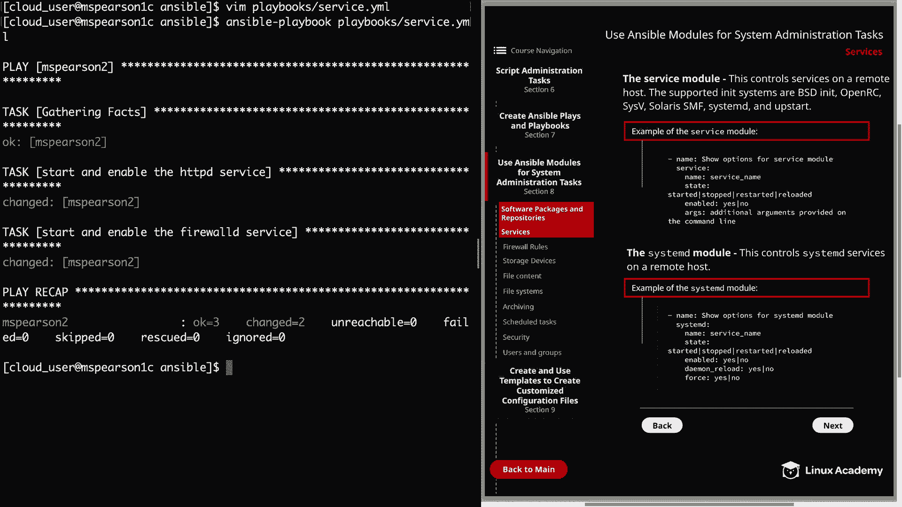

# Red Hat Certified Engineer (RHEL 8 RHCE) - P32：388-4873-2 - Services - 11937999603_bili - BV12a4y1x7ND

Welcome back everyone， this is Matt， and in this video we're going to continue our discussion on using ansible modules for system administration tasks。

And the topic that we're going to cover is controlling services with Ansible。

 So go ahead and click on Section 8。

And then， services。

And this lesson is going to focus on two modules， the service module， and the system D module。

So first， let's talk about the service module。This control services on a remote host。

 and the support in its systems are B， S D in it， Open R C， Cs V， Cloris， S M F。

 System D and Upstar in the diagram， I provided an example of the service module。

 Here we have our description。 And the purpose of this is just to show the options for the service module。

Then we're going to specify the module name， which is service。

 and then the name of the service we want to interact with。

 followed by a state and the state can include started， stopped， restarted and reloaded。

And then we have an A， which is going to allow us to determine whether or not we want a service to persist through reboot。

And then we have the Args parameter， which allows for additional arguments provided on the command line。

So speaking of the command line， let's head over there and we can do a demonstration of the service module。

So first， we need to create our playbook。We're going to do that in our playbooks directory。

 we're just going to call this service。yMl。So we'll start off with our three dashes。

And then for hostss， we're going to come back to MS Pearson 2。

And this does require escalated privileges。So we'll say become is yes。

And then we can specify our tasks。And in this playbook。

 we're going to be starting and enabling two services that we installed in the previous video。

Let's go ahead and add the first。And that's going to be start and enable。The HtTPD service。

And then our service module。Do we need to specify the name， which is HttPD？And then the state。

 which just started。And then enabled equals yes。All right， our next task。

Is going to be start and enable。The firewall D service。Specify the service module。

The name is Firewall D。State is going to be started。And enabled。Is yes。

Now I know we've already seen several examples of the service module throughout the course already。

 but for section 8， I'm trying to do really pointed demonstrations of the module to show you how they correlate with things you can do in the command line to administer your system。

So as you can see here， we're going to start and enable HTTBD and also Firewall D。

 and this is something that you always need to keep in mind for Red Hat exam。

 and that is that your configurations need to persist through a reboot。

So in the same way that you would do a system CTL start and then a system CTL enable。

 you can use the service module within your playbooks。So let's go ahead and save and quit。

And then we're going to run Antsible playbook。And then service thatt YMl。

And our playbook executed successfully。And that just shows you a base example of how to use the service module and the next module we're going to talk about is the system D module。

 and this was designed specifically to control system D services on a remote host。

This module was introduced in version 2。2， and as I just said。

 iss tailored specifically for system D。The service module。

 which provides the ability to control services on many different types of in systems。

 system D included， of course， is a bit more of a monolith as a module when compared to the system D module。

Which is only for a system that is managed by system D。And as Anspo has developed。

 they have created more and more modules that are tailored to specific systems as well as specific tasks。

The system D module also adds a few system D specific options， such as De_ reload。

 which you'll see in the example here in the diagram。

And that's going to make sure that System D has read any changes before doing any other operation。

It also allows for the force parameter， which will overwride existing S links。

And then you have scope， which uses the system scope by default。

 but may also be used for the user scope， which is user， or the scope of all users。

 which is global when it comes to deciding whether to use the system D module or the service module。

 it'll really depend on what you're using it for， but if you need to take advantage of some of these extra parameters。

 then I would suggest using system D， But if you just need the basic functionality to stop， start。

 na a service， feel free to use the service module since it has been the de facto standard for a long time。

All right， so now let's go ahead and try out the system D module in our playbook。

 Let's clear this out， and then we can open up our playbook once again。

And then we can just go ahead and update our tasks so rather than using the service module。

 we can use the system D module。So everything else is going to remain the same except for the state and we can change that over to restart it。

So we'll update this to be system D。And then this is going to be restarted。Then again， system D。

And then， restart it。And that's another nice thing about the system D module versus the service module is that the main parameters that you're using are all the same。

 and then if you need to take advantage of the additional parameters。

 you can always do that So let's go ahead and save this。And then we can kick off our playbook again。

Hantstable playbook。And then service dot yL。And as expected， our playbook executed successfully。

And that's actually going to wrap up this video on services。

 so let's go ahead and market it complete and we can move on to the next lesson。

