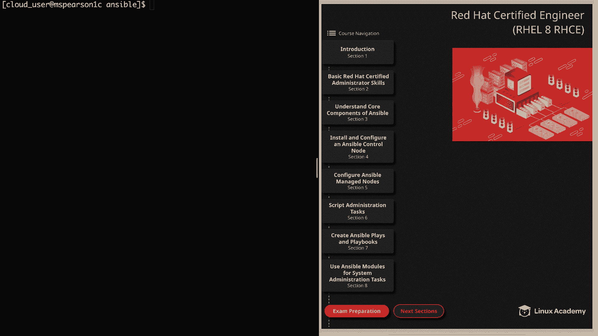
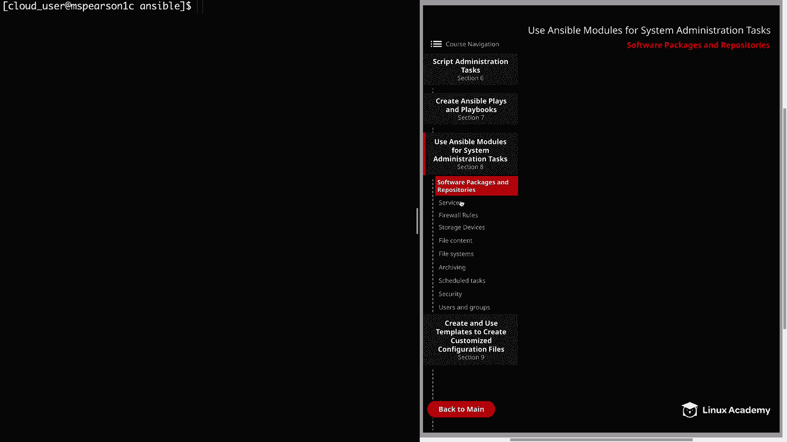
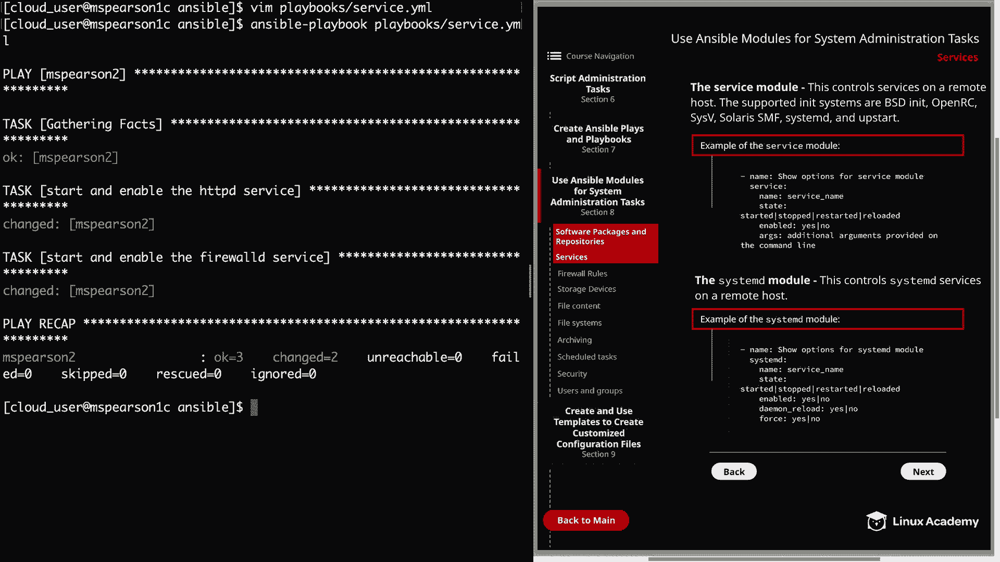

# Ansible 系统管理：第8章：服务管理 🚀

在本节课中，我们将学习如何使用 Ansible 模块来控制系统服务。我们将重点介绍两个核心模块：`service` 模块和 `systemd` 模块，并通过实例演示如何启动、停止、启用服务，以及如何让配置在系统重启后依然生效。





---

## 服务模块概述

首先，我们来了解 `service` 模块。这个模块用于在远程主机上控制系统服务，它支持多种初始化系统，包括 BSD init、OpenRC、SysV、Solaris SMF、systemd 和 Upstart。

以下是 `service` 模块的一个基本示例，展示了其主要参数：

```yaml
- name: 管理服务示例
  service:
    name: <服务名称>
    state: <状态>
    enabled: <是否启用>
    args: <额外参数>
```

*   **`name`**: 指定要操作的服务的名称。
*   **`state`**: 定义服务的运行状态，可选值包括 `started`、`stopped`、`restarted` 和 `reloaded`。
*   **`enabled`**: 决定服务是否在系统启动时自动启用。
*   **`args`**: 允许提供额外的命令行参数。

---

## 实践：使用 Service 模块

上一节我们介绍了 `service` 模块的基本概念，本节中我们来看看如何编写一个实际的 Playbook 来应用它。

以下是创建一个 Playbook 来启动并启用 `httpd` 和 `firewalld` 服务的步骤：

1.  创建 Playbook 文件 `service.yml`。
2.  定义目标主机和权限提升。
3.  添加任务，使用 `service` 模块管理服务。

```yaml
---
- hosts: mspearson2
  become: yes
  tasks:
    - name: 启动并启用 HTTPD 服务
      service:
        name: httpd
        state: started
        enabled: yes

    - name: 启动并启用 FirewallD 服务
      service:
        name: firewalld
        state: started
        enabled: yes
```

运行此 Playbook 的命令是：
```bash
ansible-playbook service.yml
```

这个操作等同于在命令行中执行 `systemctl start` 和 `systemctl enable`。在 Red Hat 相关考试中，确保配置在重启后持久化是一个关键点。

---

## Systemd 模块概述

接下来，我们介绍 `systemd` 模块。这个模块是 Ansible 2.2 版本引入的，专为控制 systemd 系统上的服务而设计。

与通用的 `service` 模块相比，`systemd` 模块更专注于 systemd 环境，并提供了一些额外的特有参数：

```yaml
- name: 使用 systemd 模块管理服务
  systemd:
    name: <服务名称>
    state: <状态>
    enabled: <是否启用>
    daemon_reload: <是否重载>
    force: <是否强制>
    scope: <作用域>
```

*   **`daemon_reload`**: 确保 systemd 在执行任何操作前重新读取配置变更。
*   **`force`**: 覆盖现有的符号链接。
*   **`scope`**: 定义操作的作用域，默认为 `system`（系统级），也可以是 `user`（用户级）或 `global`（所有用户）。

在选择使用 `service` 模块还是 `systemd` 模块时，如果只需要基本的启动、停止功能，`service` 模块是长期以来的事实标准。如果需要利用上述 systemd 特有的高级参数，则应选择 `systemd` 模块。

---

## 实践：使用 Systemd 模块

现在，让我们修改之前的 Playbook，将 `service` 模块替换为 `systemd` 模块，并将服务状态改为重启。

更新后的 Playbook 任务部分如下：

```yaml
  tasks:
    - name: 重启并启用 HTTPD 服务
      systemd:
        name: httpd
        state: restarted
        enabled: yes

    - name: 重启并启用 FirewallD 服务
      systemd:
        name: firewalld
        state: restarted
        enabled: yes
```

`systemd` 模块的一个优点是，其核心参数（如 `name`、`state`、`enabled`）与 `service` 模块保持一致，这使得在两个模块间切换非常方便。当你需要额外功能时，可以随时添加 `systemd` 的特有参数。

保存并再次运行 Playbook，预期会成功执行。

---

## 课程总结

本节课中我们一起学习了如何使用 Ansible 管理 Linux 系统服务。

我们重点探讨了两个模块：
1.  **`service` 模块**：一个通用的服务管理模块，支持多种初始化系统，适合完成基本的服务状态控制。
2.  **`systemd` 模块**：专为 systemd 系统设计，提供了如 `daemon_reload`、`force` 等更精细的控制参数。



通过实际的 Playbook 编写与运行，我们掌握了如何启动、启用、重启服务，并确保了配置的持久性。你可以根据目标系统的类型和具体的功能需求，灵活选择使用哪个模块。