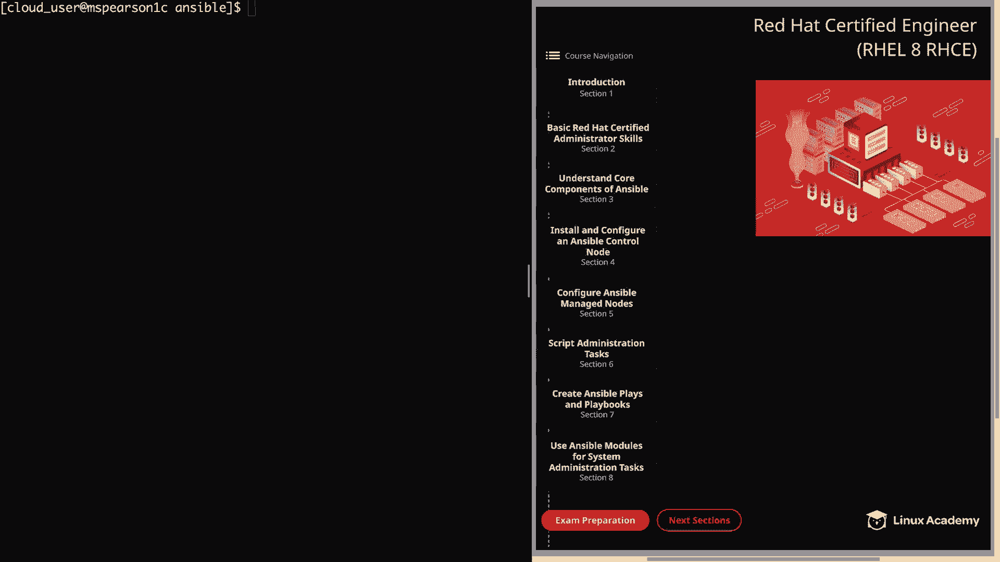
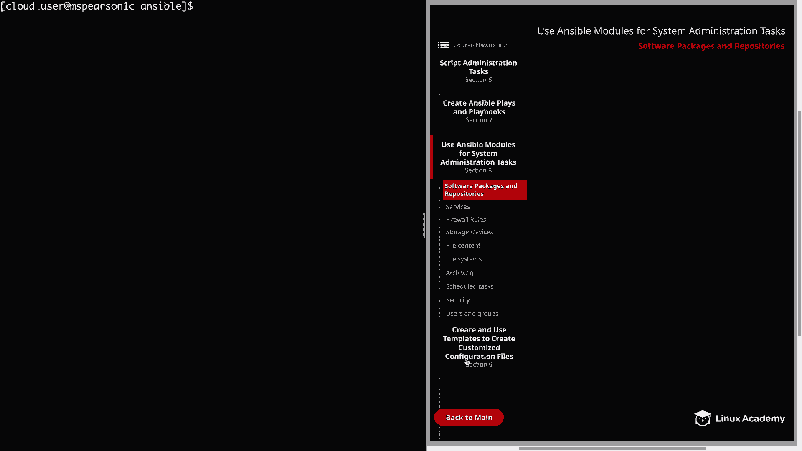
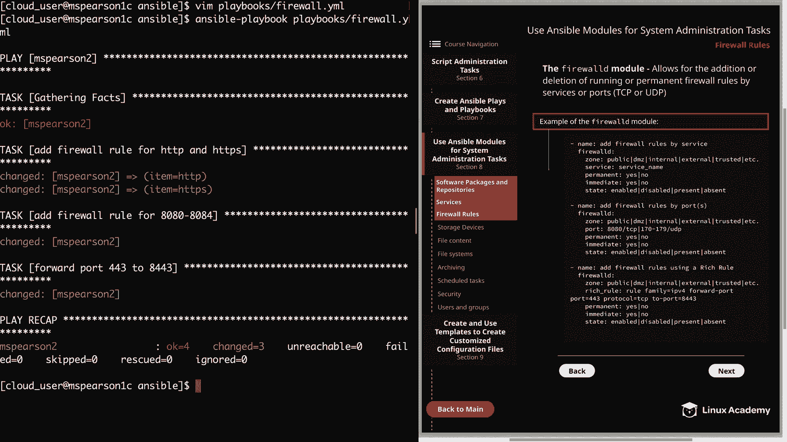
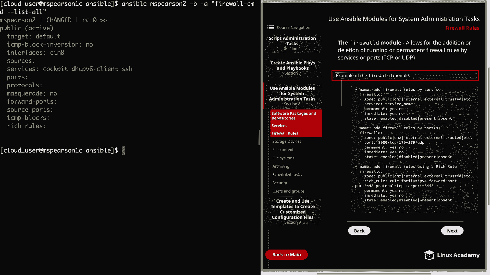

# Red Hat Certified Engineer (RHEL 8 RHCE) - P33：388-4873-3 - Firewall Rules - 11937999603_bili - BV12a4y1x7ND

Welcome back everyone， this is Matt， and in this lesson we're going to continue our section on using ansible modules for system administration tasks。

And the next topic is a very important one， and that is firewall rules。

 So let's go ahead and click on section 8。

And then we'll click on firewall rules。And before we get started。

 I did want to mention that interacting with firewall D is primarily done through the firewall CMD command line utility or the firewall config utility in the graphical interface。

 and it's really important to understand the options provided in these utilities。

 which we then over briefly in part one of managed security earlier on in the course。Well。

 in addition to these utilities， Ansible also provides a module for us to interact with and configure Firewall D。

 and that is appropriately named the Firewall D module。

 So this is going to allow for the addition or deletion of running or permanent firewall rules by services or ports。

 which will include TCP or UDP。In the diagram， I have provided a few examples of how to use the Fi alld module。

 First， we have the example of adding a rule by service。

And then it has some of the main parameters that you're going to use。 So we have a zone。

 which allows you to specify the zone that you're working in。 The default is going to be public。

And then service， which will be the service that you're adding rules for。

And whether or not you want that to be permanent， which means that it will persist through reboot or immediate。

 which means it will persist for the session you're currently in。 And then lastly。

 you can provide the state， whether you want that enabled or disabled。

 And then we also have present or absent。 Then next， we have adding farwall rules by the port。

You can see we have the port parameter that's going to allow you to specify the port here we have 8080。

 which is using TCP， and here we have a list of ports 170 through 179 that is using UDP。

And then lastly， I provide an example using rich rules。

And this is specified using the rich underscore rule parameter。

 And then you can supply your rich rule。 If you'd like to view the rest of the options for this module。

 feel free to take a look at the module index in the Anipible documentation。

 But these examples that I've provided are going to make up the lion's share of the options that you're typically going to use。

 So let's head over to the command line and we can actually try this out。

 And remember that we did install the firewall D package on our host in a previous video。

 And then also started and enabled that。 And this will be a requirement in order to use the firewall D module。

 So if you do not have firewall D installed on the host that you're going to be working with。

Go ahead and pause and install that Now， otherwise we're going to head to the command line and try it out。

Let's go ahead and create a playbook specifically for this。We're going to call it firewall。Dot YMl。

And in this playbook， we're going to go ahead and do all three different types of firewall rules we're going to show adding a rule by service and by port and then also using a rich rule。

Let's go ahead and start out with our dashes， and then we can add our host。

That again is going to be MS Pearson 2。This does require。Privileges。

 so we're going to say become yes。And then we can specify our tasks。Alright， so our first task。

 we're going to。Add firewall rule for HtTP and HttPS。We're going to specify the firewall D module。

And now we can specify our parameters， and I'm going to go ahead and add in the zone parameter and remember that by default。

 this is going to use the public zone。 But just so you can see it。

 I'm going to put in zone and then public。And then the service， and for the service parameter。

 we can only input one service at a time。 So what I'm going to do to get around that is again。

 use our loop。So we'll go ahead and add in our item variable。And then we're going to use permanent。

It's going to be yes， and then immediate。Will also be yes， so again。

 that's going to make it persist through reboot and also activate for our current session。

And then the state is going to be enabled。And now we need to add our loop。

Followed by our list of items。That's going to be HtTP。And H TtPS。All right。

 so now let's add another task。And this time， we're going to add firewall rule。For 8080 through 8084。

So a specifier module。And this time， I'm not going to add the zone parameter。

 I'm just going to leave it blank， but remember it will default to public。

 and then we need to specify the port parameter。 We're going to give it 80，80。Through 8084。

And that's going to be TCP。I'm going to want this to be permanent。YouF that real quick。

And we want this to be immediate also。And the state is going to be enabled。All right。

 now our last task。Is going to be adding a ritual rule。We're going to forward port 4，4，3，2。8，4，4，3。

We're using the FirewallD module。And then we can list our parameters。

 So we're going to say rich underscore rule， and then we can add our rich rule。It's going to be rule。

And family is going to be IPV4。And then， forward port。And we're going to specify the port。Which is 4。

4，3。And the protocol is going to be TCP。 And then we're going to forward that。To port， 8443。

And again， we need to add our permanent， yes， immediate。Also equals yes。

And then the state is enabled。All right， let's go ahead and save and quit。

And before we run our playbook， let's go ahead and list out all the firewall rules for MS Pearson 2。

 and then we can check that again after our playbook runs。So we'll use ansible M Pearson 2。

Dash B and then dash A， and we're just going to use Firewall CMD。

And we're going to run dash dash list， dash all。And currently the only services that we have enabled are cockpit。

 DHCPV6 client and SSH， and we don't have any ports that are enabled yet。

 so let's go ahead and run our playbook。It's going to be an Anciible playbook。Playbook。

And then firewall doyMl。And it looks like each of our rules completed successfully。

Let's go ahead and run our ad hoc command just to check that out。

And we see that our rules have been added， so under services we have HTTP and HTTPS。

 and then under ports we have 8080 through 8084 TCP， and then finally our rich rule at the bottom。

All right， so now that we've seen how to add firewall rules， let's see we need to do to remove them。

So we'll open up our playbook yet again。And we see that currently our state is set to enable。

For all of our different tasks。And this is a place where you might easily get confused。

 at least I was at first。 So in most of the modules。

 you have enabled or present and then you have absent that typically is going to be what you're going to use to remove something。

 You're going to put in state is absent。 But in firewall D。

 the state's present and absent can only be used in zone level operation。

 So it means when no other parameters， but zone and state are set。

 So when it comes to removing these rules。 We actually need to use disabled。

 So let's go ahead and remove these。 I'm just going to do a substitution。

 So we're going to substitute enabled。For disabled。We're going do this for the entire file。

And now we can go ahead and save our playbook。And see if it removes our rules。All right。

 and it looks like everything went off without a hitch。

Let's go ahead and clear this and see if we can run our firewall CMD list all。

And we see that our services were removed as well as our ports and our ritual rule。Well。

 that's going to bring this video on firewall rules to an end。

 feel free to check out the answersible documentation for the Firewall D module。

 but for now we can go ahead and mark this video complete and we'll move on to the next lesson。

