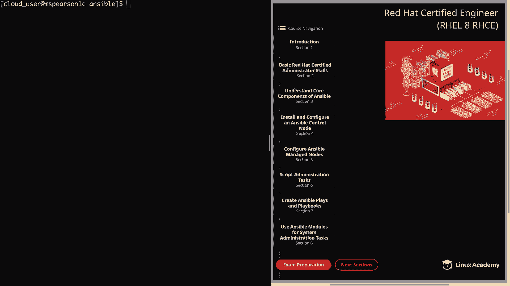
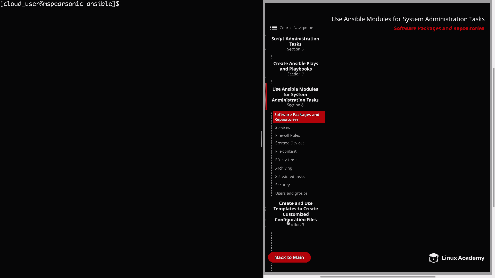
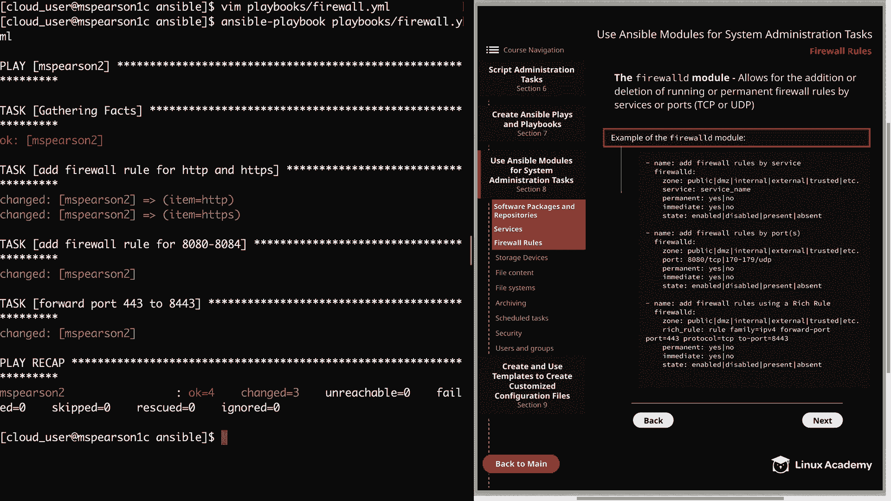
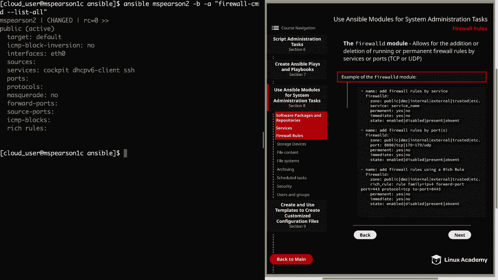

# Ansible系统管理：第八节：防火墙规则配置 🛡️





在本节课中，我们将学习如何使用Ansible的`firewalld`模块来管理系统防火墙规则。我们将涵盖如何通过服务、端口以及富规则来添加和删除防火墙规则。

## 概述

防火墙是系统安全的重要组成部分。在RHEL 8中，`firewalld`是默认的动态防火墙管理工具。除了使用`firewall-cmd`命令行工具或图形界面工具，Ansible也提供了专门的`firewalld`模块，允许我们以自动化、可重复的方式配置防火墙规则。本节将详细介绍该模块的使用方法。

## 理解Firewalld模块

上一节我们介绍了Ansible的基础知识，本节中我们来看看如何用它管理防火墙。`firewalld`模块允许我们添加或删除运行时或永久的防火墙规则，这些规则可以基于服务或端口（包括TCP或UDP）来定义。

以下是该模块的一些核心参数和用法示例：

*   **`zone`**：指定要操作的防火墙区域，默认是`public`。
*   **`service`**：指定要为其添加规则的服务名称。
*   **`port`**：指定端口号，格式可以是单个端口（如`8080/tcp`）或端口列表。
*   **`rich_rule`**：用于指定复杂的富规则。
*   **`permanent`**：设置为`yes`时，规则在重启后依然有效。
*   **`immediate`**：设置为`yes`时，规则立即在当前会话生效。
*   **`state`**：对于区域级操作，可使用`present`或`absent`；对于规则操作，则使用`enabled`或`disabled`。

## 实践：创建防火墙规则

现在，让我们通过一个实际的Playbook来演示如何添加三种类型的防火墙规则。

首先，我们需要确保目标主机上已安装并运行了`firewalld`服务。如果尚未安装，请先完成此步骤。

我们将创建一个名为`firewall.yml`的Playbook。

```yaml
---
- hosts: mspearson2
  become: yes
  tasks:
    # 任务1：通过服务添加HTTP和HTTPS规则
    - name: Add firewall rule for HTTP and HTTPS
      ansible.posix.firewalld:
        zone: public
        service: "{{ item }}"
        permanent: yes
        immediate: yes
        state: enabled
      loop:
        - http
        - https

    # 任务2：通过端口添加规则（8080-8084/TCP）
    - name: Add firewall rule for ports 8080 through 8084
      ansible.posix.firewalld:
        port: 8080-8084/tcp
        permanent: yes
        immediate: yes
        state: enabled

    # 任务3：使用富规则进行端口转发（443 -> 8443）
    - name: Add a rich rule to forward port 443 to 8443
      ansible.posix.firewalld:
        rich_rule: 'rule family="ipv4" forward-port port="443" protocol="tcp" to-port="8443"'
        permanent: yes
        immediate: yes
        state: enabled
```

运行Playbook之前，可以先查看当前的防火墙规则：
```bash
ansible mspearson2 -b -a "firewall-cmd --list-all"
```

然后执行Playbook：
```bash
ansible-playbook firewall.yml
```

执行成功后，再次运行`firewall-cmd --list-all`命令，可以确认HTTP、HTTPS服务端口、8080-8084端口以及端口转发规则都已成功添加。

## 实践：删除防火墙规则

学会了如何添加规则，接下来我们看看如何删除它们。这里有一个关键点需要注意：在`firewalld`模块中，删除已添加的规则不是使用`state: absent`，而是将`state`参数的值从`enabled`改为`disabled`。

修改上面的`firewall.yml` Playbook，将所有`state: enabled`替换为`state: disabled`。

```yaml
# ... 其他部分不变，仅修改state参数
        state: disabled
```

保存并再次运行这个Playbook：
```bash
ansible-playbook firewall.yml
```

运行完毕后，使用`firewall-cmd --list-all`命令检查，会发现之前添加的所有服务、端口和富规则都已被移除。

## 总结



本节课中我们一起学习了如何使用Ansible的`firewalld`模块来管理RHEL系统的防火墙。我们掌握了：
1.  通过`service`和`port`参数添加或删除基本的防火墙规则。
2.  使用`rich_rule`参数配置更复杂的规则，例如端口转发。
3.  理解了`permanent`和`immediate`参数对规则持久性的控制。
4.  明确了删除规则时需使用`state: disabled`而非`state: absent`。



通过将这些任务编写到Ansible Playbook中，我们可以实现防火墙配置的自动化与标准化管理，极大地提升了运维效率和一致性。建议你查阅Ansible官方文档以探索`firewalld`模块的更多高级选项。