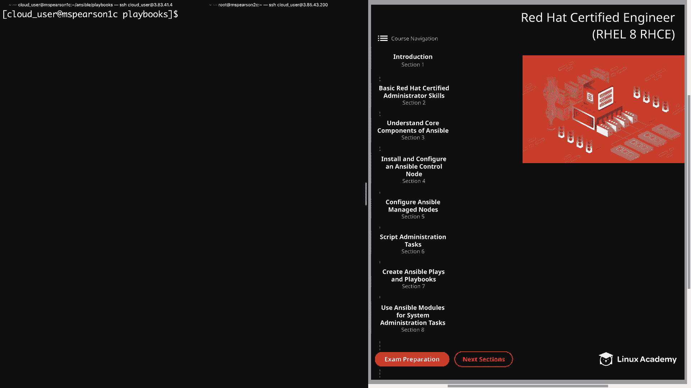
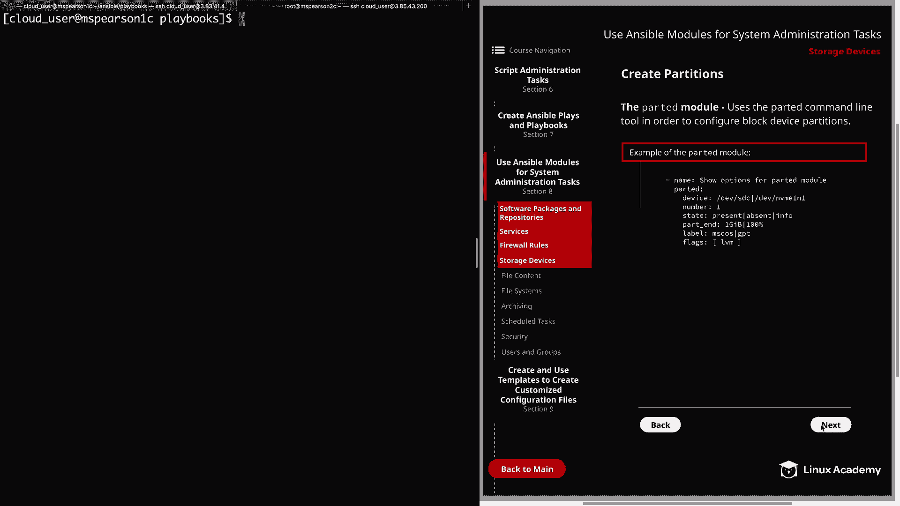
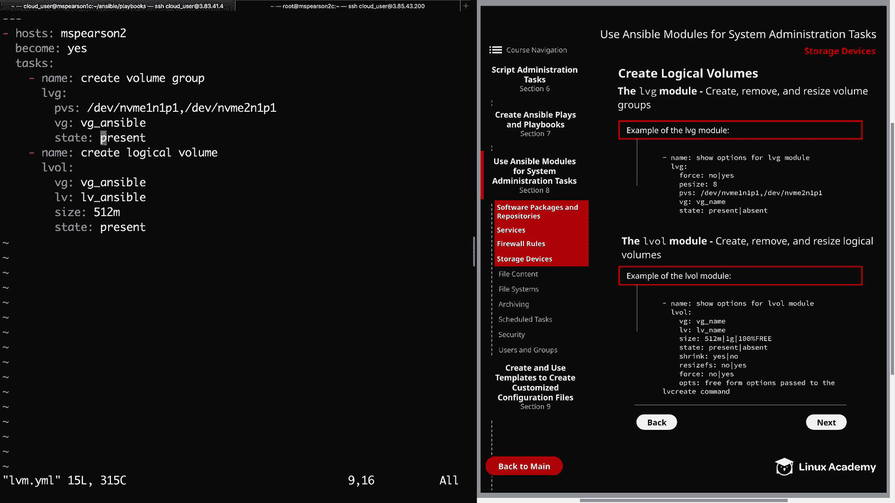

# Red Hat Certified Engineer (RHEL 8 RHCE) - P34：388-4873-4 - Storage Devices - 11937999603_bili - BV12a4y1x7ND

Welcome back everybody， this is Matt， and in this video we're going to continue our section on using ansible modules for system administration tasks。

And our next topic is going to be storage devices。 So let's head over to section 8。

And then down to storage devices。Now， before we get started。

 I did want to let you know that I have added two devices to my MS Pearson2C host。

 so if you're following along， go ahead and pause the video now and then you can head over to playground to add the devices and make sure you do that for whatever managed node you're going to be working with and all you need to do is click on the host and playground and then you're going to click the action button in the bottom left and then add dev NvM1 and1 and then MVM2 and1 And the nice thing is there's no need to restart the host。

 So once that finishes and go ahead and come back and resume。But either way。

 let's go ahead and move on。And the first thing we're going to talk about is creating partitions。

 and this is going to be done using the parted module。

And all this does is use the parted command line tool in order to configure a block device partition。

 So over here in our diagram， I've provided an example of the module and how you're going to use it。

 So， of course， we're going to give our name and here I'm just saying show options for the parted module。

 And then you're going to declare parted， which， of course， is the module we're going to be using。

Next， we have the device and for our environment， this is gonna to be dev Nvme1 and1 and also dev Nvme2 and1。

 but that can change depending on the environment that you're working in。

 whether it's a cloud server or local virtual machine or whatever you're happen to be using Next we have the partition number followed by state and this can either be present or absent。

 which we've seen with a lot of the modules here。 But then they also allow info in order to gain some information。

 Next we have part underscore end。 and this is where you're going to define when your partition is going to end as you can see here。

 I have the example of using one gigabte。 but you can also use percentages such as 100 percent or even 75% whatever it is that you're trying to accomplish。

 Now one thing that I did not put in here is part underscore start。

 And that is where the partition is going to start at。

 And by default that's just going to be0 or a percent。

 So it's going to start at the beginning of the disk。 But depending on what you're trying to do。

 you cant specify that by unit as in1 gigabte or as in a percentage like 15 or 20%。

 But in this example here， we're just accepting the。Next， we have label。

 and this is going to create a new disk label here。

 we have the example of Ms dos for an Mr partition table or G for the G partition table。

 and then lastly we have flags which allows us to specify what the partition is going to be used for。

 And in our case， we're going be using it for LVM。 Now there are other options that you can use with the parted module but as with the other modules that we're covering and that we will cover I'm going to show you some of the main ones that you're can end up using。

 but just keep in mind that you can go to the ansible documentation in order to see all the different parameters that are supported。

 Allright， so now that we've talked a little bit about the parted module。

 let's head over to our control node and we can create a playbook in order to test this out。

 So as you can see， I'm currently in my playbooks directory So I'm going to create a new playbook we're just going call partition。

Start with our three dashes。We're going to be working against MS Pearson 2。

Please input whatever host that you're working against。AndThis will require privilege escalation。

 so we're say become yes。And then we can specify our task list。So for name。

 we're going to say create partitions。They're going to specify the parted module。

And then we can specify our device。And this parameter will only allow you to input one device at a time。

 so rather than listing this out twice， I'm actually going to do a loop， so we'll open up our quote。

And we're going to add in the item variable。For number， we're going to select one。State is again。

 going to be present。We're going to use the default partition start of0。

 so I'm just going to specify part end。And we're just going to do one GIB。

 So each of these partitions is only going to be one gigabyte。And then label。

 we're going to specify MS Dos。And then lastly， for flags。We're going to specify LVM within brackets。

 And the reason for that is the next topic in this video is going to be creating logical volumes。

 So we're going to go ahead and create our base partitions first。

And now we need to come down here and create our loop。And remember。

 that's going to be dev in VME1 and one。And then that's going to be dev in VMme2 and1。All right。

 so let's go ahead and save our playbook。And now we can kick it off with Antsible playbook and then specifying partition。

 YMl。And one quick side note is you'll notice I'm not in the Ansible working directory。

 which is where I've been doing most of my work from。

I actually went ahead and added the ansible CFfG to my home directory using the dot ansible do Cfg。

 so that way I can run these playbooks directly from the playbooks directory。

 So if you've not done that， you can go ahead and do that now or just run the command from the same directory as your ansible do CFfg。

 But either way， let's go ahead and kick this off。This can take a few seconds。

 so I may go ahead and speed it up for you。All right。

 so it looks like our playbook went off without a hitch。Let's go ahead and head over to MS Pearson 2。

 I've opened up another tab here in my terminal。And I'm logged in as the root user。

 Let's go ahead and run F disk。Dash L on devv in VMme1。In one。And as you can see。

 we have the Dos disc label。And we've also created a partition， which is MVme 1 and1 P1。

 and the ID is 8 E for a Linux LVM partition。Let's go ahead and run that real quick just for two and one just to make sure。

And we see that that is the same。All right， so now let's head back over to our control node。

And now that we have our partitions created， let's head over to the next page in our diagram and we can talk about creating logical volumes。

So the first module that we're going to talk about is the LVG module。

 and this allows us to create remove and resize volume groups。

 and in the example I've provided several of the parameters first we have force and if you use the yes option here with the absent state。

 it's going to remove the volume group as well as the logical volumes Next we have PE size and this is the size of the physical extents。

And then we have PVS， and this is just a comma separated list of the physical devices that you're going to use for your volume group。

 And the other cool thing is that the module will create the physical volumes for you if they are not already created。

 So currently we haven't created any physical volumes with our new partitions。

 So all we have to do is specify them here。 and the LVG module is going to create them along with our volume group。

 Next we have VG， and this is just the name of the volume group。

 and then state is going to be present or absent。All right， so before we try out the LVG module。

 let's go ahead and talk about the LV module。And different from the LVG module。

 this is going to allow us to create， remove and resize logical volumes。 So， again。

 I provide an example of this module with some of the parameters。And the first is going to be Vg。

 which again is the volume group name， and then Lv is going to be the name for your logical volume。

Emphasize you're going to specify either a unit， as we see here with 500 total megabytes or 1 gigabyte。

 but you can also use percentages such as 100% free。

 and that's just going to use 100% of what's available。And then we have the state parameter。

 which lets us specify either present or absent。And then we have shrink， which can be yes or no。

 And the way that this works is that it's going to shrink if the current size is higher than the size you're requesting。

And then resize FS is going to resize the underlying file system with the logical volume。

And then the force parameter is going to work kind of hand in hand with this。

 because it's required if you were shrinking the volume and also if you're removing a volume。

 And this is just to ensure that the file system never gets corrupted or removed by mistake。

 So kind of in a little extra safety measure there。And then we have the Ops parameter。

 which allows us to add any free form options past the LV C command。All right。

 so now's head back over the command line and we can try this out in a playbook。

So I'm just going to create one called Lvm。yMl。Hosts again will be MSParson 2。

So that was MSP's run Pearson2。And then we're going to say become yes。

And then we can specify our task。So the first thing that we need to do。Is create our volume group。

We'll just say great volume group。We're going to use the LvG module。First。

 we'll specify our physical volumes， and for us， this is going to be dev in VmeE1 and 1 P1。

Then we'll do a comma， and it's going to be dev in VME 2 and 1， P1。

Then we need to specify the name of the volume group。And I'm just going to say VG underscore Ansible。

 you can of course， make this whatever you'd like to make it。And then state is going to be present。

And that's all we need to do to create our volume group。

 now let's go down here and we create our logical volume。So create logical volume。

And we can specify our volume group name， which is VG underscore Ansible。

 and this will be whatever you set it to。And then the logical volume name。

 I'm just going to call it LV underscore Anible。And for the size。

 we're just going to specify 512 m for 512 megabytes。And the state is present。All right。

 let's go ahead and save and quit this。And before we run that。

 I'm going to head over to MS Pearson 2 just so we can do a quick LVS。

Show that there's no logical volumes currently。No volume groups。And no physical volumes。All right。

 so let's go ahead and kick this off。That's going to be LvM。yMl。It looks like we had a syntax error。

 so let's go ahead and check that out real quick。And that's actually fairly glaring because I forgot to add my module。

Go ahead and add Elval here。And we can try to give it another go。All right。

 well that was successful this time， so let's head back over to MS Pearson 2。 we'll run our LVS。

 We see that we have a logical volume called Lv_ Ansible in the VG_ ansible volume group that is 512 megabytes。

And if we wanted to， we could run our VGS， see our volume groups， and then our PVS。

 see our physical volumes。But either way， we see that that was successful and also how easy it is to create partitions and logical volumes just using the ansible modules。

Now one last thing that I wanted to mention before we end， I'll head back over the control node。

I just want to open up our LVM playbook。And I'm actually going to keep this logical volume because we will be using it in our lesson on file systems because we're going to be creating a file system on that logical volume。

But if we wanted to remove these logical volumes， all we'd need to do is replace the state present。

With absent。And that would remove our logical volume， but we could also just remove。

This task right here。And then under the LVG module， we could say state absent。

And then also specify the force parameter and set that to yes。

 and that would remove both our logical volumes as well as our volume groups。All right， well。

 that's going to wrap up this lesson on storage devices。

 so let's go ahead and mark the video complete and we can move on to the next lesson。

