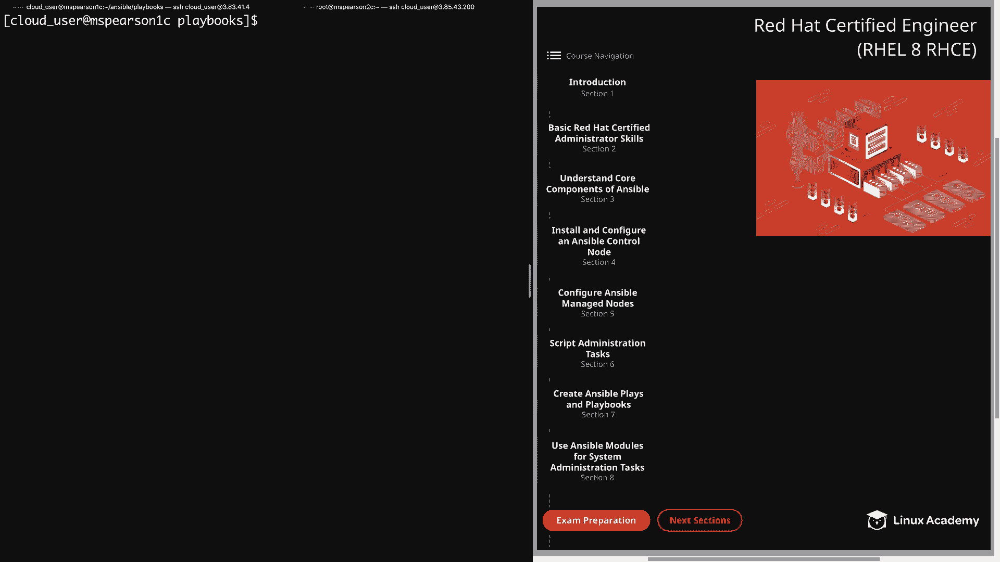
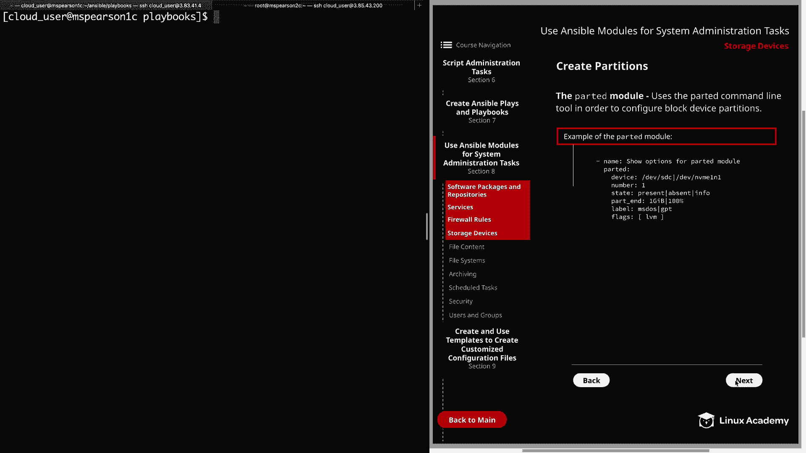
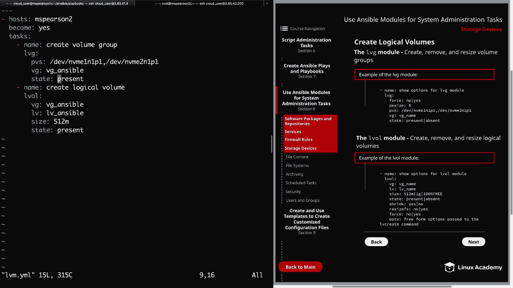

# Ansible系统管理：第8章：存储设备管理 🗂️



在本节课中，我们将学习如何使用Ansible模块来管理存储设备，包括创建分区、卷组和逻辑卷。这些是系统管理员在管理Linux服务器存储时常见的任务。

## 概述 📋

我们将分步学习两个核心模块：`parted`模块用于管理磁盘分区，以及`lvg`和`lv`模块用于管理LVM（逻辑卷管理）。通过实践，您将掌握自动化配置存储设备的方法。

---

## 创建分区 ✂️

上一节我们介绍了Ansible的基础知识，本节中我们来看看如何使用`parted`模块创建磁盘分区。`parted`模块封装了`parted`命令行工具的功能，用于配置块设备分区。

以下是`parted`模块的主要参数示例：

```yaml
- name: 显示parted模块选项
  parted:
    device: /dev/nvme1n1
    number: 1
    state: present
    part_end: 1GiB
    label: msdos
    flags: [ lvm ]
```

**参数说明：**
*   **`device`**: 目标块设备，例如`/dev/nvme1n1`。
*   **`number`**: 分区编号。
*   **`state`**: 状态，`present`表示创建，`absent`表示删除，`info`表示获取信息。
*   **`part_end`**: 分区结束位置。可以使用具体大小（如`1GiB`）或百分比（如`100%`）。
*   **`label`**: 磁盘标签类型，例如`msdos`（MBR）或`gpt`（GPT）。
*   **`flags`**: 分区标志，例如`[ lvm ]`表示用于LVM。

默认情况下，分区从磁盘起始位置（`0`或`0%`）开始。您可以使用`part_start`参数指定不同的起始点。

现在，让我们在控制节点上创建一个Playbook来实践分区创建。

```yaml
---
- hosts: mspearson2
  become: yes
  tasks:
    - name: 创建分区
      parted:
        device: "{{ item }}"
        number: 1
        state: present
        part_end: 1GiB
        label: msdos
        flags: [ lvm ]
      loop:
        - /dev/nvme1n1
        - /dev/nvme2n1
```

运行此Playbook后，您可以在目标主机上使用`fdisk -l /dev/nvme1n1`命令验证是否成功创建了标签为`msdos`、ID为`8e`（Linux LVM）的分区。

---

## 管理逻辑卷（LVM） 💾

成功创建分区后，下一步是使用这些分区来构建LVM。这涉及两个步骤：创建卷组（VG）和在卷组上创建逻辑卷（LV）。

### 1. 创建卷组（VG）

我们将使用`lvg`模块来创建卷组。该模块的一个便利之处是，如果指定的物理设备（PV）尚未创建，它会自动为您创建。

以下是`lvg`模块的关键参数：



```yaml
- name: 管理卷组
  lvg:
    vg: vg_ansible
    pvs: /dev/nvme1n1p1,/dev/nvme2n1p1
    pesize: 4
    state: present
```

**参数说明：**
*   **`vg`**: 卷组名称。
*   **`pvs`**: 用于卷组的物理设备列表（逗号分隔）。
*   **`pesize`**: 物理盘区（PE）的大小（单位MB）。
*   **`state`**: `present`创建，`absent`删除。使用`force: yes`配合`absent`可以强制删除卷组及其包含的逻辑卷。

### 2. 创建逻辑卷（LV）

创建好卷组后，我们使用`lv`模块在卷组内创建逻辑卷。

以下是`lv`模块的关键参数：

```yaml
- name: 管理逻辑卷
  lv:
    vg: vg_ansible
    lv: lv_ansible
    size: 512m
    state: present
```

**参数说明：**
*   **`vg`**: 逻辑卷所属的卷组名称。
*   **`lv`**: 逻辑卷的名称。
*   **`size`**: 逻辑卷大小。可以使用具体单位（如`512m`、`1g`）或百分比（如`100%FREE`）。
*   **`state`**: `present`创建，`absent`删除。
*   **`resizefs`**: 调整逻辑卷大小时，是否同时调整底层文件系统。
*   **`force`**: 在收缩卷或删除卷时，通常需要设置为`yes`，以确保文件系统不会意外损坏或删除，这是一项安全措施。
*   **`shrink`**: 设置为`yes`时，如果当前逻辑卷大小大于请求的大小，则会收缩卷。

现在，让我们创建一个完整的Playbook来实践LVM的创建。

```yaml
---
- hosts: mspearson2
  become: yes
  tasks:
    - name: 创建卷组
      lvg:
        pvs: /dev/nvme1n1p1,/dev/nvme2n1p1
        vg: vg_ansible
        state: present

    - name: 创建逻辑卷
      lv:
        vg: vg_ansible
        lv: lv_ansible
        size: 512m
        state: present
```

运行此Playbook后，您可以在目标主机上使用`lvs`、`vgs`、`pvs`等命令验证逻辑卷、卷组和物理卷是否已成功创建。

---

## 清理资源 🧹

如果您需要删除创建的逻辑卷和卷组，可以修改Playbook中的状态参数。

*   **仅删除逻辑卷**：将`lv`模块的`state`改为`absent`。
*   **删除卷组及所有逻辑卷**：将`lvg`模块的`state`改为`absent`，并设置`force: yes`。

```yaml
# 示例：删除卷组（连带逻辑卷）
- name: 删除卷组
  lvg:
    vg: vg_ansible
    state: absent
    force: yes
```

---

## 总结 🎯

本节课中我们一起学习了如何使用Ansible自动化管理存储设备：
1.  我们使用 **`parted`模块** 在磁盘上创建了用于LVM的分区。
2.  我们使用 **`lvg`模块** 将物理分区聚合为卷组（VG），并自动创建物理卷（PV）。
3.  我们使用 **`lv`模块** 在卷组内创建了指定大小的逻辑卷（LV）。



这些模块使得批量、一致性地配置服务器存储变得简单高效。在接下来的课程中，我们将在创建好的逻辑卷上创建文件系统并挂载使用。