# Red Hat Certified Engineer (RHEL 8 RHCE) - P35：388-4873-5 - File Content - 11937999603_bili - BV12a4y1x7ND

Welcome back everyone。 this is Matt， and in this video。

 we're going to talk about managing file content with ansible modules。

This is going to continue our section on using An modules for system administration tasks。

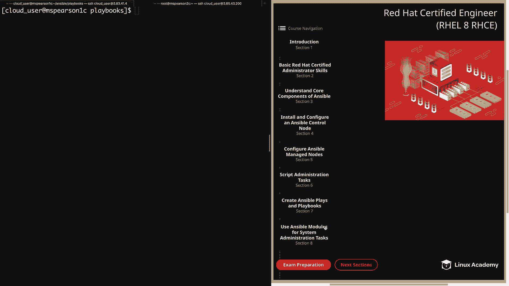

Then we just need to click on the file content。And the first module that we're going to talk about is the file module。

 and this is going to allow us to manage files and file properties。 and for this video。

 we're only going to be using the file module in order to create a file。

 So in the example that I've provided， we're going to specify the path to the file and then the state is going to be touch。

 which means that the file needs to be created。You are， of course。

 able to modify permissions with the file module and also interact with directories and Slink。

 But for this example， we're just talking about creating a blank file。 Next， we have the copy module。

 which is going to copy files to a remote location。

 and not only can you copy from your local control node。

 but you can also copy from a remote host to another remote host。

 So in order to copy from a source on the remote host。

 you need to use the remote underscore source parameter。

 Otherwise it's going to look on your local machine。 Now。

 the two parameters that we're going to be focusing on are the content and destination parameters。

 And when the content parameter is used instead of the source parameter。

 it's actually going to set the contents of the file to the value specified in the parameter within the playbook。

 but this should really only be used for simple values。

 So for any more complex values we're actually going to be using the template module。

 which we'll talk about in just a second。So in our example here。

 we're going to specify the content parameter， and then we're going to provide a value。

 and then also the destination， which is the path to the file that we're going to create and add that value to。

Next we have the line and file module， and this is used to manage lines and text files。

So the default of the line and file module is to find a string that is specified by the regular expression。

 and that's the regxP parameter， and then to replace it with a line that is specified in the line parameter。

If the line is not found， then the line will be added at the end of the file。

 but you can also specify insert before or insert after along with a regular expression in order to add your line before or after the line specified by that regular expression。

 There are， of course， several other options that can be set such as user and group ownership。

 file permissions and also the create parameter can be used in order to create the file。

 and then to add the line if it doesn't exist。 And this is going to be really similar to using copy with the content parameter。

All right， so now that we've talked about a few of these modules。

 let's head over to the command line and try them out in a playbook。

And I've actually already created the playbook for this example， which is create。yMl。

 and let's just walk through that together。Al right， so in this playbook。

 we're interacting with MS Pearson 2， and we're specifying a list of tasks。

And since we're just creating a few files in the temp director。

 we don't need to become the root user。So up here we have our first task。

 which is just to touch a new file。 we're going to use the file module。

The path to that file is going to be temp test file1， and the state is going to be touch。

Next we're going to create a file and add a line using the copy module。

 so we're going to specify our content， we're just going to say added by copy module and then the destination is going to be T test file2。

And then lastly， we're going to add a line and also create a file using the line and file module。

 and for that， we're going to specify a path and then the line that we'd like to add。

 and then we're going to specify the create parameter。

 which lets the line and file module know that if the file does not exist。

 then it needs to create it。So let's go ahead and back out of this。

And I'm going to head over to M Pearson 2， we can CDd into tempemp。

 and I'm just going to do a quick listing so you can see that the files do not currently exist。

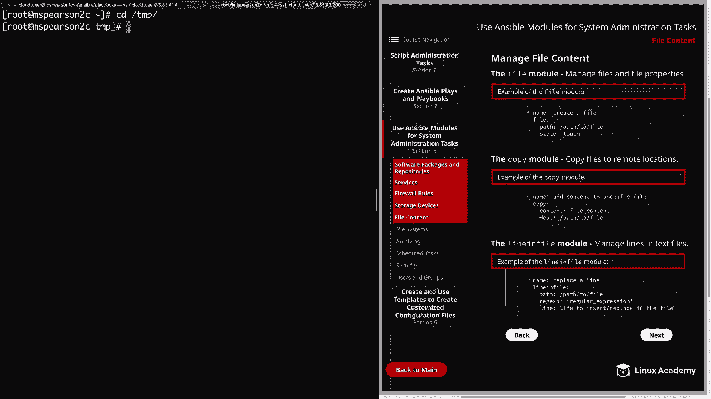

嗯。

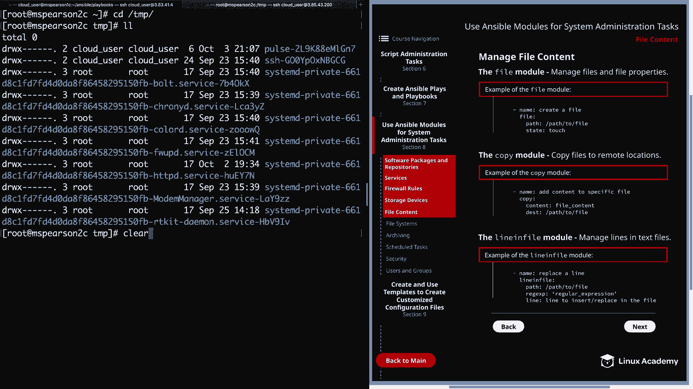

And now we can head back and run our playbook， So be Ansible playbook。And then， create dot yael。

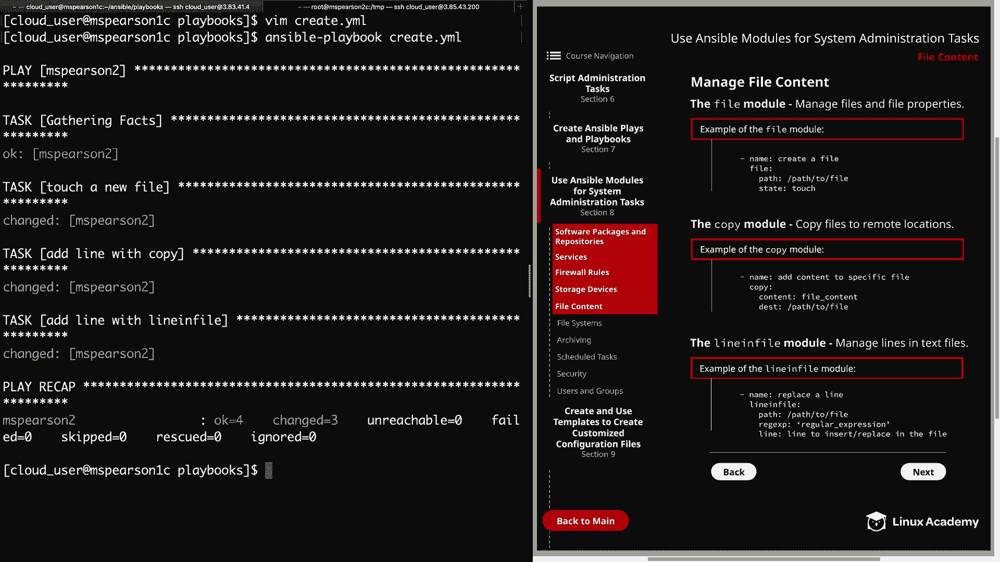

All right， so all three of our tasks ran successfully。 So now let's head back over to M。 Pearson 2。

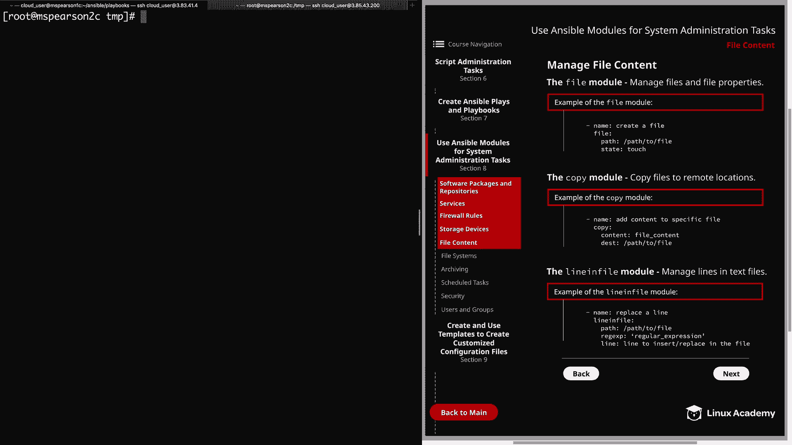

Do another listing。And we see that we have three files， we have test file one。

 test file 2 and test file 3。

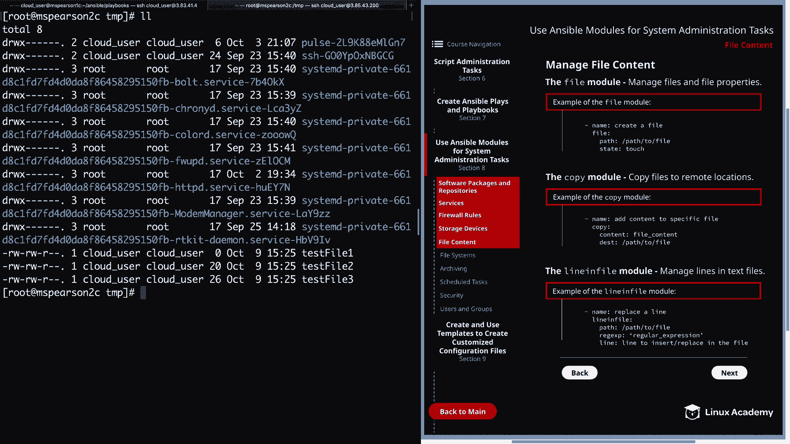

And test file 1 was created by the file module， so it should just be a blank file。 So we'll cat that。

And since the blank， we don't get any output。So let's go ahead andcaAT test file2。

And even though it's displaying before my prompt， you see added by copy module。

 so we see that file was created successful in our second task。

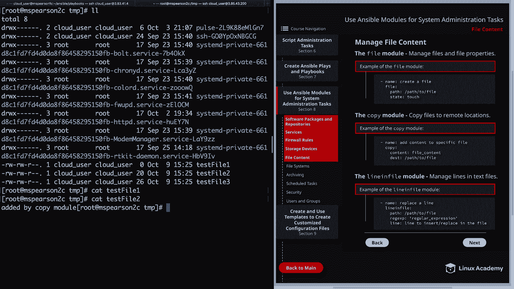

And then we can cat out test file 3。And we get our line added by line and file module。

 and I did not spell the line and file module correctly。

 but the good thing is that we did when we called it in our playbook。All right。

 let's go ahead and clear this and we can head back to our control node， clear that out as well。

 and then we can head on to the next page。

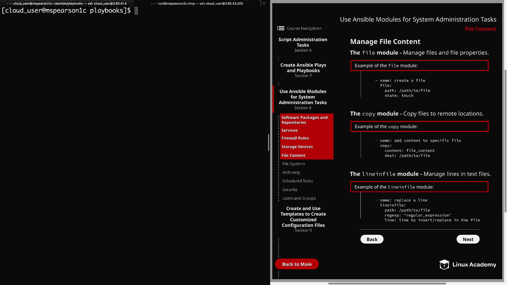

And we're going to talk about the replace module and the template module。

 So the replace module is going to replace all instances of a particular string within a file。

 So just like the line and file module， the replace module is also going to allow you to make changes to the owner。

 the group， as well as the file permissions。But unlike the line and file module。

 it's not going to stop once it replaces a single line。

 it's going to go through and find every line that matches and replace it with the given string。

 and that string can be specified using the replace parameter。

 This module also provides the before and after parameter。

 and these can be used to determine where exactly within the file that you're going to be replace the string。

 So by using before， you can specify line And once that line is found everything before that file will be replaced to the beginning of the file。

 And then after is going to allow you to find that string and then anything after that is going to replace to the end of the file。

 For our example， we're just going to specify our path。

 which is the path to the file that we're going to interact with。 and then regxp。

 which is the regular expression to match。 and then replace is going to be the string that replaces the regxp matches。

 So in the line and file module， you're going to use the line parameter。

 specify the string and in the replace module， you're going to use the replace parameter。Al right。

 so let's head back over to our command line。 We're going to open up another playbook。

 and this is just called replace dot yaml。And again， we'll be interacting with MS Pearson 2。

And this time we're going to be using the line and file and replace modules， so for our first task。

 we're going to replace a line that is in test file 2。So we'll specify the path of the file。

 and then our regular expression is going to match a line that begins with added and then grab everything in that line。

And we're going to replace it with line replaced by line and file module。 Hey。

 I spelled line and file right this time。 That's good。

And then our next task is going to replace the line in test file 3。Which I spelled a re file3。

Can't win them all。 So we're going to specify the path of the file。 And this time。

 our regular expression is going to match any line that ends with module and grab everything that comes before it。

 And then we're going to replace that with line， replace by replace module。

 Let's go ahead and save and quit。We're going to run that。

That one finished pretty quickly and looks like it was successful。

 So let's head back over to MS Pearson 2。

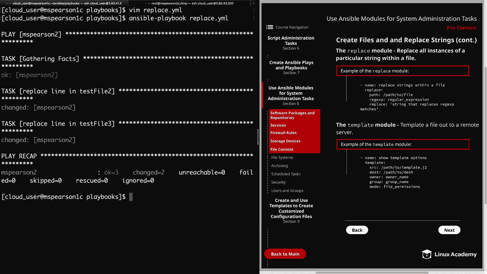

And we're going to CA test file2。And we see that the line was replaced using the line and file module。

 So let's go ahead and cat test file3。And we see that this line was successfully replaced using the replace module。

Alright， so we've seen how to create files and add some simple values to the files that we created and also how to replace those values。

 And now we come to the template module， which is actually the best way to handle complex content within a file。

 so all the template module is going to do is template out a file out to a remote server。

 And in our example here， I've provided a few parameters。 First， we have source。

 which is just going to be the path to the template。 and that does end in a dot J2 extension。

And then we have destination， which is the place we're going to be putting our templated file。

And then like many of our other modules， we have the ability to specify the owner or the group of the file。

 as well as the file permissions using mode。 So let's go ahead and clear this out。

 We'll head back to our control node。

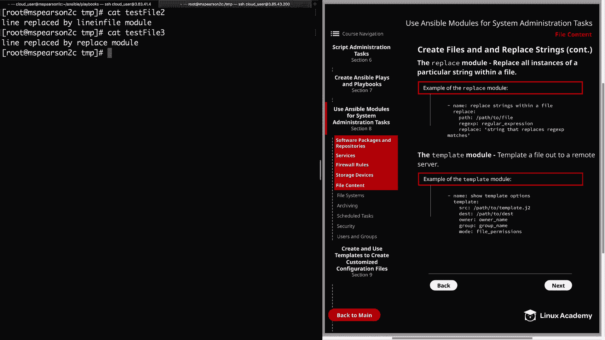

And for the purposes of this video， I went ahead and created a template in my templates directory。

 So we'll go to templates。And I call this template info。j2。

And the purpose of this template is just to gather some information about the remote host that we're pushing the file out to。

So you can see here I've got host name equals and then ansipible host name。So as you can see。

 I'm using a lot of ansible variables and all variables I'm using are actually gathered by ansible facts。

 and these are variables that are going to be available to you as long as you have fat Ga enabled。

 which you probably do because that's the behavior by default。

 So here I'm going to be grabbing the host name and I'm going to use the ansipible host name variable。

 and then I want to know the operating system。 So I'm grabbing the ansible distribution as well as the distribution version。

And then I'm going to grab the default IPV4 address as well as the default IPV6 address。

And then last， I'm going to grab the interfaces as well as the block devices。And as you can see。

 I'm adding a pipe here。And then I'm specifying join， which is a Gingja 2 filter。

 something that you can use with templates， and we'll be talking a lot more about that later on on the video on Ansible templates。

 but basically I'm saying let's get all the interfaces and then I'm going to join them together。

 and I'm going to separate them by adding a comma as well as a space。

 and I'm doing the same thing for the block devices。And for all the variables that you see here。

 you can also search for them using ansipible ad hoc command using the setup module。

 so you'll specify the setup module and then in your arguments you're going to specify filter equals and you can search for IPV4 or distribution honestly whatever you're looking for let me show you that real quick just so you can see what I'm talking about So we'll say ansible let's ansible ad hoc command。

And then set up and dash A， and we have filter。It's going to equal。

 and I'm just going to grab everything that has to do with IPV4。op。

 and I need to close my quote here。And as you can see。

 it's going to pull in all of the facts that Ansible has gathered regarding IPV4。

 so here we have the ansible default IPV4， and then I'm asking for the address that's underneath that。

 which has that value of 17231119。214。So let's go back into my template once again。

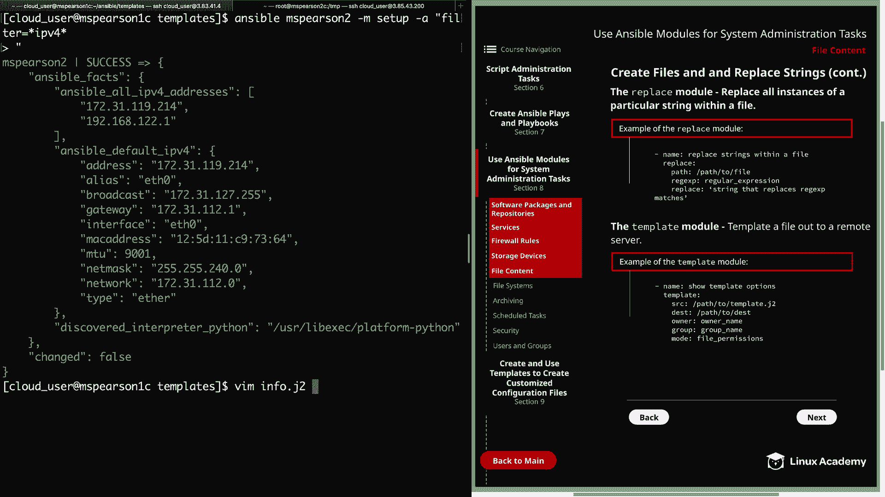

And like I said， we'll talk a little bit more about this。

 but I just wanted to mention it while we're here。I'm using the dot notation in order to specify the Ansible default IPV4 address。

 and under that I want to grab the value of address。This can also be done using block notation。

 but we'll go over that a little bit more in depth later on。So let's go ahead and quit out of this。

Then I'm going to clear。So now we need to create a playbook in order to push out our template。

 So let's set back to our playbooks directory。And I'm just going to call this template dot YMl。

We'll start with our three dashes。We're going to push this out to MS Pearson 2。

And then we can specify our tasks。And for name， I'm just going to say push out info template。

And then we'll specify our module， always very important。And then we need to specify our source。

 which is the path to our template on our control node， and that's going to be a home cloud user。

Ansible， and then templates。It's called info。t J2。And then our destination。

 and this is the destination on the remote node。We're just going to put this in temp。

 we're going to call it info。txt。That's all we need to do for this playbook。

 So let's go ahead and save and quit。Now we can run our playbook。

It's answ will playbook and then template dot Yaml。All right。

 so it looks like our task of pushing out the info template completed successfully。

 let's head over to MS Pearson 2， we're already in the temp directory。

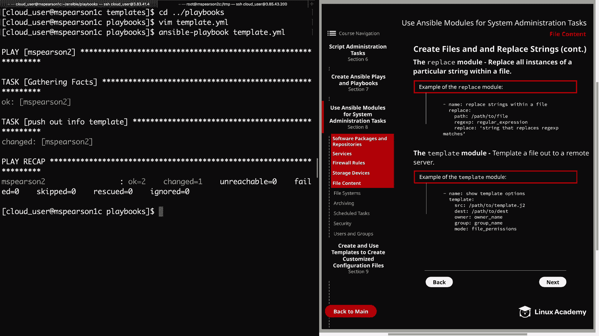

We see right there at the top， we have our info。 Txt。

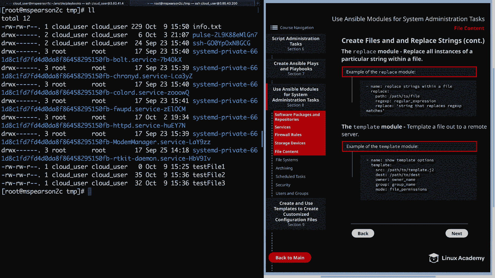

Let's go ahead and cat that out。

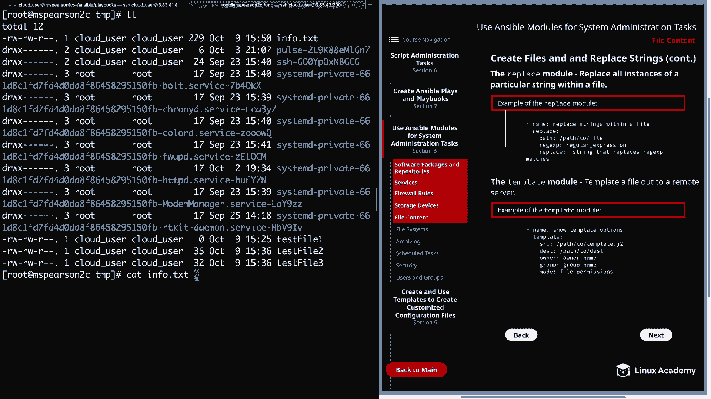

And our template was pushed out successfully， and all those variables that we referenced within our template had their values supplied by the Ansible fact。

 Once see our host name is M Pearson 2 C， the operating system is Red Ha version 80。

 We have our IPV4 and IPV6 addresses， as well as our interfaces and block devices。

 including the two that we added， which is NVME 1 and1 and MVME 2 and 1。Well。

 that's going to finish up this video on file content。

 so let's go ahead and mark the video complete and we can move on to the next section。

