# Ansible 文件内容管理：P35：使用模块管理文件内容

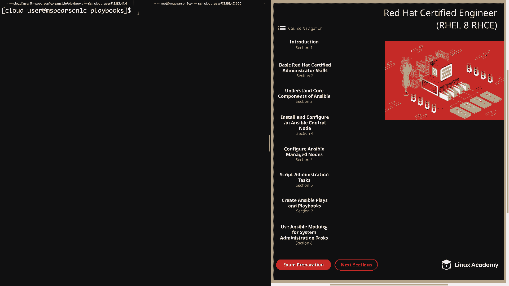

在本节课中，我们将学习如何使用 Ansible 的各种模块来管理远程主机上的文件内容。我们将涵盖创建文件、添加内容、替换文本以及使用模板生成复杂文件的方法。

上一节我们介绍了 Ansible 的基础系统管理任务，本节中我们来看看如何具体操作文件内容。

## 文件模块：创建空文件

首先，我们将介绍 `file` 模块。这个模块主要用于管理文件和文件属性。在本视频中，我们仅使用它来创建一个空文件。

在以下示例中，我们指定文件的路径，并将状态设置为 `touch`，这意味着需要创建该文件。当然，`file` 模块也可以修改权限、管理目录和符号链接，但在此示例中，我们只关注创建空白文件。

**示例代码：**
```yaml
- name: 创建空白文件
  file:
    path: /tmp/test_file1
    state: touch
```

## 复制模块：复制内容到文件

接下来是 `copy` 模块。它用于将文件复制到远程位置。你不仅可以从本地控制节点复制，还可以在远程主机之间复制文件。

要从远程主机上的源位置复制，需要使用 `remote_source` 参数，否则 Ansible 会在本地机器上查找源文件。

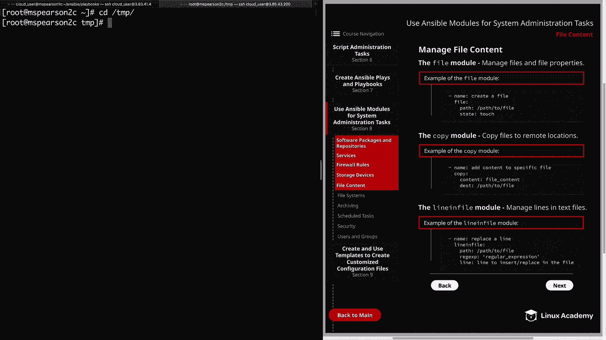

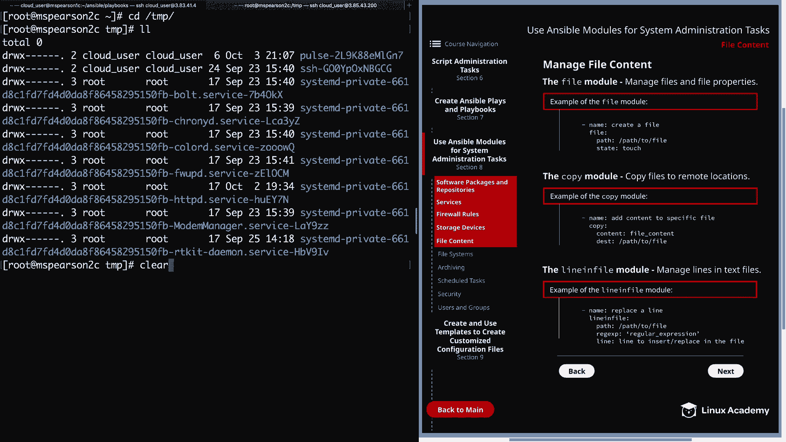

我们将重点关注 `content` 和 `destination` 参数。当使用 `content` 参数而非 `source` 参数时，它会将文件内容设置为 Playbook 中该参数指定的值。但这仅适用于简单的值。对于更复杂的内容，我们将使用稍后讨论的 `template` 模块。

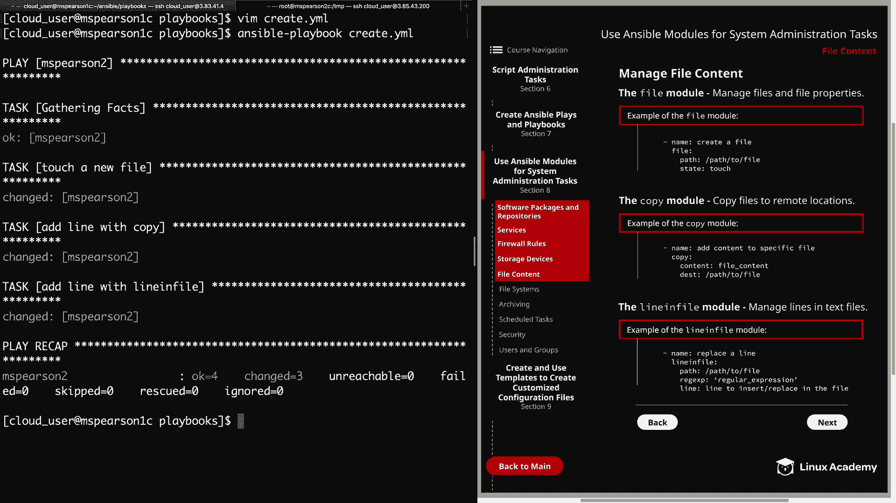

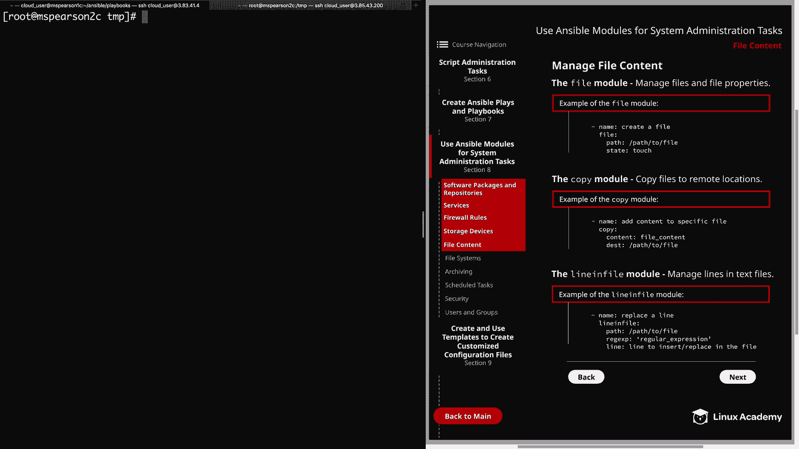

**示例代码：**
```yaml
- name: 使用 copy 模块创建文件并添加内容
  copy:
    content: "由 copy 模块添加"
    dest: /tmp/test_file2
```

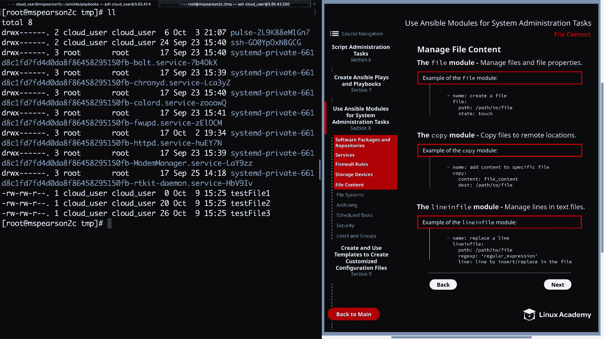

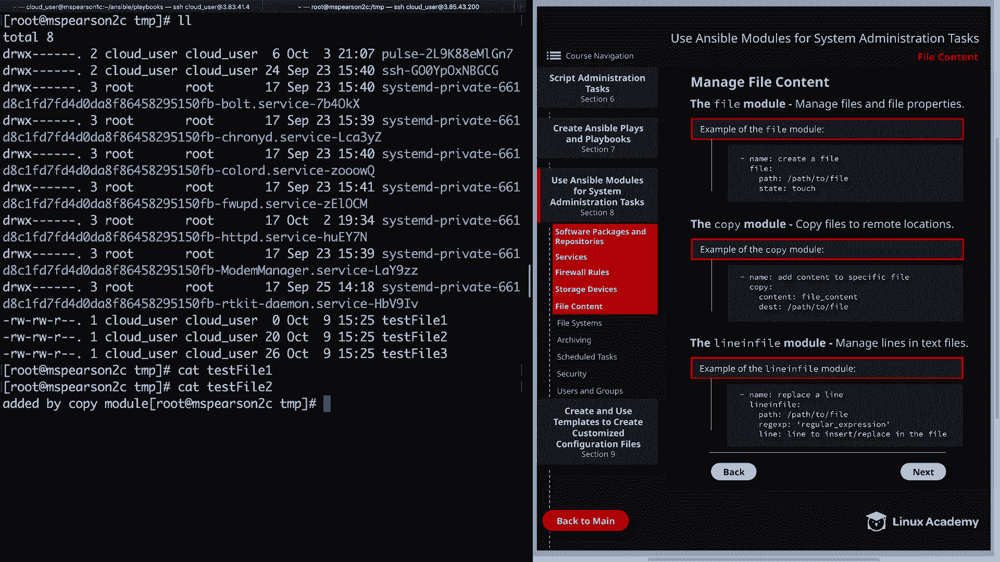

## Lineinfile 模块：管理文本文件中的行

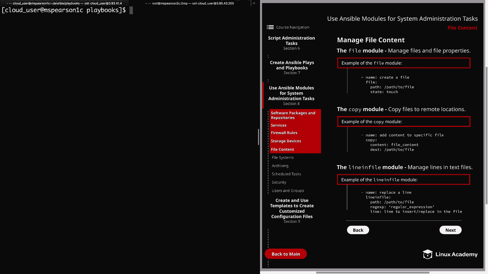

`lineinfile` 模块用于管理文本文件中的行。该模块的默认行为是查找由正则表达式（`regexp` 参数）指定的字符串，并将其替换为 `line` 参数指定的行。

如果未找到匹配的行，则该行将被添加到文件末尾。你也可以指定 `insertbefore` 或 `insertafter` 参数，并结合正则表达式，以便在匹配行之前或之后添加新行。

该模块还可以设置其他选项，如用户和组所有权、文件权限。`create` 参数可用于在文件不存在时创建文件并添加行，这与使用 `copy` 模块的 `content` 参数非常相似。

**示例代码：**
```yaml
- name: 使用 lineinfile 模块创建文件并添加行
  lineinfile:
    path: /tmp/test_file3
    line: "由 lineinfile 模块添加"
    create: yes
```

## 实践演练：创建文件的 Playbook

现在我们已经讨论了几个模块，让我们转到命令行，在 Playbook 中尝试它们。

我已经为此示例创建了一个名为 `create.yml` 的 Playbook，让我们一起查看一下。

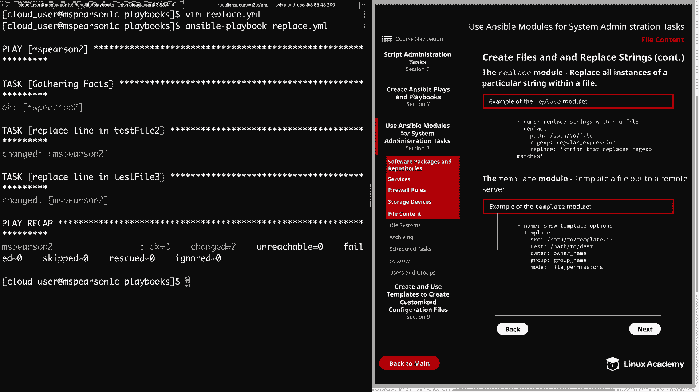

**Playbook 内容：**
```yaml
---
- hosts: mspearson2
  tasks:
    - name: 创建新文件（touch）
      file:
        path: /tmp/test_file1
        state: touch

    - name: 使用 copy 模块创建文件并添加行
      copy:
        content: "由 copy 模块添加"
        dest: /tmp/test_file2

    - name: 使用 lineinfile 模块创建文件并添加行
      lineinfile:
        path: /tmp/test_file3
        line: "由 lineinfile 模块添加"
        create: yes
```

运行此 Playbook 后，我们可以在远程主机上验证三个文件是否已按预期创建和填充内容。

## Replace 模块：替换文件中的字符串

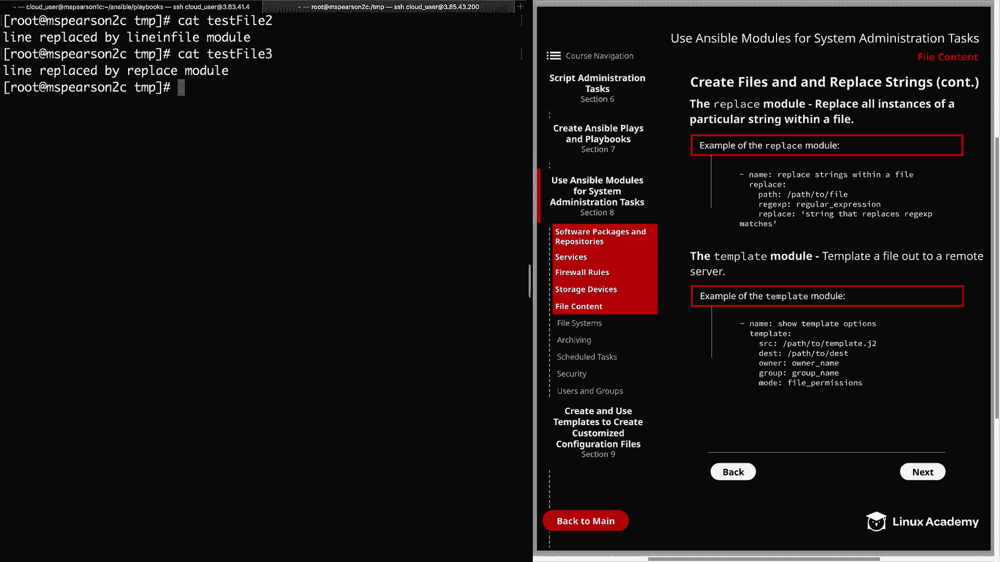


现在我们来讨论 `replace` 模块和 `template` 模块。`replace` 模块用于替换文件中特定字符串的所有实例。

与 `lineinfile` 模块类似，`replace` 模块也允许你更改文件的所有者、组和权限。但与 `lineinfile` 不同的是，它不会在替换一行后停止，而是会遍历文件，找到所有匹配的行并将其替换为给定的字符串，该字符串由 `replace` 参数指定。

此模块还提供了 `before` 和 `after` 参数，用于确定在文件中替换字符串的确切位置。使用 `before`，你可以指定一行，找到该行后，该行之前的所有内容将被替换到文件开头。使用 `after`，找到该字符串后，该字符串之后的所有内容将被替换到文件末尾。

**示例代码：**
```yaml
- name: 使用 replace 模块替换内容
  replace:
    path: /tmp/test_file3
    regexp: '.*module$'
    replace: "由 replace 模块替换的行"
```

## 模板模块：处理复杂内容

最后是 `template` 模块，这是处理文件中复杂内容的最佳方式。`template` 模块的作用是将一个模板文件渲染后推送到远程服务器。

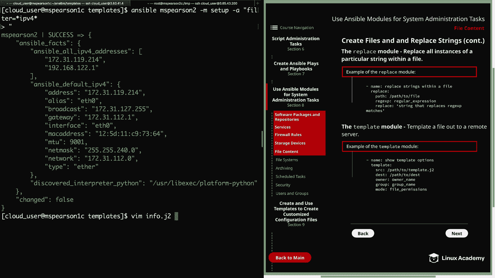

在我们的示例中，我们提供了几个参数。首先是 `src`，它是模板文件的路径，通常以 `.j2` 扩展名结尾。然后是 `dest`，即我们要放置渲染后文件的目标位置。与其他模块一样，我们可以指定文件的所有者、组以及使用 `mode` 设置文件权限。

模板可以使用 Jinja2 语法嵌入 Ansible 变量和事实，从而动态生成内容。

**示例代码：**
```yaml
- name: 推送信息模板
  template:
    src: /home/cloud_user/ansible/templates/info.j2
    dest: /tmp/info.txt
```

一个示例模板文件 `info.j2` 可能包含如下内容，用于收集远程主机信息：
```
主机名 = {{ ansible_hostname }}
操作系统 = {{ ansible_distribution }} {{ ansible_distribution_version }}
默认 IPv4 地址 = {{ ansible_default_ipv4.address }}
默认 IPv6 地址 = {{ ansible_default_ipv6.address }}
接口 = {{ ansible_interfaces | join(', ') }}
块设备 = {{ ansible_devices.keys() | list | join(', ') }}
```

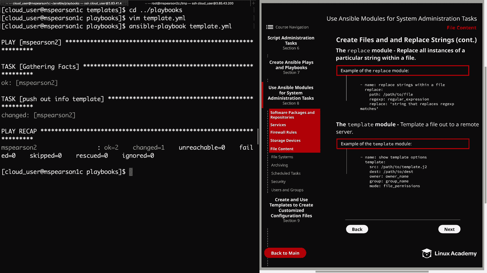

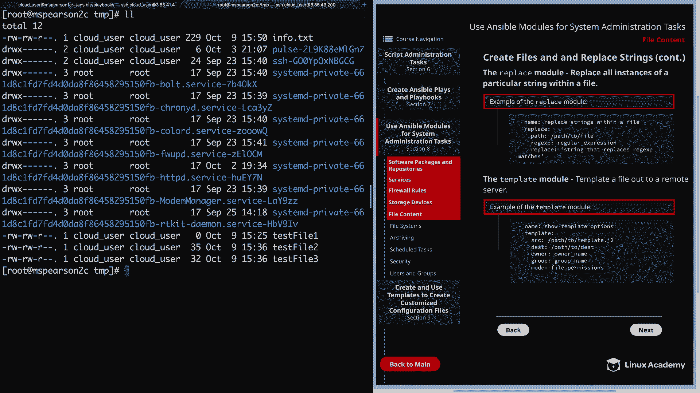

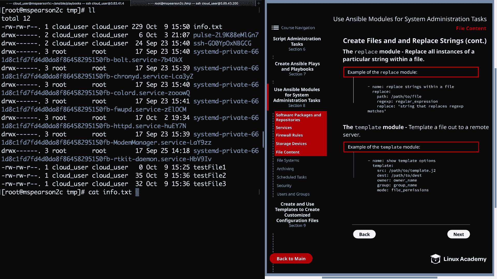

运行包含此任务的 Playbook 后，将在远程主机上生成包含动态信息的 `info.txt` 文件。

本节课中我们一起学习了使用 Ansible 管理文件内容的核心模块。我们掌握了如何使用 `file` 模块创建空文件，使用 `copy` 和 `lineinfile` 模块添加简单内容，使用 `replace` 模块进行全局替换，以及使用强大的 `template` 模块基于变量和事实生成复杂的配置文件。这些技能是进行自动化系统配置和管理的基础。