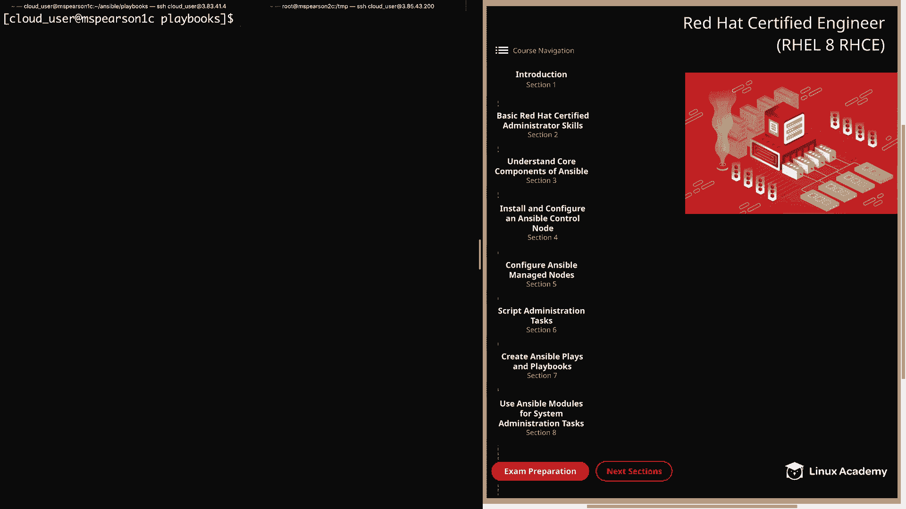
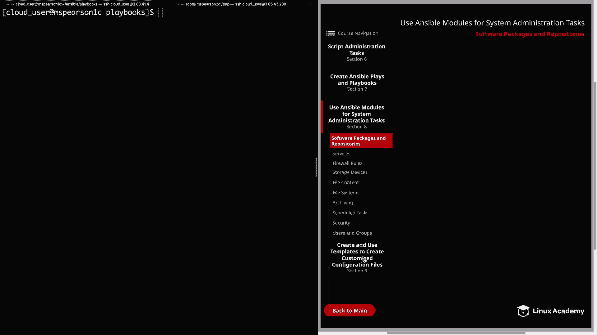
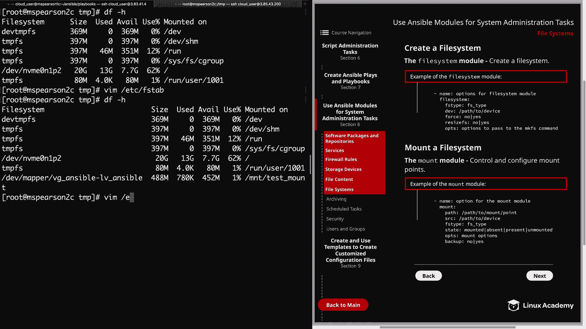
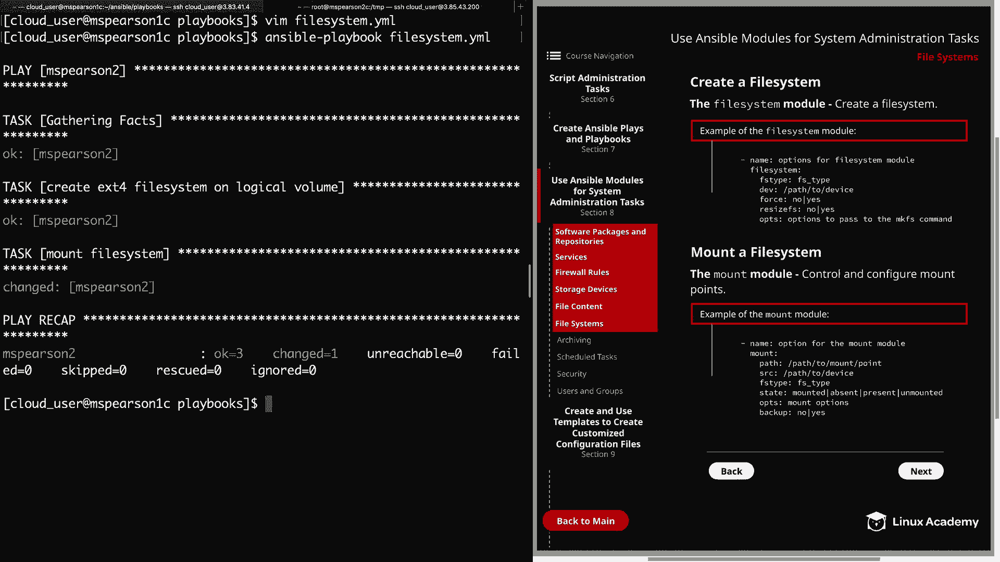
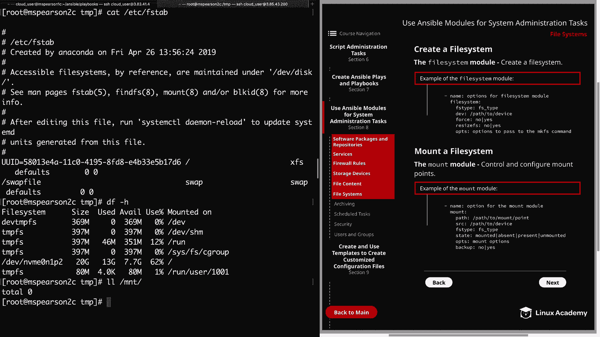

# Red Hat Certified Engineer (RHEL 8 RHCE) - P36：388-4873-6 - File Systems - 11937999603_bili - BV12a4y1x7ND

Welcome back， everyone。 This is Matt。 and in this video。

 we're going to be talking about file systems and how we can use ansible modules in order to create them on devices and also mount them。

 So let's head back down to section 8。

And then we can click on file systems。

And we're going to start by talking about the file system module。

 so the file system module just allows you to create a file system。

 and in the diagram Ive provided a list of options that you can pass to the file system module。

 the first is going to be FS type， which is the file system type that you want to create so this could be anything from EXT4 to XFS or But FS as well as many others that are supported。

Next is the path to the device or the image file that you would like to create the file system on。

And then we have force， which will allow you to create a new file system on a device that already has an existing file system。

 Next， you can specify whether or not you want to resize the file system with resize FS。

 and this is just going to resize the file system to match the device in case they differ。

And then lastly， the Ops parameter allows you to provide a list of options to pass to the MKFS command。

So now let's head over to the command line and we can check this out in action。

So I'm currently in my playbooks directory。And we need to create a new playbook for our file system。

 And we're just going to call this file system dot YMl。We'll start out with our dashes。

And we're going to be interacting with。MS Pearson 2， which is continuing to be our guinea pig。

We'll specify become yes， and then our tasks。And the description for this is just going to be create。

E Xt4 file system。All logical volume。We'll be using the file system module。

And to create this file system， we only need two parameters。 First is FS type。

we're going to specify EXt4。And then dev， which is the path to the device。

 and we're going to specify our logical volume that we created in the last video。

 It's going to be in devv Mapper， VG， underscore Ansible。Dash L V underscore answerable。

And that's all we need to do in order to create this。 Let's go ahead and save。And then we can quit。

And then we can kick off our playbook。And that playbook executed successfully。

 So now let's head over to MS Pearson 2 and I've already logged in as the root user。

I to run and block ID。And if you'll notice right here in the middle。

 we have dev Mapper VG underscore Ansible， LV Ansible。

 and it's going to provide us with our UUI and also show that we have an EXT4 file system。Al right。

 so now that we have created our file system on our logical volume。

 now we need to mount this file system。 But before we do that。

 let's go ahead and talk about the mount module， which is used to control and configure mount points。

 So at the bottom of this page on our diagram， I have provided an example of the mount module and some of the parameters that you can pass。

And the first parameter that we need to specify is the path to our mount point。

 and if the mount point does not exist， it will be automatically created whenever mounted is specified in the state option。

 then we need the path to the device that we're mounting on our mount point。

 and this is specified using source。And then FS type is going to be used to specify the type of file system on the device and is required whenever the state is set to mounted or present。

 and then state is going to provide you with four options。 We have mounted， absent。

 present or unmounted， and mounted causes the device to be actively mounted and will also configure an entry in FS tab and as we already said。

 will create the mount point if it doesn't exist。Unmounted is going to unmount the device。

 but is not going to change the Fs tab entry。 and then present is only going to configure the Fs tab entry for the device。

 but the device itself will not be mounted。 And then last， we have absent。

 and this option is going to remove the entry from Fs tab。 It's also going to unmount the device。

 And then finally， remove the mount point。Next， we have ops and this allows for additional amount options to be specified。

 and then finally backup can be specified to create a backup of your FS tab just in case you mess up the original with your configurations。

Alright， so now let's go ahead and add another task or a playbook that's going to Mo file system。

But before we do that， let's go ahead and make sure that the device is not currently mounted and that we don't have an entry for it within the atCfS tab。

ButCl this out。 So let's just run a quick D F dash H。

 and we see that our logical volume is not currently mounted anywhere。

 and then we can do them on E C FS tab。Current， we only have an entry for our root device and swap。

Let's go ahead and back out of this and then we can head over to MS Pearson 1， our control node。

Let's open fileystem。 YMl up again。And let's add additional task to mount our file system。

For the description， we're just going to say mount file system。We're going to use the amount module。

And the path is going to be mount。 And then we're just going to call this test underscore mount。

The source will be dev Mapper。And then VG_ ansible dash Lv_ Ansible。An FS type is going to be AX D4。

And for state， we want to choose mounted。Let's go ahead and do a backup as well。

So we'll say yes for that。Now we can go ahead and save and quit， and we can rerun our playbook。

And we see that our first task create EXD4 file system on our logical volume just says OK。

 so it didn't have to make a change there， and then our mount file system task， we do have a change。

So let's head back over to MS Pearson 2 and see if our file system was mounted。All right。

 we'll go ahead and run our Df dash H。And we see the dev Mapper VG Ansible LV Ansible has been mounted on mount test mount。

Then we can go ahead and open up our ECFS tab。

And we see a new entry at the bottom。That includes our device and our mountpoint。Gout out of this。

Let's also check and see if our FS tab was indeed backed up。So as you can see。

 we have our new FS tab， as well as our backup。 So if we want to。

 we can go ahead and do a diff on that Etsy FS tab， and then Etsy FS tab。

And we see the only difference is our new entry。All right， so let's head back to Emma Pearson 1。

We're going to open up our playbook again。 and now let's go ahead and remove our mount by changing the state from mounted。

Two absent。We can kick that off again。And our mount file system tested have a change。

 so let's go ahead and see if that was removed。

So we're back on MS Pearson 2。And we can count at CFS tab。

And we see that our latest entry has been removed。O the RDF dash H。

We see that the file system was unmounted。 just for good measure。

 let's go ahead and do a listing on the mount directory and we see that our mount point was also removed。

 Well， that's going to finish up this video on creating file systems and mounting file systems so let's go ahead and mark it complete and we can move on to the next lesson。

