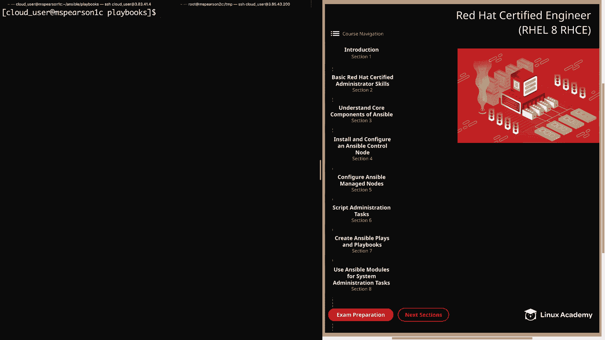
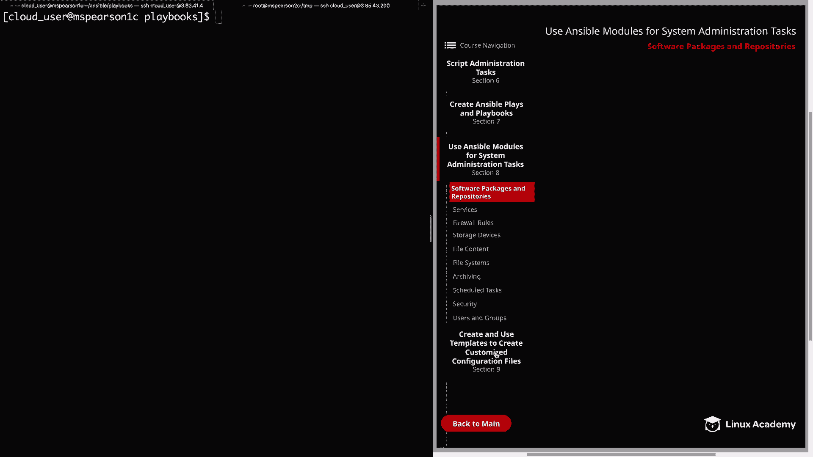
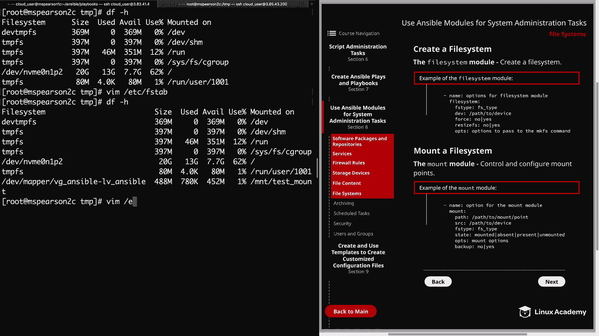
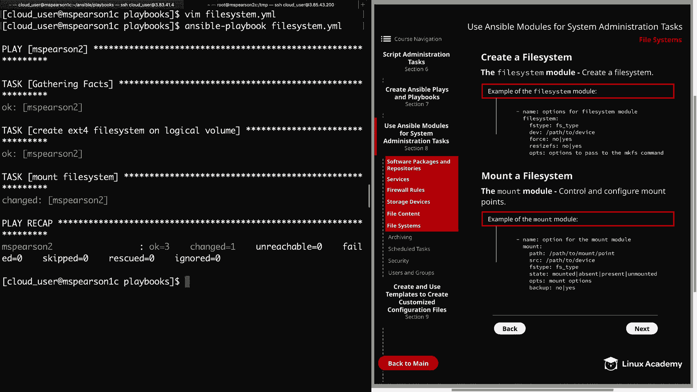
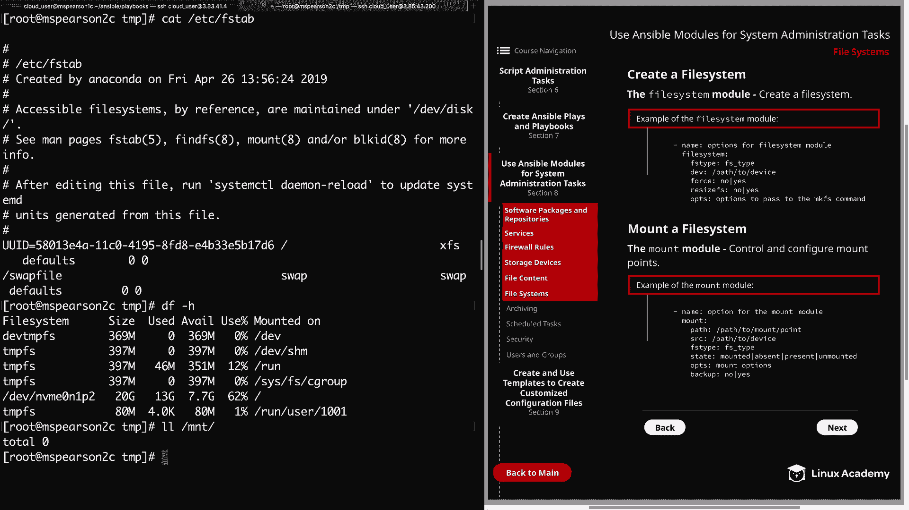

# Ansible文件系统管理：P36：文件系统创建与挂载





在本节课中，我们将学习如何使用Ansible的模块来创建文件系统并将其挂载到设备上。我们将重点介绍`filesystem`模块和`mount`模块的用法。

## 概述

我们将通过一个具体的示例，演示如何在逻辑卷上创建EXT4文件系统，然后将其挂载到指定的目录，并管理`/etc/fstab`中的挂载配置。

---

## 文件系统模块 (`filesystem`)

上一节我们介绍了Ansible的基础知识，本节中我们来看看如何使用`filesystem`模块创建文件系统。

`filesystem`模块用于在块设备（如磁盘分区或逻辑卷）上创建文件系统。以下是该模块的主要参数：

*   **`fstype`**: 指定要创建的文件系统类型，例如`ext4`、`xfs`或`btrfs`。
*   **`dev`**: 指定要在其上创建文件系统的设备或镜像文件的路径。
*   **`force`**: 允许在已有文件系统的设备上强制创建新文件系统。
*   **`resizefs`**: 如果设备大小与文件系统大小不一致，此选项将调整文件系统以匹配设备。
*   **`opts`**: 提供传递给`mkfs`命令的额外选项列表。

现在，让我们在命令行中实际操作。

首先，创建一个名为`filesystem.yml`的Playbook。

```yaml
---
- name: 在逻辑卷上创建并挂载文件系统
  hosts: mspearson2
  become: yes
  tasks:
    - name: 在逻辑卷上创建EXT4文件系统
      filesystem:
        fstype: ext4
        dev: /dev/mapper/vg_ansible-lv_ansible
```

保存并运行此Playbook。执行成功后，登录到目标主机`mspearson2`，使用`blkid`命令可以验证逻辑卷`/dev/mapper/vg_ansible-lv_ansible`上已成功创建了EXT4文件系统。

---

## 挂载模块 (`mount`)

创建好文件系统后，下一步是将其挂载到目录以便访问。本节我们将学习使用`mount`模块来管理挂载点。

`mount`模块用于控制和配置挂载点。以下是其核心参数：

*   **`path`**: 指定挂载点路径。如果挂载点不存在，且`state`设为`mounted`，则会自动创建。
*   **`src`**: 指定要挂载的设备路径（即`source`）。
*   **`fstype`**: 指定设备上的文件系统类型。当`state`为`mounted`或`present`时必需。
*   **`state`**: 定义挂载状态，有四个选项：
    *   **`mounted`**: 激活挂载设备，并在`/etc/fstab`中配置条目。如果挂载点不存在则创建。
    *   **`unmounted`**: 卸载设备，但不改变`/etc/fstab`中的条目。
    *   **`present`**: 仅在`/etc/fstab`中为设备配置条目，但不立即挂载设备。
    *   **`absent`**: 从`/etc/fstab`中移除条目，卸载设备，并删除挂载点目录。
*   **`opts`**: 指定额外的挂载选项。
*   **`backup`**: 设置为`yes`时，会在修改`/etc/fstab`前创建备份文件。

在挂载之前，我们先在目标主机上检查设备是否已挂载，以及`/etc/fstab`中是否有相关条目。使用`df -h`和`cat /etc/fstab`命令进行确认。

现在，我们在之前的Playbook中添加挂载任务。

```yaml
    - name: 挂载文件系统
      mount:
        path: /mnt/test_mount
        src: /dev/mapper/vg_ansible-lv_ansible
        fstype: ext4
        state: mounted
        backup: yes
```

保存并重新运行Playbook。任务执行后，返回目标主机验证：
1.  使用`df -h`命令，可以看到设备已挂载到`/mnt/test_mount`。
2.  使用`cat /etc/fstab`命令，可以看到底部已添加了对应的挂载条目。
3.  使用`ls /etc/fstab*`命令，可以看到原始的`/etc/fstab`文件已被备份（例如为`/etc/fstab.xxxxx`）。

---

## 卸载与清理

为了演示`state: absent`的功能，我们将修改Playbook中的挂载任务状态。



将挂载任务中的`state: mounted`改为`state: absent`，然后再次运行Playbook。

```yaml
    - name: 卸载并清理文件系统挂载
      mount:
        path: /mnt/test_mount
        src: /dev/mapper/vg_ansible-lv_ansible
        fstype: ext4
        state: absent
```

执行后，在目标主机上验证：
1.  使用`cat /etc/fstab`命令，确认之前的挂载条目已被移除。
2.  使用`df -h`命令，确认文件系统已被卸载。
3.  使用`ls /mnt/`命令，确认挂载点目录`/mnt/test_mount`也已被删除。



---

## 总结



本节课中我们一起学习了Ansible管理文件系统的核心操作。
我们首先使用`filesystem`模块在逻辑卷上创建了EXT4文件系统。
接着，我们使用`mount`模块将创建好的文件系统挂载到指定目录，并成功在`/etc/fstab`中配置了持久化挂载，同时学会了备份重要配置文件。
最后，我们通过将状态改为`absent`，演示了如何完整地卸载文件系统、清理`/etc/fstab`条目并删除挂载点。
这些技能是自动化管理Linux服务器存储的基础。