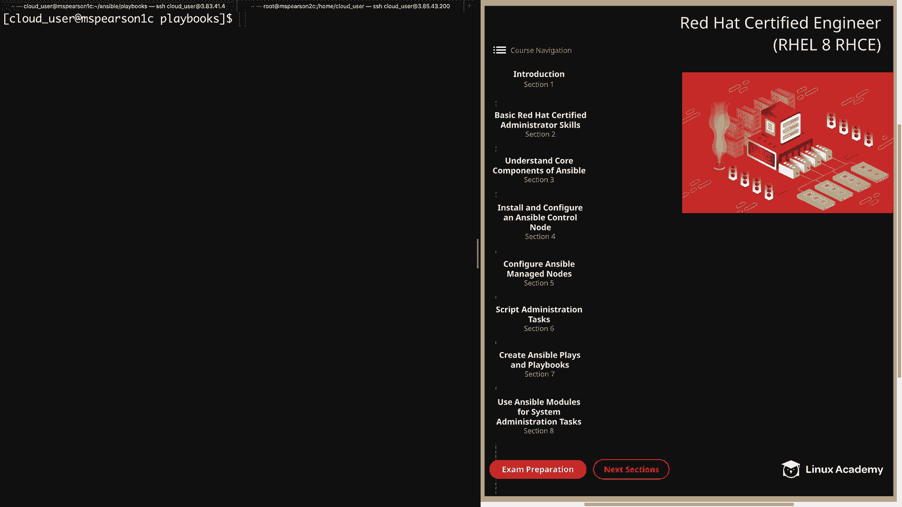
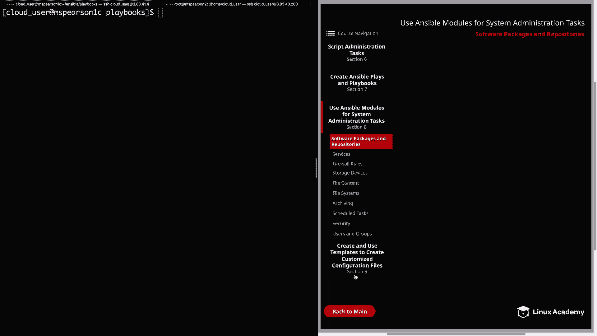
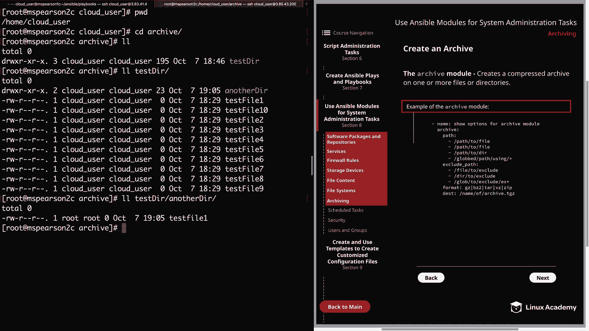
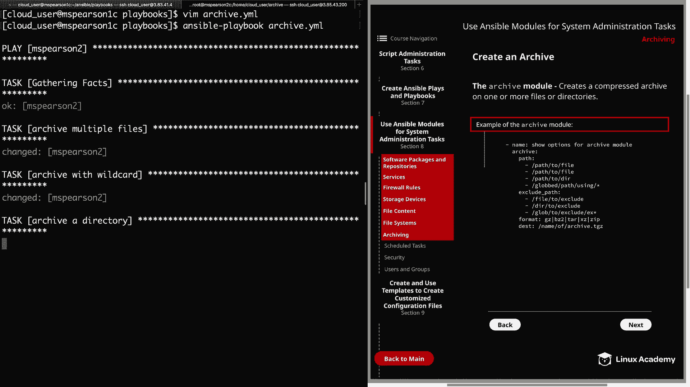
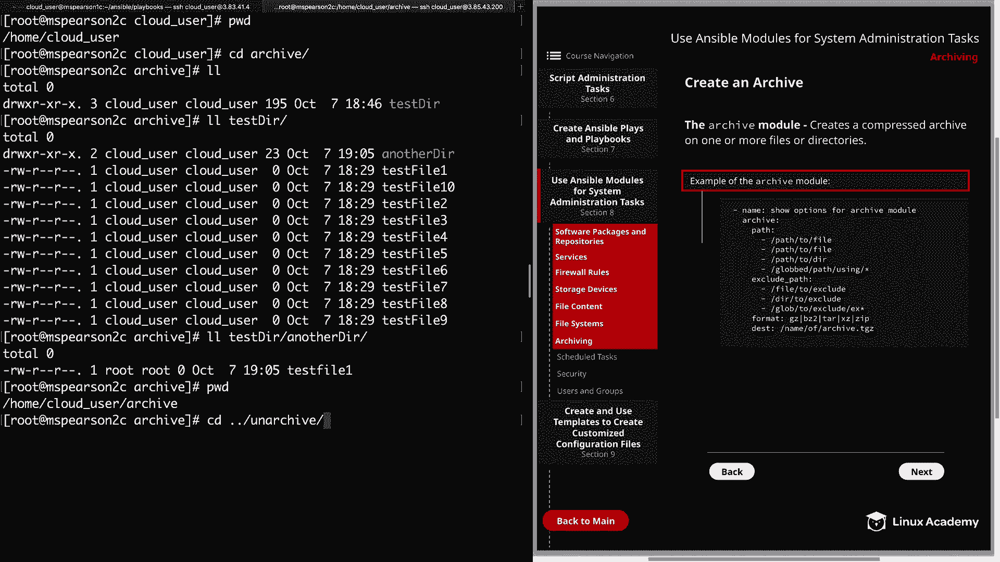
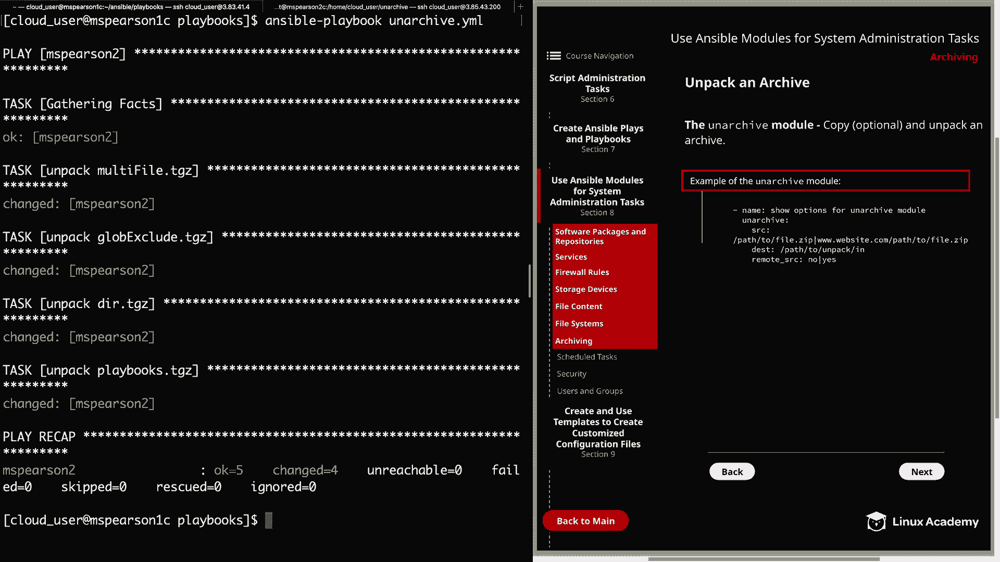
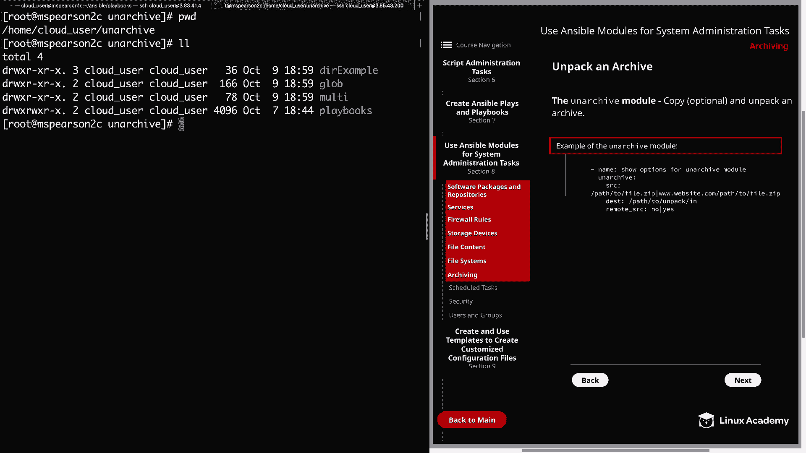
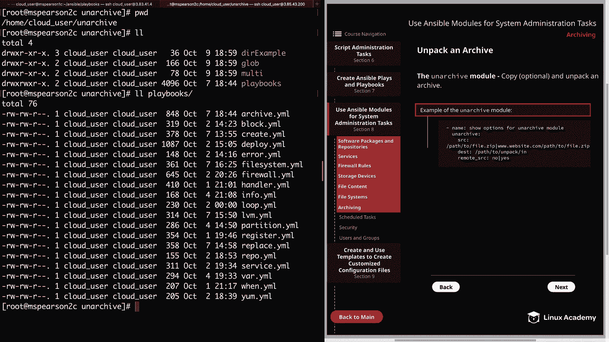

# Red Hat Certified Engineer (RHEL 8 RHCE) - P37：388-4873-7 - Archiving - 11937999603_bili - BV12a4y1x7ND

Welcome back everyone， this is Matt and in this video we're going to talk about another common task that is expected of a system administrator and that is creating archives and also unpacking those archives。

So let's head back over to section 8。

And we can click on archiving。First we're going to talk about creating an archive and this is done using the archive module。

 so this is going to create a compressed archive on one or more files or directories。

I've also provided an example of the archive module。And the first option is path。

 which allows you to list the absolute path， Gob or list of paths or Gloobs for the files to compress or archive。

 and by the same token， you can use the exclude path option to exclude files and directories。

So if we take a look over here under Pa， I've provided just a list of a couple examples。

 so path the file， path the file， then path the directory， as well as a G path using the asterisks。

And I've done the same under exclude path。 So we have a file you might want to exclude or a directory to exclude。

And then also excluding files to begin with the same letters， again， using an asterisk。Next。

 we have the format option and this allows you to specify the type of compression you would like to use。

And this can be anything from G zipip and B zipip all the way to just regular plane zip。

 And then lastly， we have destination， which is where you're going to specify the name of your archive and where you want it to go。

In addition to the options I've listed here， you can also specify the owner or group of the archive。

 as well as the mode， which is going to set those file and directory permission。

 and also any attributes which you would set using the E C H adder command。

 And then one other option I wanted to mention was remove。

 And that's going to remove files and directories listed once they've been added to the archive。

 All right。 So now let's head over to the command line。

AndI'm going to open up a playbook that I've already created， which is just called archive。 Yl。

I have multiple files。 So here we specify archive， and then for our path。

 we just specify the path to test file 2，4， and 6。 So we're going to create the archive and also compress that using G zip。

And then the destination is going to be in home cloud user unarchive multi。

 and then it's going to be called multi file。 tGc， and this is going to be on MS Pearson 2。

And next I provide an example of archiving with a wild car。So again。

 we'll specify our path and for this archive we're going to。

And we're going to call the archive Gob exclude TgZ and put it in our Gob directory。

 And then the last task is to archive a directory。And for this。

 I've just specified the path to the directory， which is tester format's going to be GeeZ。

And then the name will be D do TGZ。 And we're going to be putting it in Dr example。 All right。

 so before we run this， I did want to jump over to M S Pearson 2 and show you where these files and directories exist because this is all happening on our M S Pearson 2 manage node。

Let's head it over to our second tab， I'm currently in the cloud Users's Home directory。

Zoom a CD into our archive directory。And as you can see， I have a directory called Tester。

So we'll do a listing on that。And then within this directory， I've specified 10 files。

 test file 1 through 10。And have've also added another directory， aptly named another dur。

And within that director， we have added just a single file called test file 1。 All right。

 so let's head back to our playbook。

AndAs you can see， all of our paths and exclude paths are all referencing files and directory within Home Cloud Use Arch Tester。

And we're going to be creating those archives within home cloud user unarchive。

 So let's go ahead and quit out of this。And then we can run Ansible playbook。

And then archive dot Yaml。

And it looks like each of our tasks executed successfully， so let's head back over to MSParson 2。

And we're currently in the archive directory， so let's Cd into Unarchive。

We see that we have deer example， Gob and multi。Let's see if our archives were successfully copied here。

 I'll just do LL asterisktri。And we see under D example， we have DR do tGC and under Gob。

 we have Gob exclude do tGC， and finally under multi， we have multi file。 tGZ。All right。

 so now that we validated that our Rs were successfully created。Let's head over to the next page。

 and we can talk about unpacking an archive。So in order to unpack an archive。

 you need to use the unarchived module and you can also optionally copy the archive before you unpack it。

 So here in the example of the unarchived module， Ive provided three parameters First we have source。

And this is going to be the path to the archive。And also wanted to show you that in addition to just a path on the remote or local server。

 you can also specify URL。 and then next you can specify the destination。

 the place you're going to unpack the archive in。And then lastly， we have remote source。

 which can be set to no or yes。 It's going to be no by default。 And so if you set this to yes。

 it's going to indicate that the archive file is already on the remote system and is not local to the Ansible controller。

 And for us， this is going to be yes， since all of our archive files are on M S。 Pearson 2 C。

 which is one of our managed node。 So let's head back over to our command line。

 Then we can head to M S。 Pearson 1。And then we can open up our playbook using the unarchived module。

It called unarchived。tyl。Let's go ahead and walk through this playbook together as well。

So once again， we're going to be executing against MS Pearson 2 and we're going to become the root user。

 and then we're going to specify four separate tasks， the first is to unpack the multi file。 tGC。

So we'll specify the unarchived module and give our source， which is in unarchived multi multiphi。

 tgc， and the destination in which one unpack is going to be in the multi directory。

And we need to specify that this is a remote source because this is living on MS Pearson 2 and not our control node。

And next we're going to unpack the Lab exclude。 TGZ。So we'll specify an archive again。

 and the source this time is going to be Gob， Gloob excludelude do tgZ。

 and we're going to unpack that in un archive Gob again specifying that it's remote。

 and then we're going to unpack the D do tgZ， so we'll specify the location again。And also。

 the place we want to unpack it and then remote， yes。And here in this last example。

 we're going to unpack playbooks。tgZ。And the only difference between this task and the previous ones is that we're actually going to be unpacking this from the control node。

 so playbooks。 tgZ is actually living on MS Pearson 1。

And we're going to be unpacking that on MS Pearson 2 and Home Cloud user on archive。

 and we do this by specifying remote source， no。All right， so let's go ahead and quit out of this。

And before we run our playbook， I did want to show you the playbooks。tgc， so it's in home。

 cloud_ user， Ansible。we see right there in red playbooks。tgc。

So now let's go ahead and run our unarchived playbook。

And it appears that our playbook ran successfully， So let's head over to M Pearson 2。

 and we can validate that。

So remember， we're in the unarchived directory。Home cloud user unarch。

 and there are three directories inside sight here， which is du example Gloob and multi。

 and each one of these directories has an archive。So let's go ahead and clear this first。

 let's go ahead and look at D example and we see that the test Dur directory unpacked successfully。

 So we'll go ahead and do a listing on that as well， and we see that it pulled in another dur also。

All right， so next let's go ahead and check out Gob。And remember that when we made the archive。

 we pulled in everything that started with test file， but we excluded test file 2 and test file 4。

 so we see that 13，5，678910 were all pulled in， but test file2 and test file 4 were excluded。

So that archive was packed and unpacked successfully。We'll go ahead and clear。

 now let's go ahead and do a listing on multi。And we see that all the files that we specified for this archive。

 which was test file 2，4， and 6， were all successfully packaged and unpacked。

And that finishes out all of the remote archives that we had。

So now let's do a listing on the current directory were in， which is unarch。

And that's where we specified that we'd like to unpack the playbooks。 tgZ from our control node。

Let's go ahead and do a listing。And we see a playbooks directory。

And we see a list of all the playbooks that was unpacked from that archive。Well。

 it's going to wrap up this video on archiving， so let's go ahead and market complete and we can move on to the next lesson。

