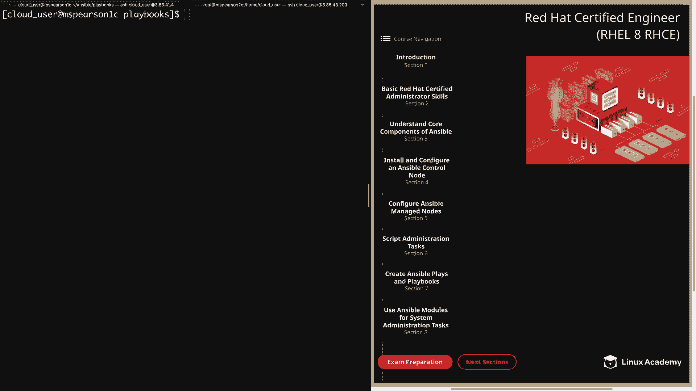
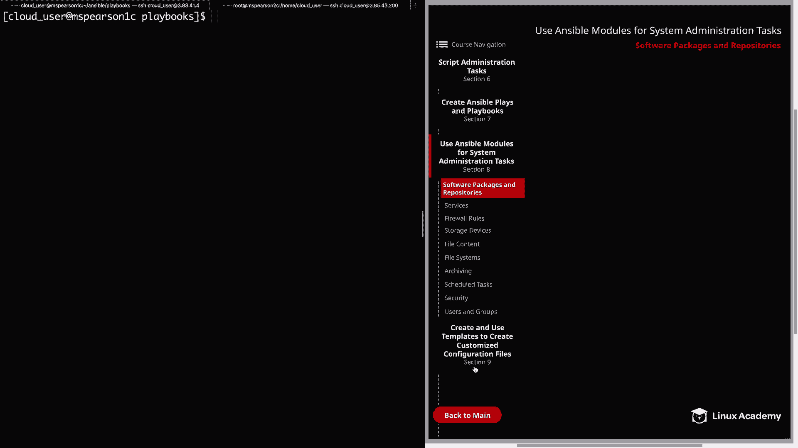
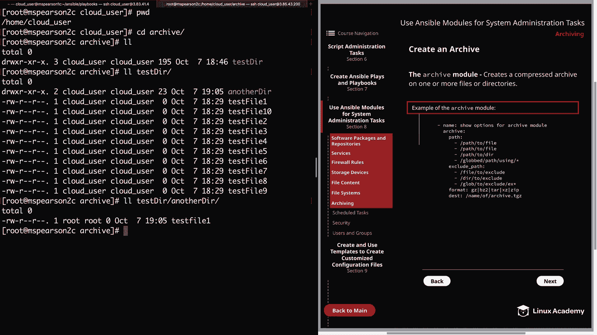
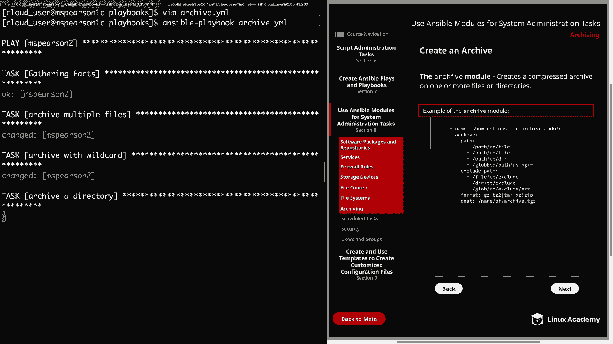
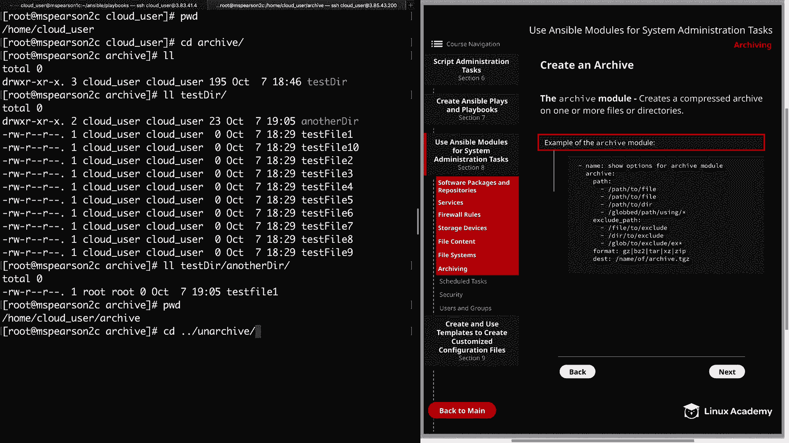
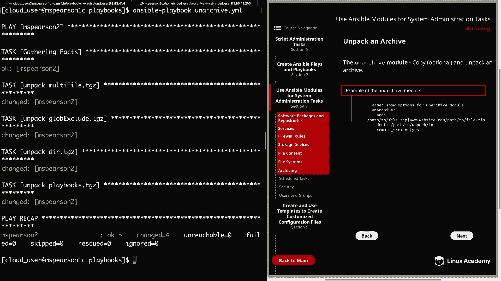
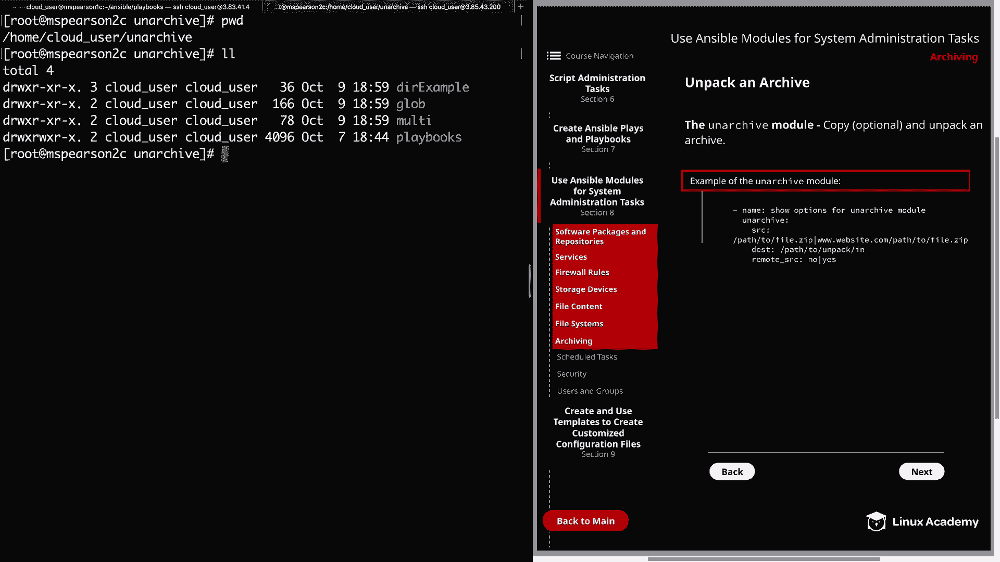
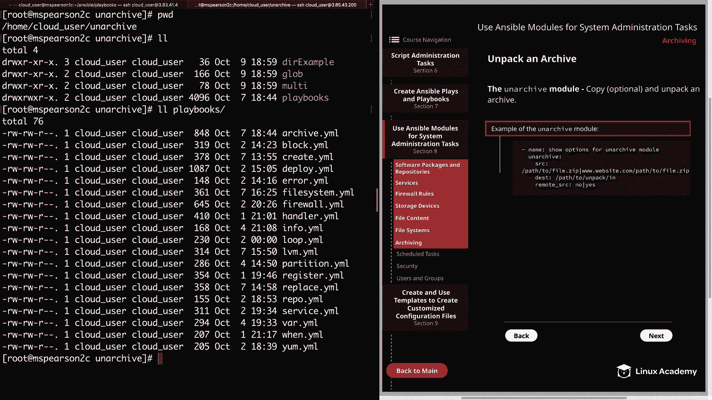

# RHCE 认证课程：第8章：归档与解档 📦





在本节课中，我们将学习系统管理员的一项常见任务：创建归档文件以及解压这些归档文件。我们将使用 Ansible 的 `archive` 和 `unarchive` 模块来完成这些操作。

## 创建归档文件

上一节我们介绍了课程概述，本节中我们来看看如何使用 Ansible 的 `archive` 模块来创建压缩归档文件。该模块用于将一个或多个文件或目录打包并压缩。

以下是 `archive` 模块的核心参数：

*   **`path`**: 指定要压缩或归档的文件或目录的绝对路径。可以是一个列表，也支持使用通配符（如 `*`）。
*   **`exclude_path`**: 指定要从归档中排除的文件或目录路径。同样支持通配符。
*   **`format`**: 指定压缩格式。可选值包括 `gz` (gzip)、`bz2` (bzip2)、`xz` 或 `zip`。
*   **`dest`**: 指定生成的归档文件的名称和存放路径。

此外，你还可以设置归档文件的所属用户 (`owner`)、所属组 (`group`)、权限 (`mode`) 以及文件属性。`remove` 参数可以在文件成功添加到归档后将其删除。

让我们通过一个示例 Playbook 来实践。以下 Playbook 将在托管节点 `mspearson2` 上创建三个不同的归档文件：

```yaml
---
- name: 归档文件示例
  hosts: mspearson2
  become: yes
  tasks:
    # 任务1：归档指定的多个文件
    - name: 归档 testfile2, 4, 6
      archive:
        path:
          - /home/cloud_user/archive/tester/testfile2
          - /home/cloud_user/archive/tester/testfile4
          - /home/cloud_user/archive/tester/testfile6
        format: gz
        dest: /home/cloud_user/unarchive/multi/multifile.tgz

    # 任务2：使用通配符归档，并排除特定文件
    - name: 使用通配符归档并排除文件
      archive:
        path: /home/cloud_user/archive/tester/testfile*
        exclude_path:
          - /home/cloud_user/archive/tester/testfile2
          - /home/cloud_user/archive/tester/testfile4
        format: gz
        dest: /home/cloud_user/unarchive/glob/glob_exclude.tgz

    # 任务3：归档整个目录
    - name: 归档 tester 目录
      archive:
        path: /home/cloud_user/archive/tester
        format: gz
        dest: /home/cloud_user/unarchive/dir_example/dir.tgz
```



运行此 Playbook 后，可以在 `mspearson2` 节点的 `/home/cloud_user/unarchive/` 目录下找到生成的 `multifile.tgz`、`glob_exclude.tgz` 和 `dir.tgz` 归档文件。





## 解压归档文件

学会了如何创建归档后，接下来我们学习如何使用 `unarchive` 模块来解压归档文件。该模块可以将归档文件解压到指定目录，并且支持从远程或本地路径获取归档。

以下是 `unarchive` 模块的核心参数：

*   **`src`**: 归档文件的源路径。可以是远程托管节点上的路径，也可以是本地控制节点上的路径，甚至是一个 URL。
*   **`dest`**: 指定解压归档文件的目标目录。
*   **`remote_src`**: 这是一个关键参数。默认值为 `no`，表示 `src` 指定的归档文件位于 **Ansible 控制节点**上。如果设置为 `yes`，则表示归档文件位于 **远程托管节点**上。

让我们看一个解压操作的示例 Playbook：

```yaml
---
- name: 解档文件示例
  hosts: mspearson2
  become: yes
  tasks:
    # 任务1：解压位于远程节点上的归档
    - name: 解压 multifile.tgz (远程源)
      unarchive:
        src: /home/cloud_user/unarchive/multi/multifile.tgz
        dest: /home/cloud_user/unarchive/multi/
        remote_src: yes

    # 任务2：解压 glob_exclude.tgz (远程源)
    - name: 解压 glob_exclude.tgz (远程源)
      unarchive:
        src: /home/cloud_user/unarchive/glob/glob_exclude.tgz
        dest: /home/cloud_user/unarchive/glob/
        remote_src: yes

    # 任务3：解压 dir.tgz (远程源)
    - name: 解压 dir.tgz (远程源)
      unarchive:
        src: /home/cloud_user/unarchive/dir_example/dir.tgz
        dest: /home/cloud_user/unarchive/dir_example/
        remote_src: yes

    # 任务4：从控制节点复制并解压归档到远程节点
    - name: 从控制节点解压 playbooks.tgz
      unarchive:
        src: /home/cloud_user/ansible/playbooks.tgz
        dest: /home/cloud_user/unarchive/
        remote_src: no
```

请注意前三个任务中 `remote_src: yes` 的用法，这是因为要解压的归档文件已经存在于远程托管节点 `mspearson2` 上。最后一个任务中 `remote_src: no` 则表示 `playbooks.tgz` 文件位于控制节点 (`mspearson1`) 上，Ansible 会先将其复制到远程节点，然后再进行解压。

运行此 Playbook 后，可以验证指定目录下是否成功解压出了归档内的文件。例如，在 `glob` 目录下，你应该能看到除了 `testfile2` 和 `testfile4` 之外的所有 `testfile*` 文件。



## 总结

本节课中我们一起学习了在 Ansible 中管理归档文件的核心技能。

我们首先介绍了如何使用 **`archive`** 模块来创建压缩归档，重点掌握了 `path`、`dest` 和 `format` 等参数，并了解了如何使用通配符和排除列表。

接着，我们探讨了如何使用 **`unarchive`** 模块来解压归档文件，关键是要正确理解并设置 `remote_src` 参数，以区分归档文件是位于控制节点还是托管节点。





通过结合使用这两个模块，你可以自动化地在多台服务器之间高效地打包、传输和分发文件，这是系统运维工作中一项非常实用的能力。