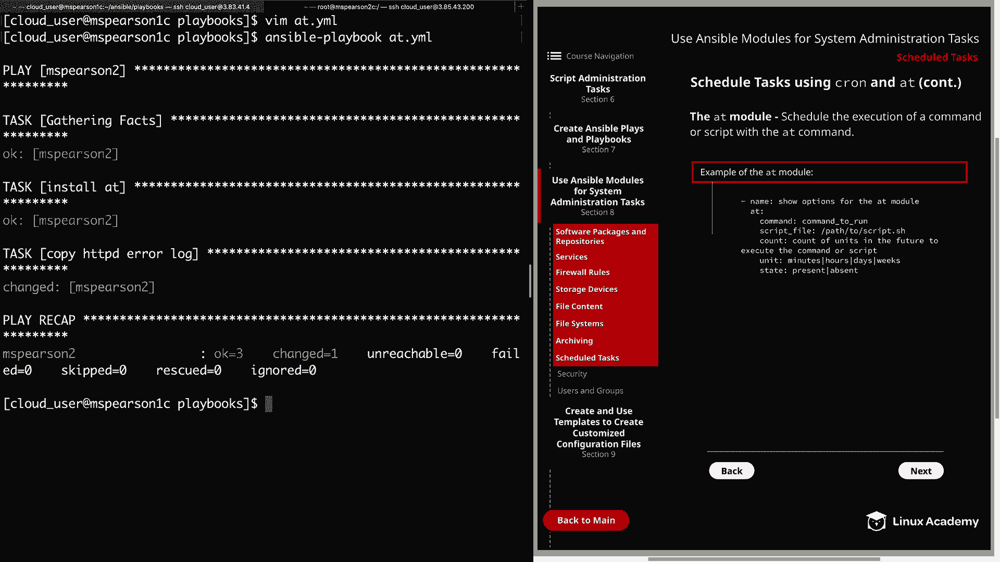

# Red Hat Certified Engineer (RHEL 8 RHCE) - P38：388-4873-8 - Scheduled Tasks - 11937999603_bili - BV12a4y1x7ND

Welcome back everyone， this is Matt， and in this video we're going to be talking about performing scheduled tasks using Ansible modules。

So let's go ahead and click on section 8。And then we can head down to schedule tasks。

And we're going to be talking about scheduling tasks using Chron and app。

So the Ch module is going to allow you to manage Ch jobs through AnsibleL rather than having to make these changes manually。

This provides you with the same flexibility you normally have。

 but also takes away the manual management， which is not very scalable and not quite as reliable。

In the diagram， I've provided a list of several different parameters for the Chron module。

 but just keep in mind that there are others， but I've included the majority of the ones that you're typically going to see。

So first， we have name， which is the name of the job， and then we have special time。

 which allows you to take advantage of the time specification nicknames。

This is going to include reboot， daily， monthly， weekly， annually， and so on and so forth。

And then we have the normal time options that you used to sing in a Chron tabab entry。

 which is going to be minute， hour day， month， weekday。

And then user is where you're going to specify the user's Chron tab that should be modified and it's going to use rootot by default。

 so if nothing is specified， it's going to use roots Chron tabab。And then we have Chon file。

 which uses a file rather than the user's Chron tabab。

 And if the path of that file is not explicitly given， this is going to be placed in Etsychron T。

 And if you're trying to modify Etsy Chron tabab， you will have to give the explicit path。

 Then we have state， which is going to determine whether or not you want the job to be added or removed。

And then lastly， job is where you're going to specify the command or the script that you want to run。

All right， so now I'm going to head over the command line and show you a demonstration of this first thing that we need to do is create our playbook。

I'm just going to call it Chron。yl。We'll start with our dashes。

We'll be performing this against MS Pearson 2 and become will be set to yes。

And then we can specify our tasks。And for the description。

 we're just going to say perform a weekly yum update。And then the Q module。

Then we need to specify the name of the job and we'll just call it。Weekly yum update。

And now we need to specify it when we want this job to run for a minute。I'rem going to say star。

And I wanted to mention that it is best to quote all the day and time values。

 otherwise you can get warnings for some and in the case of a wild card， you will get errors。

 So if you're wondering why I'm quoting these， that's exactly why。So for hour。

 we're going to say 2 AM。And then month， we're going to add our wild card again。

And then we're going to specify weekday。And this is going to be on Sunday， which is zero。

And now we need to specify the user， we're going to be using the root users Ch tabab。And of course。

 your state， we want this present。And then we can use the job parameter to specify our command。

For this， we're just going to use yum dash Y update。All right， now we can go ahead and save and quit。

All right， let's go ahead and run our playbook。All right， it looks like our task ran successfully。

So let's head over to MS Pearson 2 and we can check the rootot Use Chme tab。So as you can see。

 I'm already logged in as the root user， so all we need to do to check that is Chron tabab L。

As you can see， it inserted a comment with the name of our job。

 as well as the time we supplied and the command we wanted to run。All right， so now let's head back。

And if we wanted to remove our Chon job， all we need to do is remove present。

And replace it with absent。

。So let's go ahead and run that one more time。

All right， so now let's head back to MSParson 2。We can check our cron tabab again。

And we see that the entry in our crron tab has been removed。 All right。

 so now that we've discussed the Crron module， set over to the next page。

And now let's talk a little bit about the app module。

 So the app module schedules the execution of a command or a script with the a command。

 and before we talk about the options for the app module。

 keep in mind that the app package is a requirement in order to use the module and for this particular image of RE 8 at is not installed by default So you will need to do that we'll actually be doing that in our playbook。

 But anyways， once you have that installed， the module is going to work very similar to the way that app runs from the command line。

 So now let's go ahead and walk through the parameters that Ive provided here in the example of the app module。

 So the first two options are going to allow you to specify the command to be run or the path to an existing script that you would like to run Next we have the count。

 and this is the count of units in the future to execute the command or script and next we're going to specify the type of units in the future to run the command and this is going to be anything from minutes。

 hours， days， weeks So you can specify the count， something like two and then the unit and that could be something like hours and then your command。

Our script is going to run two hours in the future。 And finally， you can specify the state。

 which can be either present or absent with present being the default。

Now let's head back to the command line and we can try this out。

Go ahead and clear that。And MSsPion 1 as well。

So now let's go ahead and create our playbook， and we're just going to call this at。yml。

Start off with our three dashes。Our host is again， MS Perarson 2。We're going to become yes。

And then ta。And then our first task is actually to install at。

 So we're going to do that with the module。And the name of the package is at。And for state。

 we're going to specify latest。And then our second task， which is what we're here for。

Is actually using at in order to schedule a job and the job that we're going to have to do is copy the HttPD error log。

The name of the module is at。Then we need to specify the command， so we're going to Cp Var log。

 HtTPD。Eir underscore log。We're going to copy that into home cloud underscore user。And for count。

 we're going to set that to2。And for units， we'll set that to hours。

 I guess we'll just go with what we talked about in the example here。And then for state。

 we're going to say present。Alright， so let's go ahead and save and quit。

 and then we can run Ansible playbook and at Yaml。Alright， so now that our playbook has finished。

 let's head over to M Pearson 2。 see if we can validate this。

 So let's go ahead and run at Q to see if our job was added。

And we see that one job has been added。 so that means it was successfully installed and our job was added。

 So now let's make sure that the command is correct and we can do at dash C。

And we'm going to specify to you because that's the job number。

And you're going to see a bunch of different variables here。

 but what we really want to focus on is right here at the bottom and this is our command。

 which is CP Var log HtTBD， error log to home cloud user。

So now we know that our job was successfully added using the app module。

Go ahead and clear this out。 and then right before we finish。

 I'm going to head back over to our control node。

And we're going to edit our playbook。We're going to trade out present for absent and we're going to go ahead and remove our job。

So let's go ahead and run that。

Allright， so now let's head back to MSParson 2。We can run our at cube command。

And we see that there are currently no jobs in the at queue， so we have successfully removed our job。

All right， well that's going to wrap up this video on scheduling task using Chron and at。

 so let's go ahead and mark it complete and we can move on to the next section。

