# Ansible 自动化运维：第8章：使用 Ansible 模块执行计划任务 🕐

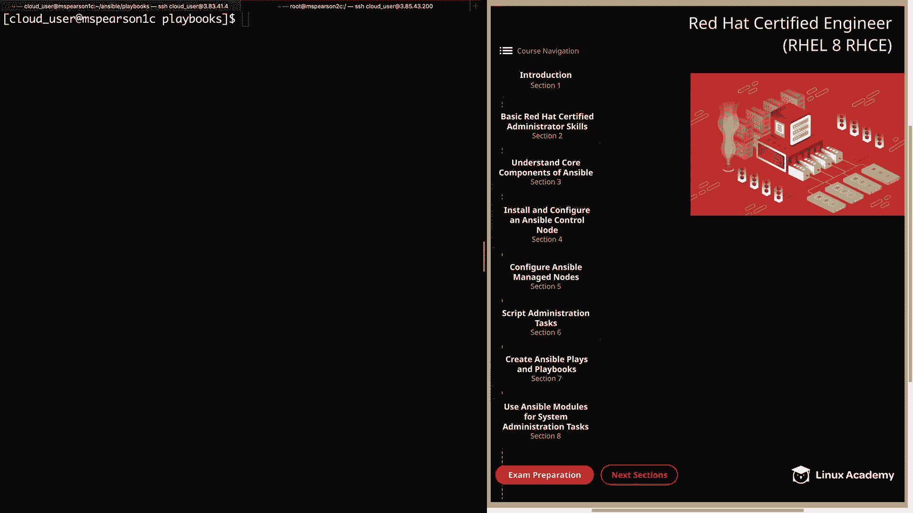

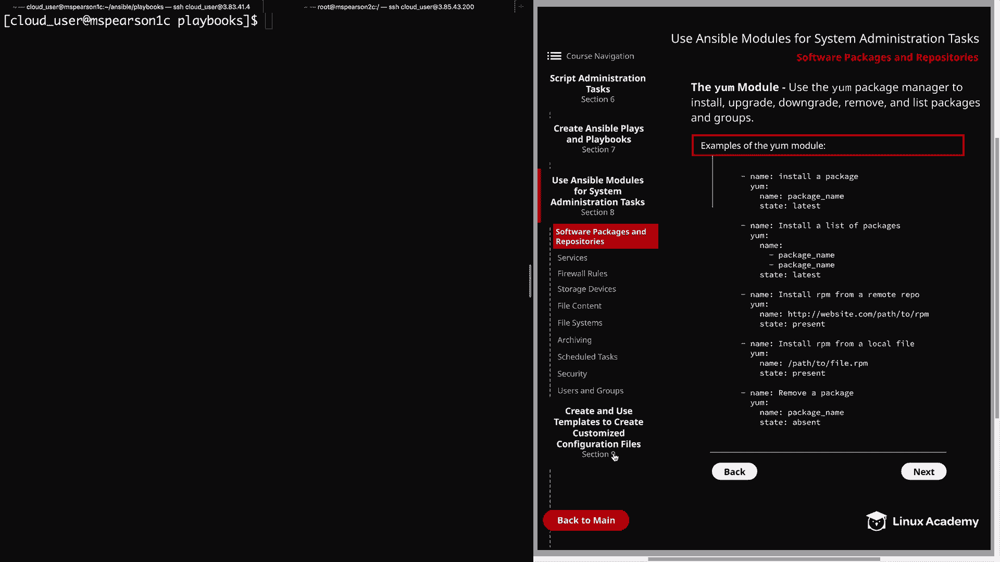

在本节课中，我们将学习如何使用 Ansible 的 `cron` 和 `at` 模块来管理计划任务。通过 Ansible 自动化这些任务，可以避免手动管理的繁琐，提高配置的可靠性和可扩展性。

## 使用 Cron 模块管理周期性任务

上一节我们介绍了课程概述，本节中我们来看看如何使用 `cron` 模块管理周期性任务。`cron` 模块允许你通过 Ansible 管理 `cron` 作业，无需手动修改 `crontab` 文件，这提供了与手动管理相同的灵活性，同时消除了手动操作带来的不可靠性和难以扩展的问题。

以下是 `cron` 模块的一些核心参数：

*   **`name`**: 任务的名称。
*   **`special_time`**: 使用时间规格的昵称，例如 `reboot`、`daily`、`monthly`、`weekly`、`annually`。
*   **`minute`、`hour`、`day`、`month`、`weekday`**: 用于指定任务运行时间的常规选项，与 `crontab` 条目中的格式一致。
*   **`user`**: 指定要修改哪个用户的 `crontab`，默认为 `root` 用户。
*   **`cron_file`**: 使用文件而非用户的 `crontab`。如果未明确指定路径，文件将放置在 `/etc/cron.d/` 目录下。若要修改 `/etc/crontab`，则必须给出明确路径。
*   **`state`**: 决定任务是添加 (`present`) 还是移除 (`absent`)。
*   **`job`**: 指定要运行的命令或脚本。

现在，让我们通过一个示例来演示如何创建 `cron` 任务。首先，创建一个名为 `cron.yml` 的 playbook。

```yaml
---
- hosts: ms_pearson_2
  become: yes
  tasks:
    - name: Perform a weekly yum update
      cron:
        name: "Weekly yum update"
        minute: "0"
        hour: "2"
        month: "*"
        weekday: "0"
        user: root
        state: present
        job: "yum -y update"
```

请注意，最好将所有日期和时间值用引号括起来，否则可能会收到警告，对于通配符 `*`，则会导致错误。

运行此 playbook 后，登录到目标主机 `ms_pearson_2` 并检查 `root` 用户的 `crontab`：

```bash
crontab -l
```

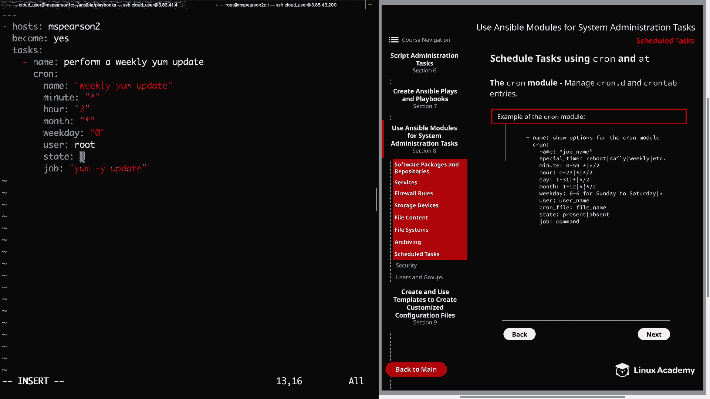

你将看到 Ansible 插入了一条包含任务名称、指定时间和要运行的命令的注释。

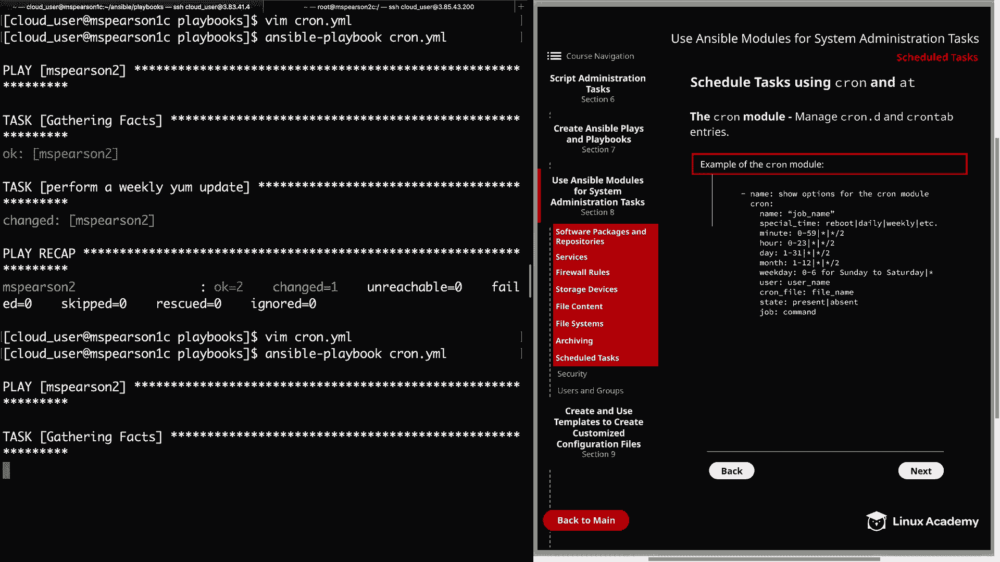

若要移除这个 `cron` 任务，只需将 playbook 中的 `state: present` 修改为 `state: absent`，然后重新运行 playbook 即可。

## 使用 At 模块管理一次性任务

上一节我们介绍了 `cron` 模块，本节中我们来看看 `at` 模块。`at` 模块用于调度一次性命令或脚本的执行。

在使用 `at` 模块前，请注意目标主机上必须安装 `at` 软件包。在 RHEL 8 的某些镜像中，它可能不是默认安装的。该模块的工作方式与命令行运行 `at` 命令非常相似。

以下是 `at` 模块的核心参数：

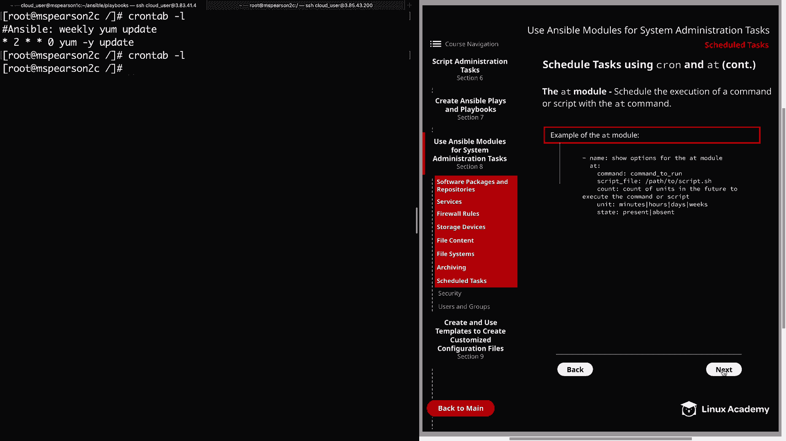

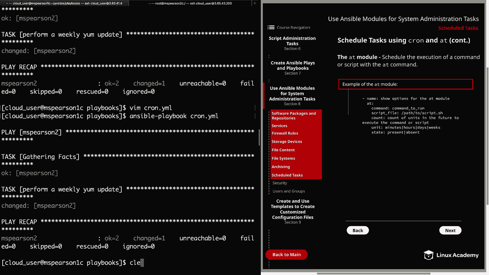

*   **`command` / `script`**: 指定要运行的命令或现有脚本的路径。
*   **`count`**: 指定在未来多少个单位时间后执行命令或脚本。
*   **`units`**: 指定 `count` 的单位类型，可以是 `minutes`、`hours`、`days`、`weeks` 等。例如，`count: 2` 和 `units: hours` 表示任务将在两小时后运行。
*   **`state`**: 可以是 `present`（添加任务，默认值）或 `absent`（移除任务）。

接下来，我们创建一个示例 playbook `at.yml` 来演示 `at` 模块的用法。这个 playbook 包含两个任务：首先安装 `at` 软件包，然后使用 `at` 模块调度一个任务。

```yaml
---
- hosts: ms_pearson_2
  become: yes
  tasks:
    - name: Install at package
      yum:
        name: at
        state: latest

    - name: Schedule a job with at
      at:
        command: "cp /var/log/httpd/error_log /home/cloud_user/"
        count: 2
        units: hours
        state: present
```

运行此 playbook 后，登录到目标主机 `ms_pearson_2` 验证任务是否已添加：

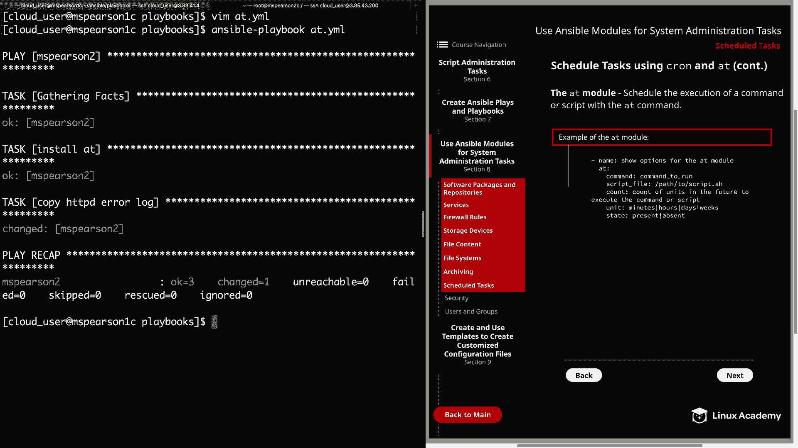

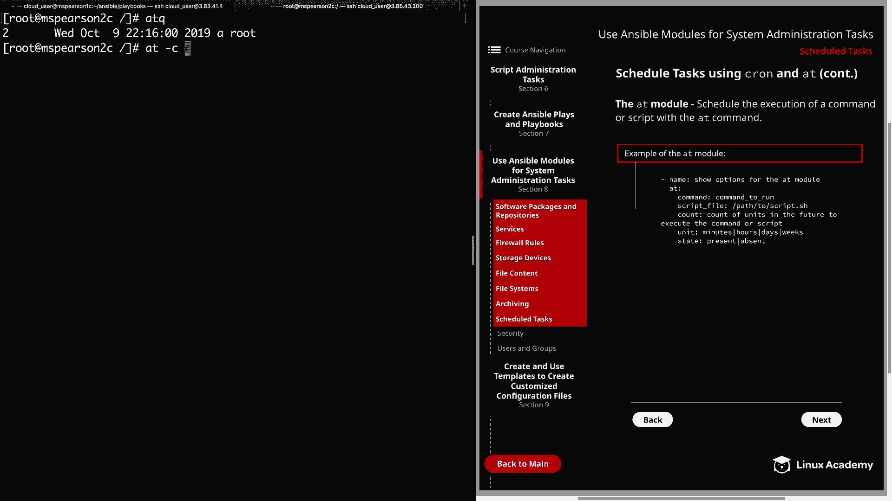

```bash
atq
```


此命令会显示 `at` 队列中的作业。你可以使用 `at -c <作业编号>` 来查看特定作业的详细信息，包括要运行的命令。

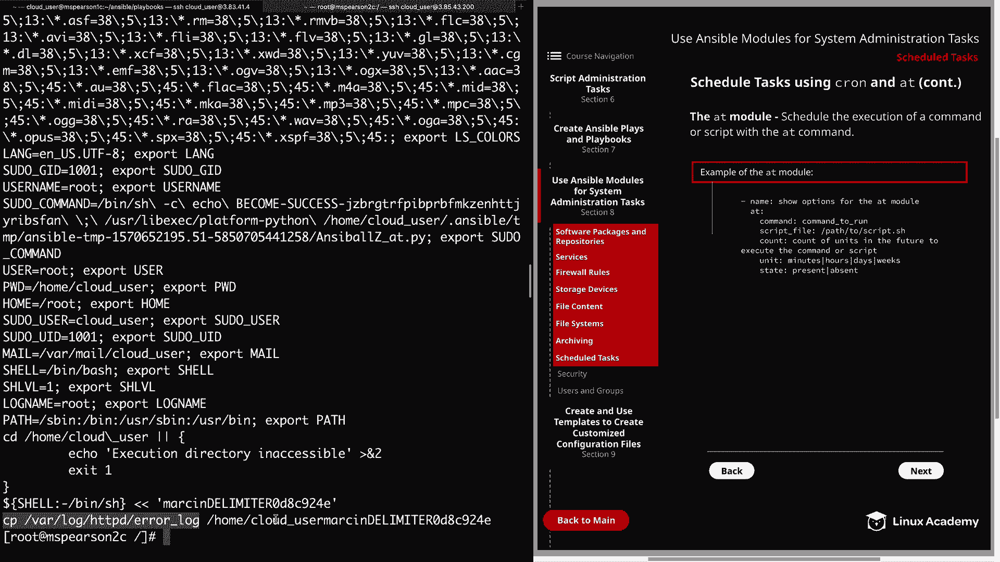

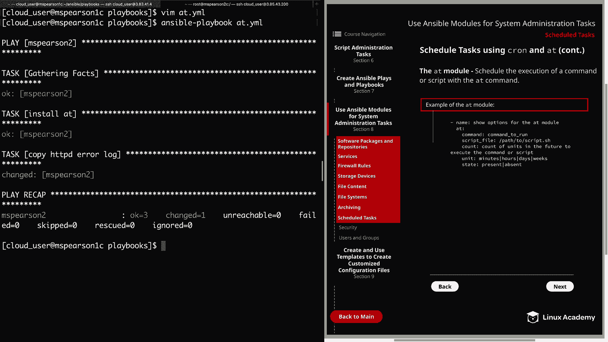

若要移除这个 `at` 任务，只需将 playbook 中 `at` 任务的 `state: present` 修改为 `state: absent`，然后重新运行 playbook。再次运行 `atq` 命令，可以看到队列中已没有作业。

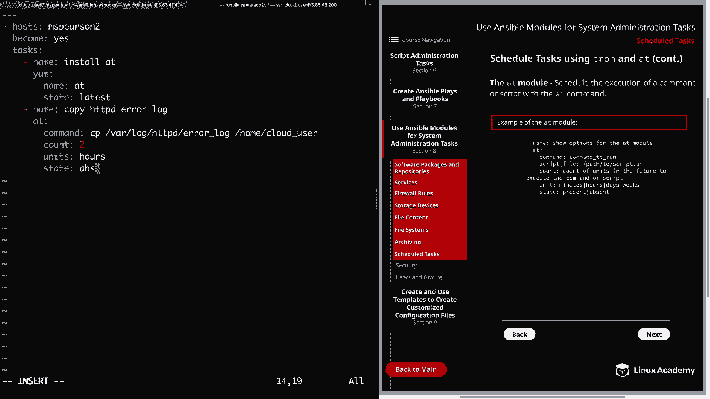

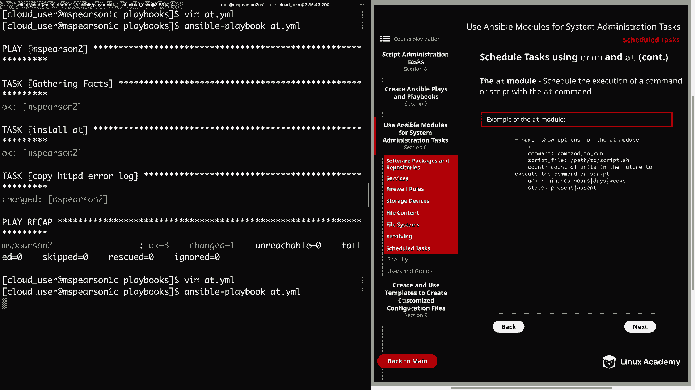

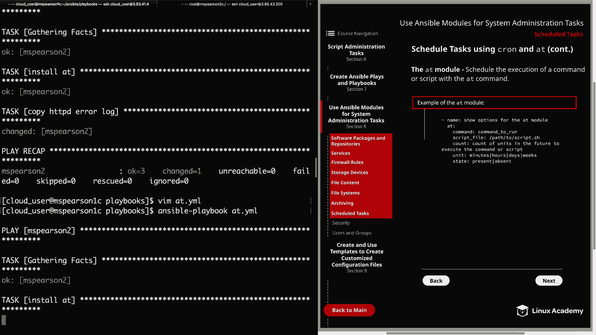

## 总结

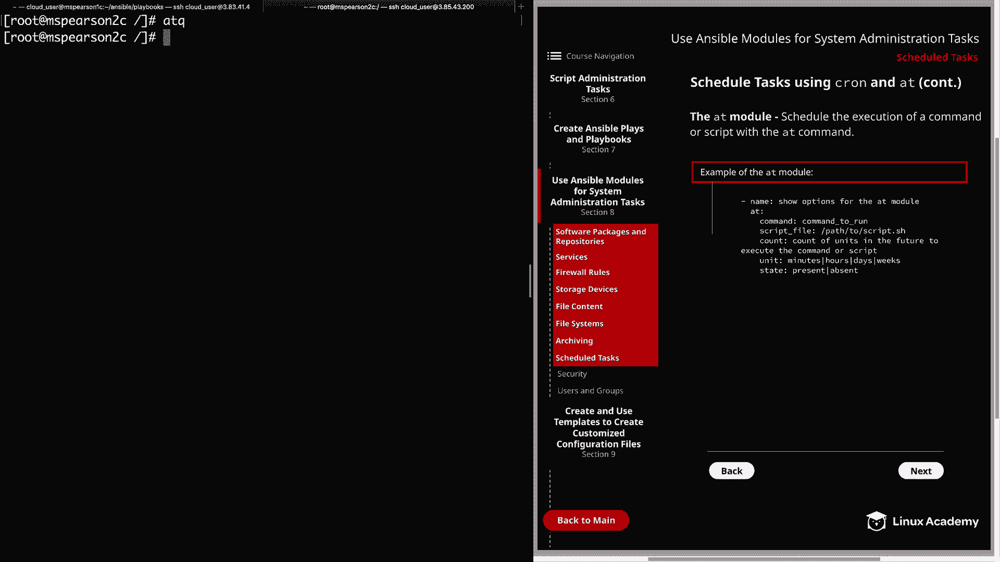

本节课中我们一起学习了如何使用 Ansible 的 `cron` 和 `at` 模块来自动化管理计划任务。`cron` 模块适用于管理需要周期性重复执行的任务，而 `at` 模块则适用于调度在未来某个特定时间点执行的一次性任务。通过将这些手动操作自动化，我们能够实现更高效、可靠且易于维护的系统管理。