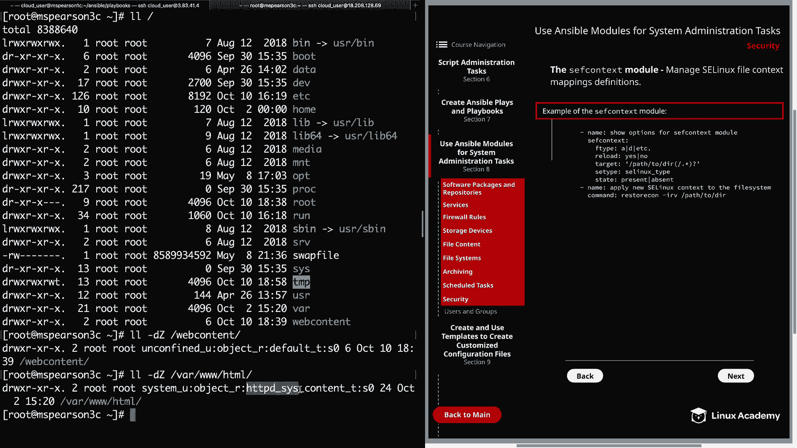
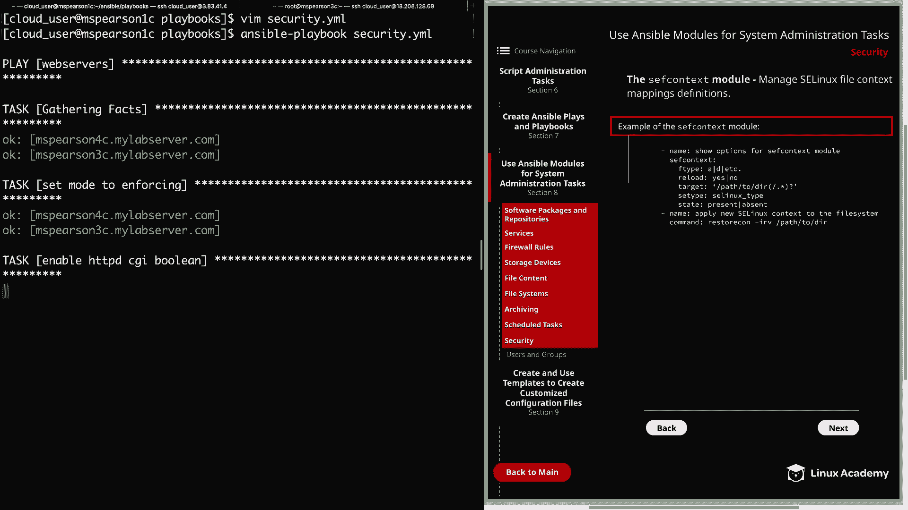

# Red Hat Certified Engineer (RHEL 8 RHCE) - P39：388-4873-9 - Security - 11937999603_bili - BV12a4y1x7ND

Welcome back everyone， this is Matt， and in this video we're going to be discussing security in regards to Ansible modules。

 so let's click back on Section 8。

And we'll head down to security and the following modules we have to discuss are all going to focus on Se Linux or security enhancedance Linux。

 So let's get started with the Se Linux module。 and this module is going to allow us to change the policy in state of Se Linux and as you can see I've provided an example here in the diagram in the first parameter that we're going to talk about is the config file parameter。

 And this option is there in case you are using a different Se Linux config file than the normal default。

 So for the value you would just specify the path to the configuration file that you're using rather than the default。

 Next， we have the Se Linux policy。 and this will most often be targeted。

 but you can also set it to something like Ms or multilevel security。 And again。

 this is not something you'll generally need to worry about。

 but I want to ahead and provided it in the example just so you know that you have the option。

 And then lastly， the biggest thing is whether you set the state to enforcing permissive or disabled。

 All right， so let's head over to the command line。

 And in this video we're actually going to be working with our web server's group。

 which is Ms Pearson 3 and 4。

And I've logged into MS Pearson 3 on a separate tab， and I've assumed the root user。

Let's go ahead and see what our Se Linux policy is set to on this host。

 So first we'll use gi in force。And we see that the policy is currently set to in forcing mode。

 we can also do an Se status。And this is also going to show us the mode that it's set to enforcing。

 but we're also going to see loaded policy name， which is currently set to targeted。

 as well as several other e Linux configurations。But now that we've seen that that's set to enforcing mode。

 let's head back over to our control node in S Pearson 1。

 and let's create a new playbook called Security。And let's use the SE Linux module in order to set the state to permissive。

So we're going to start out。Using our three dashes。And then for hosts。

 remember this time we're going to be executing it the web server host。

We're going to become the root user， and I'm going to specify our tasks。And for our first task。

 we're just going to be setting the mode to permissive。So set mode to permissive。

This is the SE Linux module。I'm going to go ahead and just say policy targeted。And then， for state。

We're going to say permissive。Let's go ahead and save that and we can kick this off。

So ansible playbook， and then security that YM。All right， so now let's head back to M Pearson 3。

 can go ahead and check get in force。 we see that that is set to permissive。

 could also do Se status if we wanted to。 But either way。

 that is how you set the mode using the Se Linux module。 All right。

 so the next module we're going to talk about is the Se Boolean module and this is going to allow us to toggle Se Linux Bos。

 And for anyone who's worked with Se Linux， Sometimes you need to enable certain bulloles in order to gain the functionality that that provides。

So let's go ahead and clear this out and I'm going to use the Git SE Bo command in order to list the current Booles and what they're set to。

So it's going to be git Se bull。And then dash A， we're just going to specify all。

 and then I'm going to search for CGI。Al right， so we see that HtTPD enable CGI is currently set to on。

 and what we're going to do is use the Se Boolean module in order to toggle this off。

 so let's head back to our control node。We're going to open up our playbook again。

And let's go ahead and change this to enforcing because we do want to have Se Linux set to enforcing mode。

And then we can add another task。And I'm going to go ahead and call this enableable HttPD CGI Booleion。

Becauseuse even though we're going to use it to disable first。

 I'm going to ultimately have it enable this boolean so we can make sure that we know that that is enabled whenever we run our playbook。

 All right so then we need to specify our module， which is Se Booleion。

And then we're going to specify the name of the  bulloleion。Which is going to be HttBD。

Underscore enable， underscore CGI。And we're going to set the state to no。

So we're going to toggle this off。And then for persistent。We're going to set this to yes。

 and this means that it will persist through a reboot。All right， so let's go ahead and save and quit。

And then we can run that。All right， it looks like both of our tasks did make their change。

 so let's head back over to MSParson 3。

We're going to go ahead and run the same command what we just ran。

And we see that HTTPD enable CGI is set you off now。I'll also run get in force。

And we see that we are back to enforcing the Se Linux policy。 All right。

 so real quick before we move on。Let's go ahead and modify our playbook， and rather than state no。

 I'm going to set this back to yes。

AndWe'll run that real quick。

And we see that there was no change to set mode enforcing since that was changed previously。

 but our HTTPD CGI Boolean did get updated。

So let's go back over and just validate that。And we see that it has been set to on。All right。

 so now let's head over to the next page。

We're going to talk about the SEF context module。So this module is going to allow us to manage Se Linux file context mappings definitions。

 and again， I've provided an example here in the diagram of some of the more common parameters。

So first we must specify the Se Linux type， and in the example here。

 I'm showing a for all files and D for directories。

 but there are also options for simlink and block devices as well as others， so again。

 feel free to check out the documentation on that if you would like。Next is the reload option。

 and this is set to you yes by default。 what that's going to do is reload the SE Linux policy after commit。

 but just keep in mind that this does not apply to the context of any existing files。

 so it's actually recommended to set the context before you create any new files or to run restorestore con manually for any already existing files and we're actually going to see an example of that in just a minute。

Next we have the pass to the target， and in this example， I've displayed a directory。

 but this could also be a file as well。And then Se type is the actual context that you're trying to apply to your target。

 and then finally you have state which can be present or absent。

I've also added an example after the SEF context module showing how you can run restorestorecon on your directory to affect any existing files。

 the dashI option here is just going to ignore files that do not exist and then dash R is going to do this recursively through all files and directories and then finally。

 the V option is going to show you the change context and just like you see with many other Linux command。

 this just stands for verbose。And just because I did not mention it。

 we actually will be using the command module in order to run that command。Alright。

 so let's head back over the command line and we can try out this module。

 so I'm going to go ahead and clear this out on MSParson 3。

So what we're going to do for this demonstration is take the newly created web content directory and update the context on it。

 and this is something that we're going to be using later on in our video on templates。

 so if you're following along go ahead and create that directory as you can see it's just slash web content so let's go ahead and check out the context on that do the dashD option since it is a directory and then Z so we can see that context and it's going to be on slash web content。

Alright， so currently you can see it's just set to default in order for Apache to be able to use it。

 we need to update this to HttPD underscore Cis， underscore content。

And you can actually see that if we do the same on var ww， w Hml。

So we need our new web content directory to have the same context that Var Ww H has。 All right。

 so let's head back to our control node。

Clear that out， and now we can add an additional task to our playbook。

 Let's go ahead and open that up Vim security。yM。 and we already have our two task here one setting the mode to enforcing the other enabling the HttPD CGI Boolean。

So let's go ahead and add another task， which is going to set our context。

So I'm just going to say set Se context。This is using the SEF context module。So first。

 let's specify our target， we're going to put this in single quotes。

 and that's going to be web content。And here I'm just making sure that it includes everything。

 so we're setting this on the directory itself as well as any files that are in the directory。

 though currently we don't have any， I just want to show you how you can do that。Next。

 we need the Se type。And this again， is going to be HtTBD， underscore cis， underscore content。

And then underscore T。And for state， we're going to say present。

And then I'm also going to add another task。That way we can run the restore con command。

So I'll just say run restorecon。We're going to use the command module。Using the restore con command。

Dash IRV。Only web content directory。All right， let's go ahead and save and quit and we can kick this off。

Allright， so now that that's completed， let's head back to MSParson 3 and see if our change took place。

So currently， our web content context is set to you。

Default underscore T。Go ahead and clear this so you can see it a little better。

And we see that our contact was successfully updated。Well。

 let's going wrap up this video on using Ansible modules for security。

 We will be seeing this web content directory in a later video。

 so it's a good thing that we got the context all sorted out。

 let's go ahead and market complete and we can move on to the next lesson。

