# Ansible安全模块教程：P39：使用Ansible管理SELinux 🔐

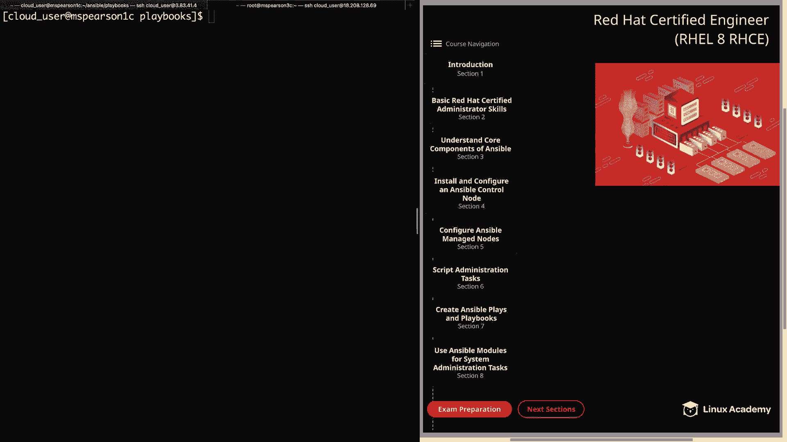

## 概述
在本节课中，我们将学习如何使用Ansible模块来管理Linux系统的安全增强功能，特别是SELinux。我们将涵盖三个核心模块：`selinux`、`seboolean`和`sefcontext`，它们分别用于管理SELinux的运行状态、布尔值和文件上下文。通过本教程，你将能够编写Ansible Playbook来自动化配置系统的安全策略。

---

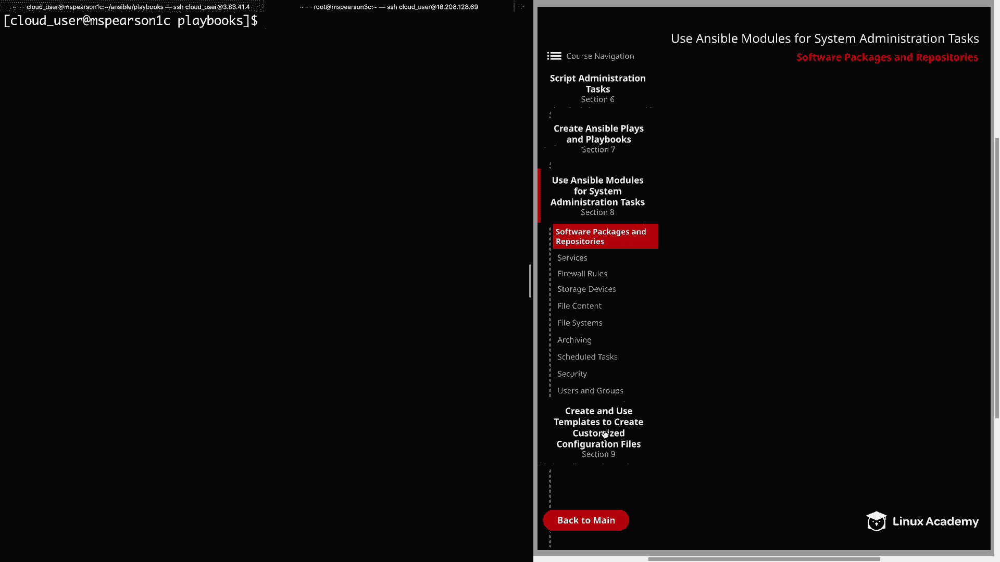

## SELinux模块：管理SELinux策略与状态

上一节我们介绍了课程概述，本节中我们来看看第一个模块：`selinux`模块。此模块允许我们更改SELinux的策略和运行状态。

以下是`selinux`模块的关键参数：
*   **`config_file`**：指定SELinux配置文件路径。默认使用标准配置文件。
*   **`policy`**：设置SELinux策略类型，通常是`targeted`，也可以是`mls`（多级安全）。
*   **`state`**：设置SELinux的运行模式，可选值为`enforcing`（强制模式）、`permissive`（宽容模式）或`disabled`（禁用）。

### 实践：将SELinux模式设置为宽容模式
首先，在目标主机上检查当前SELinux状态：
```bash
getenforce
sestatus
```
然后，在控制节点上创建Playbook，使用`selinux`模块将模式改为`permissive`。
```yaml
---
- hosts: webservers
  become: yes
  tasks:
    - name: Set SELinux mode to permissive
      selinux:
        policy: targeted
        state: permissive
```
运行Playbook后，再次在目标主机验证，模式已更改为`permissive`。

---

## SeBoolean模块：管理SELinux布尔值

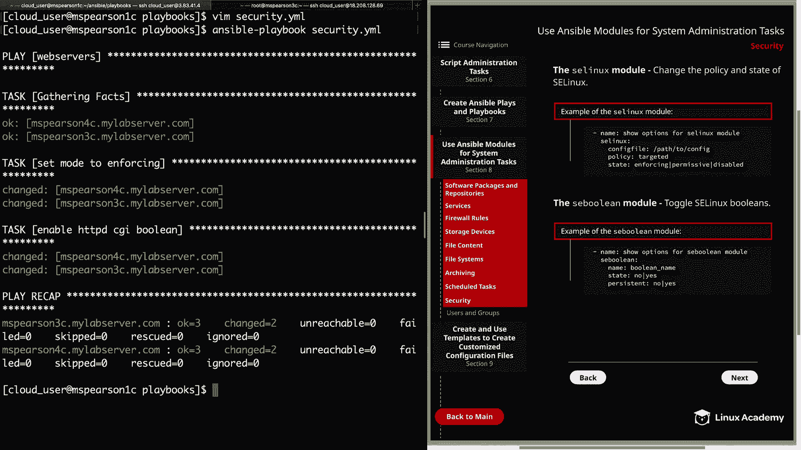

上一节我们介绍了如何管理SELinux的整体状态，本节中我们来看看如何管理更细粒度的安全开关——SELinux布尔值。`seboolean`模块用于切换SELinux布尔值的状态。

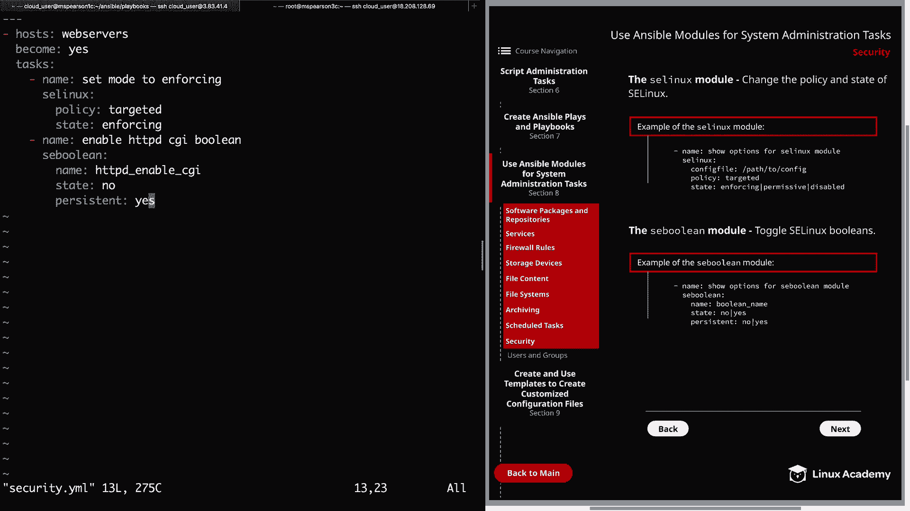

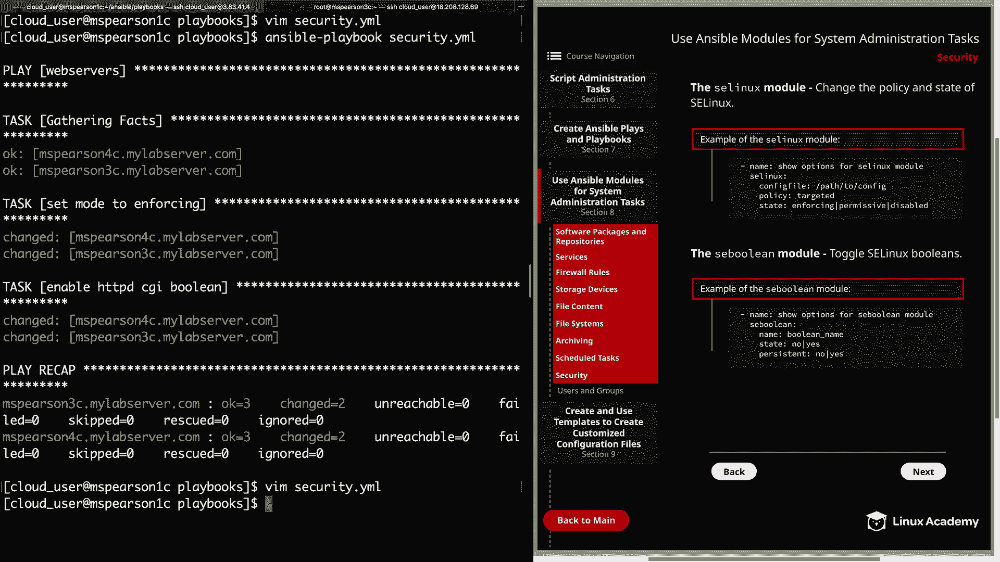

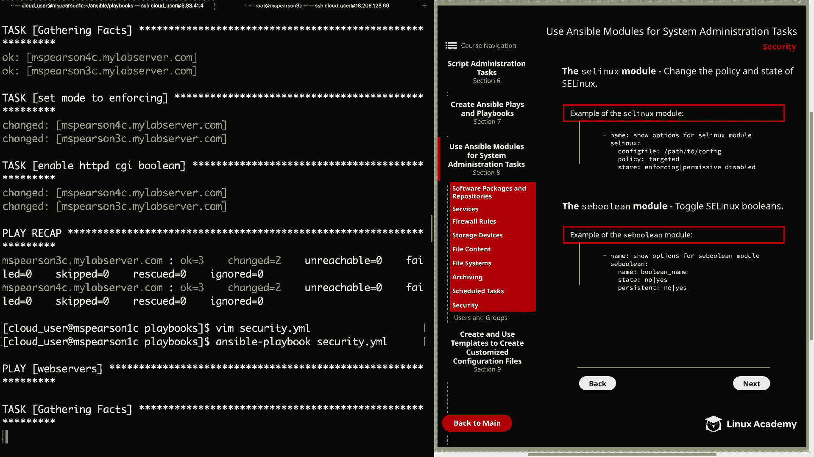

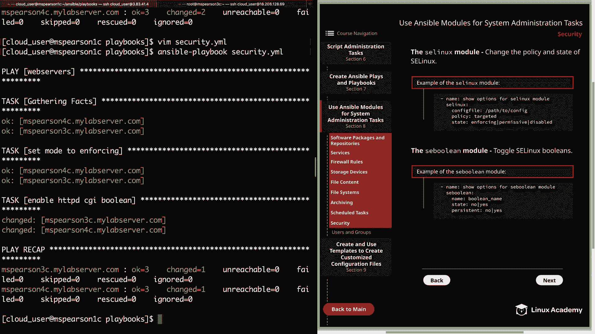

以下是`seboolean`模块的关键参数：
*   **`name`**：要设置的布尔值名称。
*   **`state`**：布尔值的目标状态，`yes`或`no`。
*   **`persistent`**：是否使更改在重启后持久化，`yes`或`no`。

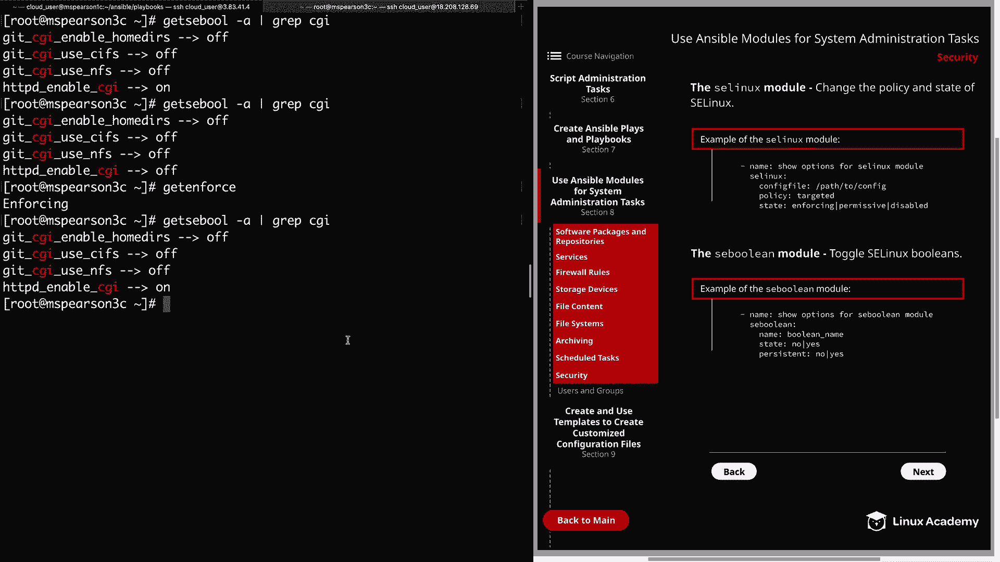

### 实践：禁用并重新启用HTTPD CGI布尔值
首先，在目标主机上查看特定的布尔值状态：
```bash
getsebool -a | grep cgi
```
假设`httpd_enable_cgi`当前为`on`。我们创建一个任务将其禁用：
```yaml
    - name: Disable HTTPD CGI Boolean
      seboolean:
        name: httpd_enable_cgi
        state: no
        persistent: yes
```
运行Playbook后，该布尔值将变为`off`。为了确保系统功能，我们通常会在配置完成后将其重新启用。只需将上述任务中的`state`改为`yes`再次运行即可。

---

## Sefcontext模块：管理SELinux文件上下文

上一节我们学习了如何管理布尔值，本节中我们来看看如何管理文件和目录的SELinux安全上下文。`sefcontext`模块用于定义SELinux文件上下文的映射关系。

以下是`sefcontext`模块的关键参数：
*   **`target`**：目标文件或目录的路径。
*   **`setype`**：要应用的安全上下文类型（如`httpd_sys_content_t`）。
*   **`state`**：定义是添加（`present`）还是移除（`absent`）上下文规则。
*   **`reload`**：是否在提交后重载SELinux策略（默认为`yes`）。注意，这**不会**影响已存在文件的上下文。

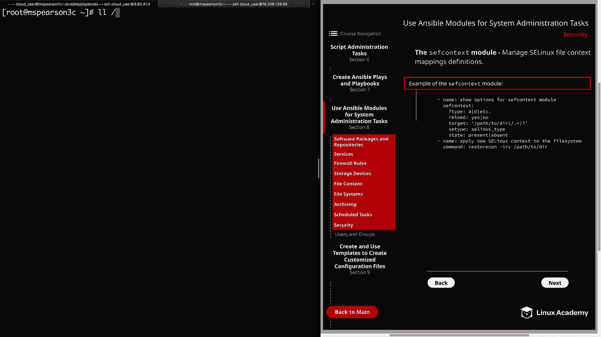

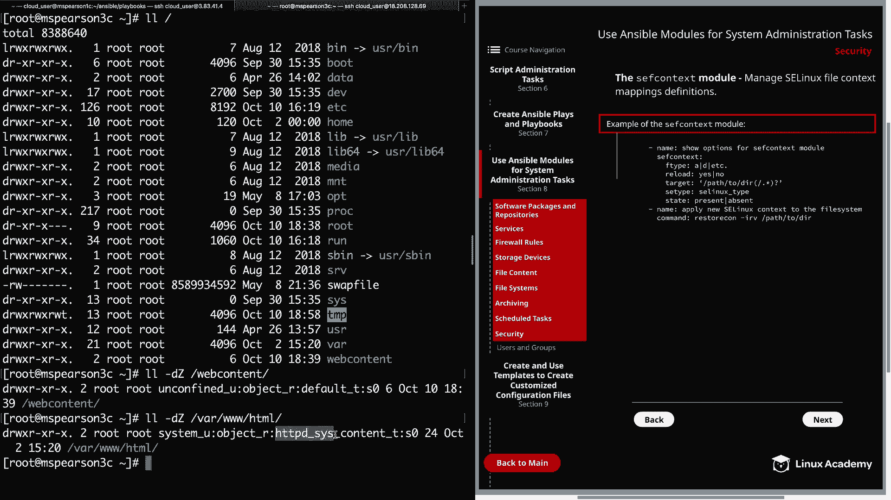

**重要提示**：`sefcontext`模块的更改通常需要运行`restorecon`命令来对现有文件生效。我们可以使用`command`模块来执行此命令：
```bash
restorecon -irv /path/to/directory
```

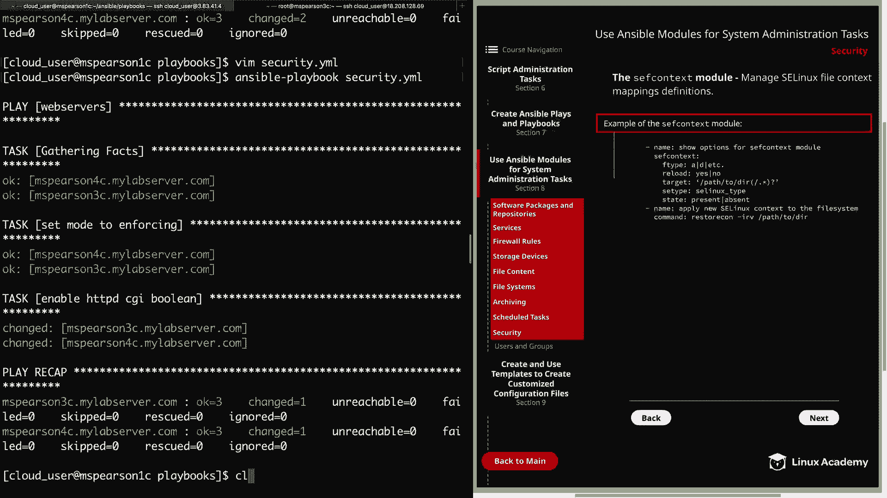

### 实践：为Web目录设置正确的上下文
假设我们有一个新目录`/webcontent`，需要为其设置与Apache默认网页目录相同的上下文，以便Apache能够访问。

1.  首先，在目标主机上检查默认目录和新建目录的上下文：
    ```bash
    ls -dZ /var/www/html
    ls -dZ /webcontent
    ```
2.  在Playbook中添加任务，使用`sefcontext`模块定义规则，并使用`command`模块应用更改：
    ```yaml
    - name: Set SELinux context for web content directory
      sefcontext:
        target: '/webcontent(/.*)?'
        setype: httpd_sys_content_t
        state: present
    - name: Apply SELinux context with restorecon
      command: restorecon -irv /webcontent
    ```
3.  运行Playbook后，再次检查`/webcontent`目录的上下文，确认其已成功更新为`httpd_sys_content_t`。

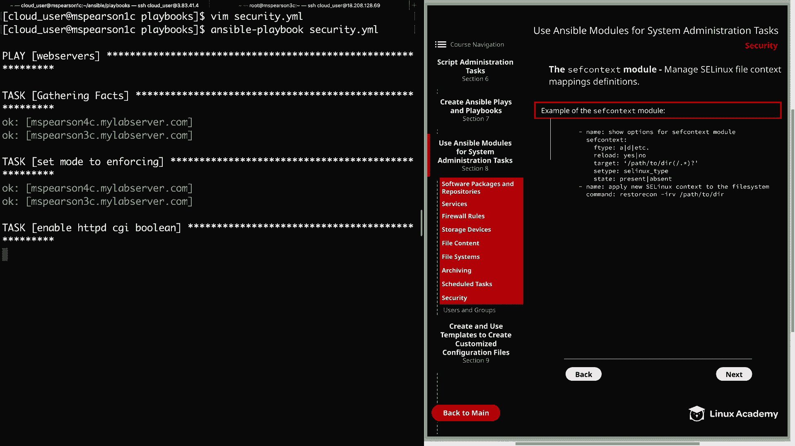

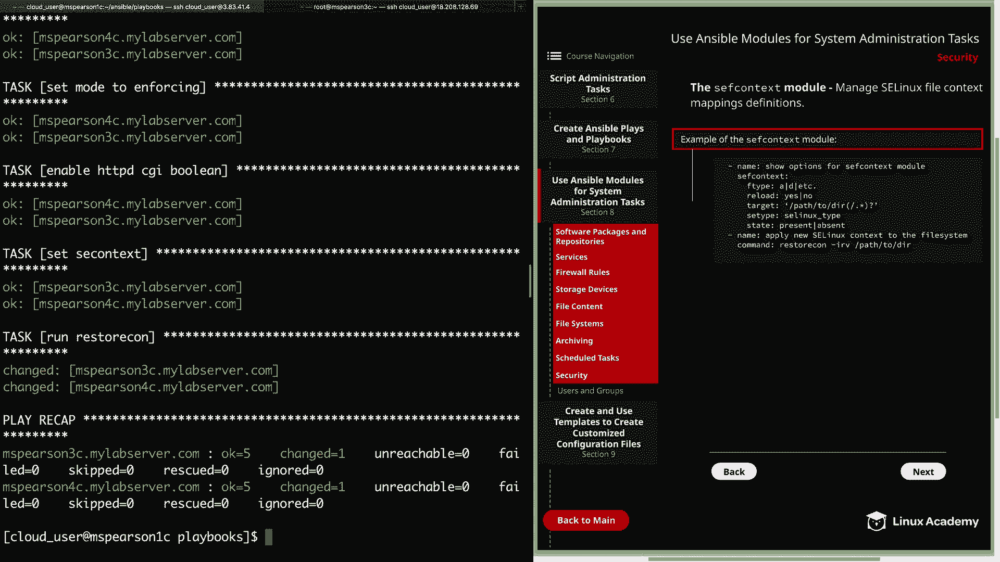

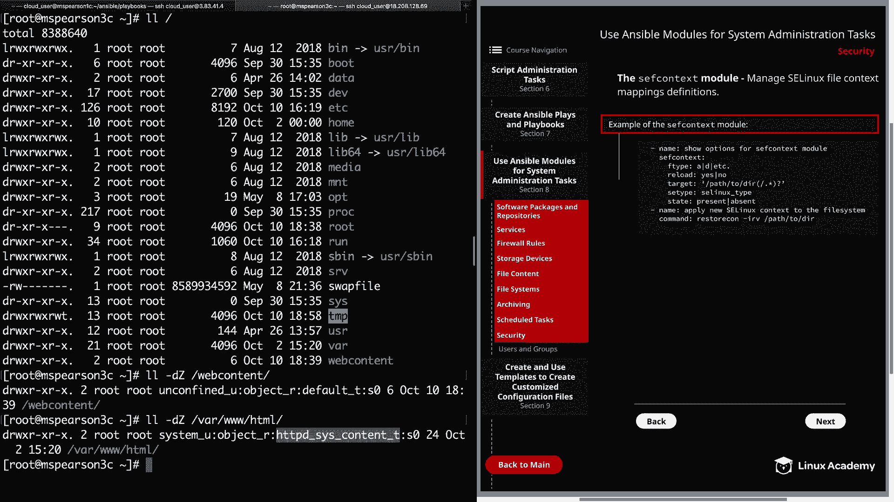

---

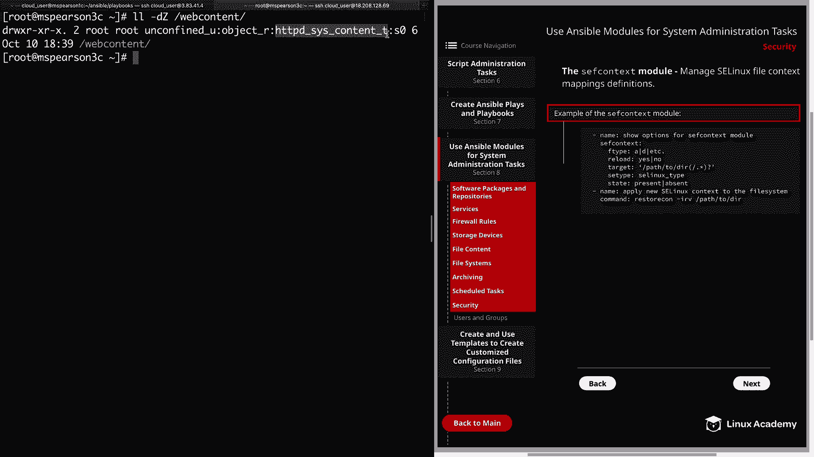

## 总结
本节课中我们一起学习了使用Ansible管理SELinux的三个核心模块。我们首先使用`selinux`模块控制了SELinux的全局运行模式；然后通过`seboolean`模块精细地控制了特定功能的开关（布尔值）；最后，利用`sefcontext`模块和`restorecon`命令，确保了应用程序目录拥有正确的安全上下文。掌握这些模块，能够帮助你高效、自动化地配置和维护Linux系统的安全策略。