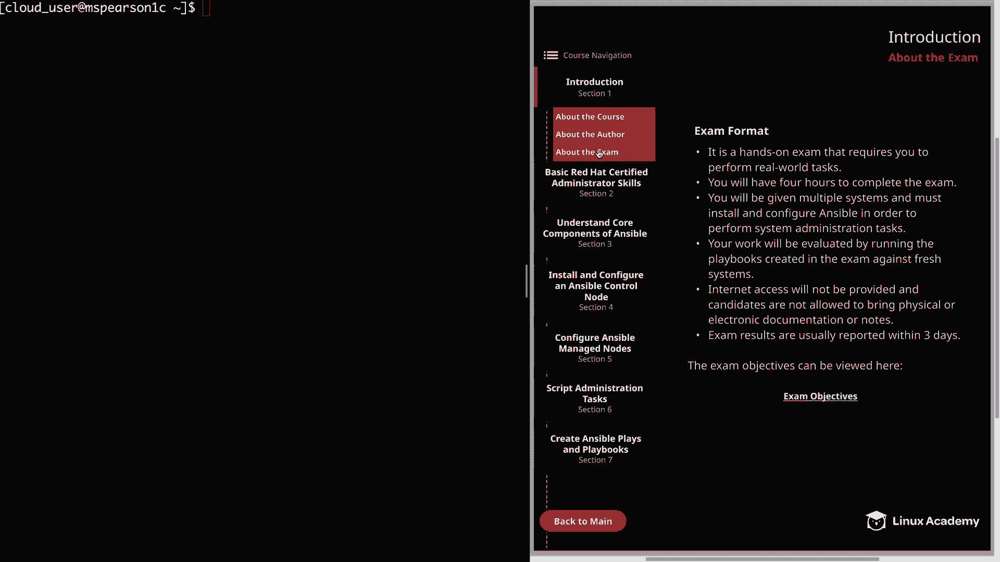
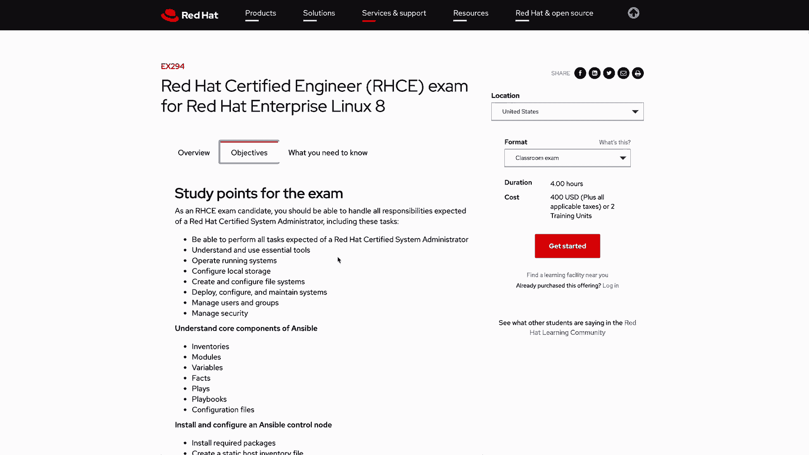

# Red Hat Certified Engineer (RHEL 8 RHCE) - P3：388-4881-3 - About the Exam - 11937999603_bili - BV12a4y1x7ND

Welcome back everyone。 This is Matt， and in this video。

 I'm going to talk a little bit about what you can expect from the actual red Ha exam。

 Now I'm not allowed to tell you exactly what's on the exam。

 but I can tell you a little bit about the format based on the information that has been publicly provided by Red Hat。

 So let's go ahead and click on the introduction Section 1， and then about the exam。First。

 this is a handson exam that requires you to perform real world tasks。

 So if you've taken in the RHCSA or another red hat exam， you already know what this means。

 but for those who haven't， this exam is not multiple choice but is actually going to require you to perform real tasks just like you would do if you are engineering the system Next。

 you will have four hours to complete the exam， which is a good amount of time but make sure that you have a decent handle on the material so that way you're not spending too much time looking through documentation which can definitely stack up in the exam you will be given multiple systems and must install and configure ansible in order to perform system administration tasks。

 So one thing that you'll notice once we take a look at the objectives is that this exam is very different from the RE7 version of the RHCE and is going to focus heavily on using ansible in order to automate the administrative tasks。

 So if you're someone who already has your RHCE and you're just looking to refresh your certification Keep in mind that these exams are vastly different and you will need to know ant。

In order to complete the exam， once you've finished your exam。

 your work will be evaluated by running the playbooks created in the exam against fresh systems。

 So it's not just about getting to a particular end state。

 but being able to reproduce that end state with the playbooks that you've created。 Next。

 Internet access will not be provided and candidates are not allowed to bring physical or electronic documentation or notes。

 But keep in mind that Red Ha does say that the documentation that ships with the product will typically be available on the exam。

 And also one of the objectives is to be able to use antsible documentation。

 So I would say there's a pretty good chance that this will be available for us during the exam。

 But again， make sure that you don't have to lean on the documentation too much as this can take up a lot of time。

And then lastly， exam results are usually reported within three days。

So don't freak out if you don't immediately get your scores because it can take up to a couple days to get them。

 though my experience has been that you usually get them in the same day。Al right。

 so down here at the bottom of this page， I've provided a link to the RHCE objectives。

 So if you'd like some more information about the exam， I would recommend hitting the website。

And I've also opened this up and another screen， so let's head over there now so we can take a look。

Al right， so once you hit this page， you're going to get an overview of the exam。

 So it's going to give you an exam description and also talk about the audience for this exam So who the exam is for。

 and then we can click on objectives。And this is going to list out all the different study points for the exam。

 so these are the topics that you need to know in order to succeed on the RHC exam。

And you'll notice that you are required to know the material from the RHCSA， but as we scroll down。

You're going to see that the majority of the tasks have to do with ansible。

 So you're going to have to have a pretty decent handle on ansible in order to do well on the exam。

 And as we are creating this course， we just mirrored these objectives within the syllabus。

 And that way we can cover everything that you need for the exam。 And then one last thing。

 if we scroll back up to the top。 And that's that this website is also。

 we're going to be able to sign up for the exam。 Well， that's going to finish up this video。

 So let's go ahead and mark it complete。 and we can move on to the next section。

