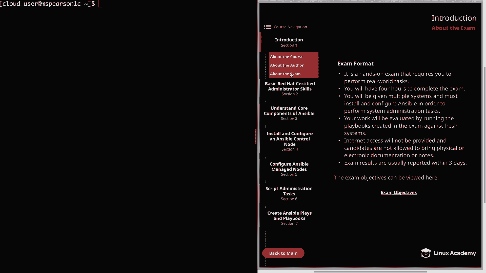
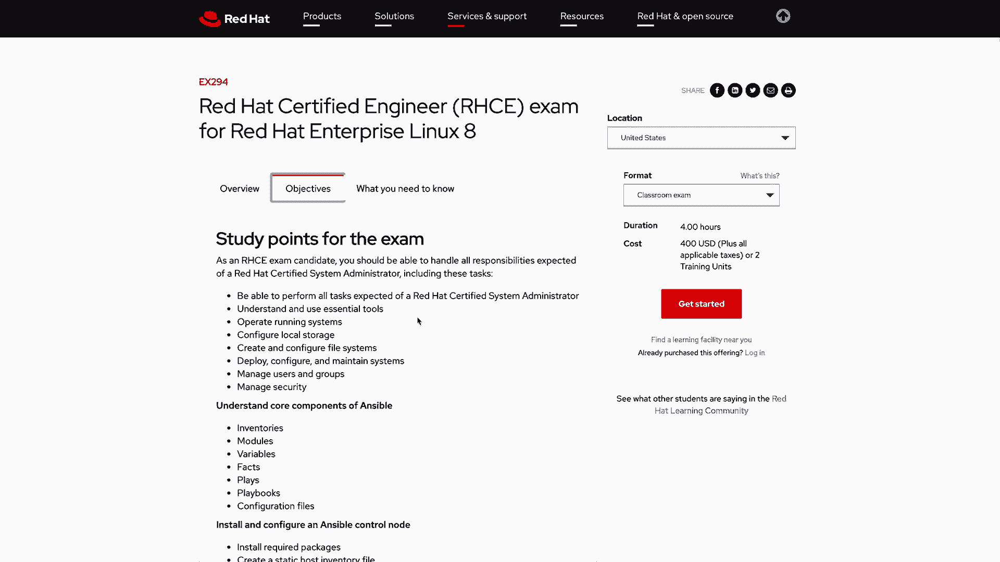

**红帽认证工程师 (RHEL 8 RHCE) - P3：388-4881-3 - 关于考试 - 11937999603_bili - BV12a4y1x7ND**

## 📝 课程概述：P3：关于考试

在本节中，我们将了解红帽认证工程师（RHCE）考试的基本信息、格式和关键要求。这有助于你为实际考试做好充分准备。

## 🧑‍💻 考试形式与核心要求

上一节我们介绍了课程背景，本节中我们来看看考试的具体情况。根据红帽官方公开的信息，RHCE考试具有以下特点：

首先，这是一门实践操作考试，要求你完成真实世界的任务。如果你参加过RHCSA或其他红帽考试，你已经了解这意味着什么。对于没有参加过的人，需要明确：此考试不是选择题，而是要求你执行实际任务，就像你在实际工作中管理系统一样。

其次，你将有**4小时**完成考试。这是一个充足的时间，但你必须熟练掌握考试内容，以免在查阅文档上花费过多时间，这在考试中会迅速累积。

以下是考试的核心设置：

*   **考试环境**：你将获得多台系统，必须安装和配置Ansible以执行系统管理任务。
*   **评估方式**：考试结束后，你的工作将通过在你创建的Playbook上针对全新系统运行来进行评估。这不仅关乎达到某个最终状态，更关乎能否用你编写的Playbook复现该状态。
*   **参考资料**：考试期间不提供互联网访问，考生也不允许携带任何物理或电子文档或笔记。但红帽指出，产品自带的文档通常可以在考试中使用。鉴于“能够使用Ansible文档”是考试目标之一，这些文档很可能在考试中可用。尽管如此，你仍需尽量减少对文档的依赖，以免占用大量时间。
*   **成绩发布**：考试成绩通常在**3个工作日**内公布。如果没有立即收到成绩，请不要紧张，可能需要几天时间。根据经验，通常会在当天收到。

## 📋 考试目标与课程大纲

了解了考试的基本规则后，我们来看看考试的具体内容。考试的核心要求是掌握Ansible自动化技术。

如果你查看过考试目标，会发现此考试与RHCE 7版本有很大不同，重点在于使用Ansible自动化管理任务。因此，如果你已持有RHCE证书并希望更新认证，请注意这两个考试差异巨大，你必须掌握Ansible才能完成新考试。

考试目标列出了所有需要掌握的知识点，这是你通过RHCE考试必须了解的主题。你会注意到，考试要求掌握RHCSA的内容，但大部分任务都与Ansible相关。因此，为了在考试中取得好成绩，你必须对Ansible有相当扎实的掌握。

在本课程中，我们的教学大纲完全映射了这些考试目标，以确保涵盖考试所需的所有内容。

## 🔗 相关资源与下一步

最后，关于考试注册和更多详细信息，你可以访问红帽官方提供的考试目标页面。该页面不仅概述了考试描述和受众，也是注册考试的入口。

## 🎯 本节总结

本节课中我们一起学习了RHCE考试的关键信息：它是一门时长4小时的实践操作考试，核心是使用Ansible在多系统环境中自动化完成任务，评估方式基于Playbook的复现能力。考试禁止外部资料但可能提供产品文档，成绩在数日内公布。成功通过考试需要扎实掌握Ansible及RHCSA基础。我们的课程将严格遵循官方目标，帮助你全面备考。