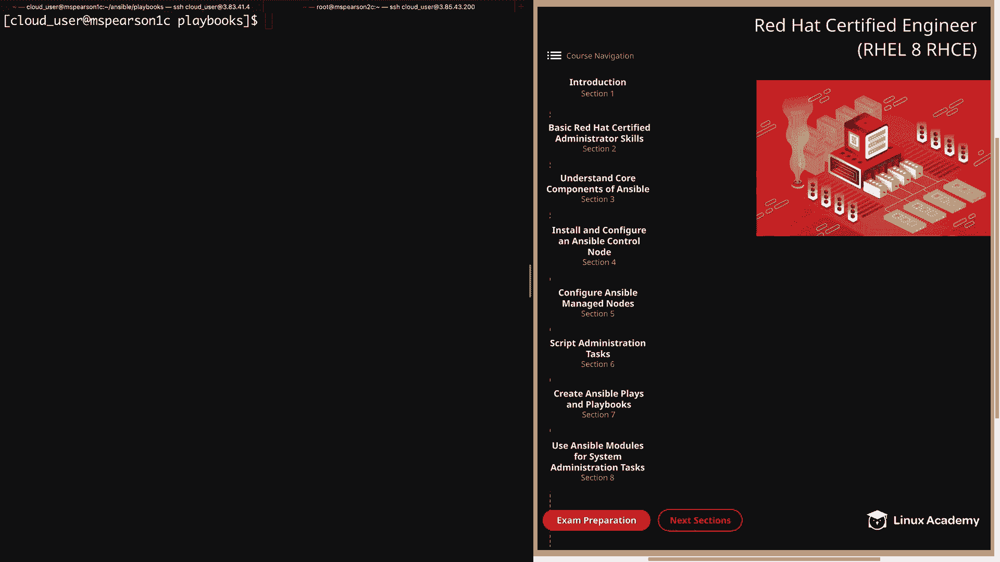
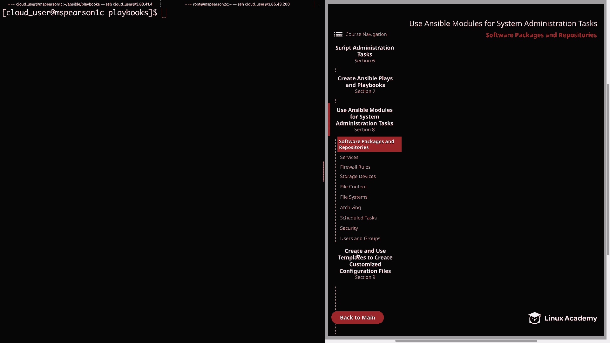
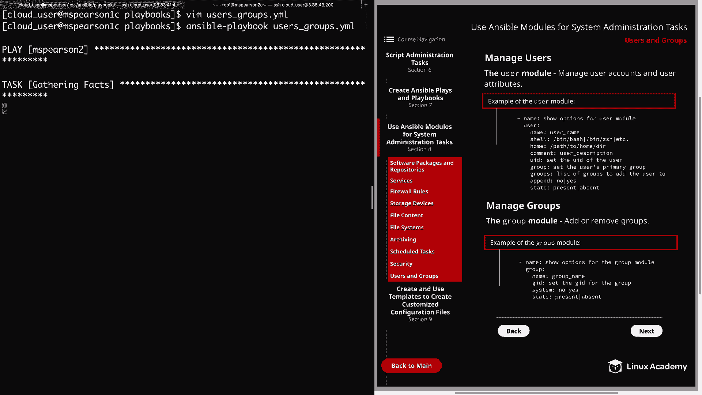
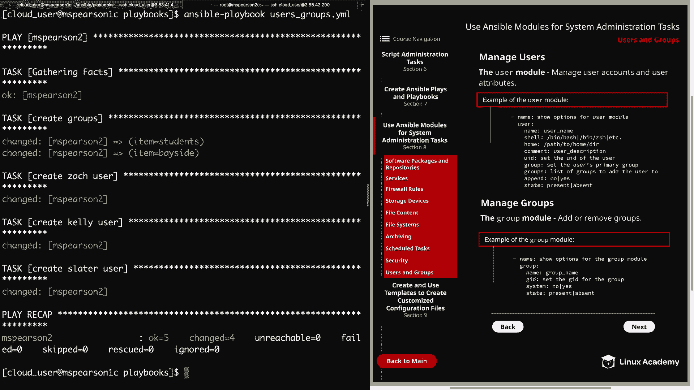
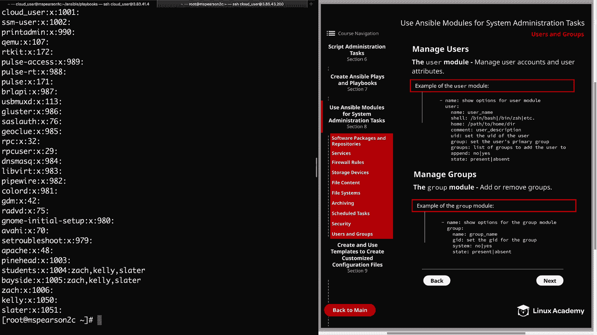
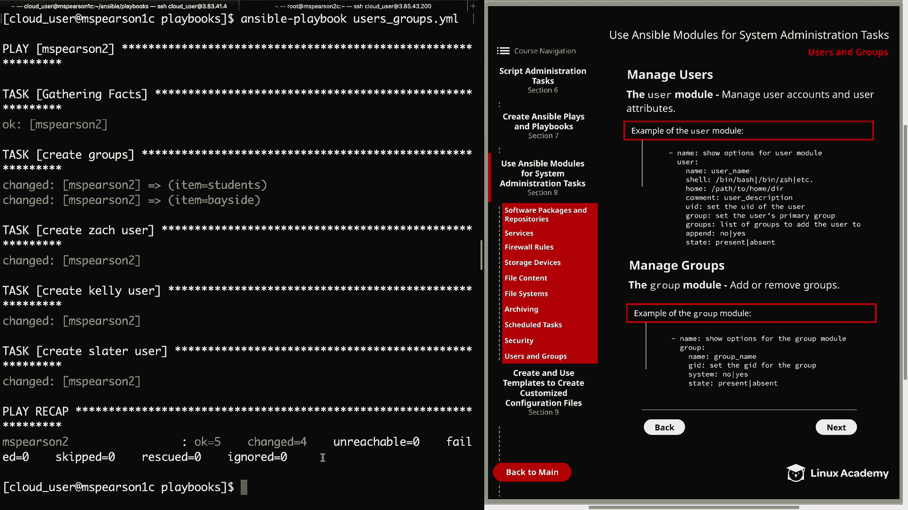
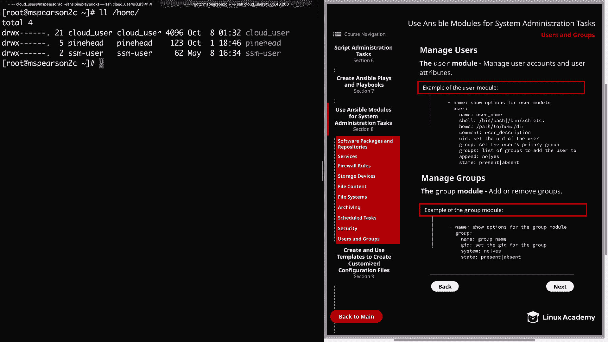

# Red Hat Certified Engineer (RHEL 8 RHCE) - P40：388-4873-10 - Users and Groups - 11937999603_bili - BV12a4y1x7ND

Welcome back everyone， this is Matt and in this video we're going to be finishing up the section on using Ansible moduleule for As administration tasks。

And our final topic is going to be managing users and groups。 So let's head down to section 8。

And down to users and groups。This has been a very long section， so good job on making it through。

Well， the first module that we're going to talk about is a module that was probably already familiar to you from even the videos we've already had in the course。

 and that is the user module， which is going to allow us to manage user accounts and user attributes。

So in the diagram， we provide an example of the user module as well as several of the parameters。

 and it's going to start off with the name parameter。

 which allows us to specify the name of the user and then the shell。

 which is going to be the user shell。Some examples of this would be Ben Bsh or B ZSH。

Then we have the home directory， and this allows you to specify the location of the user's home directory。

 Now keep in mind that the home directory is created by default。

 but it's going to be in home and in the name of the user。

 but you can use the home parameter in order to change the directory location。

 So if you like this somewhere other than just home mat or home John。

 this is the option that you're going to use in order to change that。

Comment is going to allow you to add a description for the user。And then we have the UI。

 which gives you the option of specifying the numeric UI。 Of course， by default。

 the user will be supplied at UID。 It's just going to start at the next available number。

 but this gives you the option to set that to what you want it to be。

Group sets the primary group for the user and groups will add the user to a list of groups that you provide。

 and then we have the append parameter， which is going to go hand in hand with the group's parameter。

 And this is going to allow you to specify whether or not you just want to add the user to the groups that you've specified within the group option。

 In addition to the group that the user is already a part of。 That's the S option。

And then the no option will only add the user to the groups that you specified in the group's parameter and is going to remove the user from all other groups。

 so that's something that's really important to keep in mind if you're wanting to just add a few additional groups to the user。

 make sure you have the append yes， and if you're wanting to only specify the certain groups you want them in use the no option。

And then lastly， you have state， and this determines whether or not you would like the user to exist。

And then a couple other options that I did not add in the example。

 you can also use this module in order to generate SSH keys and even to set an expirri time for the user。

And then another important one is whether or not you want to remove all the directories associated with the user upon user deletion and as we've been doing with most of these modules。

 we're just covering the options that you're most likely to use。

 but you can always view the documentation for more information about a particular module。Next。

 we have the group module， and this is going to allow you to add or remove groups In the example here。

 I've provided another set of parameters。Of course， we have the name of the group。

 and then you can also optionally set the GID number in the same way that you could set the UI with the user module。

And then system is used to indicate that the soon to be created group should be a system group。

 And then， of course， the state option is used to specify whether the group should exist or not。

 Allright， so now that we've discussed these modules。

 let's head over the command line and do a demonstration using them。

And I've actually already created the playbook that we're going to be using。

 so let's go ahead and open that up， I'm currently in the playbooks directory。

 so we're going to run vim on usersgroups。yml。All right。

 so we're going to begin with our three dashes and then the host is going to be MS Pearson 2 we're going to become the root user and then we're going to specify all our tasks。

And the first one we're going to do is create our groups and we're doing this so that when we go to create our users。

 we can actually add them to the newly created groups。

So for that we're going to use the group module and for name。

 we're going to actually supply the item variable， and then we're going to provide a loop of the groups that we want to create。

 So the state， of course， is going to be present。And then here in our loop。

 we're specifying students and Bayside。 So these are two groups that we're going to create。

 and then we're going to create the user Zack。So for that。

 we'll use the user module and then supply the name which is Zach， we're also going to add a comment。

 which is the user's full name， which is Zach Morris。And then we're going to specify the user shell。

 and for Zach， we're going to make this bin S H。And then we're going to add him to the students and Bayside group。

We're saying a pin equals yes， so this means that in addition to the groups that Zach will already by default。

 be a part of， we're going to add these students and bayside groups。 If we set this to no。

 then the only groups that Zach would have would be students and Bayside。And then the state。

 of course， is going to be present， and then for our next task。

 we're going to create the user Kelly using the user module， specify the name which is Kelly。

 and then the comment is her full name， which is Kelly Kaapowski。

And I did pick out these names for any of you die hard saved by the bell fans out there For those of you who don't know Sa by the bell。

 That is your homework for after this lesson。 Well， not actually。

 but you should definitely check it out at some point。Anyways， we're going to make Kelly's UI 1050。

And we're going to add her to the students and Bayside group， we're going to specify a pin， yes。

 and then state present。And this is our final task just to create the user slater。 So again。

 we're using the user module， the name will be slater。The comment we're going to say A sla。

And the UID will be 1051 again， adding this user to the students and baseside group with a pen equal yes。

 and then state present。So let's go ahead and save and quit。

And then we can go ahead and kick off our playbook。And this will probably take a few minutes。

 I'm going to go ahead and speed it up for you。

Al right， so now that that has finished running and it looks like our task finished successfully。

 let's go ahead and validate that by heading over to MS Pearson 2。

Let's go ahead and validate that the groups were created， so I'm just going to cat Etsy group。

We have a group slater， Kelly and Zach that were created， as well as Bayside and students。

It' also going to show us that Zach， Kelly and Slater are members of the students and Bayside group。

Now let's go ahead and cat Etsy past WD。And we see our three newly created users， Zach。

 Kelly and Slater。 and as we can see， Kelly and Slater both have their Uid set to the Uid that we set within the Ansible playbook。

 and then Zach was just given the next available。 And then in the comment section。

 we have their full name listed。 So we have Zack Morris， Kelly Kaapowski， and then A C Slater。

And since we didn't specify the home parameter， the home directors were created in home and then the user name。

 which is the default behavior。And Kelly and Slater were given the default shell。

 which has Ben baash。 And Zach was given the shell Louis we specified， which was Ben S。 H。 All right。

 so now that we have seen how to create these users， let's go back and remove them。

Clear this out。We'll open up our playbook and in order to remove these users。

 all we need to do is change the state from present to absent。So what I'll do for that。

 is we'll just substitute， So we're going to be looking for present。

 We're going to substitute that with absent。All right， we see four substitutions。

 so we have state absent， state absent all the way up to create groups。

And then one other thing we need to do is add the remove parameter and that's going to remove all the directories that are associated with that user。

So we'll head down here。 We're going to add another line。 We're going to add remove。

Set that equal to yes。And then again， remove， yes。And then here one more time。Remove， yes。All right。

 let's go ahead and save and quit this。And then we can kick off our playbook one more time。

I'll go ahead and speed this up as well。

All right， let's head back to MS Pearson 2。

And then we can run our cat on Etsy past a BD again。

And we see that all three of the users have been removed。Now， let's check out the groups。

 The cat Etsy group。And our groups have also been removed。

And the one last thing that I wanted to show you was that it also removed the user's home directories or it should have at least。

 let's go ahead and do a listing on home。And we see that the user's home directories have also been removed。

Well， that's going to finish up this lesson on user Z groups and also our section on using Ansible modules for system administration tasks。

So let's go ahead and market complete and we can move on to the next section。

