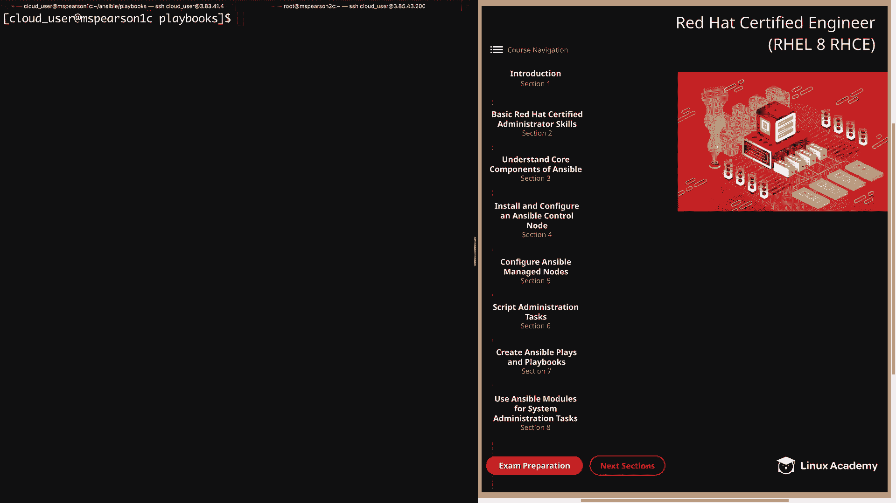
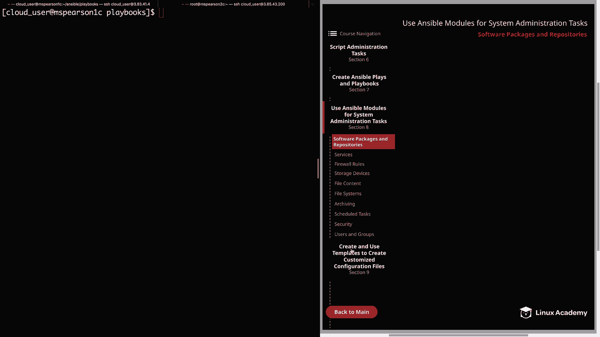
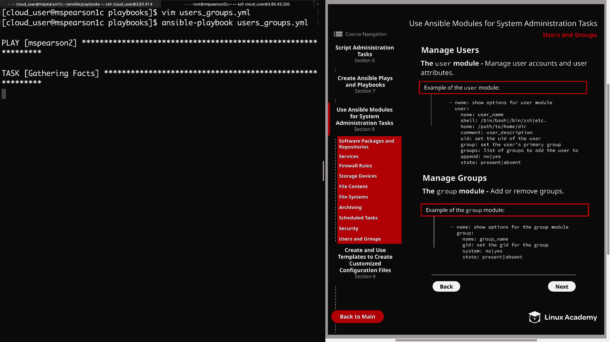
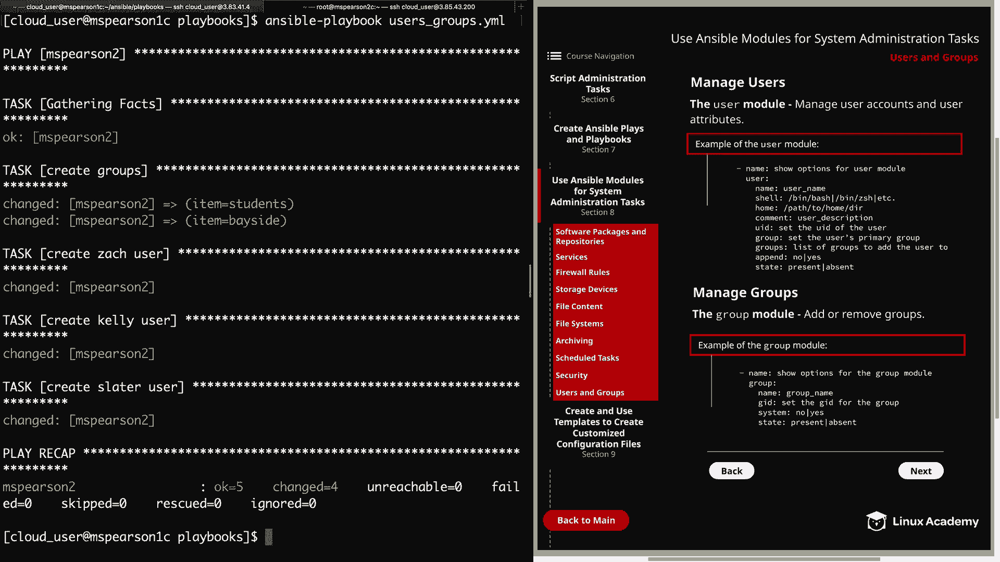
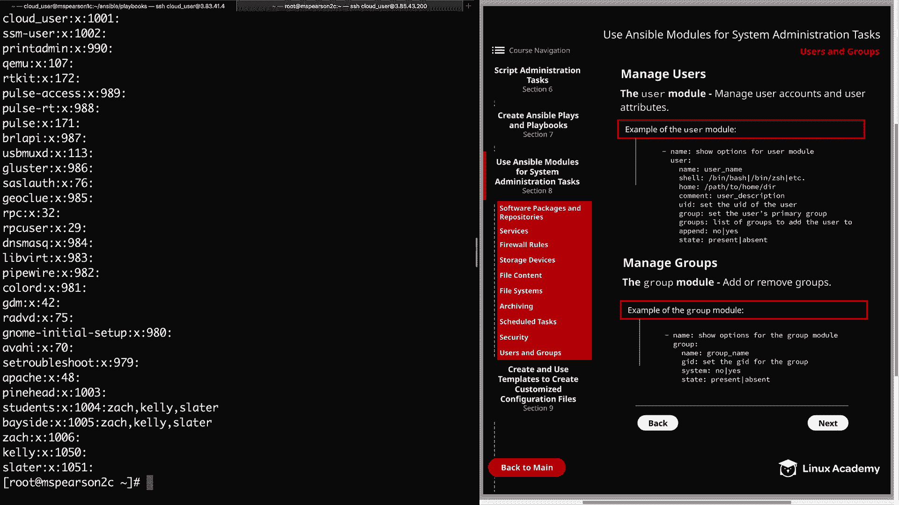
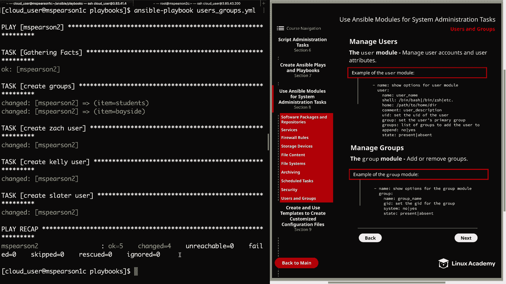
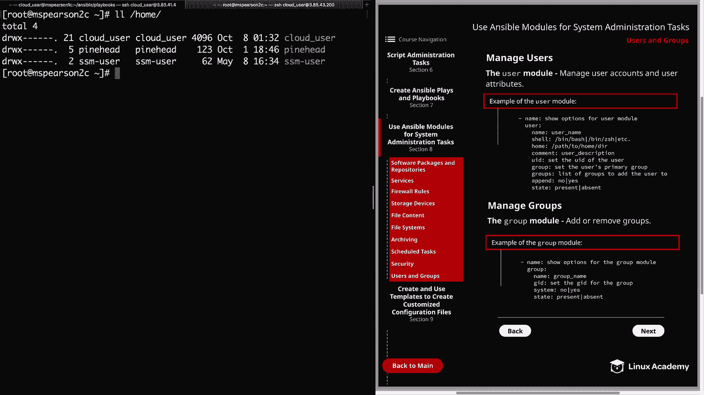

# RHCE 认证课程：P40：使用 Ansible 管理用户和组





在本节课中，我们将学习如何使用 Ansible 模块来完成系统管理任务。具体来说，我们将重点探讨如何管理用户和组。这是本课程一个较长章节的收尾部分，恭喜你坚持到这里。

上一节我们介绍了其他系统管理模块，本节中我们来看看用于管理用户和组的两个核心模块：`user` 模块和 `group` 模块。

## 用户管理模块：`user`

`user` 模块允许我们管理用户账户及其属性。以下是该模块的一些常用参数：

*   **`name`**：指定用户的登录名。
*   **`shell`**：设置用户的登录 Shell，例如 `/bin/bash` 或 `/bin/zsh`。
*   **`home`**：指定用户家目录的位置。默认情况下，家目录会创建在 `/home/用户名` 下，此参数可用于更改此默认路径。
*   **`comment`**：为用户添加描述信息。
*   **`uid`**：指定用户的数字用户ID。默认会分配下一个可用的 UID。
*   **`group`**：设置用户的主组。
*   **`groups`**：将用户添加到指定的附加组列表中。
*   **`append`**：此参数与 `groups` 配合使用。`append: yes` 表示将用户添加到 `groups` 列表中的组，同时保留其原有的其他组成员身份。`append: no` 则表示用户**仅**属于 `groups` 参数中指定的组，并将从所有其他组中移除。
*   **`state`**：决定用户账户的状态，`present` 表示创建，`absent` 表示删除。
*   **`remove`**：当 `state: absent` 时，此参数决定是否删除与该用户关联的所有目录（如家目录）。

此外，该模块还可用于生成 SSH 密钥和设置账户过期时间等。

## 组管理模块：`group`

`group` 模块用于添加或删除组。其常用参数如下：

*   **`name`**：指定组的名称。
*   **`gid`**：设置组的数字组ID。
*   **`system`**：指示即将创建的组是否为系统组。
*   **`state`**：指定组的状态，`present` 表示创建，`absent` 表示删除。

## 实践演示：创建用户和组

现在我们已经了解了这些模块，让我们通过命令行进行实际操作。以下是一个 Ansible 剧本示例，用于创建组和用户：

```yaml
---
- hosts: mspearson2
  become: yes
  tasks:
    - name: 创建组
      group:
        name: "{{ item }}"
        state: present
      loop:
        - students
        - bayside

    - name: 创建用户 Zach
      user:
        name: zach
        comment: "Zach Morris"
        shell: /bin/sh
        groups: students,bayside
        append: yes
        state: present

    - name: 创建用户 Kelly
      user:
        name: kelly
        comment: "Kelly Kapowski"
        uid: 1050
        groups: students,bayside
        append: yes
        state: present

    - name: 创建用户 Slater
      user:
        name: slater
        comment: "A.C. Slater"
        uid: 1051
        groups: students,bayside
        append: yes
        state: present
```



运行此剧本后，可以在目标主机上验证用户和组是否已按预期创建。





## 实践演示：删除用户和组

要删除之前创建的用户和组，并同时移除用户的家目录，可以修改剧本：



```yaml
---
- hosts: mspearson2
  become: yes
  tasks:
    - name: 删除用户 Zach
      user:
        name: zach
        state: absent
        remove: yes

    - name: 删除用户 Kelly
      user:
        name: kelly
        state: absent
        remove: yes

    - name: 删除用户 Slater
      user:
        name: slater
        state: absent
        remove: yes

    - name: 删除组
      group:
        name: "{{ item }}"
        state: absent
      loop:
        - students
        - bayside
```

运行修改后的剧本，即可删除用户、组及其关联的目录。


## 总结



本节课中我们一起学习了如何使用 Ansible 的 `user` 和 `group` 模块来高效地管理 Linux 系统中的用户和组。我们了解了创建、修改和删除用户及组的关键参数，并通过实践演示巩固了这些概念。这标志着我们关于使用 Ansible 模块进行系统管理任务章节的结束。接下来，我们可以继续学习后续章节的内容。