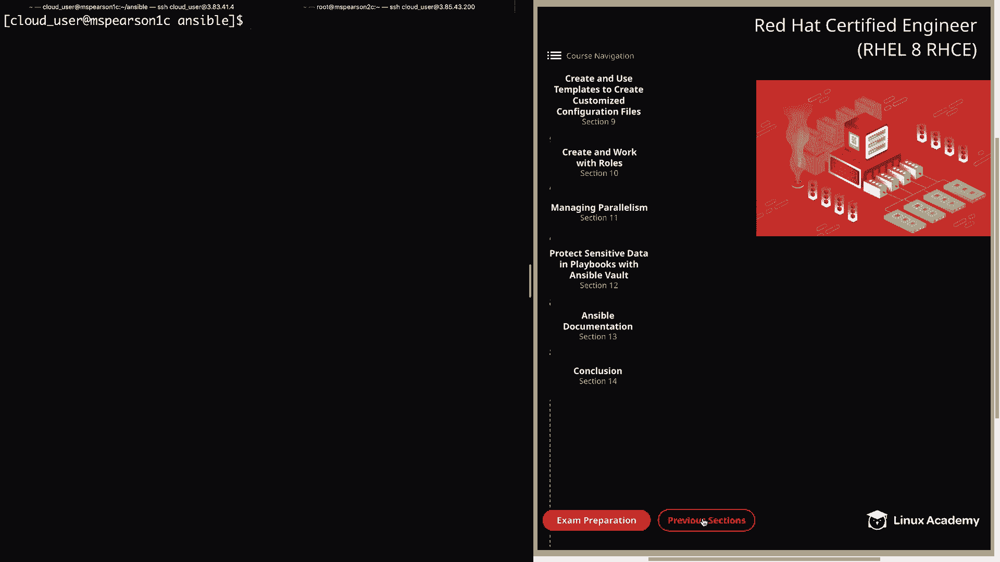

# Red Hat Certified Engineer (RHEL 8 RHCE) - P41：388-4874-1 - Ansible Variables - 11937999603_bili - BV12a4y1x7ND

Welcome back everyone， this is Matt， and in this video we're going to kick off section 9。

 which is using templates in order to create customized configuration files。

And before you can understand how to use templates。

 you really need to understand how to use variables within ansible。

 And so that's what we're going to be covering in this lesson。

 So let's head down to this little button next sections。

And then we can click on section 9。And that's going to take us to ansible variables。Alright。

 so now let's talk a little bit more about variables。

 and then I'll show you a demonstration of how you can use them in Anible。 The first。

 variables can contain letters， numbers and underscores， but it must begin with a letter。

 variabless can also be stored as dictionaries， which are going to map keys to values。

And then these dictionary variables are going to be referenced using bracket notation or dot notation。

 and I provide an example here in the diagram， So if you look right here。

 we have the example of bracket notation， which is just the name of the dictionary and then the field that you want is going to be in brackets and then single quote or you can also list the dictionary and then do a dot and then the field name and honestly this is going to come down to preference on which way you want to use this。

 of course just doing the dot is a little easier， a little less typing。

 but one thing to keep in mind is that there can be some yamble gotchas when you use the dot notation。

 so the safest way is to use bracket notation， but just keep that in mind if you run into any issues。

Next variable stored as a list array may be accessed by putting the element number in brackets。

 So in addition to being able to use dictionary variables where you have the key value pair。

 you can also store variables as a list and whenever you need to reference a member of that list。

 you can always put the list name or the array name and then the number or where the actual element comes in the list。

 So in the example here I'm showing the first element of an array。

 So you have the name of the array or the name of the list and then the first element is going to be 0。

 and then it goes1，2，3， so on and so forth。Next variables may be defined or set in the following location so you can store the variables directly in the inventory file or within hoststVs or group bars directories。

 which of course is going to be relative to the inventory。

And then you can also store them within playbooks， and you have several options here。 First is vrs。

 which is going to allow you to add the variable directly。So we have vrs prompt。

 which is going to prompt whoever is running the playbook for specific values。

 Next variables can be set for roles， and this is done by adding them to the main dot Yaml within the varrs directory of that roll。

 And we'll be talking a lot more about that in a later video。

But when you've added those variables to the main dot yaml。

 it's going to make it available to that role。 And generally speaking。

 all the other roles are going to be able to make use of the variables as well。 And then lastly。

 you can also define variables directly on the command line when you're running your playbook。

 and this is done by using the dash Efl or dash dash extra vs。

And you can add them as key value pairs， or you can even reference a variable file using the at symbol。

 Allright， so now let's head on to the next page。Next。

 you can reference defined variables using the Gingja2 templating system。

 I'm going to provide an example of this in the diagram。

 so as you can see you're going to have the variable name and you're going to surround that with two curly braces。

 but keep in mind that Yaml does require values starting with a variable to be quoted。

 So if your variable comes at the beginning of the line。

 you are going to need to quote the entire line。You can also transform variable values using Genja2 filters。

 such as join or capitalize， where join is going to concatenate values and capitalize is going to capitalize values。

 And again， we will be talking more about that later on。Next。

 Ansible stores information about remote host and variables that are known as Ansible facts。

 and we've seen a lot of examples of this already。But these are very useful and are collected by Ansible by default。

 So that's something that we'll definitely take advantage of when we're using templates。 Also。

 Ansible provides special reserve variables known as magic variables。

 And some examples of these is going to be host barss， groups， group names and inventory host name。

And HoFar is going to let you access variables for another host。

 which can definitely be useful when you're running in a playbook and you want to access variables of another managed node。

Groups is going to provide a list of all the groups in the inventory and also the host that belong to them。

 and then group names is going to provide a list of all the groups that the current host is in。

 And then finally， inventory host name is the name of the host name as configured in the inventory file。

 So sometimes you may not want to use the ansciible host name that's gathered by the Anciible facts or even the F QDN。

 but rather the name as you have defined it in the inventory file。Al right。

 so the last thing we're going to talk about is custom facts， also known as local facts。

 and these can be added to the remote system by the user。

 These facts are going to be defined in files that end with dot fact。

And the local fact files are stored in Etsy ansible fax。d by default。

 but the fact file directory can be changed using the fact_ path keyword。

 so as it is with many other ansible configurations you can also update this and put it in a directory that might make more sense for you。

And then lastly， local facts can be viewed by running the Ansible ad hoc command with the setup module and then filter by looking for Ansible underscore Local So now let's head over the command line and I'll show you how to do this real quick。

Before we run our ansipible ad hoc command， let's head to MSParson 2。

And I'm going to CDd into Etsy ansiblefaax。d。As you can see， we have one fact file。

 which is host_ Info， so let's go ahead and open that up。So as you can see。

 this is an II format and I have a dictionary with some key value pairs。

 so I'm just calling this La server， and then I have type equals cloud and then platform equals AWS。

So let's go ahead and close out of this and head back to MSParson 1， our control node。

And then we can run ansible。Ms Pearson 2。Use the setup module。And then we're also going to filter。

And look for Ansible， underscore local。Go ahead and kick that off。And as you can see。

 it's going to pull back our ansible f looking for Ansible Local。

 which shows our host underscore Info Fax file。And then we have lab server with our key value pairs here。

 which is platform AWS and type cloud For more casual users。

 you probably will not be using local f as much， but this is an option that's available to you。

 And that way you can define certain variables that make sense for your installation。 Allright。

 so now let's clear this out。Alright， so now I'm going to show you a demonstration of using a variable file in order to create some users。

So the first thing I want to show you is that I'm in the Home cloud user Ansible directory。

I've created another directory called VRS， this is just where I'm keeping my variable files。

So let's go ahead and open up users。yMl。As you can see this is in Yaml format and I'm just specifying my variable here which is students。

 and then I'm creating a list， so under students we have Zach。

 Kelly Slater and Lisa and then I have another variable which is faculty and under that we have building。

 blis， tuttle and Dewey。And to jump back to what I was talking about before in order to view or reference a variable。

 you see we have an array here or a list。So if we were to reference this variable students。

 Zach would be referenced by using zero， and then we would have Kelly 1，2，3。

So that's just so you can visually see what I'm talking about， but anyways。

 we have our two variables here and it's a list of users， so let's go ahead and quit out of this。

And now we can seed into our playbooks directory， we're going to create a new playbook。

And I'm just going to call it variables。yl。Start out with our three dashes。And then for host。

 we're going to be running this again against MS Pearson 2。And then become is going to be yes。

 And then I'm going to specify keyword that we already referenced in this lesson。

 which is varase underscore files。And this is going to allow us to reference our variable file。

So we'll come down here。We're going to type in home cloud_ user。

Ansible or this is in our vars directory， and it's called users。 YMl。

 And if you had multiple variable files that you wanted to reference in your playbook。

 you could just add the list right here， but since we're just using one。

 I'm going to go ahead and hit enter。And then we can come back and supply our tasks。

So for this playbook， we're only going to have one task。For the description。

 I'm just going to say create users。We're going to use the user module。

We're going to specify name and for this， I'm actually going to use the item variable。

 so we'll put in our curly braces。Close our quote， type in item。

And that's because we're going to ultimately end up looping through the users that we've listed in our variable file。

 so we've got our item variable。Now we need to specify the state， which is going to be present。

And normally I would use the loop keyword this time I'm going to show you with items。

And then we go to delete the users， I'll come back and I'll show you the syntax to use for the loop keyword。

 which is actually going to require a filter in order to get the expected outcome We'll talk about that in just a minute。

So now let's go ahead and add our variables。So it's going to be。Students。

And then I'm just going to yank and paste this。And then it's going to be faculty。And so right here。

 even though students and faculty have not been defined in this playbook。

 we're able to reference them because we're pulling in our variable file where they are defined。

 All right， let's go ahead and save this， and then we can run our playbook。

Playbook and then it's variables do YMl。This might take a little while。

 so I'll go ahead and speed it up so you don't have to wait。All right， so now that that is finished。

 let's head over to MS Pearson 2C。And then we can cat E C past WD。

And then we see that all eight of our users， the four under studentss， which was Zach Kelly Slater。

 Lisa， and then the four that was under faculty， buildinging， bliss Tuddle and Dewey。

 have all been created。So we were able to successfully reference our variables using the VarRS underscore files keyword within our playbook。

 but now let's head back to MSParson 1 and we can remove these users。So go ahead and clear that out。

Let's go ahead and replace present with absent。And then we can add remove equals yes。

That's just going to remove all those directories associated with the users。

And then rather than using the with items keyword。We're actually going to say loop。

And then we can just remove。These two variables here。Then we're going to open up a double quote。

 and then our two curly braces， and then we're going to open a bracket and we're going to reference both of these variables so it's going to be students。

And then faculty。And then we're going to apply a filter， which is flatten。1n。

And then we can close this out。So we're just listing out our variable students and faculty。

 each has a list of users associated with it。And then we're going to add the pipe。

 and then we're going to specify a filter， which is flatten。

 and this is going to allow us to perform single level flattening。

 And this is something that we need to do in order to get the same exact output that we would do with with items。

And that has to do with the way that we've specified our variables。

So let's go ahead and save and quit。And then we can kick off our playbook once again。

I want it looks like I misspelled faculty， so let's pop right back into that real quick。

This is going to be faculty。All right， so let's save and quit。 and then we can try this again。

All right， so that completed successfully this time。 set back over to M Pearson 2。

And we can run another cat on past WD。

And we see that all of our users have been removed using the loop with the flatten filter。

And also all their home directories have been removed as well。Well。

 that's going to wrap up this lesson on variables。 Next， we're going to dive into templates。

 Well let's go ahead and mark this complete。