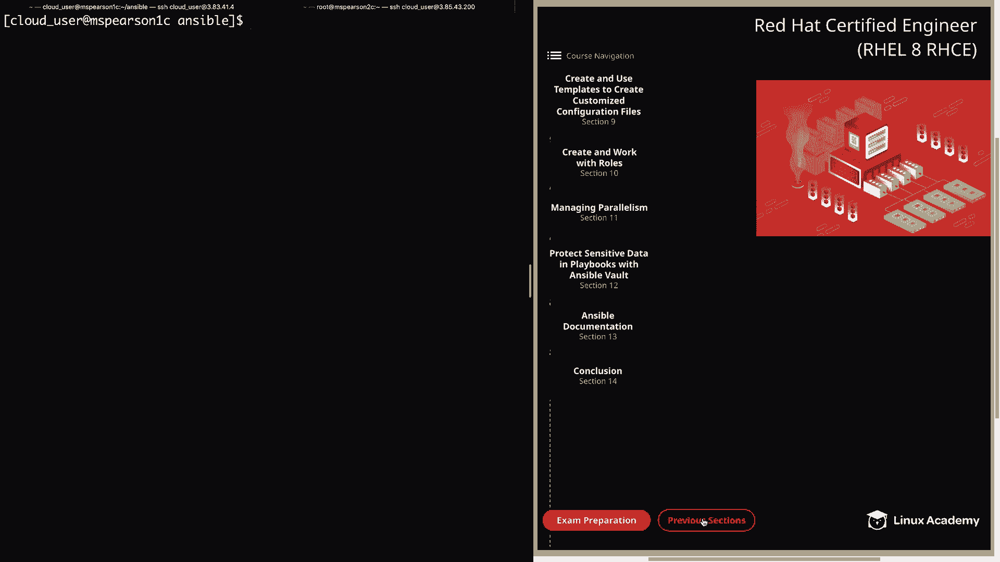
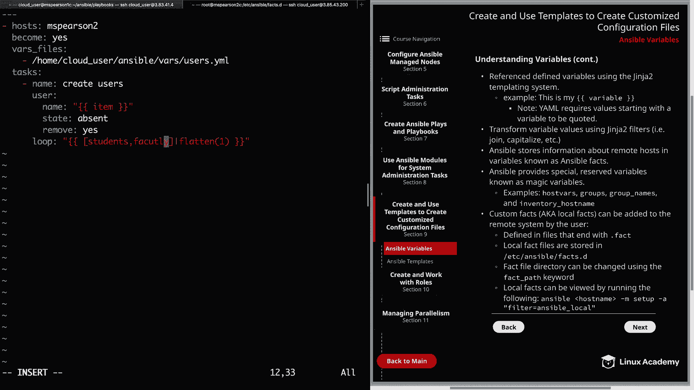
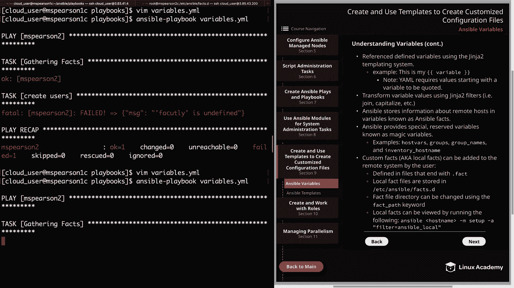
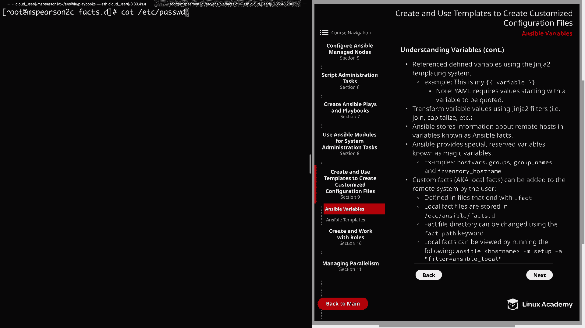

# Ansible 课程：第9章：使用变量 🎯



在本节课中，我们将学习 Ansible 变量的核心概念和使用方法。变量是 Ansible 自动化中存储和引用动态数据的关键，理解它们是掌握模板功能的基础。

## 变量基础

上一节我们介绍了 Ansible 的基本结构，本节中我们来看看变量的定义规则。

变量名称可以包含字母、数字和下划线，但**必须以字母开头**。

变量可以存储为字典，字典将键映射到值。引用字典变量时，可以使用方括号表示法或点表示法。

**代码示例：**
```yaml
# 方括号表示法
user_info['name']
# 点表示法
user_info.name
```

点表示法输入更简便，但使用方括号表示法通常更安全，可以避免一些 YAML 解析的潜在问题。

变量也可以存储为列表或数组。访问列表元素时，需在列表名称后的方括号内指定元素的索引号（从0开始）。

**代码示例：**
```yaml
# 访问列表的第一个元素
user_list[0]
```

## 变量的定义位置

以下是定义变量的几种主要位置：

*   **清单文件**：可以直接在 Ansible 清单文件中定义变量。
*   **主机变量与组变量目录**：可以在相对于清单文件的 `host_vars` 或 `group_vars` 目录中定义变量。
*   **Playbook 内部**：
    *   `vars:`：直接在 Playbook 中定义变量。
    *   `vars_prompt:`：运行 Playbook 时提示用户输入变量值。
*   **角色变量**：在角色的 `vars/main.yml` 文件中定义，使其对该角色可用。
*   **命令行**：使用 `-e` 或 `--extra-vars` 选项在运行 Playbook 时直接定义变量，支持键值对或通过 `@` 符号引用变量文件。

## 变量的引用与处理

在 Playbook 中，我们通过 Jinja2 模板系统引用已定义的变量。

引用变量时，需用双花括号 `{{ }}` 包围变量名。注意，如果一行 YAML 的值以变量开头，则必须用引号将整行括起来。

**代码示例：**
```yaml
- name: 使用变量
  debug:
    msg: "{{ my_variable }}"
```

可以使用 Jinja2 过滤器来转换变量值，例如 `join` 用于连接值，`capitalize` 用于将值首字母大写。

## Ansible 事实与魔法变量

Ansible 会自动收集被管理节点的信息，这些信息存储在称为 **Ansible 事实** 的变量中，它们在模板中非常有用。

此外，Ansible 还提供了一些特殊的保留变量，称为 **魔法变量**。

*   `hostvars`：允许访问其他主机的变量。
*   `groups`：提供清单中所有组及其所属主机的列表。
*   `group_names`：提供当前主机所属的所有组的列表。
*   `inventory_hostname`：清单文件中配置的主机名。

## 自定义事实（本地事实）

用户可以自定义事实，也称为本地事实。这些事实定义在以 `.fact` 结尾的文件中。

默认情况下，本地事实文件存储在 `/etc/ansible/facts.d/` 目录下，但可以通过 `fact_path` 关键字更改此目录。

要查看本地事实，可以运行带有 `setup` 模块的 Ansible 临时命令，并通过过滤器查找 `ansible_local`。

**代码示例：**
```bash
ansible mspearson2 -m setup -a "filter=ansible_local"
```

## 实践演示：使用变量文件管理用户

现在，让我们通过一个实际例子来巩固所学知识。我们将创建一个变量文件来定义用户列表，并在 Playbook 中使用它来创建和删除用户。

首先，在 `vars/users.yml` 变量文件中定义两组用户：

```yaml
students:
  - zach
  - kelly
  - slater
  - lisa
faculty:
  - building
  - bliss
  - tuttle
  - dewey
```

接着，创建一个 Playbook `playbooks/variables.yml`。在 Playbook 中，使用 `vars_files` 关键字引入外部变量文件，然后使用 `user` 模块和循环来操作用户。

**创建用户的 Playbook 示例：**
```yaml
---
- hosts: mspearson2
  become: yes
  vars_files:
    - /home/cloud_user/ansible/vars/users.yml
  tasks:
    - name: 创建用户
      user:
        name: "{{ item }}"
        state: present
      with_items:
        - "{{ students }}"
        - "{{ faculty }}"
```

运行此 Playbook 后，清单中定义的所有用户将被创建。

**删除用户的 Playbook 示例（使用 `loop` 和 `flatten` 过滤器）：**
```yaml
---
- hosts: mspearson2
  become: yes
  vars_files:
    - /home/cloud_user/ansible/vars/users.yml
  tasks:
    - name: 删除用户
      user:
        name: "{{ item }}"
        state: absent
        remove: yes
      loop: "{{ [students, faculty] | flatten }}"
```

这里，`loop` 关键字结合 `flatten` 过滤器，将嵌套的列表（`students` 和 `faculty`）扁平化为一个单层列表，以便正确循环。







---

本节课中我们一起学习了 Ansible 变量的核心知识，包括变量的定义规则、存储位置、引用方法，以及如何使用事实、魔法变量和自定义事实。我们还通过一个管理用户的实例，演示了如何在 Playbook 中引入变量文件并利用循环执行任务。掌握变量是迈向高效使用 Ansible 模板的重要一步。下一节，我们将正式进入模板的学习。