# Red Hat Certified Engineer (RHEL 8 RHCE) - P42：388-4874-2 - Ansible Templates - 11937999603_bili - BV12a4y1x7ND

Welcome back everyone， this is Matt， and in this video we're going to be wrapping up section 9 and talking about using templates in order to create customized configuration files。

So let's head over to next sections and then section 9。

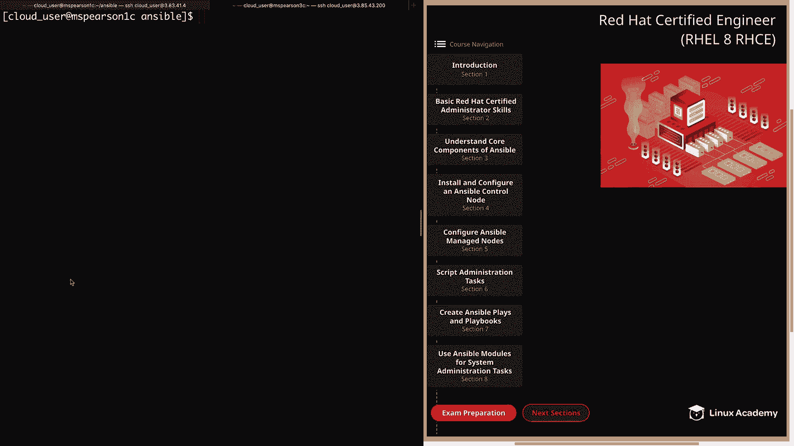

And finally， down to Ansible templates。

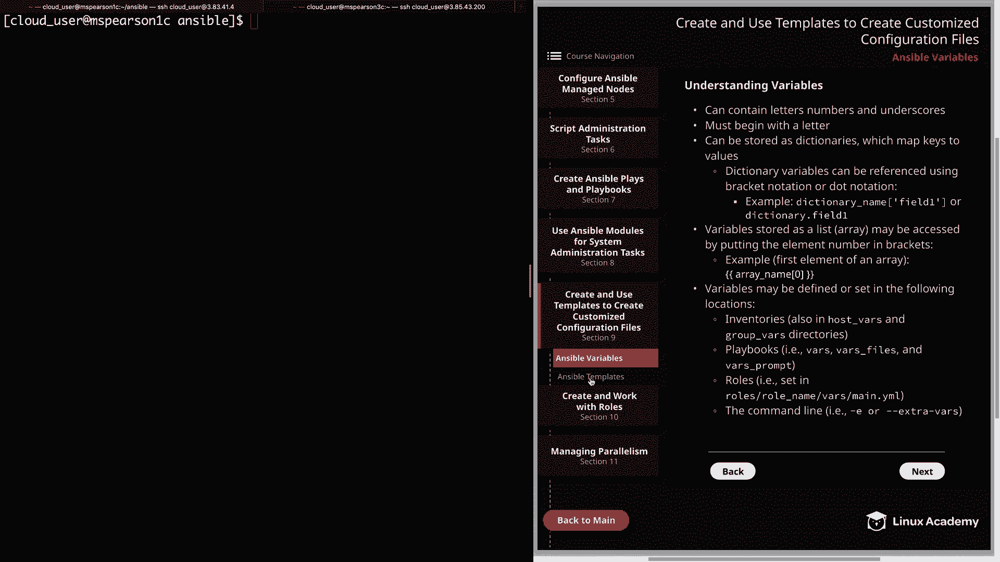

So first we're going to talk a little bit about templates and then I'm going to show you a couple template files that I've created and then we're going to use those template files in a playbook in order to push out a configuration file Allright。

 so first off templates are just files that contain both static values and dynamic values through the use of variables so the powerful thing about a template is that you can have a basic file with data in it but by taking advantage of variables you can also have these values dynamically generated based on the host that you're pushing the template out to or just variables that you define and Ansible is going to process these templates using Geningja2 and this is just a templating language for Python and we're not going to go super in-epth into Genja2 but I will be showing you the basics of how we're going to create these templates for use with Ansible and also how we can use filters to manipulate the output of our data。

Next templates are designated with the dot J2 extension。

 and that just specifies that the file is a Geningja 2 template and should be read as such Next template files are often used for configuration file management。

 and that's because it removes the need to manually update configuration files which for anyone who's done that themselves is very prone to human error。

 but it also allows config files to be pushed out to multiple hosts so in that way it's going to be scalable and you can find variables or use existing variables so that the values within the file will be automatically generated and that leads us into the next point。

 which is that templates have access to the same variables as the play that calls them。

 so this will be any variables that Ansible collects about the remote servers via Ansible facts and any variables that you defined for your host or your groups。

Or even variables that you've defined specifically for that play。

 And that brings us to the template module， which processes a template and then pushes it out to remote server。

 So this is going to be our main means of taking the templates that we've created and then pushing them out to our managed servers。

And in the diagram， I've provided an example of the template module with many of its parameters。

First， of course， we have source， which is the path to the template itself， then destination。

 which is where you actually want to put the template file on the remote server。

Next you could specify the owner and group of the file， as well as the file permissions using mode。

Another handy option is the validate option and so for this you're going to put in a validation command and then that little percent S is what's going to pull in your actual template file and depending on what type of configuration file you're working with that validation command is going to change but several different services provide syntax checking utilities and so you're just going to pick the one for your particular configuration so this can be something like Vi pseudo in order to validate a pseudoors configuration and again the path to the file you want to validate is going to be passed using that percent S and that also must be present and then lastly。

 we have the backup option which is just going to allow you to take a backup of the original configuration file so you have that in case for some reason your templated configuration file is messed up in any way。

Al right， so now let's click over to the next page。

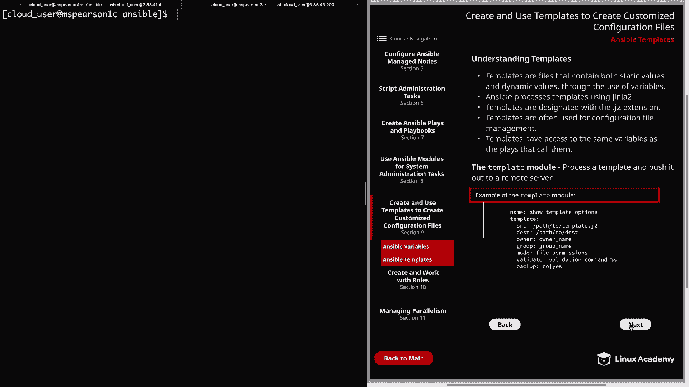

And this is going to show you an example of an Apache configuration file template。

 and I'm actually going to be showing you this in the command line。

 but I want you to know that it is in the diagram， so that way you can reference back to it if you want。

 we also have a templated index。 HTML file and that's another one I'll be showing you in the command line。

And then lastly， I've provided a playbook example， and so this is the playbook that I'm going to use to push out my templates。

All right， so let's head over to command line。And I'm currently in my working directory。

 which is answersible。 Let's go ahead and change directories and go to the templates directory。

And in this directory， I've created my httPd。com。j2 and my indexex。html。j2。

 so let's go ahead and open up httPd。com。And so what I did for this template was just copy the basic Apache configuration file。

 and then I added it to my control node， and then I removed all of the comments。And then at the top。

 I just added what the configuration file was， which is the main HttP server configuration file。

 and then I added it in a variable here， which is ansible managed。

 so this is going to substitute our value for that ansible managed variable。

 which is going to let any user know that this particular configuration file is controlled by ansible。

And for the rest of the configuration file， I have added a mixture of variables that I'm defining in my playbook。

 as well as some variables that are just gathered by Ansible facts。

So if we go down just a little bit， we have the listen directive。

 and I've added a variable here called HtTP underscore Port。

 and this is one of those that I've actually defined in my playbook。

 and I'll be showing you that in just a minute。And then if we go down a little bit more。

 we have the server admin， and I've added the variable admin， which is also defined in our playbook。

 and then ansible host name， which is gathered by ansible F。

AndThen if you go down a little bit further， I have changed the document route to be a variable called content underscore D。

 and this is another variable that I have defined directly in the playbook。

 and I've also placed it within this directive in order to change the directory that's being referenced。

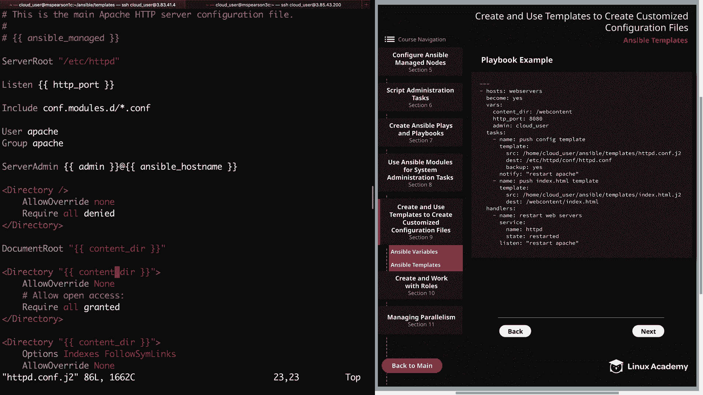

And then I also changed it here。 And then for the rest of the values。

 I've just kept the default httP。 co configurations。 and if we wanted to。

 we could change any of these to reference a value of our own or to reference a variable。

 but I'm just going to leave these as the default。 So let's go ahead and quit out of this。

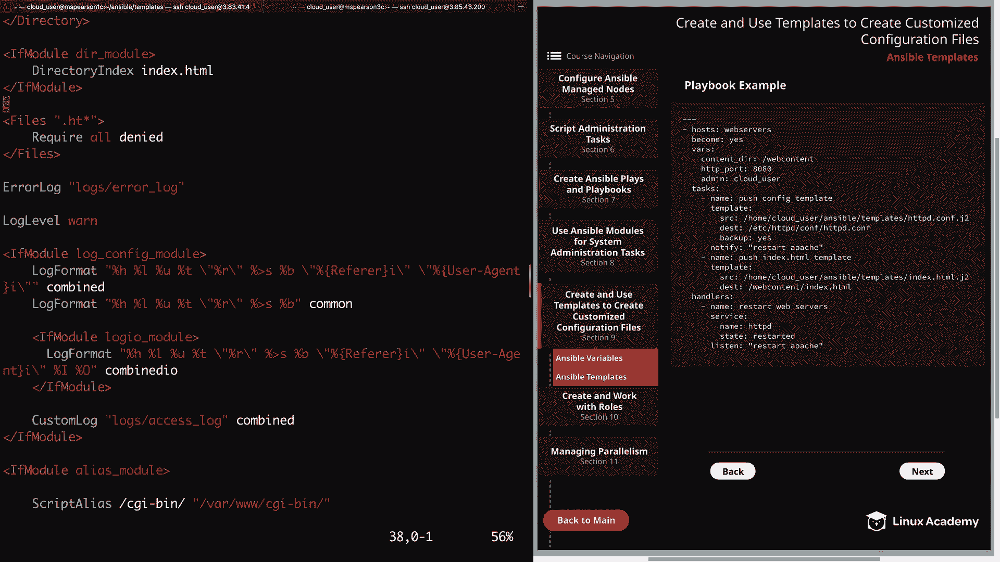

And then the next file I want to show you is my index。htm。j2。So this is just a template for an index。

t HTML。 So what I'm doing here at the top is saying welcomee to。

 and then I'm pulling in the ansible underscore host name。

And then as we go down just a little bit more， I'm listing out that the IPV4 address is set to the ansible default underscore IPV4。

 and then I'm referencing the address and bracket notation。

 And next I have the current memory usage set to ansible memory underscore M。

 and I'm referencing real and then used。And then I'm saying out of the total memory available。

 And so that's going to be。Real and then total， again， expressed in bracket notation。

 And then on the next line， I'm referencing the ansipible underscore devices variable。

 and then I'm using a filter here that is saying to pull the first device。

 and then I add inblock device has the following partitions， and then a colon。

 and then on the next line， I'm again making a call to ansible devices。

 and then the Nvme 0 and1 block device。And then finally to partitions。

 so that's going to pull in all the partitions， and then I've supplied another filter。

 which is the join filter that's going to allow us to concatenate these values。

 and then we're going to concatenate these values using a line break。

 which is going to be backslash in and then I've added a space and then another dash so that's going to make sure that every partition is added on a new line and then includes a space and a dash before you actually list the partition。

All right， so let's go ahead and quit out of this。And now we can head to our playbooks directory。

I'm going to clear out and I'm going to open up the playbook that I've created for this demonstration。

 and I just called it Apachetemplate。yMl。So if we head back to the top。

 we can see that the host that we're executing against is the Web server's group。

 we're going to become the root user， and then we're going to specify a few variables using the varRS keyword。

So underneath Vars we have content underscore Dr， which is set to the web content directory and remember that we have set the document route to that variable content Dr so our new document route is going to be web content and then we have HtTP underscore port which we've now set to 8080 and by default。

 Apache is going to listen on port 80 and you remember the listen directive within the Apache configuration file we have set to our HtTP port variable So now Apache is going to listen on 8080 rather than port 80。

And then lastly， we have admin and for this variable。

 we've set the value to cloud underscore user so all the variables that you saw in the configuration file。

 this is where they're defined Now if we wanted to。

 we could have created a variables file and added all of these variables to that file and then use the varrs underscore file keyword and then just referenced the file location。

 but this time I have chosen to use the vrs keyword and just added them directly into the playbook。

And next we have our tasks。The first task is to push the config template。

And so we're going to use the template module and the source is going to be the path to our httPd do co J2 template and the destination is the default location for the Apache configuration file。

 which is an Etsy HttPD compf HttPD co and I have specified that we're going to make a backup of this So that way when we push out our template。

 we will have the original as well。 And then I'm also using the notify keyword in order to notify our handler that's specified down at the bottom to restart Apache。

 So if we go down to our handler。We're just using this to restart our web servers。

 so we're using the service module， giving the name HtTBD。

 and then the state is going to be restarted and we're listening for restart Apache。

So whenever the configuration file is changed， that notify keyword is going to notify our handler and it's going to roll our web servers and that way the configuration file can be made live。

 All right， so if we jump back up just a bit， we have another task and this is to push the index HTML template。

 So again we're going to use the template module and the source is the path to our index HTMLt。

 J2 and our destination this time is going to be our new content directory which is web content and we're going call it of course。

 index HTML and if you remember from our security video we actually already updated the web content directory so that it has the proper context for Apache to interact with it and also to read files from it。

So now that we've gone through the playbook， let's go ahead and quit out of this。

And now we can kick off our playbook， so ants will playbook。This is going to be Apache templatelate。

ymo。All right， let's fire that off。And I'll go ahead and speed this up for you so you don't have to wait。

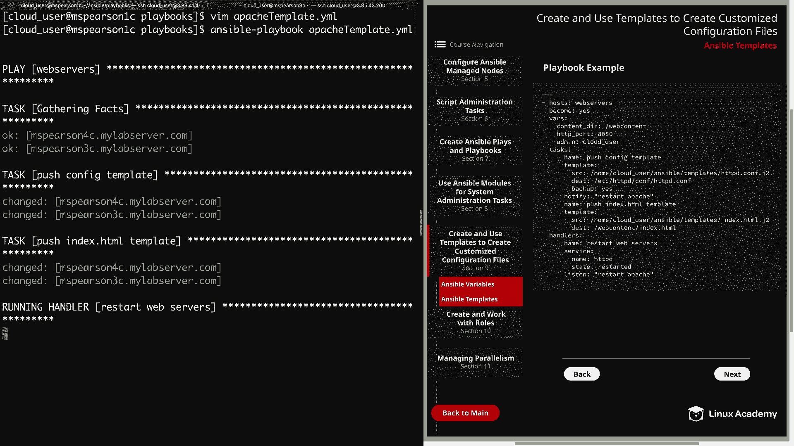

Actually， that finished pretty quickly， so we didn't have to speed it up and it looks like all of our tasks were successful。

 so we gathered our f。 We pushed out our configuration file template to MSsParson 3 and 4。

 which are both the members of the Web servers group and then pushed out our index HTML and then ultimately since we pushed out the configuration file and there was a change there our handler was notified and we restarted our Apache servers。

 All right， so let's head back to MS Pearson 2。

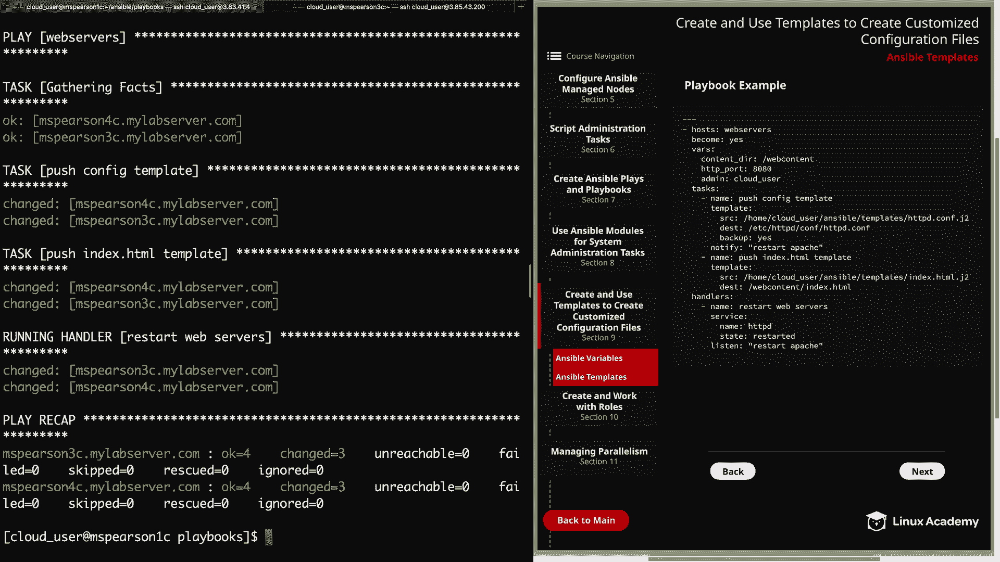

Let's go ahead and open up our Etsyttttb。com。And we see that our configuration file template was added and all of the variables have been supplied with actual values。

 so ants will manage， which is， of course， the values antsible managed。

And then our listen address is 8080。If we come down to serverver admin。

 we see cloud Use at MSParson 3C， and then for document route， we have slash web content。

And for this directory directive， we also have web content and again， web content。So， that's good。

WellLet's go ahead and see if our backup was created as well， So do a listing HtPD。com asterisk。

And we do see our backup， so let's go ahead and open that up real quick。

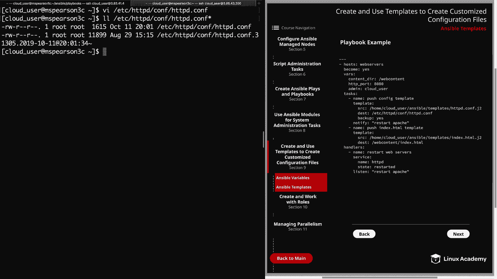

And if we scroll through， we're going to see all the original comments that are letting us know what each directive can do and what the different options are。

 as well as the original value。 So here for our listen address， we have port 80。

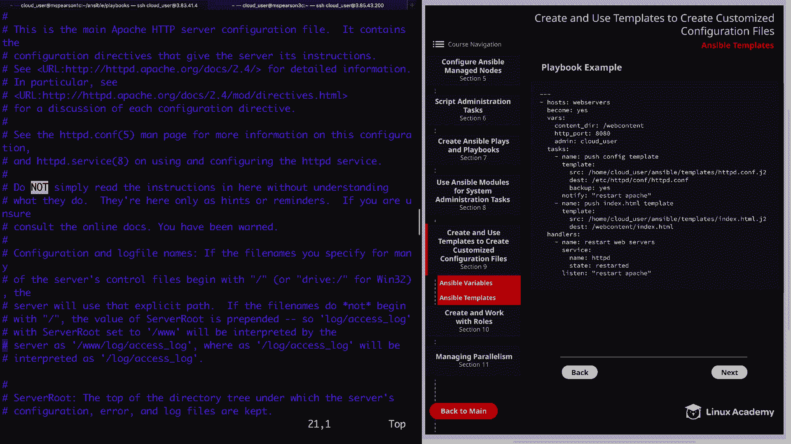

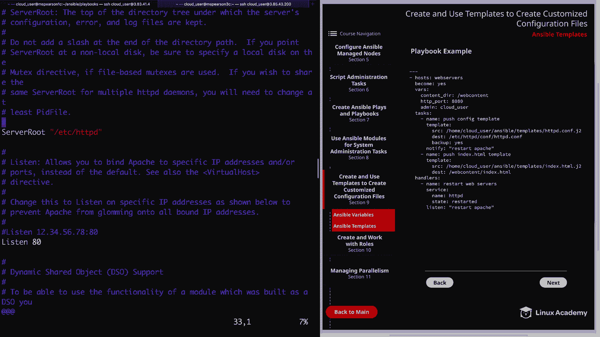

Keep going down， we see the server admin is set to root at local hostst。

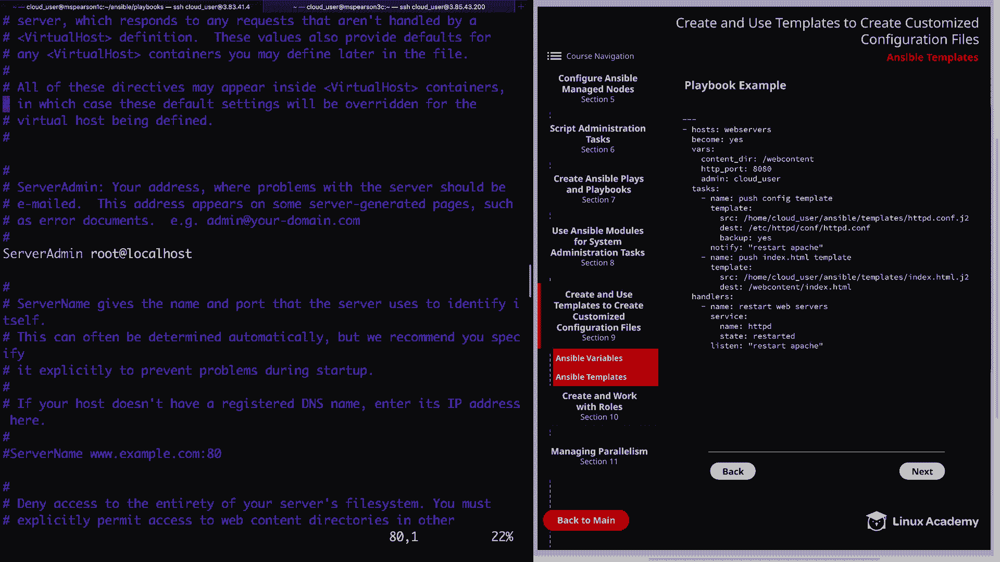

And then our document route is set to the default of bar Www HTML。

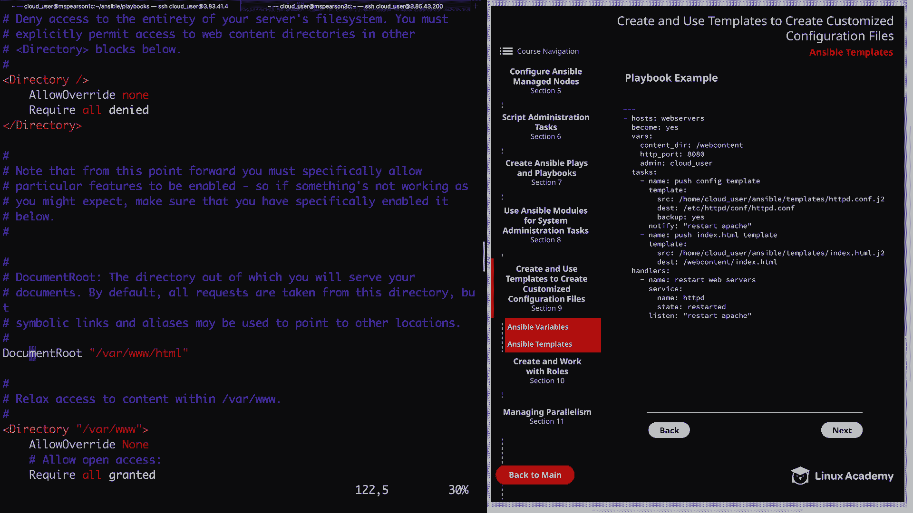

And then Var Dww and Var Www HTML。 All right， so our backup was created successfully。

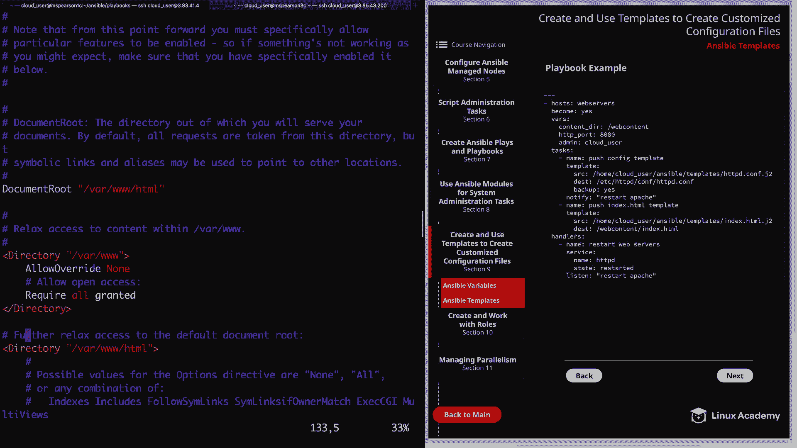

And then we can also check out our index。 HTML。So web contentent indexdex。 HTMLt。

 just like was for the Apache configuration file， all our variables have been supplied with values。

So it says welcome to Mss Pearson 3C， we have the IPV4 address。

The current memory usage out of the total memory usage。

 and then we have the NVmeE block device as the following partitions。

And we see that we have two partitions。And that our filter was able to manipulate the output to put it in the format we want。

 which was a line break， and then a space and a dash。Let's go ahead and quit out of this。

And just as one final validation， let's head back to MS Pearson 1。AConl node。

 And then we'll just curl Ms Pearson。3C。On port 8080， and then index。 HTMLtm。

And we see that we're given our welcome message。And we could also do this for MS Pearson 4。

 let's go ahead and do that。And we see welcome to MM Pearson 4C and our updated IPV4 address as well as the current memory usage。

Well， that's going to wrap up this video on using templates in order to create customized configuration files。

 so let's go ahead and mark it complete and we can move on to the next section。

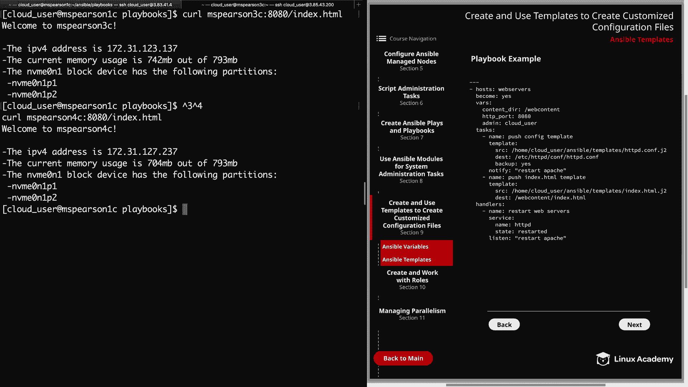